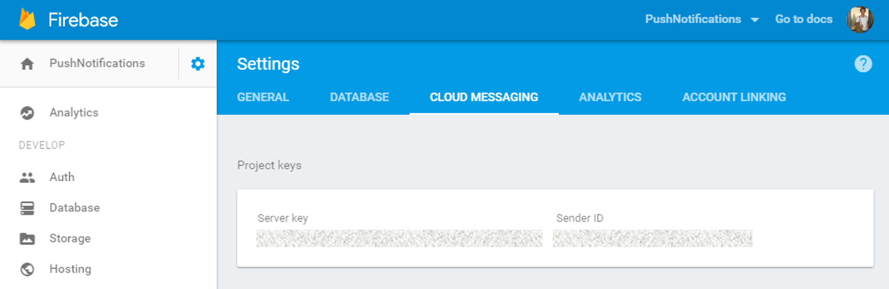

## 1 Introduction

In order to send Android push notifications from this module, you need to set up a Firebase account with Firebase Cloud Messaging enabled. To register for Firebase Cloud Messaging and configure the service in the app, you need to perform the steps below.

There are two possible scenarios: you can create a new FCM project, or you can update your existing GCM project to FCM. Both scenarios are described below.

**This how-to will teach you how to do the following:**

* Create a new FCM project
* Update an existing GCM project to FCM

## 2 Prerequisites

* Have a Firebase account

## 3 Migrating a GCM project to Firebase Cloud Messaging

To prevent the degraded reliability of push notifications delivery, you should migrate existing GCM projects to Firebase Cloud Messaging and upgrade credentials if needed.

### 3.1 Step 1 – Log In to the Developers Console

Open up the Firebase [developers console](https://console.firebase.google.com/) and log in with your Google id.

### 3.2 Step 2 – Import the Project

In the Firebase console, select `Import Google Project`. Select your GCM project from the list of existing projects, select a region, and click on `Add Firebase`.

From here, continue with step 3, below.

## 4 Creating a New Firebase Cloud Messaging Project

### 4.1 Step 1 – Log In to the Developers Console

Open up the Firebase [developers console](https://console.firebase.google.com/) and log in with your Google id.

### 4.2 Step 2 – Create Project

Click `Create new project` and fill in the project name and region for your application. Then click `Create`.

### 4.3 Step 3 – Look Up the Cloud Messaging Credentials

In the top left corner of the screen, click on the little cogwheel and select `Project settings`.

On the new page, go to the `Cloud Messaging` tab. Your _Sender ID_ and _Server key_ are listed here. We'll use these values to configure your app.

### 4.4 Step 4 – Configure FCM in Your Application

Open your Mendix application, log in as an Admin, and open the `PushNotifications_Administration` page. In this page, navigate to `Configurations` tab. Select the configuration object and click on the `Edit` button if it already exists, or on the `New` button if it does not. For the `DTAP mode` field, choose the option which corresponds to your environment. The `XMPP server` field should have the value `gcm.googleapis.com` whereas the `XMPP Port` field should be `5235`. Enter the **sender id** into the `Sender id` field and the **server key** into the `API Key` field.

Note that at this moment, multiple configuration objects are not supported; having more than one of these objects will lead to unpredictable behavior. This will be fixed in the near future.

Once the information has been entered, tick the `Enabled` checkbox and press the `Save and Restart` button. From now on your application will always connect to the FCM service on startup.

For more information on setting up your Google API please refer to this article: [Firebase Cloud Messaging](https://firebase.google.com/docs/cloud-messaging/).
