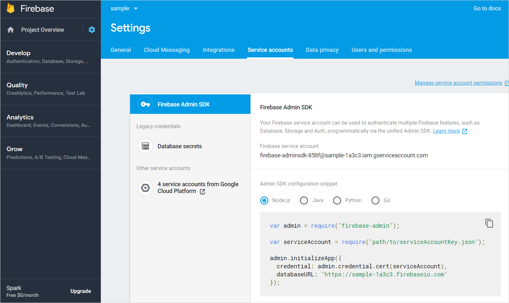

## 1 Introduction

You can use Google's Firebase Cloud Messaging service to send push notifications to both Android as well as iOS. In order to send push notifications using FCM from this module, you need to set up a Firebase account with Firebase Cloud Messaging enabled. To register for Firebase Cloud Messaging and configure the service in the app, you need to perform the steps below.

## 2 Prerequisites

* A Firebase account

## 3 Setting up a Firebase project

There are two possible scenarios: you can create a new FCM project, or you can update your existing GCM project to FCM. Both scenarios are described below.

### 3.a Migrating a GCM project to Firebase Cloud Messaging

To prevent the degraded reliability of push notifications delivery, you should migrate existing GCM projects to Firebase Cloud Messaging and upgrade credentials if needed.

#### 3.a Step 1 – Log In to the Developers Console

Open up the Firebase [developers console](https://console.firebase.google.com/) and log in with your Google id.

#### 3.a Step 2 – Import the Project

In the Firebase console, select `Import Google Project`. Select your GCM project from the list of existing projects, select a region, and click on `Add Firebase`.

From here, continue with step 4, below.

### 3.b Creating a New Firebase Cloud Messaging Project

#### 3.b Step 1 – Log In to the Developers Console

Open up the Firebase [developers console](https://console.firebase.google.com/) and log in with your Google id.

#### 3.b Step 2 – Create Project

Click `Create new project` and fill in the project name and region for your application. Then click `Create`.

## 4 Configure APNs credentials (optional)

If you wish to send push notifications to iOS devices through FCM, you will need to configure your APNs credentials. To do so, click in the top left corner of the screen and select 'Project settings'.

Navigate to the 'Cloud messaging' tab.

On this tab, upload either your APNs key or your APNs certificate(s).

## 5 Set up a service account

In the top left corner of the screen, click on the little cogwheel and select `Project settings`. Then navigate to the 'Service accounts' tab.

On this page, you can press 'Generate new private key'. Store the resulting file in a secure location. You'll use this file when configuring FCM in the backend of your Mendix application.

The file you just created gives API access to all available Firebase services for your app. In case you want a more restrictive service account, click on 'Manage all service accounts' in the top right, and create a service account that is restricted to using the Cloud Messaging functionality.

## 6 Download the Google Services config files

In addition to the backend configuration set up in the previous steps, you'll need additional files that will be bundled as part of your mobile application. To obtain these, again click on the little cogwheel in the top left and select 'Project settings'. Then navigate to the 'General' tab.

The list at the bottom shows the Android and iOS applications that you have configured for your Firebase project. Select the Android application and click on 'google-services.json'. Then click on the iOS application and click on 'GoogleService-Info.plist'. Store both files in a secure location. You will need these when building your mobile application.

## 7 – Configure FCM in Your Application

Open your Mendix application, log in as an Admin, and open the `PushNotifications_Administration` page. Scroll to the FCM section and create or edit a configuration. The configure FCM as follows:

*	Tick the 'Enabled' checkbox
*	Choose a name for the new configuration
*   Enter your Firebase project ID. You can find this on the Firebase console website
*	Upload the private key you downloaded earlier, when you created a service account
