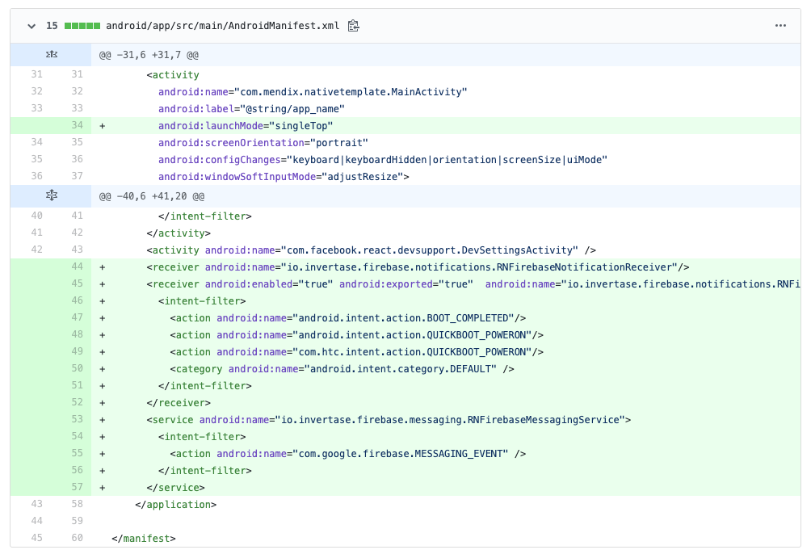
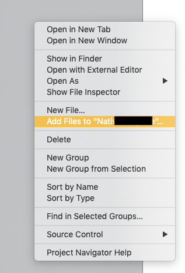
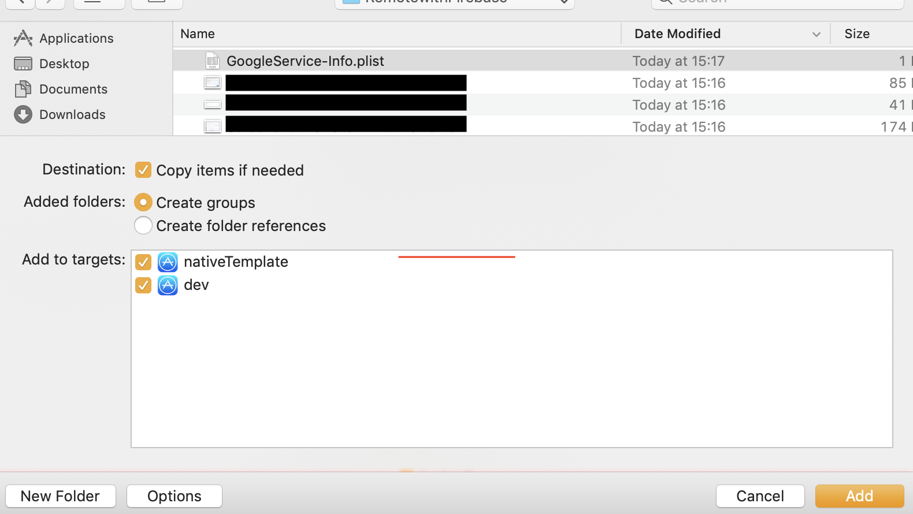
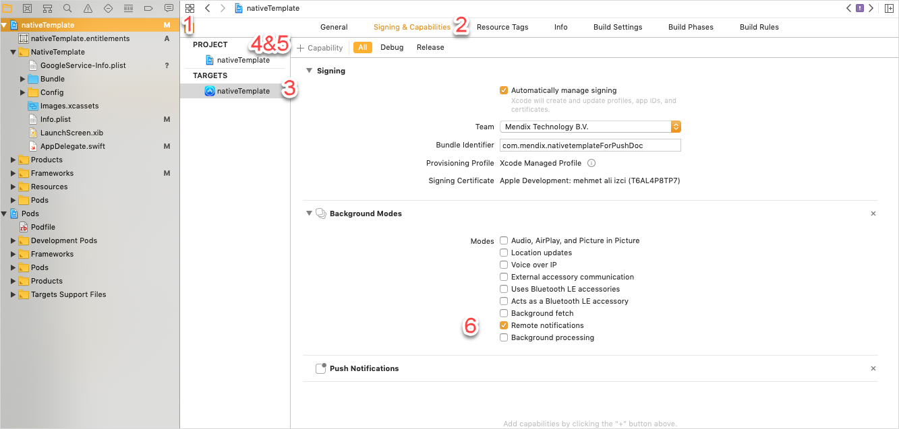

## 1 Introduction

Push notifications (also known as remote notifications) allow you to remotely trigger small text messages, sounds, and more on your users' devices. For more information on notifications, see Apple's [APNs Overview](https://developer.apple.com/library/archive/documentation/NetworkingInternet/Conceptual/RemoteNotificationsPG/APNSOverview.html) or Google's [Notifications Overview](https://developer.android.com/guide/topics/ui/notifiers/notifications).

Native remote push notifications have more capabilities than hybrid push notifications. To set up push notifications for your Native App, you will have to:

1. Generate an app using the Native Mobile Builder.
1. Configure your Firebase setup.
1. Customize your native template.

Follow the sections below to complete these three tasks and enable native remote push notifications. After you have completed this document, see [How To Use Native Push Notifications](/howto/mobile/native-remote-notifications) for instructions on implementing native push notifications.

{}

Push notifications will not work in XCode's Simulator. For iOS, notifications only work on physical devices.

{}

**This how-to will teach you how to do the following:**

* Enable push notifications in your native mobile app

## 2 Prerequisites

Before starting this how-to, make sure you have completed the following prerequisites:

* Complete [How to Deploy Your First Mendix Native Mobile App](deploying-native-app) through the end of the *Preparing Your Project* section. Once you finish those sections, you will have a generated a GitHub repository with all the files you will need.
* Learn the basics of [Git](https://www.atlassian.com/git) (only if you cannot use the Mendix Native Mobile Builder or need to modify your app manually)

## 3 Setting up Firebase Cloud Messaging Service {#firebase-setup}

Google's Firebase service supports both Android and Apple push notifications. Because APNs can require more work during customization steps, this document will teach you to set up your push notifications using Firebase.

To set up the Firebase cloud messaging server, complete [How to Set Up the Google Firebase Cloud Messaging Server](setting-up-google-firebase-cloud-messaging-server). During that document's *Adding an Android and iOS App* section, be sure to add both an iOS and an Android app to your Firebase configuration. 

If you would like to test push notifications with a custom developer app, please make sure to add one *additional* Android app to your Firebase project, using the app identifier *{your chosen app identifier}-developerapp*. So in this case, you should have a total of two Android apps and one iOS app included in your Firebase project. 

After you complete that tutorial, you will have these files:

* *google-services.json*
* *GoogleService-Info.plist*
* *yourPrivateKey.json*

You will use these later to complete your work with the Native Mobile Builder and with Firebase.

## 4 Enabling Push Notifications for your Native Apps

To enable push notifications for your application you will have to follow one of the following sections. Please choose the section that fits which tools you can use.

With the release of Native Mobile Builder in Mendix Studio Pro v8.15, the process of enabling push notifications has been simplified. The Native Mobile Builder, integrated into Mendix Studio Pro, is the recommended method for setting up any capabilities in your app. If you can use this tooling, please follow this section: [Enabling Push Notification with the Native Mobile Builder (UI)](#auto-changes).

If you must use a version Mendix Studio Pro below 8.15, the Native Builder (CLI) is the preferred method. To use that tooling, please follow the section: [Enabling Push Notification with the Native Builder (CLI)](#auto-changes-cli).

If you wish to implement your changes manually, please follow this section: [Manually Implementing Changes](#manually-implementing-changes).

### 4.1 Implementing Push Changes With the Native Builder {#auto-changes}

The Native Mobile Builder simplifies the process of adding any capabilities to your native mobile app. To enable push notifications, do the following: 

1.  Click **Project** > **Build Native Mobile App**:

	{}{}

1.  When the Mendix Native Mobile Builder launches you will see the home screen:

	{}{}

1. Select **Build app for distribution**.
1.  Click **Capabilities** on the left menu:

	{}{}

1.  Toggle **Push notifications** on:

	{}{}

1. Click **Upload google-service.json file**. Navigate to where you saved your app's **google-services.json** file and select it. The tool will verify that the required app id is included in *json* file and will notify you if otherwise. That is to prevent you using the wrong configuration files, which would result in push notifications not working. 

	{}The tool will warn you if *google-services.json* does not include a correct custom developer app's app identifier in the format of `(chosen app id)-developerapp`. It can be safely ignored if you do not plan on testing push notifications with a custom developer app.{}

1. Click **Upload GoogleServices-info.plist file**. Navigate to where you saved your app's *GoogleServices-info.plist* file and select it. The tool will verify that the required app id is included in *json* file and will notify you if otherwise. That is to prevent you using the wrong configuration files, which would result in push notifications not working.
1. Click **Save**.

The next time you build your app, the Native Mobile Builder will take care of enabling push notifications for the app.

### 4.2 Implementing Push Changes With the Native Builder CLI {#auto-changes-cli}

Remember these parameters of your app, since you will use them often in commands (for more information on parameters, see the [Native Builder Reference Guide](/refguide/native-builder)): 

* `--project-name`
* `--mendix-version` 
* `--github-access-token`

Also, be sure to remember the absolute path to your app's *google-services.json* and *GoogleService-Info.plist* files.

Run these commands in any order:

```
./native-builder.exe config ios add-entitlements --project-name "your project name" --entitlements notification
```

```
./native-builder.exe config ios add-background-modes --project-name "your project name" --modes notification
```

```
./native-builder.exe prepare --github-access-token yourAccessToken12345 --projectName "your project name"  --mendix-version x.x.x --firebase-ios-config-path A:\\bsolute-Path-To\GoogleService-Info.plist --firebase-android-config-path A:\\bsolute-Path-To\google-services.json
```

These commands will automatically do the necessary code alterations and make a GitHub commit in your repo. 

### 4.3 Manually Implementing Changes {#manually-implementing-changes}

Implementing push notifications manually requires you to modify source files locally or on your app's repository. How you implement push notifications differs based on the Native Template version your project uses. 

* For Native Template versions up to v5.0.x, or otherwise for Native Templates supporting up to Mendix Studio Pro v8.15.0, please follow these sections based on your platform: 
	* [For Android](#manual-android-5.0.x)
	* [For iOS](#manual-ios-5.0.x)
* For Native Template versions from v5.1.x, or otherwise for Native Templates supporting from Mendix Studio Pro v8.15.x and up, please follow these sections based on your platform: 
	* [For Android](#manual-android-5.1.x)
	* [For iOS](#manual-ios-5.1.x)

#### 4.2.1 On Android for Native Template up to v5.0.x {#manual-android-5.0.x}

1. Add the *google-services.json* file inside your **android/app** folder. 
1. Set app launch mode inside activity props and add necessary receiver changes in *android/app/src/main/AndroidManifest.xml*:

	```
	<activity
    ...
    android:launchMode="singleTop"
      >
	```

1.  Included the firebase service and receiver in your **android/app/src/main/AndroidManifest.xml**. Copy and paste the lines below that are between the **\<application>\</applicatation>** tags into the app's **AndroidManifest.xml** between the **\<application ...>\</application>**:

	```
	<application ...>
 <receiver android:name="io.invertase.firebase.notifications.RNFirebaseNotificationReceiver"/>
 <receiver android:enabled="true" android:exported="true"  android:name="io.invertase.firebase.notifications.RNFirebaseNotificationsRebootReceiver">
    <intent-filter>
    <action android:name="android.intent.action.BOOT_COMPLETED"/>
    <action android:name="android.intent.action.QUICKBOOT_POWERON"/>
    <action android:name="com.htc.intent.action.QUICKBOOT_POWERON"/>
    <category android:name="android.intent.category.DEFAULT" />
    </intent-filter>
 </receiver>
 <service android:name="io.invertase.firebase.messaging.RNFirebaseMessagingService">
    <intent-filter>
   <action android:name="com.google.firebase.MESSAGING_EVENT" />
    </intent-filter>
 </service>
</application>
	```

	

1. Commit and push your changes to your **master** branch.

#### 4.2.2 On Android for Native Template from v5.1.x {#manual-android-5.1.x}

With Native Template v5.1.0 we introduced a new auto-linking behavior. Before Native Template v5.1.0, libraries not needed explicitly by your app were included when building your applications. 

With the new approach in Native Template v5.1.0 and above, you can easily toggle capabilities on or off as needed by modifying the configuration files of each platform. The system will take care 
of linking the libraries and peer-dependencies as needed. You can do so manually by following these steps:

1. Manually add the `google-services.json` file inside your **android/app** folder.
1. In *capabilitiles.android.json* change the push notification key to be true: `"pushNotifications": true`. This tells the new Autolink behavior to link the libraries needed
1. Set app launch mode inside activity props and add necessary receiver changes in **android/app/src/main/AndroidManifest.xml**:
   
	```
	<activity
    ...
    android:launchMode="singleTop"
      >
	```
   
1.  Include the firebase service and receiver in your **android/app/src/main/AndroidManifest.xml**. Copy and paste the lines below that are between the **\<application>\</applicatation>** tags into the app's **AndroidManifest.xml** between the **\<application ...>\</application>**:

	```
	<application ...>
    <receiver android:name="io.invertase.firebase.notifications.RNFirebaseNotificationReceiver"/>
    <receiver android:enabled="true" android:exported="true"  android:name="io.invertase.firebase.notifications.RNFirebaseNotificationsRebootReceiver">
      <intent-filter>
        <action android:name="android.intent.action.BOOT_COMPLETED"/>
        <action android:name="android.intent.action.QUICKBOOT_POWERON"/>
        <action android:name="com.htc.intent.action.QUICKBOOT_POWERON"/>
        <category android:name="android.intent.category.DEFAULT" />
      </intent-filter>
    </receiver>
    <service android:name="io.invertase.firebase.messaging.RNFirebaseMessagingService">
      <intent-filter>
      <action android:name="com.google.firebase.MESSAGING_EVENT" />
      </intent-filter>
    </service>
    </application>
	```
    
	
	
1. Commit and push your changes to **master** branch.

You repository should now have the *google-services.json* included and the `pushNotifications` value in the `capabilitiles.android.json` set to true.

#### 4.2.3 On iOS for Native Template up to v5.0.x {#manual-ios-5.0.x}

In order for your generated template to work with push notifications, you will need Xcode installed in your machine. Once installed, open Xcode and do the following:

1. Open the *app/ios/yourProjectName.xcworkspace* in Xcode.
1.  Right click in the left pane and select **Add files to ...**, then drop the *GoogleServices-Info.plist* file into the root iOS directory:

	

1. Select **GoogleService-Info.plist** and make sure **Copy items if needed** is selected. 
1.  Select the **Create Groups** option, then select all targets:

	

In the **Signing & Capabilities** tab, add **push notifications** capabilities to your app by doing the following:

1. Click **nativeTemplate** in the left-side file explorer.
1. Click the **Signing & Capabilities** tab.
1. Click **Targets** > **nativeTemplate**.
1. Click **Capability**, type *push* in the dialog box, then select **Push Notifications**.
1. Click **Capability**, type *background* in the dialog box, then select **Background Modes**.
1. Select **Background Modes** > **Remote Notifications**:
    
1. Commit and push your changes to your master branch.

With those steps completed you have manually enabled push notifications for your Android app.

#### 4.2.4 On iOS for Native Template from v5.1.x {#manual-ios-5.1.x}

1. Make sure you have completed the [iOS for Native Template up to 5.0.x](#manual-ios-5.0.x) section.
1. In *capabilitiles.ios.json* change the push notification key to be true: `"pushNotifications": true`. This allows the push notifications libraries to be installed.
1. Run `pod install` to link the new libraries and update the *Podfile.lock* file.
1. Commit and push your changes to your **master** branch.

With those steps completed you have manually enabled push notifications for your iOS app.

## 5 Read More

* [How to Use Local Notifications](local-notif-parent)
* [Native Builder Reference Guide](/refguide/native-builder)
