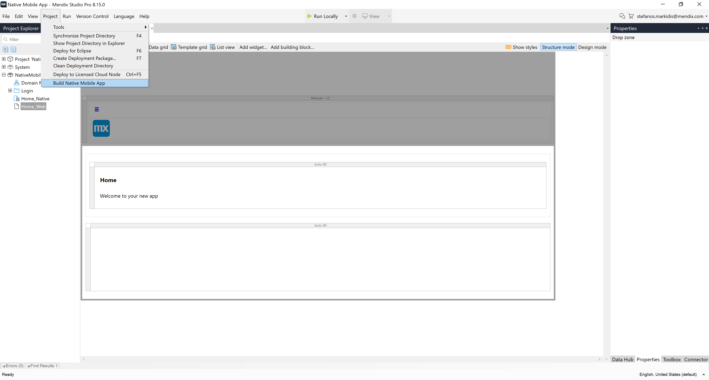
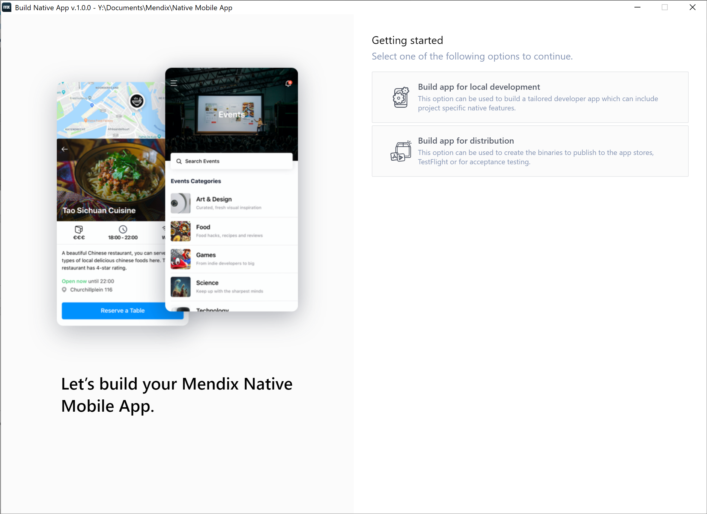
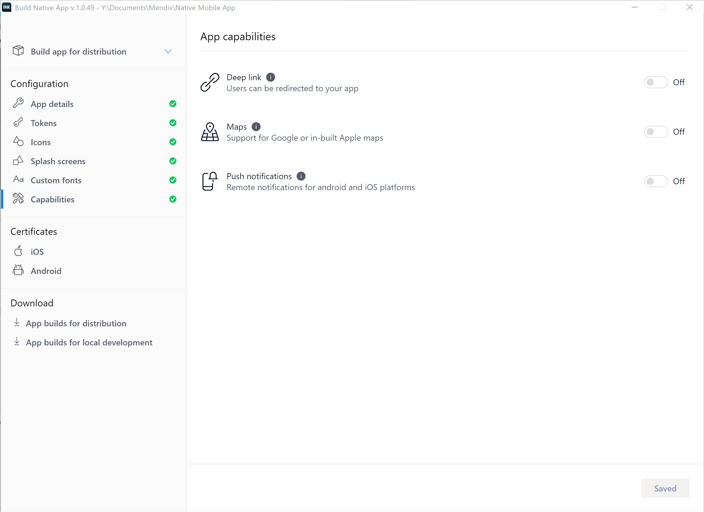
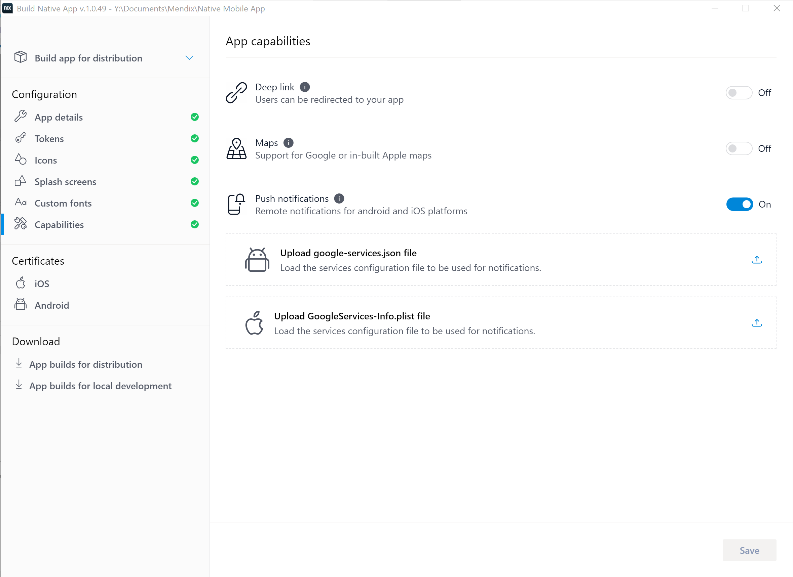

## 1 Introduction

Push notifications (also known as remote notifications) allow you to remotely trigger small text messages, sounds, and more on your users' devices. For more information on notifications, see Apple's [APNs Overview](https://developer.apple.com/library/archive/documentation/NetworkingInternet/Conceptual/RemoteNotificationsPG/APNSOverview.html) or Google's [Notifications Overview](https://developer.android.com/guide/topics/ui/notifiers/notifications).

Native remote push notifications have more capabilities than hybrid push notifications. To set up push notifications for your Native App, you will have to:

1. Generate an app using the Native Mobile Builder.
1. Configure your Firebase setup.
1. Customize your native template.

Follow the sections below to complete these three tasks and enable native remote push notifications. After you have completed this document, see [How To Use Native Push Notifications](/howto/mobile/native-remote-notifications) for instructions on implementing native push notifications.

{}

Push notifications will not work in XCode's Simulator. For iOS, notifications only work on physical devices.

{}

**This how-to will teach you how to do the following:**

* Enable push notifications in your native mobile app

## 2 Prerequisites

Before starting this how-to, make sure you have completed the following prerequisites:

* Complete [How to Deploy Your First Mendix Native Mobile App](deploying-native-app) until you have a generated a GitHub repository with all the files you will need.
* Learn the basics of [Git](https://www.atlassian.com/git) (only if you cannot use the Mendix Native Mobile Builder or need to modify your app manually)

## 3 Setting up Firebase Cloud Messaging Service {#firebase-setup}

Google's Firebase service supports both Android and Apple push notifications. Because APNs can require more work during customization steps, this document will teach you to set up your push notifications using Firebase.

To set up the Firebase cloud messaging server, complete [How to Set Up the Google Firebase Cloud Messaging Server](setting-up-google-firebase-cloud-messaging-server). During that document's *Adding an Android and iOS App* section, be sure to add both an iOS and an Android app to your Firebase configuration. 

If you would like to test push notifications with a custom developer app, please make sure to add one *additional* Android app to your Firebase project, using the app identifier *{your chosen app identifier}.developerapp*. So in this case, you should have a total of two Android apps and one iOS app included in your Firebase project. 

After you complete that tutorial, you will have these files:

* *google-services.json*
* *GoogleService-Info.plist*
* *yourPrivateKey.json*

You will use these later to complete your work with the Native Mobile Builder and with Firebase.

## 4 Enabling Push Notifications for your Native Apps

With the release of Native Mobile Builder in Mendix Studio Pro v8.15, the process of enabling push notifications has been simplified. The Native Mobile Builder, integrated into Mendix Studio Pro, is the recommended method for setting up any capabilities in your app. To enable push notifications with the Native Mobile Builder, follow the section below.

### 4.1 Implementing Push Changes With the Native Mobile Builder {#auto-changes}

The Native Mobile Builder simplifies the process of adding any capabilities to your native mobile app. To enable push notifications, do the following: 

1.  Click **App** > **Build Native Mobile App**:

	{}{}

1.  When the Mendix Native Mobile Builder launches you will see the home screen:

	{}{}

1. Select **Build app for distribution**.
1.  Click **Capabilities** on the left menu:

	{}{}

1.  Toggle **Push notifications** on:

	{}{}

1. Click **Upload google-service.json file**. Navigate to where you saved your app's **google-services.json** file and select it. The tool will verify that the required app id is included in *json* file and will notify you if otherwise. That is to prevent you using the wrong configuration files, which would result in push notifications not working. 

	{}The tool will warn you if *google-services.json* does not include a correct custom developer app's app identifier in the format of `(chosen app id)-developerapp`. It can be safely ignored if you do not plan on testing push notifications with a custom developer app.{}

1. Click **Upload GoogleServices-info.plist file**. Navigate to where you saved your app's *GoogleServices-info.plist* file and select it. The tool will verify that the required app id is included in *json* file and will notify you if otherwise. That is to prevent you using the wrong configuration files, which would result in push notifications not working.
1. Click **Save**.

The next time you build your app, the Native Mobile Builder will take care of enabling push notifications for the app.

## 5 Read More

* [How to Use Local Notifications](local-notif-parent)
