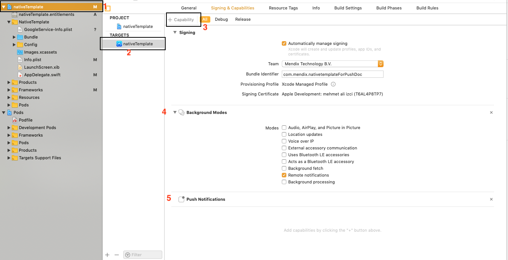

## 1 Introduction

todo: move this text to a parent intro doc or the local notifs one --> If you want to use local push notifications with Make it Native app, the only step you have to perform is [Firebase setup](#4-firebase-setup)

Remote push notifications allow you to remotely trigger small text messages, sounds, and more on your users' devices. For more information on notifications, see Apple's [APNs Overview](https://developer.apple.com/library/archive/documentation/NetworkingInternet/Conceptual/RemoteNotificationsPG/APNSOverview.html) or Google's [Notifications Overview](https://developer.android.com/guide/topics/ui/notifiers/notifications).

Native remote push notifications have the same capabilities as [hybrid push notifications](link here). However, native push notifications require a unique setup method:

1. Generate an app using the Native Builder.
2. Configure your Firebase setup.
3. Customize your native template.

Follow the sections below to complete these three tasks and enable native remote push notifications. After you have completed this document, see [How To Use Native Push Notifications](link here) for instructions on implementing native push notifications.

**This how-to will teach you how to do the following:**

* Customize your native template so it can use remote push notifications

## 2 Prerequisites

Before starting this how-to, make sure you have completed the following prerequisites:

* Learn the basics of [Git](https://www.atlassian.com/git)

## 3 Creating a Native Builder App

To make a native app for this how to, do the following:

1. Complete [How to Deploy Your First Mendix Native App](deploying-native-app) through the end of the *Preparing Your Project* section. Once you finish this, you will have a generated a GitHub repository with all the files you will need. 
2. Clone the generated repository to your computer. This will enable customizations later.

## 4 Setting up Firebase Cloud Messaging Service

Google's Firebase service supports both Android and Apple push notifications. Because APNs can require more work from you during customization steps, this document will teach you to set up your push notifications using Firebase.

To set up the Firebase cloud messaging server, complete [Setting up Google Firebase Cloud Messaging Server](setting-up-google-firebase-cloud-messaging-server). During that document's *Adding an Android and iOS App* section, be sure to add both an iOS and an Android app to your Firebase configuration. After you complete that tutorial, you will have these files:

* *google-services.json*
* *GoogleService-Info.plist*
* *yourPrivateKey.json*

You will use these later to complete your work with the Native Builder and with Firebase.

## 5 Setting up Native Builder Customizations

After you run the `prepare` command, the Native Builder will create iOS and Android source code. To enable push notifications, you will customize these platforms' source code files.

### 5.1 Customizing Android Source Code

To customize your Android source code and enable push notifications, do the following steps:

1. Change the code in *android/app/build.gradle* until it looks like this:

```diff
@@ -101,6 +101,10 @@ dependencies {
     implementation fileTree(dir: "libs", include: ["*.jar"])
     implementation "com.facebook.react:react-native:+"  // From node_modules
     implementation "org.webkit:android-jsc:r245459"
     implementation "com.google.android.gms:play-services-base:16.1.0"
     implementation "com.google.firebase:firebase-core:16.0.9"
     implementation "com.google.firebase:firebase-messaging:18.0.0"
     implementation 'me.leolin:ShortcutBadger:1.1.21@aar'
 }
```

2. Move *google-services.json* inside your **android/app** folder.
3. Change *android/app/src/main/AndroidManifest.xml* to this:

```diff
@@ -2,9 +2,11 @@
   package="com.mendix.nativetemplate">

     <uses-permission android:name="android.permission.INTERNET" />
     <uses-permission android:name="android.permission.RECEIVE_BOOT_COMPLETED" />
     <uses-permission android:name="android.permission.VIBRATE" />
     <application
       android:name=".MainApplication"
       android:usesCleartextTraffic="true"
       android:label="@string/app_name"
       android:icon="@mipmap/ic_launcher"
       android:roundIcon="@mipmap/ic_launcher_round"
@@ -13,6 +15,7 @@
       <activity
         android:name=".MainActivity"
         android:label="@string/app_name"
         android:launchMode="singleTop"
         android:configChanges="keyboard|keyboardHidden|orientation|screenSize"
         android:windowSoftInputMode="adjustResize">
         <intent-filter>
@@ -21,6 +24,20 @@
         </intent-filter>
       </activity>
       <activity android:name="com.facebook.react.devsupport.DevSettingsActivity" />
         <receiver android:name="io.invertase.firebase.notifications.RNFirebaseNotificationReceiver"/>
         <receiver android:enabled="true" android:exported="true"  android:name="io.invertase.firebase.notification
             <intent-filter>
                 <action android:name="android.intent.action.BOOT_COMPLETED"/>
                 <action android:name="android.intent.action.QUICKBOOT_POWERON"/>
                 <action android:name="com.htc.intent.action.QUICKBOOT_POWERON"/>
                 <category android:name="android.intent.category.DEFAULT" />
             </intent-filter>
         </receiver>
         <service android:name="io.invertase.firebase.messaging.RNFirebaseMessagingService">
             <intent-filter>
                 <action android:name="com.google.firebase.MESSAGING_EVENT" />
             </intent-filter>
         </service>
     </application>

 </manifest>
```

{}
You will test your implementation against a local Mendix instance, which requires the line `android:usesCleartextTraffic="true"` above. After you complete this tutorial remove this line, as it can cause a vulnerability.
{}

4. Change *android/app/src/main/java/com/mendix/nativetemplate/MainApplication.java* to this:

```diff
 import fr.greweb.reactnativeviewshot.RNViewShotPackage;
 import io.invertase.firebase.RNFirebasePackage;
 import io.invertase.firebase.messaging.RNFirebaseMessagingPackage;
 import io.invertase.firebase.notifications.RNFirebaseNotificationsPackage;

 public class MainApplication extends MendixReactApplication {
   @Override
   public boolean getUseDeveloperSupport() {
     return true;
   }

   @Override
@@ -53,6 +55,8 @@ public class MainApplication extends MendixReactApplication {
             new ImagePickerPackage(),
             new RNGeocoderPackage(),
             new RNFirebasePackage(),
             new RNFirebaseMessagingPackage(),
             new RNFirebaseNotificationsPackage(),
             new RNDeviceInfo(),
             new RNCameraPackage(),
             new CalendarEventsPackage(),
```

5. Change *android/build.gradle* to this:

```diff
        }
     }
     dependencies {
         classpath("com.android.tools.build:gradle:3.4.1")
         classpath 'com.google.gms:google-services:4.2.0'
         // NOTE: Do not place your application dependencies here; they belong
         // in the individual module build.gradle files
     }
```

6. Open *android/app/src/main/res/raw/runtime_url* and replace its one line with your local IP address.
7. Commit and push your changes to master. This will automatically trigger an App Center build.

### 5.2 Customizing iOS Source Code

todo: intro text needed

{}

Remote notifications will not work with an iOS simulator [todo: emulator?]

{}

To change the capabilities of your app, open *app/ios/yourProjectName.xcworkspace* in Xcode:

1. Add *GoogleService-Info.plist* to your *NativeTemplate* folder (it should be at the same level as *Info.plist*).

2. Change */ios/AppDelegate.swift* (here you add your local IP to test against a local Mendix instance):

```diff
 import Foundation
 import UIKit
 import MendixNative
 import Firebase


 @UIApplicationMain
 class AppDelegate: UIResponder, UIApplicationDelegate {
@@ -10,11 +12,24 @@ class AppDelegate: UIResponder, UIApplicationDelegate {
     guard let url = Bundle.main.object(forInfoDictionaryKey: "Runtime url") as? String, let runTimeUrl = AppUrl.forRuntime(url: url) else {
       fatalError("Missing the 'Runtime url' configuration within the Info.plist file")
     }
     guard let bundleUrl = AppUrl.forBundle(url: "http://LOCALIP:8080", remoteDebuggingPackagerPort: 8083, isDebuggingRemotely: true, isDevModeEnabled: true) else {
       fatalError("Could not properly load JS bundle file")
     }
     FirebaseApp.configure()
     RNFirebaseNotifications.configure()
     ReactNative.instance.start(MendixApp(bundleUrl: bundleUrl, runtimeUrl: runTimeUrl, warningsFilter: WarningsFilter.none))
     return true
   }

   func application(_ application: UIApplication, didReceive notification: UILocalNotification) {
     RNFirebaseNotifications.instance().didReceive(notification)
   }

   func application(_ application: UIApplication, RemoteNotification userInfo: [AnyHashable : Any], fetchCompletionHandler completionHandler: @escaping (UIBackgroundFetchResult) -> Void) {
     RNFirebaseNotifications.instance().didReceiveRemoteNotification(userInfo, fetchCompletionHandler: completionHandler)
   }

   func application(_ application: UIApplication, didRegister notificationSettings: UIUserNotificationSettings) {
     RNFirebaseMessaging.instance().didRegister(notificationSettings)
   }
 }
```

3. Make sure *ios/Podfile* contains the following lines:

```
  pod 'RNFirebase', :path => '../node_modules/react-native-firebase/ios'
  pod 'Firebase/Core' 
  pod 'Firebase/Messaging', '~> 5.15.0'
```

4. Change the *Info.plist* runtime URL to your local IP.
5. In **Signing & Capabilities** tab, add **push notifications** capabilities to your app by doing the following:

     a. Click **nativeTemplate** in the left-hand file explorer.
     b. Click the **Signing & Capabilities** tab.
     c. Click **Targets** > **nativeTemplate**.
     d. Click **Capability**, type *push* in the dialog box, then select **Push Notifications**. 
     e. Click **Capability**, type *background* in the dialog box, then select **Background Modes**.
     f. Select **Background Modes** > **Remote Notifications**.

     

Congratulations, you finished setting up customizations for your custom native app! To implement remote push notifications on a test device, see [Use Remote Notifications](native-remote-notifications).

## 6 Read More

* [How to Use Local Notifications](local-notif-parent)
* [Native Builder Reference Guide](/refguide/native-builder)
