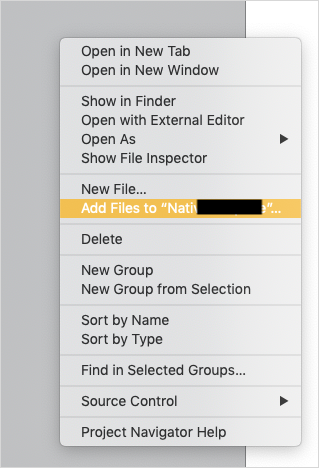

## 1 Introduction

Remote push notifications allow you to remotely trigger small text messages, sounds, and more on your users' devices. For more information on notifications, see Apple's [APNs Overview](https://developer.apple.com/library/archive/documentation/NetworkingInternet/Conceptual/RemoteNotificationsPG/APNSOverview.html) or Google's [Notifications Overview](https://developer.android.com/guide/topics/ui/notifiers/notifications).

Native remote push notifications have the more capabilities than hybrid push notifications. Native push notifications also require a unique setup method:

1. Generate an app using the Native Builder.
1. Configure your Firebase setup.
1. Customize your native template.

Follow the sections below to complete these three tasks and enable native remote push notifications. After you have completed this document, see [How To Use Native Push Notifications](/howto/mobile/native-remote-notifications) for instructions on implementing native push notifications.

If you want to use local push notifications with the Make It Native app, the only step you have to perform is [Setting up Firebase Cloud Messaging Service](#firebase-setup)

{}

Remote notifications will not work in the iOS Simulator app.

{}

**This how-to will teach you how to do the following:**

* Customize your native template so it can use remote push notifications

## 2 Prerequisites

Before starting this how-to, make sure you have completed the following prerequisites:

* Learn the basics of [Git](https://www.atlassian.com/git)
* Complete [How to Deploy Your First Mendix Native App](deploying-native-app) through the end of the *Preparing Your Project* section. Once you finish those sections, you will have a generated a GitHub repository with all the files you will need.

## 3 Setting up Firebase Cloud Messaging Service {#firebase-setup}

Google's Firebase service supports both Android and Apple push notifications. Because APNs can require more work during customization steps, this document will teach you to set up your push notifications using Firebase.

To set up the Firebase cloud messaging server, complete [How to Set Up the Google Firebase Cloud Messaging Server](setting-up-google-firebase-cloud-messaging-server). During that document's *Adding an Android and iOS App* section, be sure to add both an iOS and an Android app to your Firebase configuration. After you complete that tutorial, you will have these files:

* *google-services.json*
* *GoogleService-Info.plist*
* *yourPrivateKey.json*

You will use these later to complete your work with the Native Builder and with Firebase.

## 4 Setting up Native App Customizations

After you create your app using the Native Builder's `prepare` command, the Native Builder will create iOS and Android source code. To enable push notifications, you will customize these platforms' source code files. The easiest way for your to customize these source code files is to follow the [Implementing Push Changes With the Native Builder](#auto-changes) section below. If you wish to implement the changes manually, please skip to section [Manually Implementing Changes](#manually-implementing-changes) section further below. 

Choose one of these sections and complete *only* that section before moving on to [Customizing the Android Manifest File](#customize-android-manifest).

### 4.1 Implementing Push Changes With the Native Builder {#auto-changes}

Remember these parameters of your app, since you will use them often in commands (for more information on parameters, see the [Native Builder Reference Guide](/refguide/native-builder)): 

* `--project-name`
* `--mendix-version` 
* `--github-access-token`

Also, be sure to remember the absolute path to your app's *google-services.json* and *GoogleService-Info.plist* files.

Run these commands in any order:

```
./native-builder.exe config ios add-entitlements --project-name "your project name" --entitlements notification
```

```
./native-builder.exe config ios add-background-modes --project-name "your project name" --modes notification
```

```
./native-builder.exe prepare --github-access-token yourAccessToken12345 --projectName "your project name"  --mendix-version x.x.x --firebase-ios-config-path A:\\bsolute-Path-To\GoogleService-Info.plist --firebase-android-config-path A:\\bsolute-Path-To\google-services.json
```

These commands will automatically do the necessary code alterations and make a GitHub commit in your repo. 

### 4.2 Manually Implementing Changes {#manually-implementing-changes}

#### 4.2.1 Android

Manually add the `google-services.json` file inside your **android/app** folder. Commit and push your changes to master branch.

#### 4.2.2 iOS

In order for your generated template to work with push notifications, you will need XCODE installed in your machine.

1. Open the *app/ios/yourProjectName.xcworkspace* in Xcode.
1.  Right Click in the left pane and select *Add files to ...* and drop the *GoogleServices-Info.plist* file into the root iOS directory:

  

1. Select *GoogleService-Info.plist* and make sure **Copy items if needed** is selected. 
1.  Select the **Create Groups** option, then select all targets:

  

In **Signing & Capabilities** tab, add **push notifications** capabilities to your app by doing the following:

1. Click **nativeTemplate** in the left-side file explorer.
1. Click the **Signing & Capabilities** tab.
1. Click **Targets** > **nativeTemplate**.
1. Click **Capability**, type *push* in the dialog box, then select **Push Notifications**.
1. Click **Capability**, type *background* in the dialog box, then select **Background Modes**.
1. Select **Background Modes** > **Remote Notifications**:

  

Commit and push your changes to your master branch.

### 4.3 Customizing the Android Manifest File {#customize-android-manifest}

Set app launch mode inside activity props and add necessary receiver changes in *android/app/src/main/AndroidManifest.xml*:

```
<activity
...
android:launchMode="singleTop"
  >
```

```
<application ...>
<receiver android:name="io.invertase.firebase.notifications.RNFirebaseNotificationReceiver"/>
<receiver android:enabled="true" android:exported="true"  android:name="io.invertase.firebase.notifications.RNFirebaseNotificationsRebootReceiver">
  <intent-filter>
    <action android:name="android.intent.action.BOOT_COMPLETED"/>
    <action android:name="android.intent.action.QUICKBOOT_POWERON"/>
    <action android:name="com.htc.intent.action.QUICKBOOT_POWERON"/>
    <category android:name="android.intent.category.DEFAULT" />
  </intent-filter>
</receiver>
</application>
```


Congratulations, you finished setting up customizations for your custom native app! To implement remote push notifications on a test device, see [How to Use Remote Notifications](native-remote-notifications).

## 5 Read More

* [How to Use Local Notifications](local-notif-parent)
* [Native Builder Reference Guide](/refguide/native-builder)
