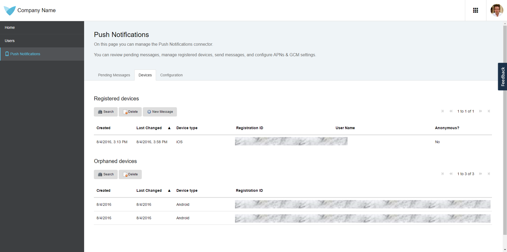
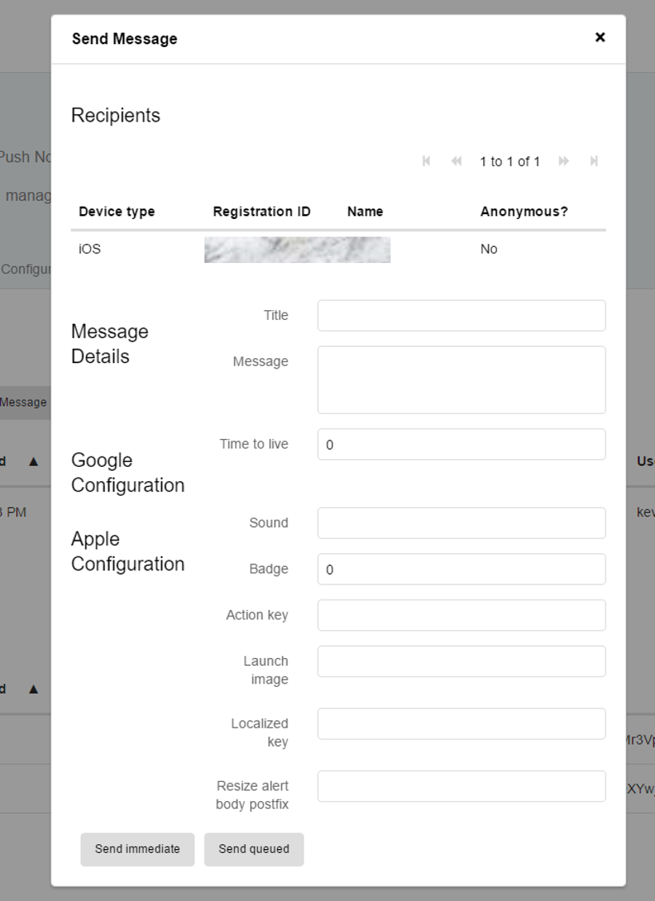

Once you finish implementing the steps described in [How to Implement Push Notifications](implementation-guide), you need to test whether everything works correctly. This can be done easily using the administration pages that should be included in your application (for details, see the section [Setting Up the Administration Pages](implementation-guide#setting) in *How to Implement Push Notifications*). Follow the steps below to send a push notification to a device.

### Step 1 - Log In as Administrator to the Web (Desktop) Application

Open your application in the browser and log in as administrator (e.g. `MxAdmin`).

### Step 2 - Create a User Account for a Mobile User

To be able to log in into your hybrid mobile application, you will need to create a new user. Typically, this can be done from the administration pages of your application.

### Step 3 - Log In to Your Hybrid Mobile Application

Open your hybrid mobile app and log in to it.
If you are testing offline-mode, please press the sync button to send the pending device registration request to the server.

### Step 4 - Open the Push Notifications Administration Page

Back in the administrator view of your web application, navigate to the `Devices` tab in the Push Notifications administration page. Here you should see one device already having been registered, which is the device that you used to log in to your hybrid mobile application. Continue by selecting the device and press the `New Message` button.

### Step 5 - Send a Message

Fill in the title and the message in the form and press `Send immediate` button. Your device should receive a new push notification. If your hybrid mobile app is currently running in the foreground, the notification will be displayed in the app. Otherwise, it will be shown as a standard push notification.

