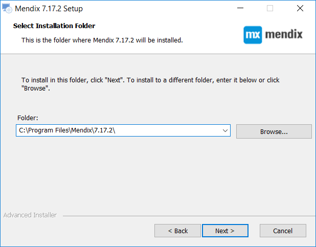

## 1 Introduction

The Mendix Desktop Modeler enables you to build apps on the Mendix Platform. This how-to will guide you through the steps of installing the Mendix Desktop Modeler.

**This how-to will teach you how to do the following:**

* Download the Mendix Desktop Modeler
* Install the Mendix Desktop Modeler

## 2 Prerequisites

Before starting this how-to, make sure you have completed the following prerequisites:

* You need a Windows environment to install the Modeler (see [System Requirements](/refguide/system-requirements) for the full list of supported systems and required frameworks)

## 3 Download the Mendix Desktop Modeler

The Mendix Desktop Modeler can be installed on your machine with a Windows exectuable file. This executable can be downloaded from the Mendix App Store. Follow these steps to download the Mendix Desktop Modeler:

1. Go to the Modeler download page in the [Mendix App Store](https://appstore.home.mendix.com/link/modeler/).
2. Click **Download** to download the latest Mendix Desktop Modeler.

   

## 4 Install the Mendix Desktop Modeler

The Mendix Desktop Modeler needs to be installed on your computer before you can start building apps. Follow these steps to install the Mendix Desktop Modeler:

1. Open the downloaded Mendix Modeler executable. It is named like this: *Mendix-7.X.X-Setup*.

    

2. Click **Next**.

    

3. Select **I accept the terms in the License Agreement** and click **Next**.

    

4. Select the folder where you want to install to and click **Next**.

    

5. Enter the start menu shortcuts folder you want to use and click **Next**.

    

6. Check the **Desktop** option to create a shortcut to the Modeler on your desktop and click **Next**.

    

7. Click **Install** to install the Modeler on your computer.

    

8. Check **Launch Mendix 7.X.X** and click **Finish** to finish the installation and launch the Modeler.

This concludes the how-to about installing the Mendix Desktop Modeler.

## 5 Related Content

* [Desktop Modeler](/refguide/desktop-modeler)
* [Desktop Modeler Overview](/refguide/desktop-modeler-overview)
