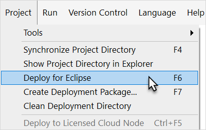
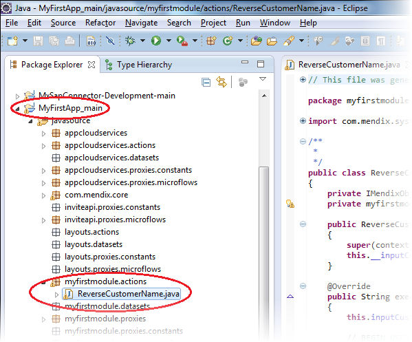
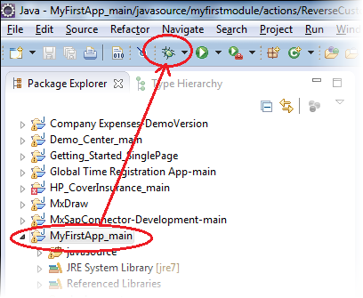
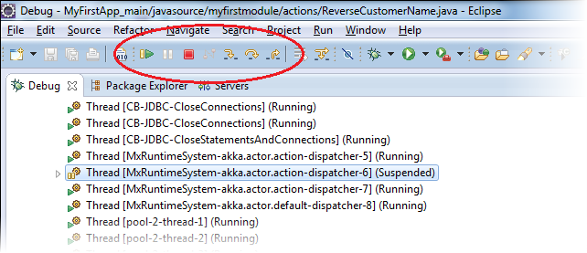
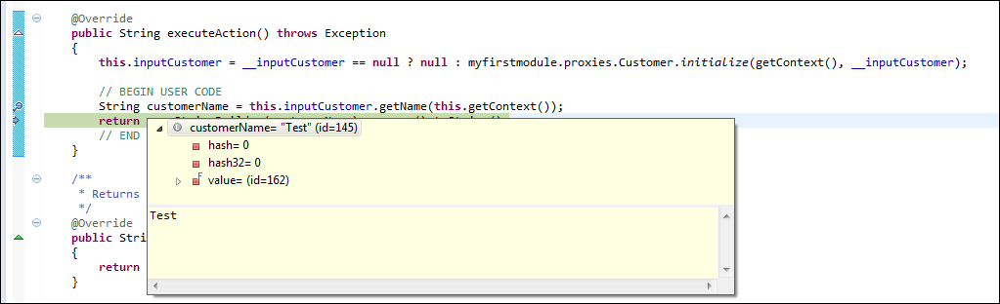

## 1 Introduction

The Mendix Modeler has a built-in debugger to solve errors on the microflow level. A microflow can be extended with custom Java actions, but because these actions are text-based, they can only be checked on compile errors. If you run into an error in any of the Java actions, you can easily debug them by utilizing the debugger of Eclipse.

**This how-to will teach you how to do the following:**

* Set breakpoints
* Debug in Eclipe

## 2 Prerequisites

Before starting this how-to, make sure you have completed the following prerequisites:

* Install [Eclipse](https://eclipse.org/)
* Add a Java action and open the project in Eclipse
* Read [How to Extend Your Application with Custom Java](../logic-business-rules/extending-your-application-with-custom-java)
* Deploy the application for Eclipse by selecting **Deploy for Eclipse** from the project menu in the Modeler (you should redo this every time you make changes in the Modeler):
    

## 3 Setting Breakpoints

1. Open Eclipse and locate the project in the **Package Explorer**.
2. Double-click **ReverseCustomerName.java**:
    
3. Place the cursor on the line that needs debugging, hold down **Ctrl+Shift**, and press **B** to enable a breakpoint. A blue dot in front of the line will appear: 
    

    {}

    You can also use Ctrl+Shift+B to disable a breakpoint.

    {}

## 4 Debugging in Eclipse

1. Select the project root node in the package explorer and click the debug icon in the Eclipse toolbar:
    

    The application will now be started with Eclipse attached as debugger.
    
2. As soon as the deployment process is ready, open the application in your browser and trigger the Java action:
    * As an end-user of the application, you will see a progress bar on your application
    * As a developer, you will see the Eclipse icon flashing on the Windows task bar
3. Open Eclipse. You should now see the "debug" perspective of Eclipse.
4. Click **Step into** (or press F5) or **Step over** (or press F6) to move on the next step in the microflow:
    

    {}

    With debugger options, the difference between "Step into" and "Step over" is only noticeable if you run into a function call. "Step into" means that the debugger steps into the function, and "Step over" just moves the debugger to the next line in the same Java action. With "Step Return" (pressing F7), you can instruct the debugger to leave the function; this is basically the opposite of "Step Into." Clicking "Resume" (pressing F8) instructs the debugger to continue until it reaches another breakpoint.

    {}
5. Place your cursor on any of the variables in the Java action to see its value in a pop-up window:
    

## 5 Related Content

* [How to Find the Root Cause of Runtime Errors](finding-the-root-cause-of-runtime-errors)
* [How to Clear Warning Messages in Mendix](clear-warning-messages)
* [How to Test Web Services Using SoapUI](../testing/testing-web-services-using-soapui)
* [How to Monitor Mendix Using JMX](monitoring-mendix-using-jmx)
* [How to Debug Java Actions Remotely](debug-java-actions-remotely)
* [How to Log Levels](log-levels)
* [How to Debug Microflows](debug-microflows)
* [How to Common Mendix SSO Errors](handle-common-mendix-sso-errors)
* [How to Debug Microflows Remotely](debug-microflows-remotely)
* [Java Actions](/refguide7/java-actions)
