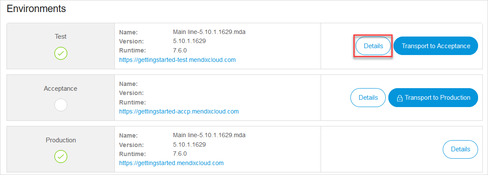
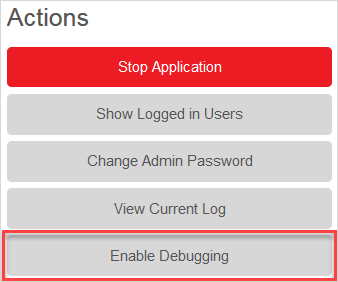
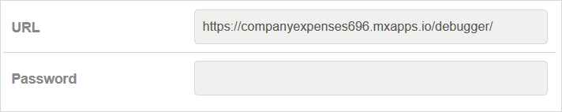
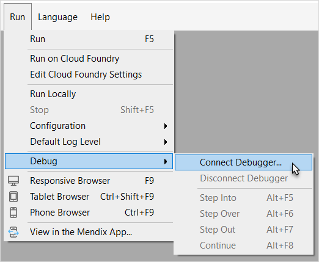
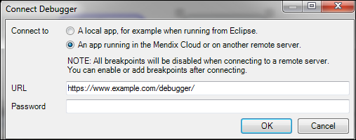

## 1 Introduction

It is possible to debug applications that are already in the cloud (either in an acceptance or production environment).

**This how-to will teach you how to do the following:**

* Connect your debugger to your cloud environment

## 2 Prerequisites

Before starting this how-to, make sure you have completed the following prerequisites:

* Install a Basic, Professional, or Enterprise Mendix edition: [http://www.mendix.com/editions/](http://www.mendix.com/editions/)

## 3 The Basics

To enable the cloud debugging, you need to get a URL and a password from the cloud and add that information to the Modeler. The steps below will explain where you can gather all the necessary information. 

{}

The debugger supports only debugging of single instance environments. Multi-instance environents need to be scaled down to one instance first before the debugger can be used.

{}

{}

Debugging in production is not recommended. However, if you are debugging in the cloud, be aware of other system end-users. The debugger will stop processes from moving on for other users.

{}

### 3.1 Enabling Debugging in the Cloud

1. Open your browser, go to [http://home.mendix.com](http://home.mendix.com), and log in with your Mendix ID.

2. Click **Apps** and navigate to the project that you want to debug:

     

3. Click **Environments** in the left sidebar, and on the **Deploy** tab, click **Details** for the environment:

    

4. On the **Environment Details** screen, click **Enable Debugging**:

    

    This invokes the **Debugger settings** pop-up window. Usually this presents a URL (such as `http://yourapp.mendixcloud.com`) and a secure password that changes each time you enable and disable the debugger:

    

    If you want to disable the debugger, click **Disable Debugging** on the **Environment Details** screen.

### 3.2 How to Enable Cloud Debugging in Your Modeler

Once you have the unique URL and password, there are two methods for connecting the modeler to the cloud environment. 

{}

If you do not see an overview similar to the one below, then you do not have sufficient cloud permissions to deploy packages into the cloud or to debug in the cloud. Contact the technical contact or the project SCRUM master in your project to get sufficient permissions.

{}

#### 3.2.1 First Method for Connecting the Modeler to the Cloud Environment

1. Go to the **Run** tab and select **Connect debugger...**:

    

2. In the **Connect Debugger** dialog box, enter the **URL** and the **Password** that you got from the cloud environment (for details, see [3.1 Enabling Debugging in the Cloud](#EnablingDebuggingintheCloud)):

    

#### 3.2.2 Second Method for Connecting the Modeler to the Cloud Environment

1. Go to the **Debugger** dock window.
2. Click **Connect** and enter the URL and password information in the dialog window.

## 4 Related Content

* [How to Find the Root Cause of Runtime Errors](finding-the-root-cause-of-runtime-errors)
* [How to Clear Warning Messages](clear-warning-messages)
* [How to Test Web Services Using SoapUI](../testing/testing-web-services-using-soapui)
* [How to Monitor Mendix Using JMX](monitoring-mendix-using-jmx)
* [How to Debug Java Actions Remotely](debug-java-actions-remotely)
* [How to Log Levels](log-levels)
* [How to Debug Microflows](debug-microflows)
* [How to Debug Java Actions](debug-java-actions)
* [How to Handle Common Mendix SSO Errors](handle-common-mendix-sso-errors)
* [The Ultimate Debugger](http://www.mendix.com/tech-blog/the-ultimate-debugger/) 
* [Debug Live Apps in the Cloud](http://www.mendix.com/tech-blog/new-goodies-for-mendix-app-platform-users-mendix-business-modeler-4-3-release-today/)
