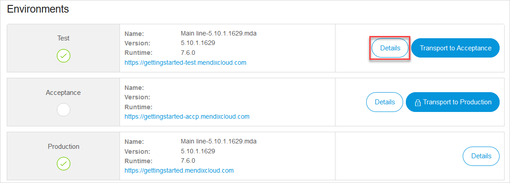
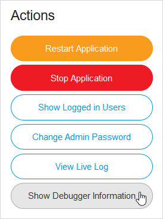
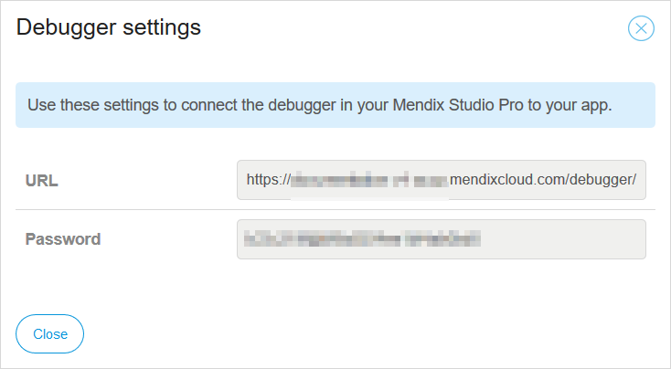
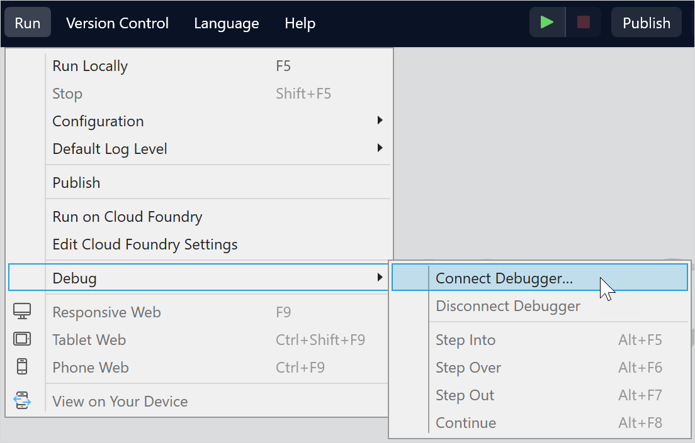
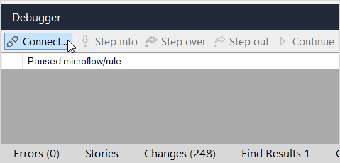
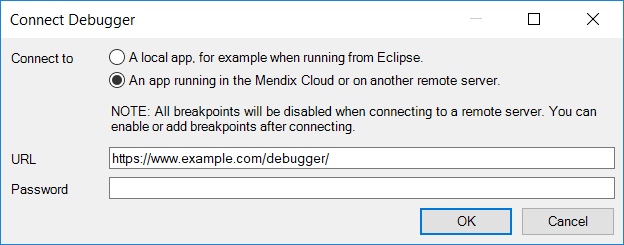

## 1 Introduction

In addition to debugging a local deployment of your app, it is also possible to debug applications that are already in a cloud environment.

{}
These instructions are for apps running in Mendix Cloud v4. If you are running an older version of Mendix which is deployed to Mendix Cloud v3 you need the previous version of this document here: [Debug Microflows Remotely](/howto7/monitoring-troubleshooting/debug-microflows-remotely).
{}

{}
**Debugging in a production environment is not recommended.**

If you are debugging in the cloud, be aware of other app end-users. Breakpoints in the debugger will pause processes for all users of the app in this environment.
{}

**This how-to will teach you how to do the following:**

* Connect the debugger in Studio Pro to your Mendix Cloud v4 environment

## 2 Prerequisites

Before starting this how-to, make sure you have completed the following prerequisites:

* Have access as a team member to a Mendix app deployed to a [licensed](/developerportal/deploy/licensing-apps) Mendix Cloud v4 environment
* Have **TRANSPORT RIGHTS** to the app environment you want to debug in the app's [node permissions](/developerportal/deploy/node-permissions)

## 3 The Basics

In Mendix Cloud v4, the debugger is always listening for connections so you cannot turn it on or off. To debug your app in the cloud, you need to get a URL and a password from the app environment and provide that information to Studio Pro. The steps below explain how to do this.

{}
The debugger supports only debugging of single-instance environments. Multi-instance environments need to be scaled down to one instance before the debugger can be used. See [Scaling Your Environment in Mendix Cloud v4](/developerportal/deploy/scale-environment) for more information.
{}

### 3.1 Obtain Debugging Credentials

#### 3.1.1 Obtain Debugging Credentials from Mendix cloud

When your application is in the Mendix cloud:

1. Open your app in the [Developer Portal](https://home.mendix.com).

2. Click **Environments** in the left sidebar.

3. In the **Deploy** tab, click **Details** for the environment which you want to debug:

    

4. In the **General** tab, click **Show Debugger Information**:

    

    This invokes the **Debugger settings** pop-up window which provides a URL (such as `http://yourapp.mendixcloud.com/debugger/`) and a password:

    

You will need to provide these credentials to Studio Pro to connect the debugger to the app running in the cloud.

#### 3.1.2 Obtain Debugging Credentials from SAP S/4 HANA Cloud

If your application is on the SAP S/4 HANA cloud, you will need to set the password in the SAP Cockpit:

1. Log in to the SAP Cockpit and go to your application's settings page.

2. Go to your application > **User-Provided Variables**.

3. Click on the button 'Add variable' and add 'DEBUGGER_PASSWORD' and the password. Both are case-sensitive.

    

4. Restart your application.

### 3.2 How to Enable Cloud Debugging in Studio Pro

Once you have the unique URL and password, there are two methods for connecting Studio Pro to the cloud environment. 

{}
If you do cannot connect the debugger, then you do not have sufficient permissions to your app. Ask the *technical contact* or the project *SCRUM Master* to provide the correct permissions.
{}

1. Open the **Connect Debugger** dialog box – you can do this in two ways within Studio Pro:

    * Go to the **Run** menu and select **Connect Debugger…**:

        
        
    * Click **Connect…** in the **Debugger** pane:

        

2. In the **Connect Debugger** dialog box set the following:

    * **Connect to** – select the option *An app running in the Mendix Cloud or on another remote server.*
    * **URL** – the *URL* from the **Debugger Settings** for your app environment
    * **Password** – the *Password* from the **Debugger Settings** for your app environment

        

3. Click **OK**.

The debugger is now connected to your app running in the cloud.

## 4 Read More

* [Find the Root Cause of Runtime Errors](finding-the-root-cause-of-runtime-errors)
* [Clear Warning Messages](clear-warning-messages)
* [Test Web Services Using SoapUI](/howto/testing/testing-web-services-using-soapui)
* [Monitor Mendix Using JMX](monitoring-mendix-using-jmx)
* [Debug Java Actions Remotely](debug-java-actions-remotely)
* [Log Levels](log-levels)
* [Debug Microflows](debug-microflows)
* [Debug Java Actions](debug-java-actions)
* [The Ultimate Debugger](http://www.mendix.com/tech-blog/the-ultimate-debugger/) 
