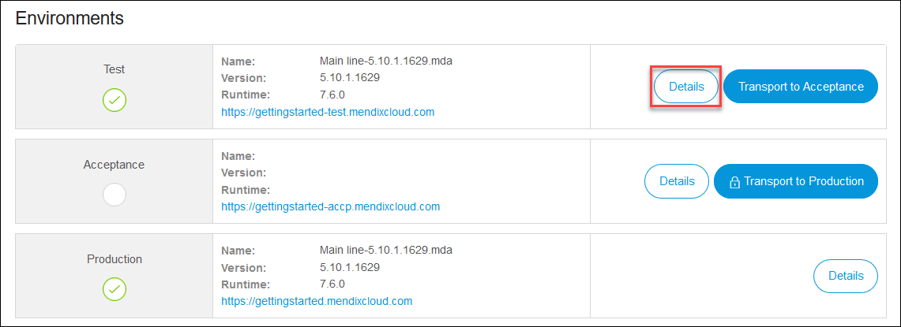

## 1 Introduction

It is possible to debug applications that are already in a cloud environment.

{}

These instructions are for apps running in Mendix Cloud v4. There are instructions for running in Mendix Cloud v3 in the previous version of this document here: [Debug Microflows Remotely](/howto7/monitoring-troubleshooting/debug-microflows-remotely).

{}

{}

Debugging in a production environment is not recommended.

If you are debugging in the cloud, be aware of other app end-users. Breakpoints in the debugger will pause processes for all users of the app in this environment.

{}

**This how-to will teach you how to do the following:**

* Connect the debugger in Studio Pro to your cloud environment

## 2 Prerequisites

Before starting this how-to, make sure you have completed the following prerequisites:

* Deploy a Mendix app to a [licensed](/developerportal/deploy/licensing-apps) Mendix Cloud v4 environment

## 3 The Basics

To enable the cloud debugging, you need to get a URL and a password from the cloud and add that information to Studio Pro. The steps below will explain where you can gather all the necessary information. 

{}

The debugger supports only debugging of single-instance environments. Multi-instance environments need to be scaled down to one instance before the debugger can be used.

{}

### 3.1 Enabling Debugging in the Cloud

1. Open your browser, go to [http://home.mendix.com](http://home.mendix.com), and log in with your Mendix ID.

2. Click **Apps** and navigate to the project that you want to debug:

     

3. Click **Environments** in the left sidebar, and on the **Deploy** tab, click **Details** for the environment:

    

4. On the **Environment Details** screen, click **Enable Debugging**:

    

    This invokes the **Debugger settings** pop-up window. Usually this presents a URL (such as `http://yourapp.mendixcloud.com`) and a secure password that changes each time you enable and disable the debugger:

    

    If you want to disable the debugger, click **Disable Debugging** on the **Environment Details** screen.

### 3.2 How to Enable Cloud Debugging in Studio Pro

Once you have the unique URL and password, there are two methods for connecting Studio Pro to the cloud environment. 

{}

If you do not see an overview similar to the one below, then you do not have sufficient cloud permissions to deploy packages into the cloud or to debug in the cloud. Contact the technical contact or the project SCRUM Master in your project to get sufficient permissions.

{}

#### 3.2.1 First Method for Connecting Studio Pro to the Cloud Environment

1. Go to the **Run** tab and select **Connect debugger...**:

    

2. In the **Connect Debugger** dialog box, enter the **URL** and the **Password** that you got from the cloud environment (for details, see [3.1 Enabling Debugging in the Cloud](#EnablingDebuggingintheCloud)):

    

#### 3.2.2 Second Method for Connecting Studio Pro to the Cloud Environment

1. Go to the **Debugger** dock window.
2. Click **Connect** and enter the URL and password information in the dialog window.

## 4 Read More

* [Find the Root Cause of Runtime Errors](finding-the-root-cause-of-runtime-errors)
* [Clear Warning Messages](clear-warning-messages)
* [Test Web Services Using SoapUI](../testing/testing-web-services-using-soapui)
* [Monitor Mendix Using JMX](monitoring-mendix-using-jmx)
* [Debug Java Actions Remotely](debug-java-actions-remotely)
* [Log Levels](log-levels)
* [Debug Microflows](debug-microflows)
* [Debug Java Actions](debug-java-actions)
* [Handle Common Mendix SSO Errors](handle-common-mendix-sso-errors)
* [The Ultimate Debugger](http://www.mendix.com/tech-blog/the-ultimate-debugger/) 

