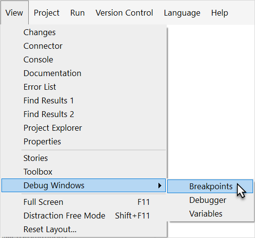
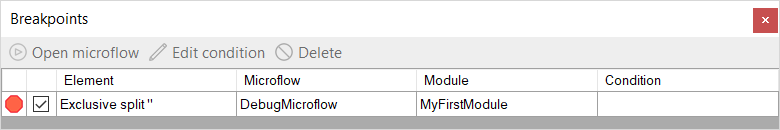
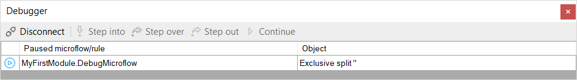
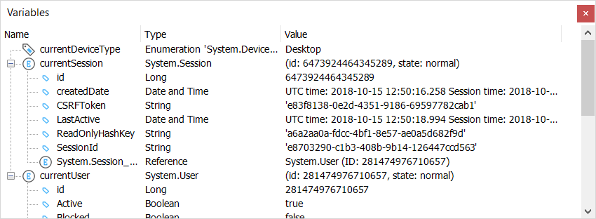
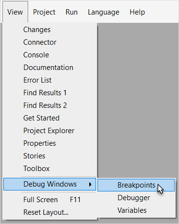
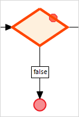
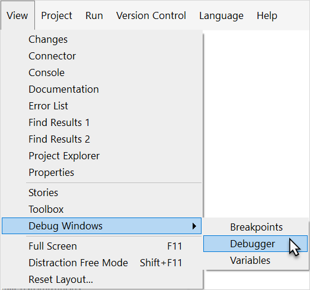
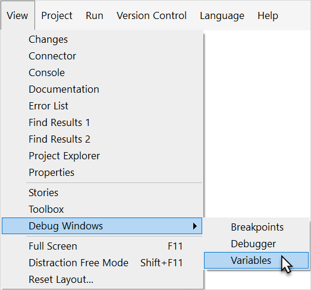
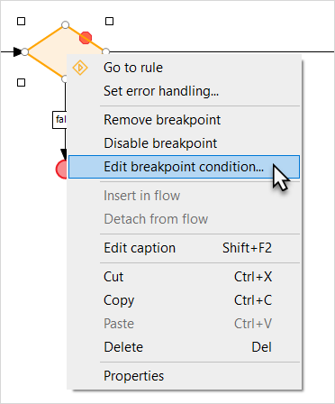
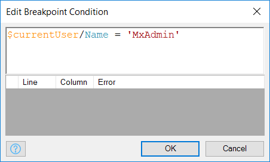

## 1 Introduction

The Mendix Modeler has a built-in consistency checker that validates if the application you are building contains any obvious errors. This dramatically reduces the amount of technical errors during run-time, but the Modeler isn't able to check if your app contains functional errors. This is mainly a manual practice, but Mendix does support enough tools to make this easier. If you run into a functional error in any of the microflows, you can easily debug them with the debugger.

**This how-to will teach you how to do the following:**

* Use breakpoints
* Debug microflows

## 2 Prerequisites

Before starting this how-to, make sure you have completed the following prerequisites:

* Read [How to Create a Basic Data Layer](../data-models/create-a-basic-data-layer)
* Read [How to Create Your First Two Overview and Detail pages](../ux/create-your-first-two-overview-and-detail-pages)

## 3 Debugging Overview

There are three debugging windows to be aware of: **Breakpoints**, **Debugger**, and **Variables**:



The **Breakpoints** window shows all the microflows that contain breakpoints, which makes it easier to find your breakpoints. The best practice is to remove any breakpoints after you are done troubleshooting your microflows. You can always delete them from the **Breakpoints** dock window.



The **Debugger** dock window is useful when you are debugging your microflow, as it will walk you through the microflow:



The **Variables** dock window shows the variables involved in your microflow and how they are changing as you step through the microflow via the **Debugger** window:



The best practice is to have the **Debugger** and **Variables** windows at different docks. The **Debugger** window should usually be at the bottom of your development dock, and the **Variables** can be either on the left dock or the side dock. You want to be aware of how the variables are being changed in the microflow, and it is difficult to see those changes if both windows are tabs within the same dock.

## 4 Using Breakpoints

Breakpoints are points in a microflow where the application will halt execution. This is useful to analyze the application execution and data up to that point. You can add breakpoints at any point in your microflow by following these steps:

1. Run your application locally.
2. Open the microflow that needs debugging in the Modeler.
3. Right-click any of the activities or splits in the microflow and select **Add breakpoint**. This sets a breakpoint on the selected step in the microflow, which is visually represented by a red dot:
    
    You can open an overview of all the breakpoints by going to **View** > **Breakpoints**:
    

    In the **Breakpoints** window, you can enable, disable, and delete breakpoints. You can also configure a breakpoint condition and open the microflow that contains that breakpoint:
    

## 5 Debugging

1. Run the application and open it in your browser.
2. Do whatever is needed to trigger the microflow that you want to debug:
    * As an end-user of the application, you will see a progress bar on the application
    * As a developer of the application, you will see the Mendix icon flashing on the Windows task bar
3. Click the icon on the Windows task bar to open the Modeler. The element with the breakpoint that interrupts this microflow should be highlighted with a red border:
    
4. Open the **Debugger** window from the **View** menu:
    

    The debugger can be used to go through the microflow step by step:
    
5. You have the following options on this window:  
    * Click **Step into** or **Step over** to move to the next step in the microflow (note that the difference between **Step into** and **Step over** is only noticeable if you run into a call microflow activity or a loop)
        * **Step into** means that the debugger steps into the sub microflow or loop
        * **Step over** moves the debugger to the next step in the same microflow
    * Click **Step out** to instruct the debugger to leave the sub microflow or loop (this is basically the opposite of **Step Into**)
    * Click **Continue** to instruct the debugger to continue until it reaches another breakpoint

## 6 Variables Viewer

As you are stepping through a microflow, the variables window will start to change. This overview will show you all the variables involved in the application. It will show you all the entities, references, current-user information, and device-type information. It can be used as you are stepping through the microflow to review the variable values and see if they match your expectations.

You can open the **Variables** window from the **View** menu:


The **Variables** viewer can be used to inspect the values of variables in the microflow. The values are updated with every step you make in the **Debugger**:


## 7 Breakpoint Conditions

Sometimes it is necessary to configure a breakpoint so that the microflow only breaks on a certain condition. This is achieved with breakpoint conditions and is configured by use of microflow expressions. Setting a breakpoint condition can be very useful if you are debugging a batch process and you only want to break at a certain value. Using breakpoint conditions is strongly advised if you are debugging an application that is running in production, as this will prevent the application from stopping for users other than yourself.

To use breakpoint conditions, follow these steps:

1. Right-click the activity or split in the microflow with a breakpoint and select **Edit breakpoint condition...**:
    
2.  Use the expression below to make sure this breakpoint only interrupts the microflow if you are executing it yourself (replace `YourUserName` with your own user name):

    ```java
    $currentUser/name = 'YourUserName'
    ```

    The expression should look like this:
    

3. Click **OK** to save the breakpoint condition.

## 8 Related Content

* [How to Find the Root Cause of Runtime Errors](finding-the-root-cause-of-runtime-errors)
* [How to Clear Warning Messages in Mendix](clear-warning-messages)
* [How to Test Web Services Using SoapUI](../testing/testing-web-services-using-soapui)
* [How to Monitor Mendix Using JMX](monitoring-mendix-using-jmx)
* [How to Debug Java Actions Remotely](debug-java-actions-remotely)
* [How to Log Levels](log-levels)
* [How to Debug Java Actions](debug-java-actions)
* [How to Handle Common Mendix SSO Errors](handle-common-mendix-sso-errors)
* [How to Debug Microflows Remotely](debug-microflows-remotely)
* [Microflow Element Common Properties](/refguide7/microflow-element-common-properties)
