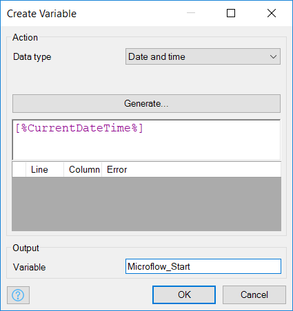
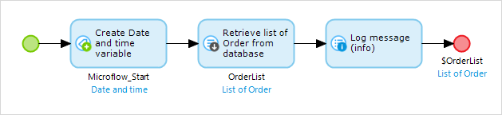
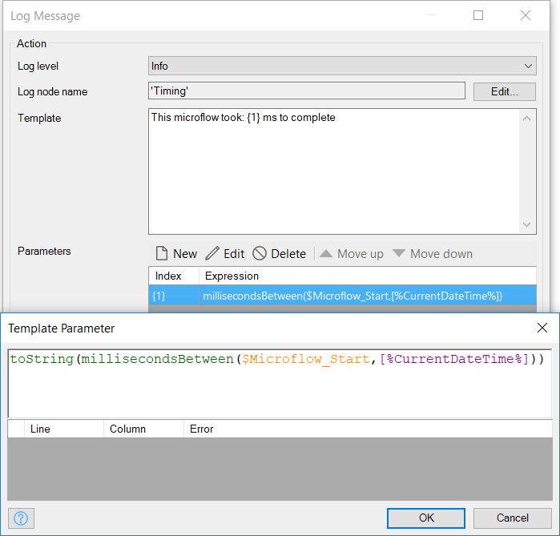
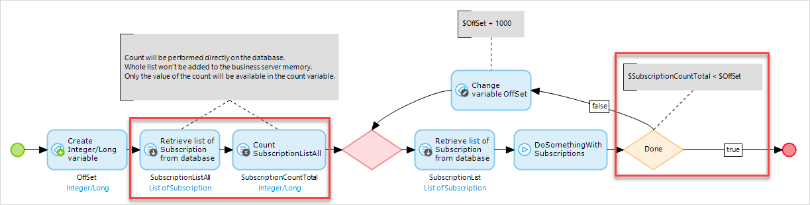
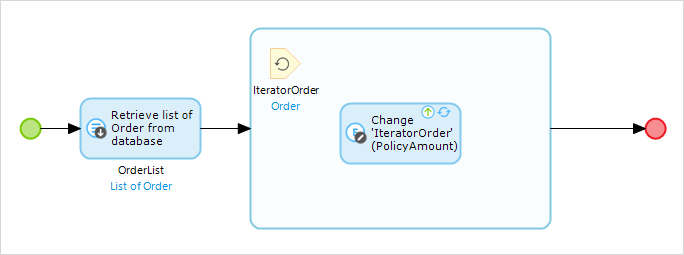
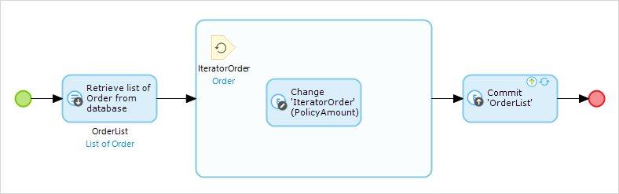

Any application can run into performance issues. Here are a number of possible performance issues you may run into, some root causes, and finally how you can resolve them.

## Overview

The flow chart below, designed  like a microflow, provides a great infrastructure for deciding how to troubleshoot and resolve performance-related issues. The rest of this article will be based on this flow.

## Issues

Performance issues typically manifest themselves for users in one of two ways: either an action takes too long to complete (a page feels slow or unresponsive), or an entire page loads slowly.

In either case, some process is running too long or too many times to complete a specific task. Your goal should be to identify _which_ _tasks_ in particular are causing your issue, and focus your effort on optimizing that task. 

First, you'll need to identify if your issue is UI-centric or microflow-centric. If a page is taking a long time to initially load, or if a page gets slow or unresponsive after clicking a microflow button, it's most likely a microflow slowing your application down. If the UI feels glitchy or slow _after_ the page has loaded, you may have a UI-centric issue.

{}

All performance issues are extremely context-sensitive. That is, there is no single cure-all for a performance problem, but this article will attempt to address common issues and how may be able to resolve them.

{}

## Slow UI

If your user interface is slow, you'll need to figure out whether this is due to slow microflows called by the page, or due to a large number of calls made by the UI. To determine, you'll need to use a web browser debugger, such as Firebug [http://getfirebug.com/](http://getfirebug.com/).

After installing Firebug, open your app in Firefox, navigate to your app, and before you load the page with an issue, press the F12 key on your keyboard. This will activate Firebug:

From here, click on the "Net" tab and activate Firebug if prompted. Then, select the _all_ sub-tab. Next, in Firefox load your slow page. Your Firebug window should look something like this:

Here I have _26_ xpath retrieves for my single page load. The timeline on the right gives you run times for each step (purple), and indicates how long that step waited before starting (grey). In my case, I have a few retrieves that took longer than others, but the fact that I have 26 retrieves occurring is also a potential issue.

Once you've identified the cause, either too many loads, or slow loads, you're ready to move on.

### Too Many Loads

If you have too many loads occurring on a single page, review the page structure in the modeler to determine if that number can be reduced. Here are a few common causes of large number of loads:

*   Many datagrids
*   Many nested dataviews
*   Many reference selectors
*   Many tabs
*   Widgets

Every situation is unique, but you're well on your way to finding your slow component. From here, sometimes trial and error is you best bet. Remove objects from your page until it speeds up to narrow down the slow one.

### Slow Loads

So you've determined that slow loads are your issue. Take a look at the slow load in Firebug, and determine where it comes from:

*   A retrieve action
*   A microflow
*   Slow network (long transfer time for small amount of data)

#### Slow Network

If your data transfers are taking a long time, you may wish to contact a system administrator for further assistance. This article focuses on issues you can resolve within your application model.

#### Retrieve Action

If you find that a particular retrieve action is slow, you can work to simplify it. Review the following:

*   Complex XPath
*   Missing Indexes
*   Combined Security Rules (i.e. a user with multiple user roles, each with complex security)

#### Microflow

If your slow action occurs via microflow, see the next section for information on troubleshooting slow microflows.

## Slow Microflows

So your performance issue is caused by a microflow. Now you just need to find out _which_ _microflow,_ and _which activities_ are the slowest in that microflow.

Sometimes, identifying the slow activity and activities in your slow microflow will be obvious. You may have a single microflow with just a few steps, and one of them is egregiously slow. If this is the case, move on to the next section and focus on optimization. If not, continue on below.

There are a number of tools you can use to identify your slow microflow, and the specific slow activities in that microflow:

*   Server Monitoring
*   Microflow Debugger
*   Microflow Time Stamps

### Server Monitoring

The Mendix Server and Developer Portal offer a number of performance graphs and logs.

### Microflow Debugger

Once you've identified a slow page, it's pretty easy to identify which microflows are executed on that page. Make sure you look at directly referenced microflows, such as data sources, but also look at any sub-flows, on change event handlers, or domain model event handlers that could be called by your page.

Setting a break point and stepping through these relevant microflows can often give you a quick (although subjective) way to find a slow action. To get started with debugging microflows, see: [Debugging Microflows](https://world.mendix.com/display/howto6/Debugging+Microflows). If you cannot subjectively identify your slow process, move on to the next step.

### Microflow Time Stamps

Times Stamps can allow you to objectively identify slow microflows and activities by timing their execution. To do so, consider a simple microflow like this:

To set up a timer, add a _Create Variable_ activity as the first step. Here you're going to store the current time:

Next, add a _Log Message_ activity at the end of your microflow:

Set up the activity similar to this:

Here, you're calculating the number of milliseconds between when your microflow began and when it completed, and then writing that out to the console as info. When you run your project, you will see a line in the console every time this microflow executes. The message will contain the execution time.

Add microflow timers until you find your culprit microflow, then add extra timers in that microflow to determine which activity is the slow one. If you find a slow activity, look at Optimizing Microflow Activities. If not, look further down for suggestions on optimizing your microflow as a whole.

## Optimizing Microflow Activities

### Slow Database Retrieves

Slow retrieves can occur for a number of different reasons. Here are a few:

*   Sub-optimal xpath
*   Complex security xpath
*   Missing indexes
*   Complex calculated attributes
*   Large # of objects retrieved (See batching below)

Additionally, review this article on denormalization and how it can improve your app performance in some cases: [Denormalize Data to Improve Performance](https://world.mendix.com/display/howto6/Denormalize+Data+to+Improve+Performance)

### Slow Database Commits

Slow commits are often caused by a Before or After Commit event. Review those microflows for slow activities.

If you are commit large amounts of data (1000s of rows), you might consider using batching to improve performance. Additionally, check for the use of the "Refresh in Client" property.

#### Batches

Below is an example of how to _retrieve_ in batches. You can do something quite similar for commits as well. This article will be expanded in the future to include a complete example of a batch retrieve and a batch commit.

#### Refresh in Client

The "Refresh in Client" property of a change or commit activity is quite useful to provide updated information to your user. However, when committing large numbers of rows,this can slow you application down as it attempts to update thousands of rows in your client's browser. Consider turning it off if possible.

### Slow Sub Microflow

If you find that you have a slow sub microflow, begin the process of identifying the slow activity within the microflow, based on the Slow Microflows section above.

### General Slow Microflow (No Specific Activity Identified)

If your microflow is slow as a whole, but there is no particular activity that stands out as the culprit, consider the structure of your microflow. Here are a number of possible issues:

*   Many Commits
*   Many retrieves
*   Unnecessary/Nested Loops

#### Many Commits

If you find yourself committing data inside a loop, you can typically optimize this by making changes to your entities and storing them into a list. For example, consider this microflow:

Every time the loop executes, an Order object is committed. You can optimize this by committing the entire list outside the loop, after processing is completed. Simply set the _commit_ property to _no_ on the _Change Order _activity, then add a commit of the entire OrderList outside the loop:

This ultimately reduces the number of database operations that need to be performed during execution of your microflow, thus enhancing performance.

#### Many Retrieves

If your microflow performs multiple retrieves, especially in a loop, this may be the cause of your performance issues. To optimize this, think about how you could retrieve data in lists outside of a loop. Additionally, check for any calculated attributes on your retrieved entities, as they are calculated every time you retrieve that entity, _regardless_ of whether they are actually used.

#### Unnecessary / Nested Loops

If you find that your microflow has a large number of objects to loop over, or especially if your microflow has nested loops, execution time can escalate quickly. In this situation, think about your Domain Model architecture, and how an additional entity, attribute, or association might make it simply to accessing the information you need. You might also be able to more effectively use xpath rather than search in a loop for a particular object.

As always, make sure you look at retrieves and commits performed in your loops, and try to minimize them wherever possible.

## Related Content

[Expert Webinar Series: App Performance](http://ww2.mendix.com/Expert-Webinar.Performance.html)
