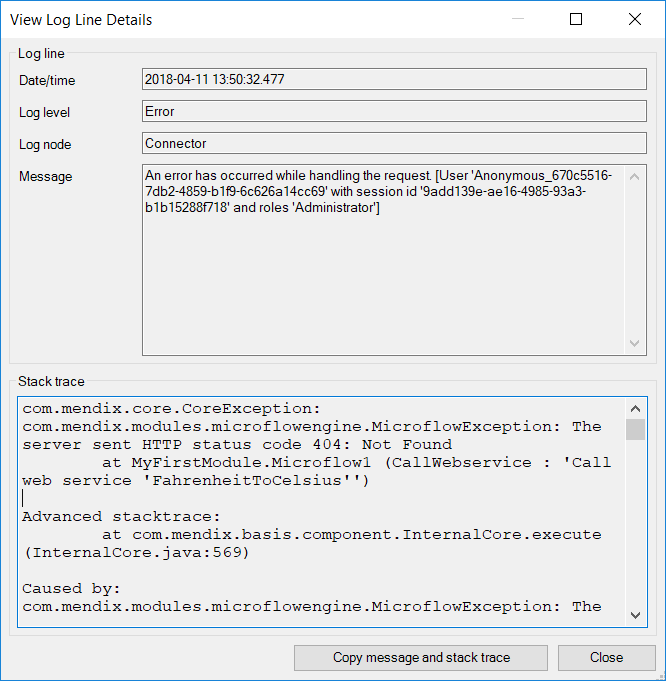

## 1 Introduction

This how to will show you how to find the information necessary to locate the root cause of a runtime error. The message displayed in the application is often vague and non-descript. Depending on the environment in which the error occurred, there are two methods for finding this information.

**This how-to will teach you how to do the following:**

* Find the root cause of runtime errors via two methods

## 2 Method #1 – Using Studio Pro

If the application is deployed from Studio Pro, the information is located in the console:

When an error occurs, a line with a red font will appear in the console.  Double-clicking on this line brings up the **VIew Log Line Details** pop-up window:

There are three key pieces of information in this window:

1. The microflow and action where the error occurred.
2. The type of error that occurred.
3. The expression in which the error occurred.

With these three pieces of information, you should be able to find the cause of the error. If you cannot determine the cause from this information, you can put a break point in the specified microflow and debug the situation.

## 3 Method #2 – Using the Application Logs

If the application is deployed from the service console or in the cloud, the information is available in the application logs. 

{}

You need to have the timestamp of when the error occurred. The logs can contain a lot of information, and this timestamp will make searching through them much easier. Once you navigate to the log file, you can search for the error.

{}

Go to the section of the log that corresponds to the time of the error. There will be a number of lines in that timeframe that have `ERROR – ` after the timestamp. These are the lines of the log file that contain the necessary information. There are three key pieces of information here:

1. The microflow and action where the error occurred.
2. The type of error that occurred.
3. The expression in which the error occurred.

With these three pieces of information, you should be able to find the cause of the error. If you cannot determine the cause from this information, you can put in a break point in the specified microflow and debug the situation.

## 4 Read More

* [Clear Warning Messages](clear-warning-messages)
* [Test Web Services Using SoapUI](../testing/testing-web-services-using-soapui)
* [Monitor Mendix Using JMX](monitoring-mendix-using-jmx)
* [Debug Java Actions Remotely](debug-java-actions-remotely)
* [Log Levels](log-levels)
* [Debug Microflows](debug-microflows)
* [Debug Microflows Remotely](debug-microflows-remotely)
* [Debug Java Actions](debug-java-actions)
* [The Root Cause of Runtime Errors and Resolving the 2 Most Common Issues](http://www.mendix.com/blog/the-root-cause-of-runtime-errors-and-resolving-the-2-most-common-issues/)
