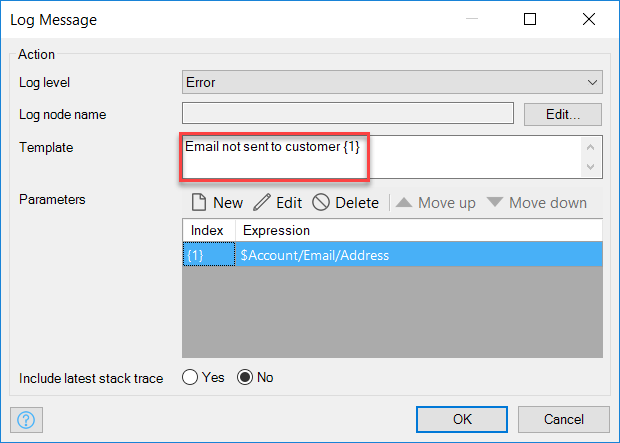
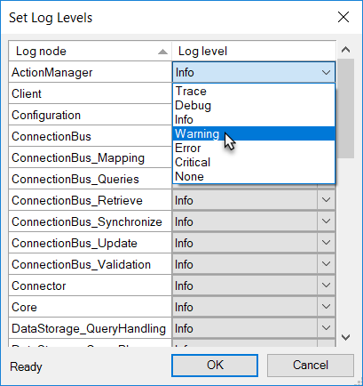
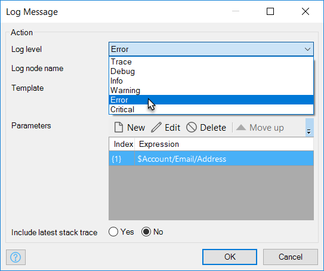

## 1 Introduction

Each application has a log to which it writes log messages to monitor the health of the running application. Log levels are used to label the log messages and to highlight the highest priority ones so that they can be easily identified and responded to.

**This how-to will teach you how to do the following:**

* Configure the log levels for the various types of logging within your app

## 2 Logging Basics

### 2.1 Log Messages

Log messages appear in the log of your Mendix application and present contextualized and detailed information, including the following:

* Date and time the log message was created
* Level
* Log node
* Message
* Stack trace

#### 2.1.1 Log Node

The log node describes the source of the log message. For example, in a log message from the e-mail module, the log node could be set to **Email Module**.

#### 2.1.2 Message

Most messages in the log are auto-generated by the system (for example, **Mendix Runtime successfully started, the application is now available**). However, log messages that are created via a microflow, can be customized by the developer.

Customized log messages are created by defining a **Template**. The template is the structure of the message, and can be composed of parameters and free text.

 

In the image above, the template for the message is **Email not sent to customer {1}**. With this example template, when the error occurs the customer’s email address is inserted into the parameter placeholder **{1}** (for example, the log message would be **Email not sent to customer john.smith@hiscompany.com**). Thus, the log message is customized with data that is specific to the error.

#### 2.1.4 Stack Trace

The stack trace is a list of current method calls from the point when the application was started to the point where the exception occurred. 

In Studio Pro, log messages that include a stack trace are marked with a paperclip icon. Double-clicking this icon shows the stack trace.

### 2.2 Level {#level}

The log level defines the severity of the log message. In Studio Pro, this is represented by different colors and an icon. 

These are the log levels used by Mendix: 

| Level | Icon | Color | Description
| --- | --- | --- | --- |
| Trace | | | More detailed information. These are only written to logs. |
| Debug | | | Detailed information, typically of interest only when diagnosing problems. |
| Info  | | | Confirmation that things are working as expected. |
| Warning |  | Orange | Indicates that something unexpected happened or that there is some problem in the near future (for example, "disk space low"). The application is still working as expected. |
| Error |  | Red | Due to a more serious problem, the application has not been able to perform some function. |
| Critical |  | White (text), red (background) | A serious error has occurred, indicating that the application itself may be unable to continue running. |

## 3 Setting the Log Levels

In this section, you will learn how to configure the log levels of the messages produced by the system. The different highlighted [levels](#level) can be applied to the predefined logging produced by Mendix Studio Pro and to custom logging. 

This section describes how to configure both the log levels for predefined logging created by Studio Pro and custom logging.

### 3.1 Configuring Log Levels via Script

Log levels can be configured through the runtime admin port before the actual log levels exist. This enables creating a script that sets all the required log levels at once.

This is a Python script that sets `ConnectionBus` and `ActionManager` to the Trace and Debug levels:

```
import requests, base64, json, sys

payload = {
    'action':'set_log_level',
    'params': {'nodes' : [
        { 'name':'ConnectionBus', 'level':'TRACE'},
        { 'name':'ActionManager', 'level':'DEBUG'}
        ], 'force':True}
}
```

You can run this script as follows:

```
C:\temp\LogDemoApp\python
λ python setlogs.py 87a32a3e-c6db-4bc8-9fa3-7cd5b108eaec 8090
{"feedback":{},"result":0}
```

### 3.2 Configuring the Log Levels for Standard Log Messages{#standard-log-levels}

To set the log levels for standard log messages, follow these steps:

1. Ensure that your app is running locally – if not, the option to set log levels will not be clickable.
2. In the **Console** pane, click **Advanced** to open the menu of advanced options.
3. Click **Set log levels**.
4. For the relevant **Log node**, select the desired level from the drop-down in the **Log level** column.



{}
You can override the log level for standard log messages in each environment when your app is deployed to the Mendix cloud. See the [Log Levels Tab](/developerportal/deploy/environments-details#log-levels) section in *Environment Details* for more information.
{}

### 3.3 Configuring the Log Levels for Custom Log Messages

To set the level of custom log messages that you have created via a microflow, follow these steps:

1. Open the microflow in which you intend to change the log message level.
2. Double-click the log message activity.
3. In the **Log level** drop-down, select the desired level.



## 4 Read More

* [Find the Root Cause of Runtime Errors](finding-the-root-cause-of-runtime-errors)
* [Clear Warning Messages in Mendix](clear-warning-messages)
* [Monitor Mendix Using JMX](monitoring-mendix-using-jmx)
* [Debug Microflows and Nanoflows](debug-microflows-and-nanoflows)
* [Debug Java Actions](debug-java-actions)
* [A Script to Set the Log Node Levels in Mendix](http://www.mxblog.eu/p/post/2533274790397906)
