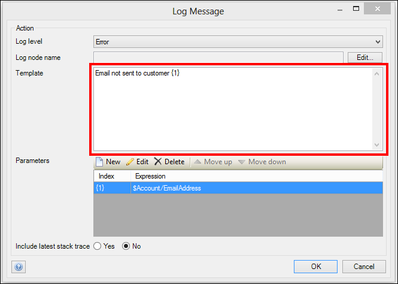
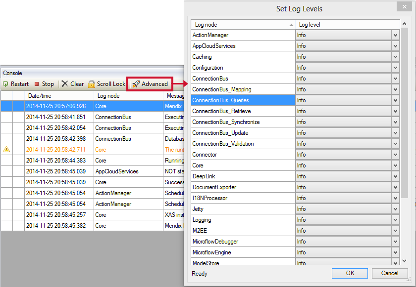
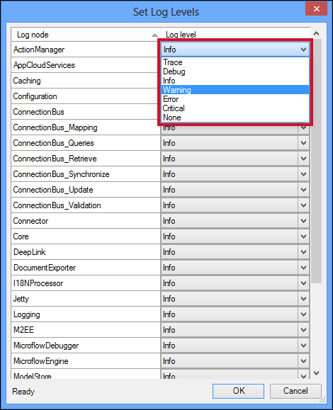
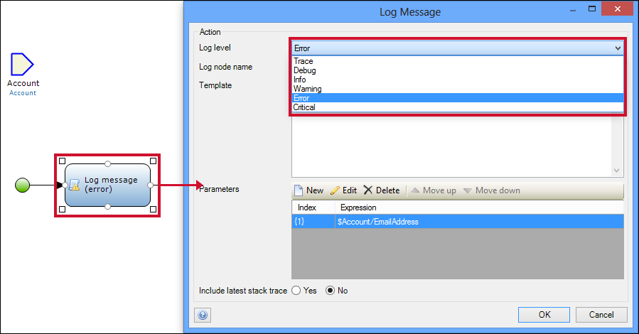

## 1 Introduction

Each application has a log and log messages to monitor the health of the running of the application. Log levels are used to distinguish the log messages and to highlight the highest priority ones so that they can receive the immediate intervention they require.

**This how-to will teach you how to do the following:**

* Configure the log levels for the various occurrence of logging within your app

## 2 Prerequisites

None.

## 3 Logging Basics

### 3.1 Log Messages

Log messages are notes that appear in the log of your Mendix application that present contextualized and detailed information such as the following:

* Date/time the log was created
* Level
* Node
* Detailed message
* Stack trace

#### 3.1.1 Log Node

The log node name defines the source of the log message. For example, in a log message from the e-mail module, the log name would appear as **Email Module**.

#### 3.1.2 Message

Most messages in the log are auto-generated by the system (for example, **Mendix Runtime successfully started, the application is now available**). However, for logging that has been created via a microflow, log messages can be customized by the developer.

Customized log messages are created by defining a template. The template is the structure of the log’s message, and can be composed of parameters and free text.

 

In the image above, the template for the message is **Email not sent to customer {1}**. With this example template, when the error occurs, the customer’s full name is inserted into the parameter placeholder **{1}** (for example, the log message would be **Email not sent to customer John Smith**). Accordingly, the log message is customized to the data that is specific to the situation.

#### 3.1.4 Stack Trace

The stack trace is a list of method calls from the point when the application was started to the point where the exception occurred. 

In the Modeler, log messages that include a stack trace are marked with a paperclip icon. Double-clicking this icon shows the stack trace.

### 3.2 Level

The log level defines the severity of the log message. In the Modeler, this is represented by different colors and an icon. 

These are the log levels used by Mendix: 

| Level | Icon | Color | Description
| --- | --- | --- | --- |
| Trace | | | More detailed information. These are only written to logs. |
| Debug | | | Detailed information, typically of interest only when diagnosing problems. |
| Info  | | | Confirmation that things are working as expected. |
| Warning |  | Orange | Indicates that something unexpected happened or that there is some problem in the near future (for example, "disk space low"). The application is still working as expected. |
| Error |  | Red | Due to a more serious problem, the application has not been able to perform some function. |
| Critical |  | White (text), red (background) | A serious error has occurred, indicating that the application itself may be unable to continue running. |

## 4 Setting the Log Levels

In this section of the how-to, you will learn how to configure the log levels of the logging messages produced by the system. The different levels highlighted in [3.2 Level](#Level) can be applied to custom logging and to the predefined logging produced by the Mendix Modeler. 

This section will define how to configure both the log levels in custom logging and the predefined logging created by the Modeler.

### 4.1 Advanced Features of the Console

To access the advanced features of the console, follow these steps:

1. Open the **Console**.
2. Click **Advanced** to open the drop-down menu of advanced options.
3. Click **Set log levels...**.

### 4.2 Configuring the Log Levels

To select the level on which a log node will log messages, follow these steps:

1. Set the relevant **Log Node**.
2. Open the **Info** drop-down menu in the **Log Level** column.
3. From the drop-down menu, select the correct level.

| Log Node | Description
| --- | --- |
| ActionManager |
| AppCloudServices | 
| Caching |
| Configuration |
| ConnectionBus | General logging related to database startup, synchronization and connections management for Mendix |
| ConnectionBus_Mapping | Information relating to the translations of XPath Queries and OQL text queries to OQL Queries |
| ConnectionBus_Queries | Deprecated: This is a legacy node |
| ConnectionBus_Retrieve | All information related to the retrieval of data, such as: Incoming requests from the application, the executed statement. Also logs issues encountered during the processing of the received data |
| ConnectionBus_Security | Information regarding access rights needed to access the database |
| ConnectionBus_Synchronize | Deprecated: This is a legacy node |
| ConnectionBus_Update | All information related to the update of data in the database. Incoming storage requests, the executed statements and issues encountered during storage |
| ConnectionBus_Validation | Information related modification of the existing database, and database migration |
| Connector |
| Core | 
| DataStorage_QueryPlan | Query execution plan information for installations (currently only supported for PostgreSQL databases)
| DeepLink |
| DocumentExplorer |
| I18NProcessor |
| Jetty |
| Logging | 
| M2EE |
| MicroflowDebugging |
| Microflow Engine |
| ModelStore | 

### 4.3 Configuring Custom Log Levels

To set the level of custom log messages that you have created via a microflow, follow these steps:

1. Open the microflow in which you intend to change the log messag level.
2. Double-click the log message activity.
3. In the **Log level** drop-down menu, select the correct level.

## 5 Related Content

* [How to Find the Root Cause of Runtime Errors](finding-the-root-cause-of-runtime-errors)
* [How to Clear Warning Messages in Mendix](clear-warning-messages)
* [How to Test Web Services Using SoapUI](../testing/testing-web-services-using-soapui)
* [How to Monitor Mendix Using JMX](monitoring-mendix-using-jmx)
* [How to Log Levels](log-levels)
* [How to Debug Microflows](debug-microflows)
* [How to Debug Microflows Remotely](debug-microflows-remotely)
* [How to Debug Java Actions](debug-java-actions)
* [How to Debug Java Actions Remotely](debug-java-actions-remotely)
* [How to Handle Common Mendix SSO Errors](handle-common-mendix-sso-errors)
