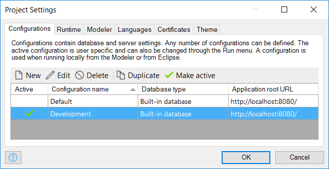
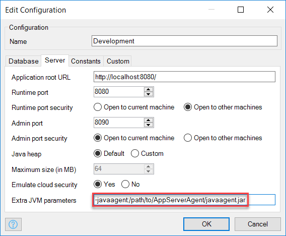
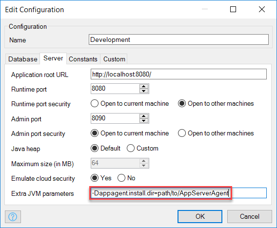
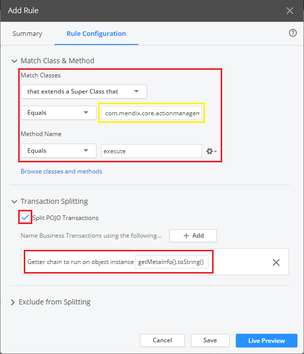
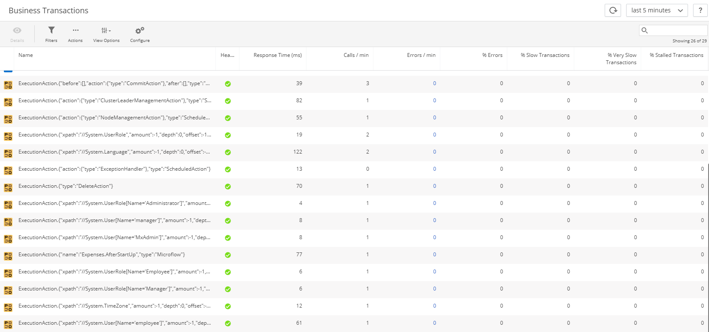
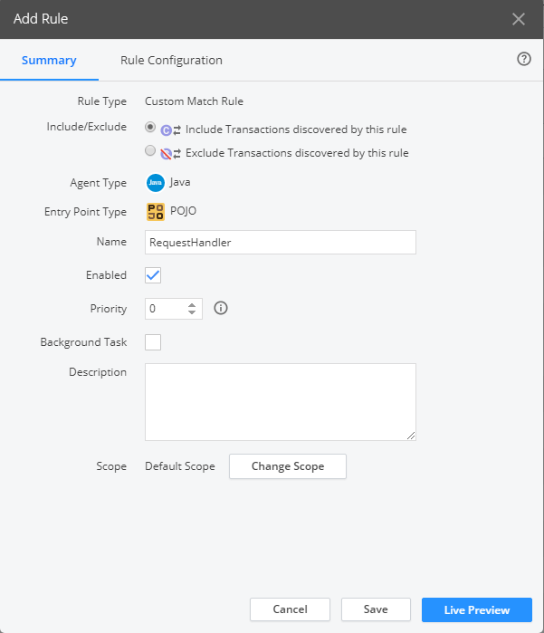
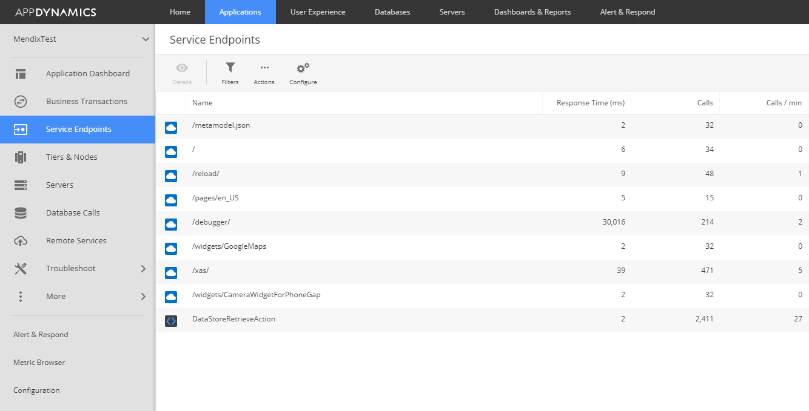
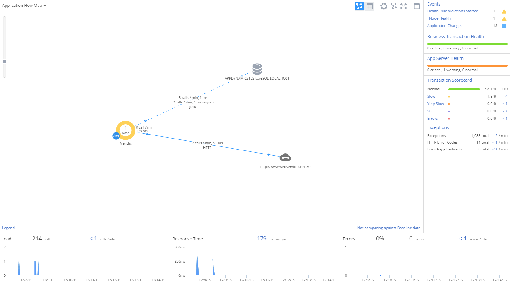

## 1 Introduction

To ensure your applications run smoothly, they need to be actively monitored so that the information is available in order to do the following:

* Avoid performance problems
* Diagnose performance problems when they occur

AppDynamics is a flexible application performance management tool that provides information to help you achieve the above goals.

**This how-to will teach you how to do the following:**

* Set up application performance management for your Mendix application on AppDynamics

## 2 Prerequisites

Before starting with this how-to, make sure you have completed the following prerequisites:

* Create an AppDynamics account by signing up here: [https://portal.appdynamics.com/account/signup/community/](https://portal.appdynamics.com/account/signup/community/)
* AppDynamics provides two different options for hosting their environment, the SaaS or on-premises solution. If you want to install on-premises AppDynamics, see this article: [https://docs.appdynamics.com/display/PRO14S/Get+Started+with+AppDynamics+On-Premise](https://docs.appdynamics.com/display/PRO14S/Get+Started+with+AppDynamics+On-Premise)

## 3 Setting Up

In this section, we will walk through all the steps to configure AppDynamics so that it can be used for the application performance monitoring of your Mendix application.

## 3.1 Setting Up AppDynamics

To set up AppDynamics, follow these steps:

1. Navigate to your AppDynamics controller, where you should see the following screen:

    
2. Select **Java**.
3. This will open up the configuration screen for your AppDynamics application. 
4. At step 4, download the Agent Installer and extract it to any directory, but remember the path as this will be used later for integrating the Java Agent with your Mendix application:

   
    

## 3.2 Setting Up Your Mendix Deployment

### 3.2.1 Cloud Foundry

Follow the the build-pack instructions to set up AppDynamics for Cloud Foundry deployments that are described here: [https://github.com/mendix/cf-mendix-buildpack#appdynamics](https://github.com/mendix/cf-mendix-buildpack#appdynamics).

### 3.2.2 On-Premises Linux & Windows Service Console

To the `javaopts` list in your *m2ee.yaml* file, add "-javaagent:<path-to-javaagent>javaagent.jar". For example:

```java
 javaopts: [
   "-Dfile.encoding=UTF-8", "-XX:MaxPermSize=128M", "-Xmx512M", "-Xms512M",
   "-Djava.io.tmpdir=/srv/mendix/data/tmp",
   "-javaagent:/opt/AppDynamics/AppAgent/javaagent.jar"
 ]
```

### 3.2.3 Mendix Desktop Modeler (Development Mode Only)

1. Open your Mendix application, and then select **Settings** in the **Project Explorer**:

    

2. Open a configuration:

     

3. In the **Extra JVM parameters** field on the **Server** tab, add `-javaagent:<path-to-javaagent>javaagent.jar` and `-Dappagent.install.dir=<path-to-javaagent>` __without__ the `javaagent.jar`:
    

    

4. As the last step of setting up your Mendix application you will need to set a few extra configuration values in the `AppServerAgent/ver4.x/conf/controller-info.xml` file (where `x` is the version of AppDynamics you downloaded):
    * `application-name` (for instance MyMendixApp, this will be the name that will be used within AppDynamics).
    * `tier-name` (for instance tier-1).
    * `node-name` (for instance node-1).

5. Run your Mendix Application to generate data for AppDynamics. Sometimes AppDynamics does not automatically find your application in the configuration screen, make sure to check the applications tab whether the application shows up there.

## 4 Configuring Business Transactions

Now that your Mendix application has been set up to provide its information using the Java agent, AppDynamics needs to be configured so that it can be displayed in a useful way. This information will be presented as business transactions that will show the requests handled by the request handlers and the Mendix actions that have been triggered. These business transactions will allow you to pinpoint the bottle necks and issues in your Mendix application.

To configure these business transactions, follow these steps:

1.  From the **Applications** page, select your application:

    

2.  Open the **Configuration** page (1) and click **Instrumentation** (2):

    

3.  On the **Instrumentation** page, navigate to the **Transaction Detection** tab (1), and add a new **Custom Match Rule** (2):

    

### 4.1 Mendix Actions

To monitor your actions as business transactions, follow these steps:

1. From the **Add Rule** page, select the Custom Match Rule, **Java** as the Agent Type and **POJO** as the entry point type:

    

2. Fill in the **Summary** tab with **POJO** as Entry Point Type, the Name field as **ExecutionAction**, Enabled checkbox selected and the Scope field to **Default Scope**.

    

3. Fill in the **Rule Configuration** tab with the information presented in this screenshot (the yellow highlighted field should be *com.mendix.core.actionmanagement.CoreAction*):

    

4. After saving, the Mendix actions will appear under **Business Transactions**:

    

### 4.2 Request Handlers

To set up monitoring on the request handlers, follow these steps:

1. From the **Add Rule** page, select the Custom Match Rule, **Java** as the Agent Type and **POJO** as the entry point type:

    

2. Fill in the **Summary** tab with **POJO** as Entry Point Type, the Name field as **RequestHandler**, Enabled checkbox selected and the Scope field to **Default Scope**.

    

3. Fill in the **Rule Configuration** tab with the information presented in this screenshot (the yellow highlighted field should be *com.mendix.externalinterface.connector.RequestHandler*):

    

4. After saving, the requests will appear as **Business Transactions**:

    

## 5 Web Services

AppDynamics can automatically detect web service calls. This feature is enabled by default and can be found in the service endpoints menu item:


## 6 Database

AppDynamics automatically detects database calls. These can be viewed by navigating to the **Database Calls** page:


## 7 Application Topology

Once you have performed all of the steps above for your Mendix application, its topology should become visible by navigating to the **Application Dashboard** page. Here you can see an overview of your application and all of its integrations with external systems.



## 8 Further Documentation

For more information on AppDynamics, see the AppDynamics documentation here: [https://docs.appdynamics.com/](https://docs.appdynamics.com/).

## 9 Related Content

* [How to Find the Root Cause of Runtime Errors](finding-the-root-cause-of-runtime-errors)
* [How to Clear Warning Messages](clear-warning-messages)
* [How to Monitor Mendix Using JMX](monitoring-mendix-using-jmx)
* [How to Debug Java Actions Remotely](debug-java-actions-remotely)
* [How to Set Log Levels](log-levels)
* [How to Debug Microflows](debug-microflows)
* [How to Debug Java Actions](debug-java-actions)
* [How to Handle Common Mendix SSO Errors](handle-common-mendix-sso-errors)
* [How to Solve Load and Import Errors](solving-load-and-import-errors)
* [How to Debug Microflows Remotely](debug-microflows-remotely)
