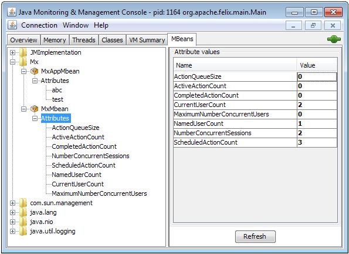

## 1 Introduction

This how-to is relevant if you run Mendix on-premises. If you do this, you probably have standard monitoring tooling that you use to monitor all your applications.

For Java applications, most monitoring tools provide a way to hook into [JMX](http://www.oracle.com/technetwork/java/javase/tech/javamanagement-140525.html) in order to get information about the application. This how-to describes using JMX to get information on your Mendix application.

Mendix doesn’t provide any runtime or application specific MBeans, which means that without writing your own MBeans, you will only be able to monitor generic JVM statistics. This how-to will also describe enabling JMX on your Mendix runtime as well as writing custom MBeans to expose Mendix runtime information and app-specific information.

**This how-to will teach you how to do the following:**

* Start Mendix Runtime with JMX
* Expose management information with an MBean
* Expose app-specific statistics with an MBean

## 2 Prerequisites

None.

## 3 Starting the Mendix Runtime with JMX enabled

To enable JMX on your Mendix Runtime, you can use the following Java options in the *m2ee.yaml* for your Mendix Runtime:

```
javaopts: [

"-Dfile.encoding=UTF-8", "-XX:MaxPermSize=64M", "-Xmx128M", "-Xms128M",

"-Djava.io.tmpdir=/tmp",

"-Dcom.sun.management.jmxremote",

"-Dcom.sun.management.jmxremote.port=7845",

"-Dcom.sun.management.jmxremote.local.only=false",

"-Dcom.sun.management.jmxremote.authenticate=false",

"-Dcom.sun.management.jmxremote.ssl=false",

"-Djava.rmi.server.hostname=192.168.1.70",

]
```

## 4 MBean Exposing Generic Mendix Statistics

The simplest way to expose management information is by writing an MBean interface and a Java class that implements the interface. You can define the getters and setters, but you can also define methods that can be called from the generic management tooling. This can be used, for example, to tell a running application to reload its configuration file.

This is an example of an interface that contains getters for some generic Mendix information, *MxStatsMBean.java*:

```

package jmx.actions;

public interface MxStatsMBean {

public int getMaximumNumberConcurrentUsers() throws Exception;

public int getActionQueueSize();

public int getActiveActionCount();

public int getScheduledActionCount();

public long getNumberConcurrentSessions();

public long getCurrentUserCount();

public long getCompletedActionCount();

public long getNamedUserCount();

}
```

This is the implementation, `MxStats.java`. The methods call the [Mendix Core](http://apidocs.mendix.com/4/runtime/classcom_1_1mendix_1_1core_1_1_core.html) class and return the value:

```
package jmx.actions;

import com.mendix.core.Core;

 public class MxStats implements MxStatsMBean {

 public int getMaximumNumberConcurrentUsers() throws Exception {

 return Core.getMaximumNumberConcurrentUsers();

 }

 public int getActionQueueSize(){

 return Core.getActionQueueSize();

 }

 public int getActiveActionCount(){

 return Core.getActiveActionCount();

 }

 public int getScheduledActionCount(){

 return Core.getScheduledActionCount();

 }

 public long getNumberConcurrentSessions(){

 return Core.getNumberConcurrentSessions();

 }

 public long getCurrentUserCount(){

 return Core.getConcurrentUserCount(true);

 }

 public long getCompletedActionCount(){

 return Core.getCompletedActionCount();

 }

 public long getNamedUserCount(){

 return Core.getNamedUserCount();

 }
}
```

Now you're able to see the result of the values exposed by this MBean in the JConsole:



## 5 MBean Exposing App-Specific Statistics

You can use the same approach with an interface and an implementation class to expose app-specific information. Here’s a different approach: one that exposes a dynamic set of values. You can do the same with methods, but the example only shows the attributes to retrieve values.

The idea is that you will have a Java Action that you can call in a microflow where you expose arbitrary key value pairs.

## 6 Related Content

* [How to Find the Root Cause of Runtime Errors](finding-the-root-cause-of-runtime-errors)
* [How to Clear Warning Messages](clear-warning-messages)
* [How to Test Web Services Using SoapUI](../testing/testing-web-services-using-soapui)
* [How to Monitor Mendix Using JMX](monitoring-mendix-using-jmx)
* [How to Debug Java Actions Remotely](debug-java-actions-remotely)
* [How to Log Levels](log-levels)
* [How to Debug Java Actions](debug-java-actions)
* [How to Handle Common Mendix SSO Errors](handle-common-mendix-sso-errors)
* [How to Debug Microflows](debug-microflows)
* [How to Debug Microflows Remotely](debug-microflows-remotely)
* [How to Debug Java Actions Remotely](debug-java-actions-remotely)
* [Getting Started with the Nexus Maven Repository Manager](http://www.andrejkoelewijn.com/blog/2010/03/09/getting-started-with-nexus-maven-repository-manager/)
* [Using Eclipse to Debug Your Tomcat Web Application](http://www.andrejkoelewijn.com/blog/2003/10/23/using-eclipse-to-debug-your-tomcat-web-application/)
* [Profiling Mendix Using JProfiler](http://www.andrejkoelewijn.com/blog/2014/01/15/profiling-mendix-using-jprofiler/)
