## 1 Introduction

This tutorial shows you how to develop a Mendix app which uses, as its source, data which is held on an SAP back-end system.

You will create an app to maintain a catalog of products which integrates seamlessly with the SAP S/4 system. The app will support the admin and user roles.

You will then add the ability to search the catalog using SAP Leonardo Machine Learning image classification.

Specifically, you will learn how to:

* Create a Mendix app based on a template
* Generate the app’s domain model based on an OData service coming from an SAP S/4 system
* Set up Mendix so that you can consume an SAP OData service using pre-built components from the Mendix App Store
* Adding more functionality to your app by modeling in Mendix
* Make your app ‘smart’ by leveraging the SAP Leonardo Machine Learning Foundation Connector
* Set security in your app
* Deploy your app to SAP Cloud Platform

## 2 Prerequisites

You are provided with all the information and software which you need to perform this tutorial.

## 3 Starting a New SAP App

The first step is to create a Mendix app. You need to link this to SAP Cloud Platform so that you can run the app there.

1.  Choose the **Blank App** with Atlas UI styling.

    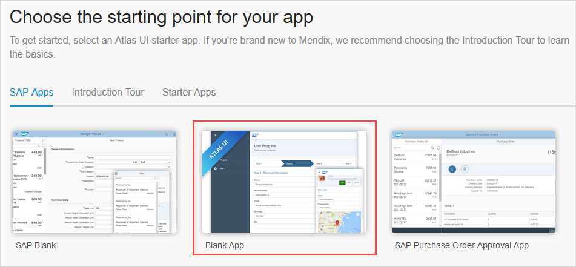

1.  Click **Use this app** to confirm that this is the one you want.

	

1.  Enter *Smart Catalog*, as the name and click **Create App**.

	

## 4 Creating an SAP Cloud Platform Environment

SAP needs to know exactly which region, account, subaccount, and space you will be using to deploy this app. Mendix will take you through the process step-by-step.

Depending on whether you have used SAP from Mendix before, and whether you are currently signed in to SAP you may have to log in to SAP and confirm that SAP and Mendix can share information about the app.

1.  Select the **Region** of your SAP account.

	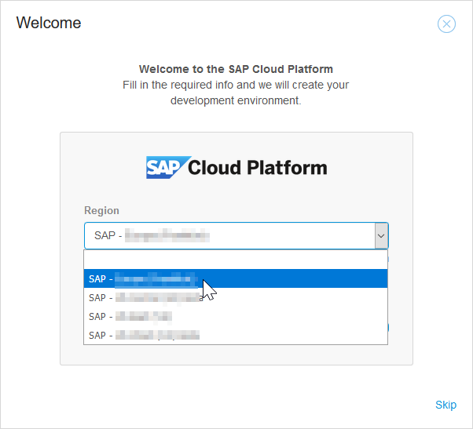

1.  Click **Next**.

	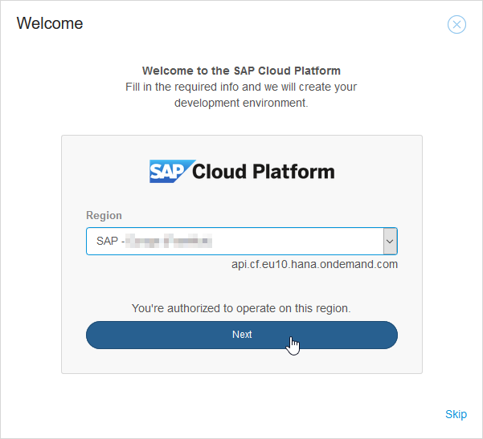

1.  Select your **Domain**, **Organization** (subaccount), and **Space**. You will only be able to select options which are accessible to your account.

1.  Select No for Custom Database?.

1.  Leave the **Postgress-v9.4-dev** \[sic\] database selected.

1.  Click **Create**.
    
    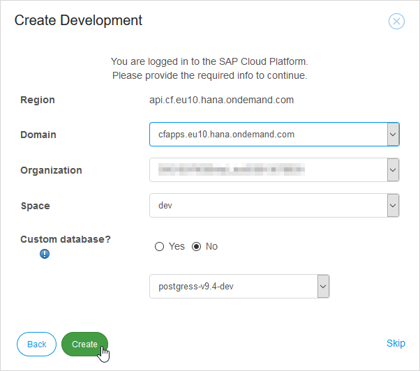

    SAP now creates the environment for you, with all the runtime resources which are needed by your app.

    You are shown a confirmation page and can now edit your app.

    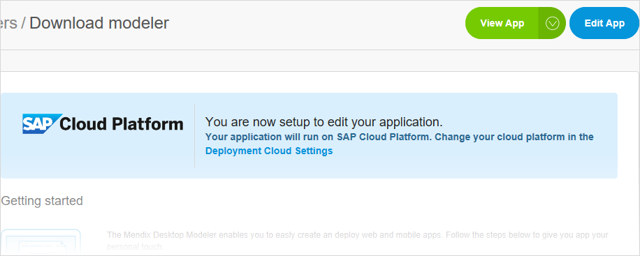

1.  Click **Edit App**.

	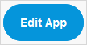

    The correct version of the Mendix Desktop Modeler will open, automatically download your app to your computer, and open it.

1. Click the *arrow* next to the **Run** button in the Desktop Modeler.

1. Click **Run Locally**.

	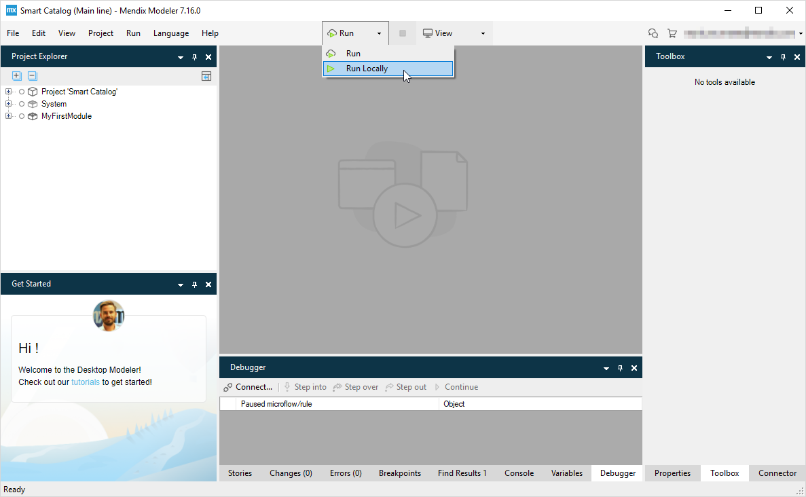

1. Click **Yes** to confirm that you want to create a database for the app.

	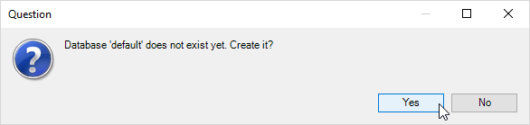

1. Wait for the app to be started.

1. Click **View** to view the app in a browser.

	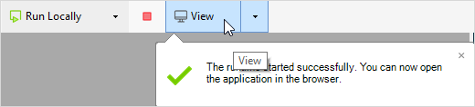

The App looks like this:

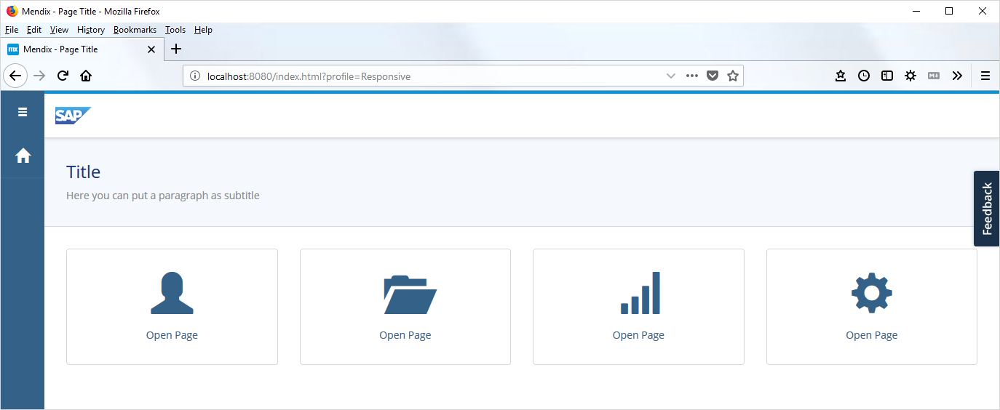

## 5 Creating an OData Data Model for the Product Management OData service

You are going to use a product catalog which is held in the SAP back-end system. These have been exposed via an OData service called **EPM_REF_APPS_PROD_MAN_SRV** is provided in the *student share* folder.

Your Mendix app needs to know the details of the EPM_REF_APPS_PROD_MAN_SRV OData service before you can get data from it. You do this by creating a data model using the SAP OData Model Creator in the Mendix App Store.

1.  Open the SAP OData Model Creator App Store page ([<span class="underline">https://appstore.home.mendix.com/link/app/105622/</span>](https://appstore.home.mendix.com/link/app/105622/)) in your browser.

1. Click **Open** to start the SAP OData Model Creator.

	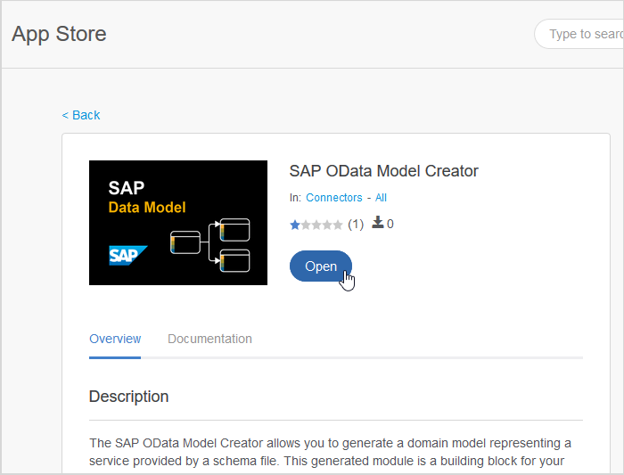

1. Click **Manual** as the source for the API.

	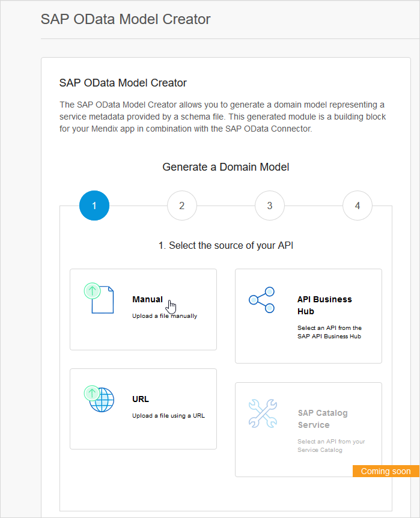

1. Select the $metadata.xml file in the session folder in the *student share* and click **OK**.

	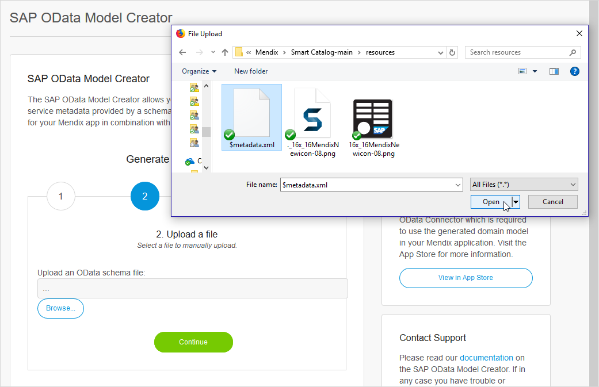

1. Click Continue.

1. Select the EPM_REF_APPS_PROD_MAN_SRV schema and click **Continue**.

	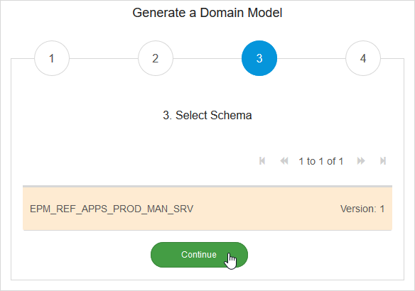

1. Click **Generate .mpk**.

1. Once the generation is complete, the **Download** button appears.

	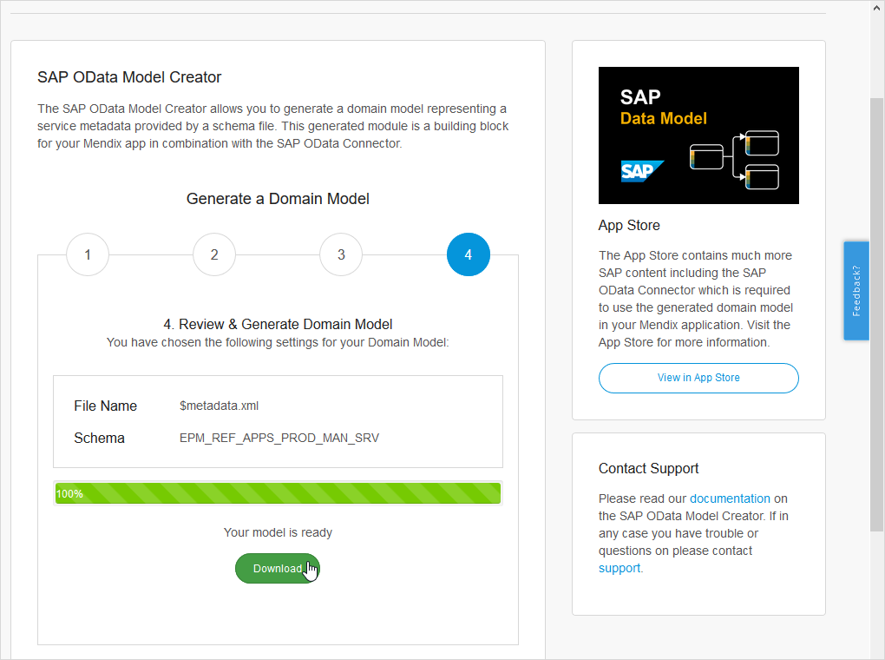

1. Click **Download** to save the file on your local drive.

## 6 Importing the Data Model into your App

You now have all the information which Mendix needs to get your data out of the SAP back-end using the EPM_REF_APPS_PROD_MAN_SRV OData service. Now all you have to do is to import it into your Smart Catalog app, so that you can use it there.

1.  Return to your *Smart Catalog* app in the Desktop Modeler.

1. Right-click the project name and choose **Import module package...**.

	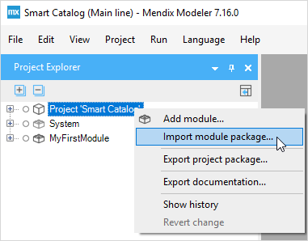

1. Find the module file you have just generated with the SAP OData Model Creator.

1. Click **Open**.

	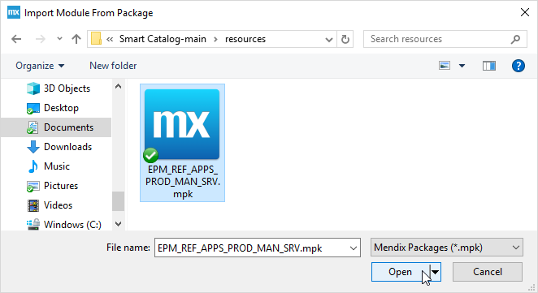

1. Select **Add as a new module** and click **Import**.

	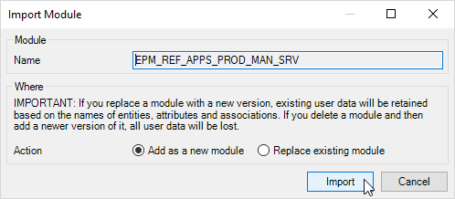

Your module will now be part of your Project:

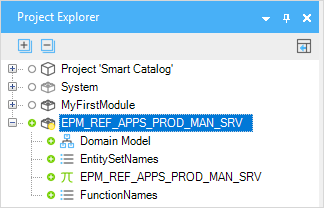

## 7 Importing Required Modules into the Mendix App

Some of the app has been written already, so you need to import those pieces into your app.

1.  Click the App Store icon (the shopping basket) in the Desktop Modeler.

	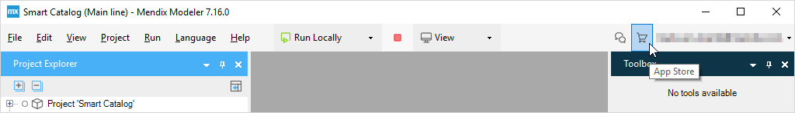

1. Enter *Catalog* in the search box and click the magnifying glass.

1. Click **Read more** next to *SAP TechEd 2018 - Smart Catalog*.

	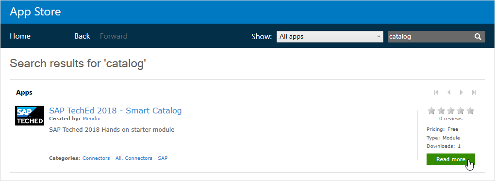

1. Click **Download** to add the module to your project.

	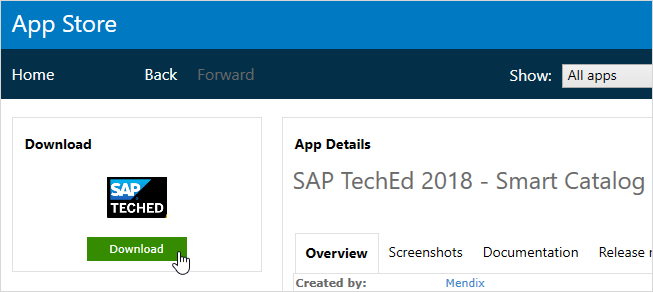

1. Click **Import** to confirm that you want to import the module.

	

1. Repeat steps 3 through 6 to find and download the **SAP Leonardo Machine Learning Foundation Connector** module.

	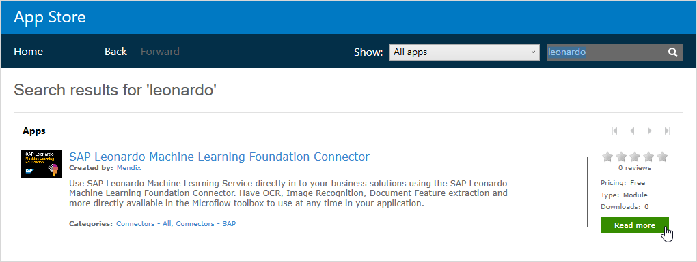

1. Repeat steps 3 through 6 to find and download the **Camera** module.

	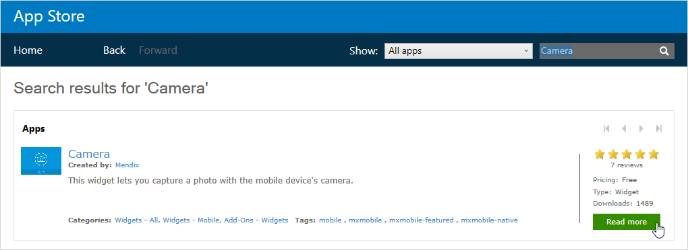

1. You can see the *LeonardoMachineLearning* and *SmartCatalogExercise* modules you have imported, along with other modules, by expanding the tree structure in the **Project Explorer**. The *Camera* module has created a new camera widget which you will use later in the exercise.

	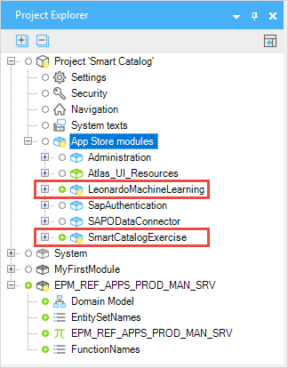

* The **SAP TechEd 2018 - Smart Catalog** module contains the initial modeling for your app
* The **SAP Leonardo Machine Learning Foundation Connector** allows your app to connect to SAP Leonardo Machine Learning Foundation services
* The **Camera** module allows your app to access the camera on your device

## 8 Setting up Application Navigation

To ensure the application is using the imported module, the navigation of the application needs to be adjusted.

Mendix apps work by showing pages to the user. You can define which page should be the Home page: the first page the user sees. Each page in your Mendix app can also have a menu bar. You can define which pages appear in this.

1.  Right-click **Project 'Smart Catalog' > Navigation** and click **Open**.

	

1. Click **Select...** next to **Default home page**.

1. Enter *open* in the **Filter**.

1. Select **App Store modules > SmartCatalogExercise > Microflow > IVK_OpenProductCatalog** as the new home page.

1. Click **Select**.

	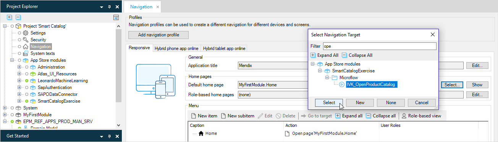

1. Click the **Home** page in the **Menu** section of the **Navigation**.

1. Click **Edit**.

1. Select *Call a microflow* for **On click**.

1. Select the **IVK_OpenProductCatalog** microflow using the filter.

1. Click **Select**.

	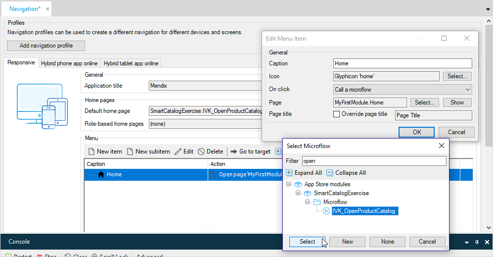

1. Click **OK** to confirm the change.

1. Click the **Hybrid phone app online** tab on the Navigation dialog.

1. Repeat steps 2 through 11 for this tab.

	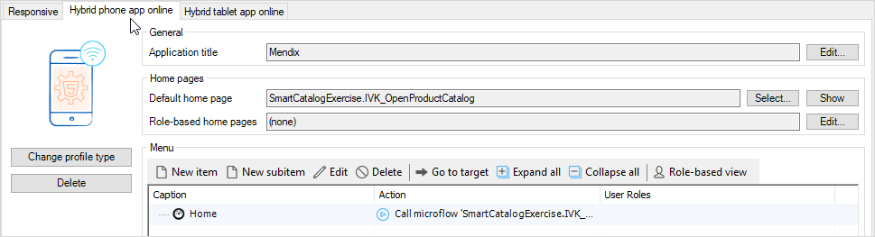

1. Click the **Hybrid tablet app online** tab on the Navigation dialog.

1. Click **Delete** to delete this navigation profile.

	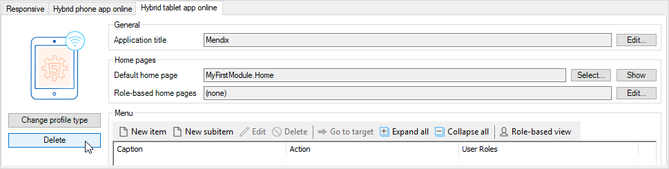

## 9 Retrieving Data from S/4HANA

The **SmartCatalogExercise** module comes with no products. You need to replace a retrieve from the local database with an OData **Get** action against the **EPM_REF_APPS_PROD_MAN_SRV** service.

1.  Press Ctrl + G to open the **Go To** dialog.

1. Search for the microflow **IVK_SearchProduct**.

1. Click **Go to**.

	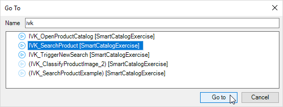

1. Click the action Create list of Product.

1. Press Delete to delete this action.

	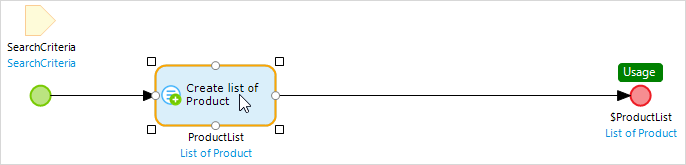

1. Click the **Toolbox** tab in the right-hand pane to switch to the microflow toolbox.
    
    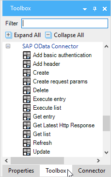

1. Drag an SAP OData Connector > Create request params into the microflow.

	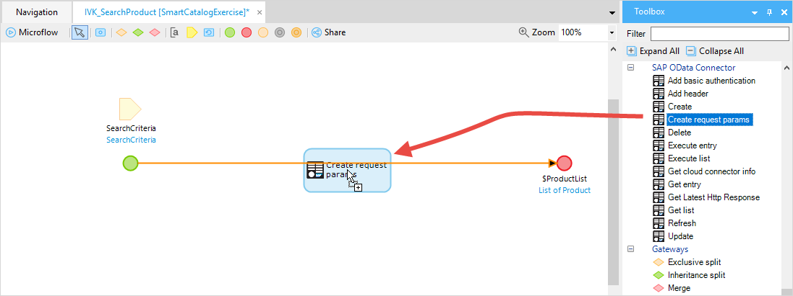

1. Double-click the **Create request params** action to open the properties.

1. Enter *Parameters* as **Variable** name.

1. Click **OK**.

	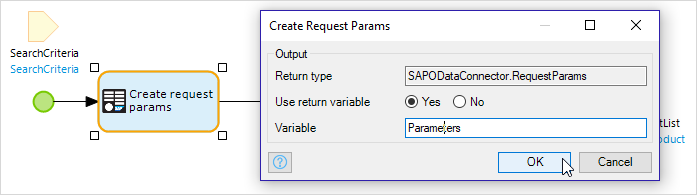

1. Drag an **SAP OData Connector > Add basic authentication** action after the **Create request params** action in the microflow.

1. Double-click this new action.

1. Select **$Parameters** as the **Request parameters**.

1. Click **Edit...** next to **Username**.

1. Enter **@sm**.

1. Click **@SmartCatalogExercise.BE_User (String)** to select it.
    
    (This is a constant containing a user for the S/4HANA system which has been set up in advance).

1. Press Enter to confirm your selection. (Check that the full name of the parameter appears in the dialog).

	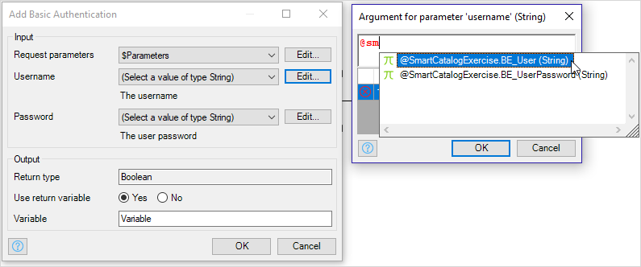

1. Click **OK**.

1. Repeat steps 14 through 17 to set **Password** to *@SmartCatalogExercise.BE_UserPassword (String)*. This is the password for the user which was set up on the S/4HANA system.

1. Select *No* for **User return variable**.

1. Click **OK** to confirm the basic authentication action.

	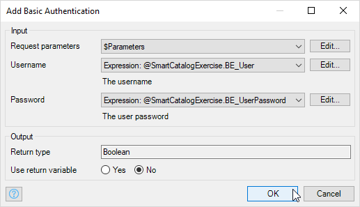

1. Drag **SAP OData Connector > Get list** action after the **Add basic authentication** action in the microflow.

1. Double-click on the **Get list** action.

1. Click **Edit...** next to the **Query**.

1. Enter (or copy and paste) the following query in the Edit box.

    ```
    @EPM_REF_APPS_PROD_MAN_SRV.EPM_REF_APPS_PROD_MAN_SRV + '/' + toString (EPM_REF_APPS_PROD_MAN_SRV.EntitySetNames.Products) + '/?$filter=substringof(SubCategoryName,''' + urlEncode($SearchCriteria/Term) + ''')'
    ```

    This is the OData query which retrieves a list of products which contain the search term which is entered on the product list page. The first part of the query identifies the S/4HANA service list of products. This is then filtered to only return products where the search term appears in the product's SubCategoryName.

1. Click **OK**.

1. Click **Select...** next to the **Response type**.

1. Search for *Product*.

1. Select **EPM_REF_APPS_PROD_MAN_SRV > Product**.

1. Click **Select**.

	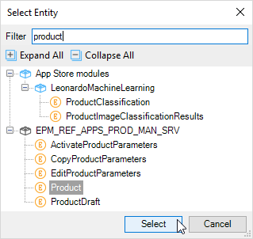

1. Select *$Parameters* from the dropdown for **Request Parameters**.

1. Select *empty* from the dropdown for **Parent**.

1. Select *empty* from the dropdown for **Result info**.

1. Select *true* from the dropdown for **Use SAP cloud connector**.
    
    The SAP Cloud Connector has been configured in advance. It means that you can connect to the S/4HANA system (which is running on-premises and is not publicly available) just by setting this value to *true*. Mendix then makes the connection automatically for you, behind the scenes.

1. Enter *ProductList* for the **Variable** name.

1. Click **OK**.

	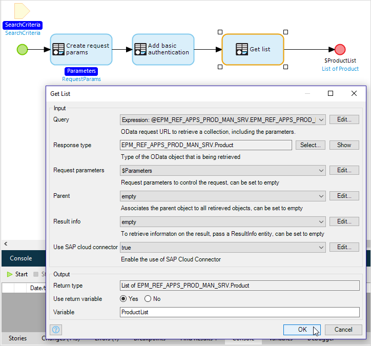

The microflow now looks like this:

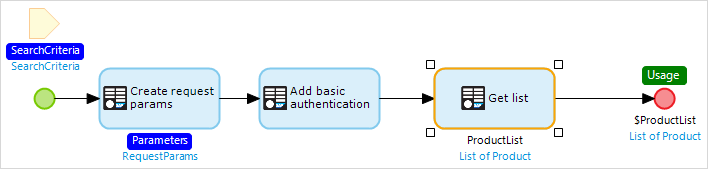

## 10 Testing the Integration with SAP

1.  Right-click **Project ‘Smart Catalog’ > Settings** and click **Open** to open the project settings.

1. In the **Certificates** tab click **Import**.
    
    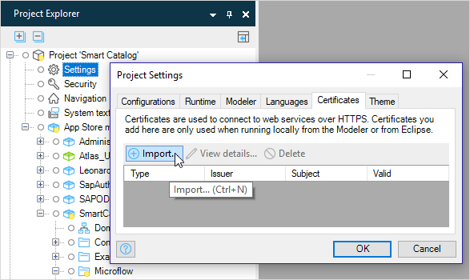

1. Browse to the “Student (Local)” folder > CNA369.

1. Select the certificate file.

1. Click **Open**.

1. Click **OK** to close the dialog.

1.  Click **Run Locally**.

1.  Click **Save and continue** if you are asked to save changes and continue.

	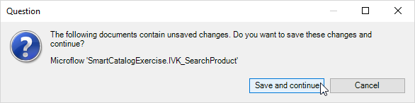

1. Click **Synchronize database** if you are told that the database has to be updated.

	

1. Wait until the runtime has been started successfully.

1. Click **View** to see the app running in a browser.

The app looks like this:

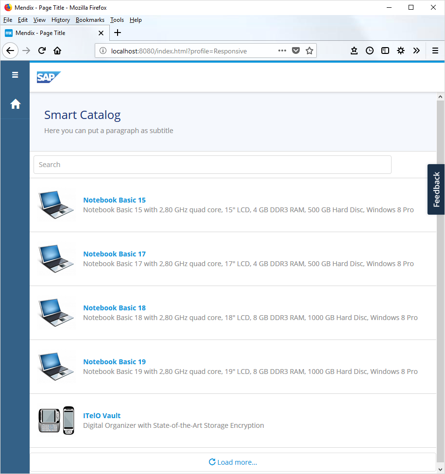

## 11 Adding Image-based Searching

You will now add the ability to search the catalog by image.

### 11.1 Adding Images to the App

1.  Double-click **SmartCatalogExercise > Domain Model** to open the module's domain model.

	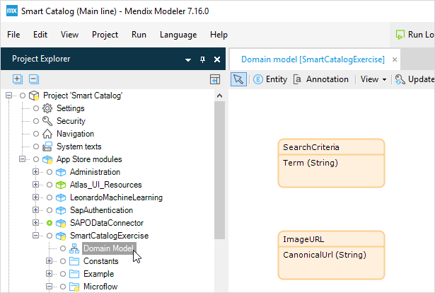

    Firstly, you need to add an entity to the domain model to store the image you are going to use later to search the product list.

1. Drag a new **Entity** into the domain model.

	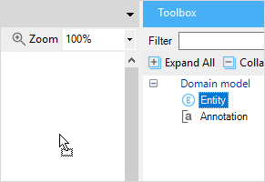

1. Double-click the new entity to open the properties.

1. Enter *SearchImage* as the **Name**.

1. Click **Select...** for the **Generalization**.

1. Select **System > Image**.

1. Click **Select**.

	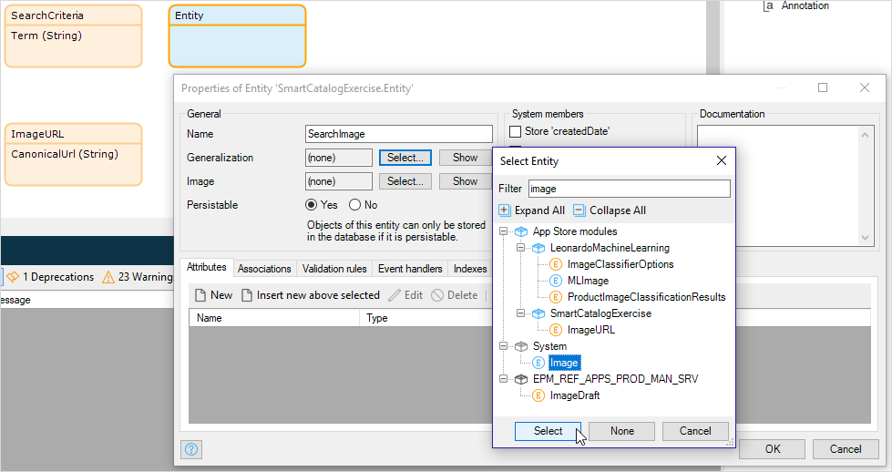

1. Click **OK** to close the properties dialog box.
    
    Now you create an empty *SearchImage* object which will then have the image put into it.

1. Right-click **Project 'Smart Catalog' > App Store modules > SmartCatalogExercise > Microflow** in the **Project Explorer**.

1. Click **Add microflow...**.
    
    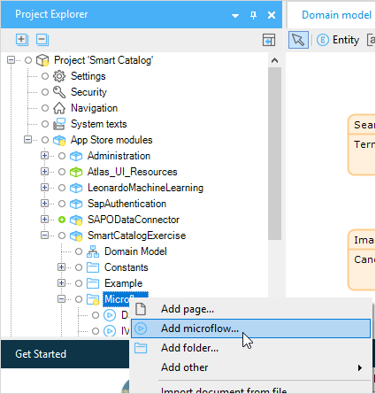

1. Enter *DS_NewEmptyImage* as the **Name**. (The DS_ prefix indicates that the microflow is acting as a *Data Source* - this is good practice to help future developers who extend your app).

1. Click **OK**.

1. Drag a **Create Object** action into the microflow.

1. Double-click the **Create** action.

1. Click **Select** for the **Entity**.

1. Select **App Store modules > SmartCatalogExercise > SearchImage**.

1. Click **Select**.

	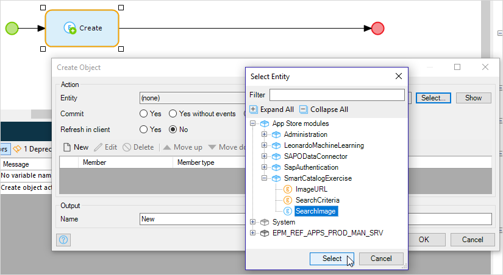

    The output **Name** will be changed to **NewSearchImage**.

1. Click **OK**.

1. Double-click the red dot (the end event) of the microflow.

1. Select **Object** from the **Type** dropdown.

1. Select *App Store modules > SmartCatalogExercise > SearchImage* for the **Entity**.

1. Enter *$NewSearchImage* as the **Return Value**.

1. Click **OK**.

	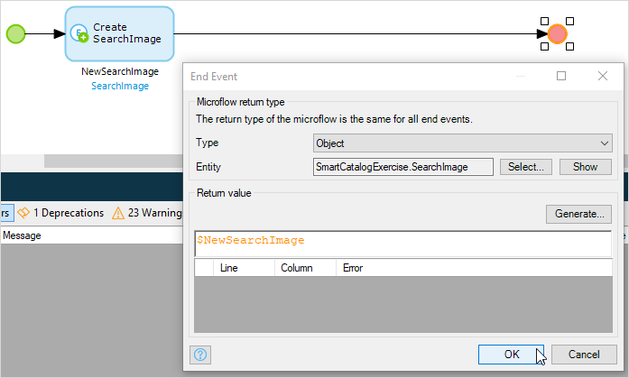

    The microflow to create the empty *SearchImage* looks like this:

    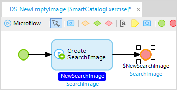

1. Right-click **Project 'Smart Catalog' > App Store modules > SmartCatalogExercise** in the **Project Explorer**.

    Now you are going to add a new page which will be used when the user chooses to search by image.

1. Click **Add page....**

	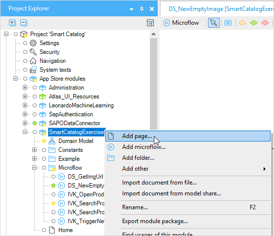

1. Enter *SelectNewImage* as **Page name**.

1. Select *PopUpLayout (Atlas_UI_Resources)* as **Navigation layout**.

1. Select **Forms > Form Vertical**.

1. Click **OK**.

	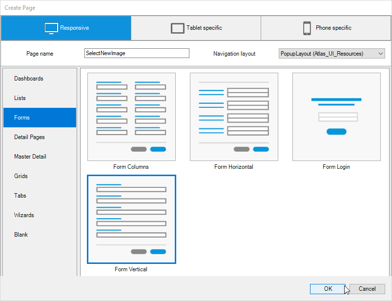

1. Click **Properties** in the right-hand pane.

	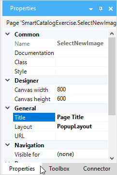

1. Enter *Select Image* as the **Title**.

	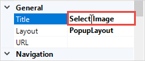

1. Double-click the data view on the page (the blue heading currently displaying **(Unknown)**).

1. Select **Microflow** as the **Data source > Type**.

1. Select the **DS_NewEmptyImage** microflow.

1. Click **OK**.

	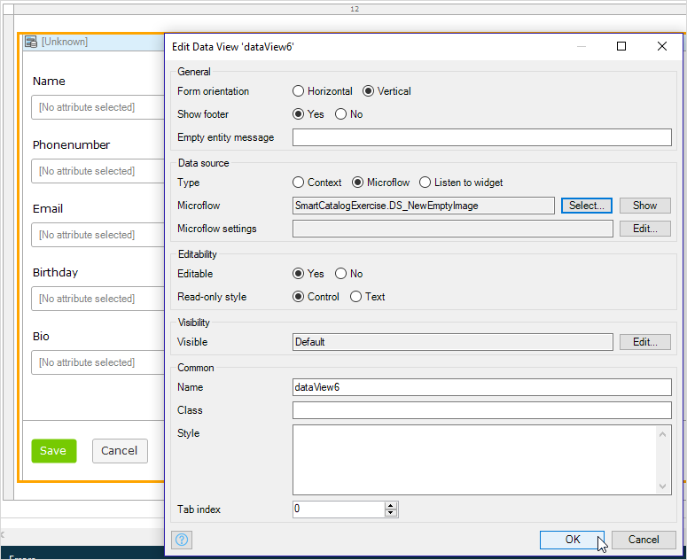

1. Click **Yes** for the question **Do you want to automatically fill the contents of the data view?.**

	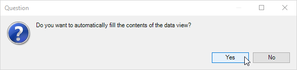

1. Click the **Name** field on the page.

	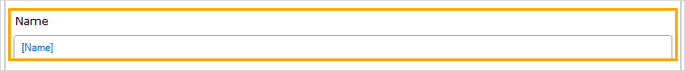

1. Press Delete to delete this field.

1. Delete the **Size** field.

1. Switch back to the **Toolbox** in the right-hand pane.

    You need to add a camera widget to the page, so that users who are using a mobile device can use their camera to capture an image.

1. Drag a **Layout grid** into the drop zone under the image.

	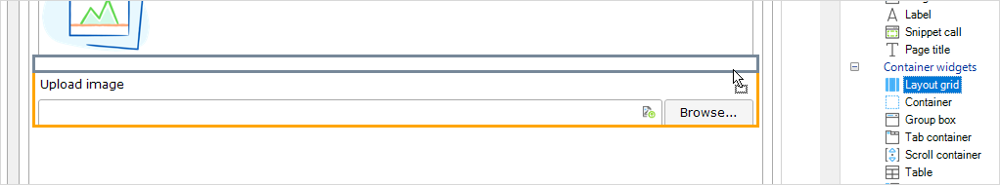

1. Select the **full** grid format.

	

1. Drag the **Upload image** widget on the screen into the layout grid.

	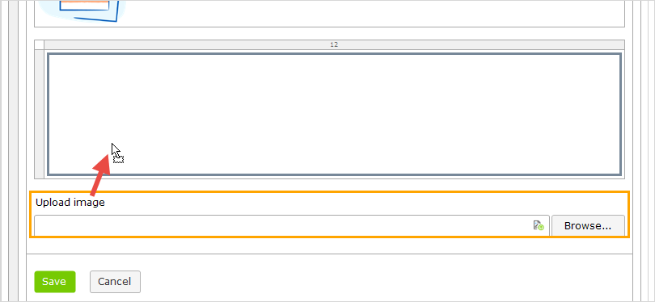

1. Right-click the left-hand side of the layout grid.

1. Click **Insert row above**.

	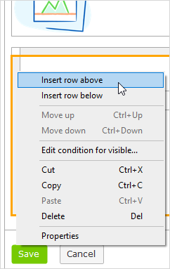

1. Click **Full**.

1. Drag a **Camera** widget into the new row.

	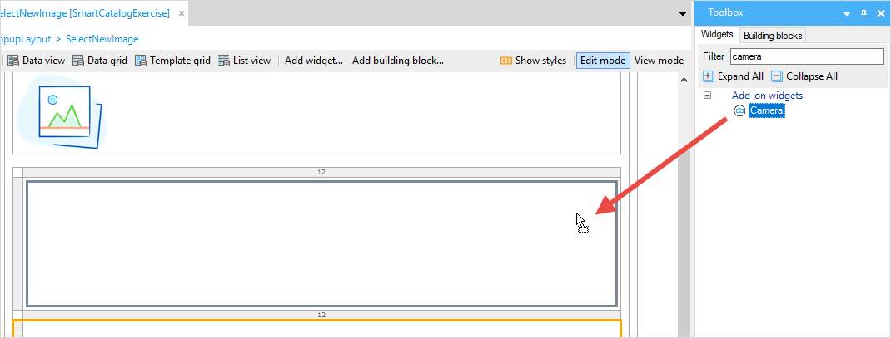

1. Double-click the **Camera** widget to open the properties.

1. Enter *Use Camera* as the **Label** in the **Button** tab.

1. Select **Yes** for **Auto save** in the **Behavior** tab.

1. Click **OK**.

	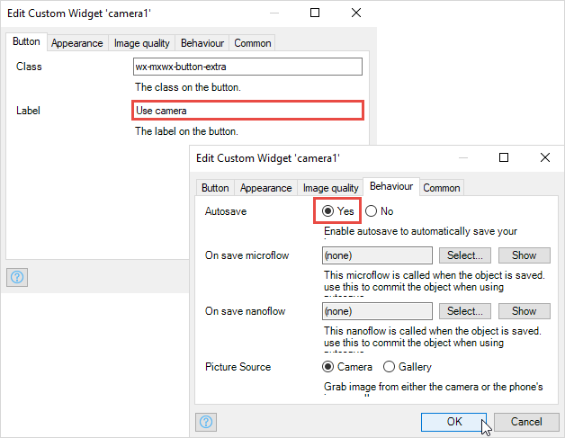

1. Double-click the **Save** button.

1. Enter *Search* as the **Caption** on the button.

1. Select **Call a microflow** for the **On click** action.

1. Click the **SmartCatalogExercise > Microflow** folder.

    Now you will create a microflow to use SAP Leonardo Machine Learning Foundation services to classify the image.

1. Select a **New** microflow.

1. Enter *IVK_ClassifyProductImage* as the **Name**.

1. Click **OK**.

	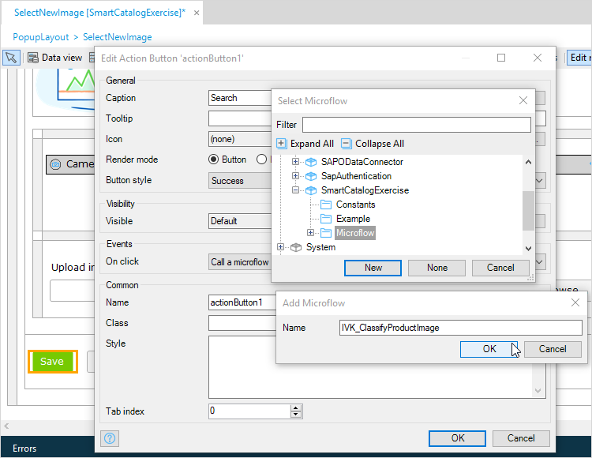

1. Click Edit... for Microflow Settings.

1. Select Blocking for Show progress bar.

1. Enter *Analyzing ...* as the Progress message.

1. Click OK.

	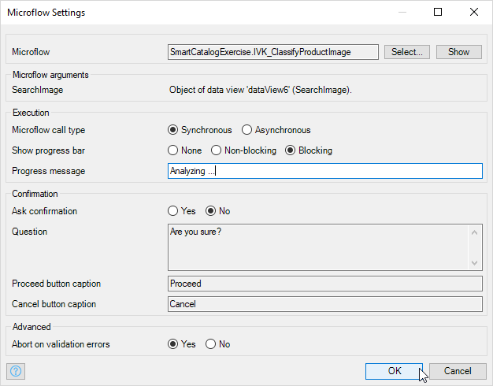

1. Click **OK** to close the **Edit Action Button** dialog.

    The page will look like this:

    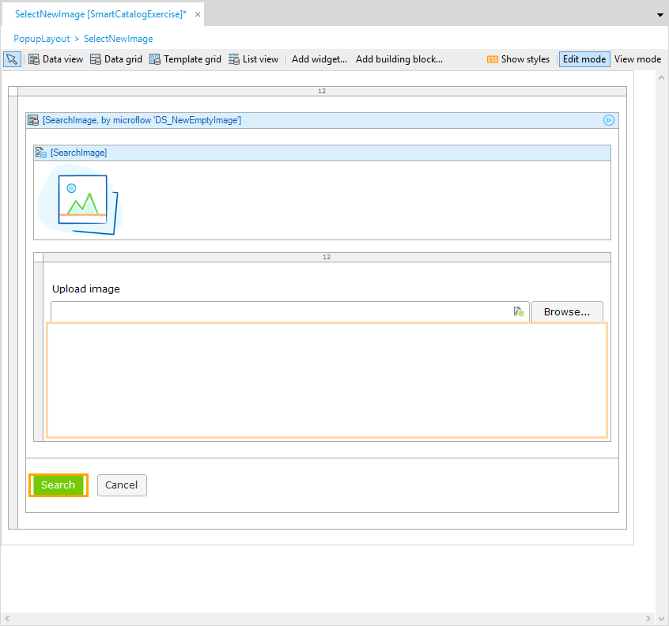

1. Double-click **Project 'Smart Catalog' > App Store modules > SmartCatalogExercise > Home** in the Project Explorer to open it.

1. Drag an **Open page button** next to the search bar.

	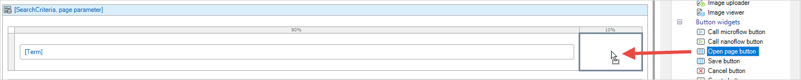

1. Click **App Store modules > SmartCatalogExercise > SelectNewImage**.

1. Click **Select**.

	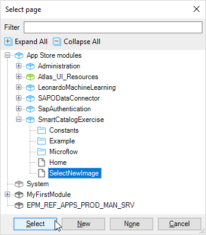

1. Double-click the new button.

1. Enter *Image* as the **Caption**.

1. Click **Select...** for the **Icon**.

1. Select the **picture** icon.

1. Click **Select**.

	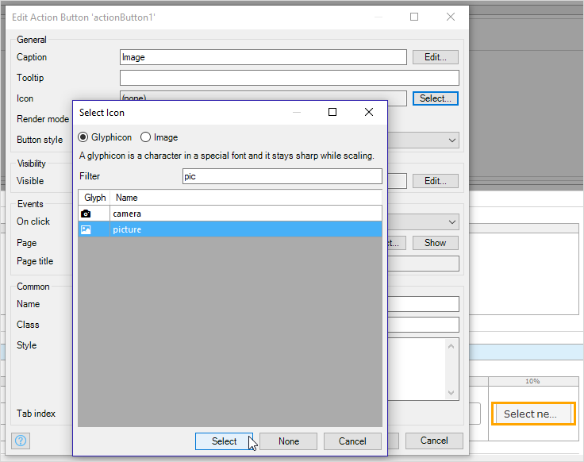

1. Click **OK**.

1. Click **Run Locally**.

1. Click **View** when the runtime has been started successfully.

You can now see the changes to the app. There is an **Image** button which you can click to see the **Select Image** pop-up.

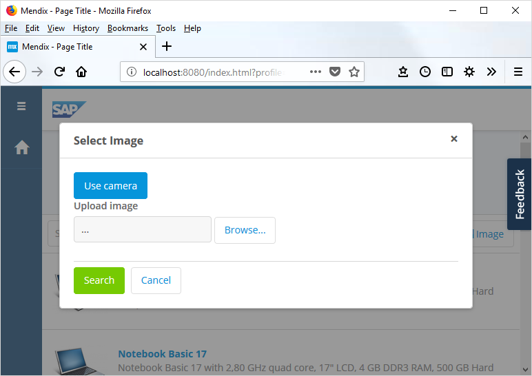

Now you need to use SAP Leonardo Machine Learning to make your app 'smart'.

### 11.2 Making your App 'Smart' Using the SAP Leonardo Machine Learning Foundation Service

1.  Double-click the microflow **IVK_ClassifyProductImage** to open it.

1. Drag an **SAP Leonardo machine learning (API Business Hub) > Product Image Classification** action into the microflow.
     
     The *SAP Leonardo machine learning* widgets in the *API Business Hub* section are only available via the *SAP API Business Hub*. Other *SAP Leonardo machine learning* widgets are available both in the *SAP API Business Hub* and in the cloud.

	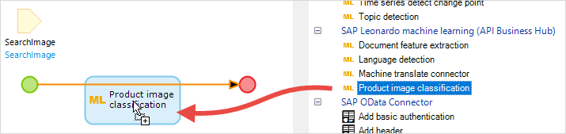

1. Double-click the **Product Image Classification** action.

1. Select *$SearchImage* as the **File**.

1. Enter *ProductClassifications* as the **Variable**.

1. Click **OK**.

	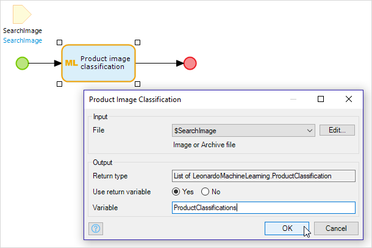

1. Drag a **List activities > List operation** action as the second action in the microflow. (It will be labeled **Union**).

1. Double-click the list operation.

1. Select *Head* as the **Operation**. This selects just the first item in the list.

1. Select *ProductClassifications (List of LeonardoMachineLearning.ProductClassification)* as the **List**.

1. Click **OK**.

	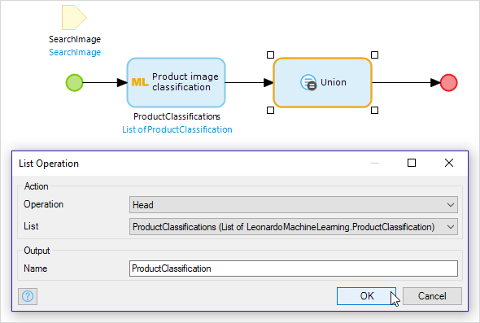

1. Drag an **Object activities > Retrieve** action as the third action in the microflow.

1. Double-click the **Retrieve** action.

1. Select **By association** as **Source**.

1. Click **Select...** for **Association**

1. Select **Variables > ProductClassification (LeonardoMachineLearning.ProductClassification) > ProductImageClassiciationResults_ProductClassification (List of LeonardoMachineLearning.ProductImageClassificationResults)**.

1. Click **Select**.

	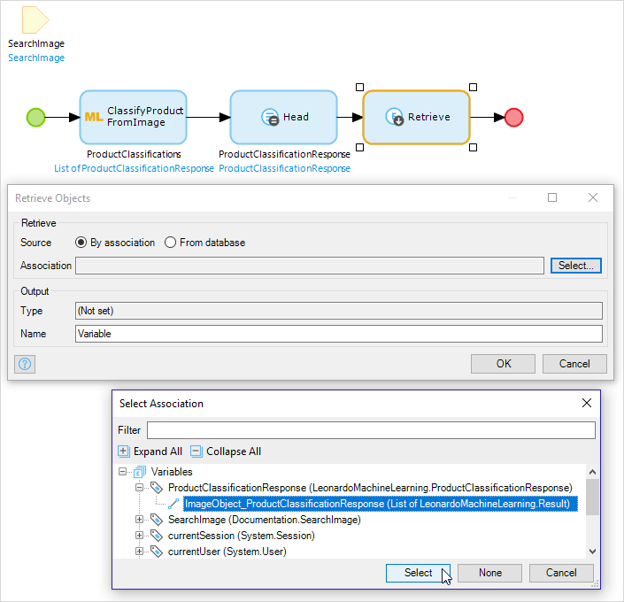

1. Click **OK** to close the dialog.

1. Drag a **List activities > List operation** action as the fourth action in the microflow.

1. Double-click the list operation.

1. Select *Head* as the **Operation**.

1. Select *ProductImageClassificationResultsList (List of LeonardoMachineLearning.ProductImageClassificationResults)* as the **List**.

1. Enter *Results* as the **Name**.

1. Click **OK**.

	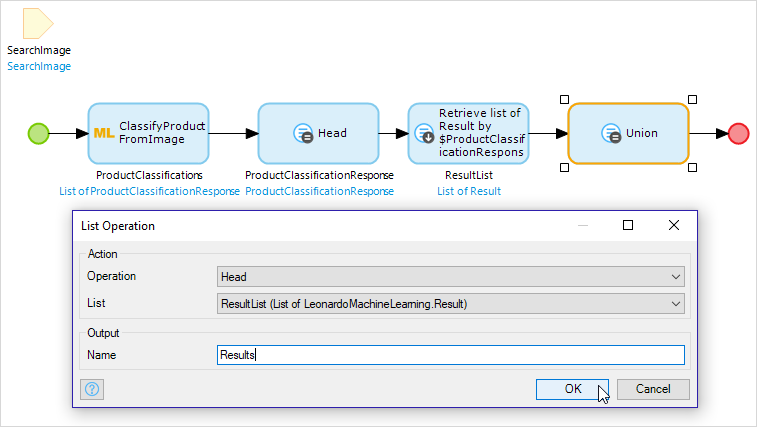

1. Drag a new **Create object** action as the fifth action in the microflow.

1. Double-click the **Create** action.

1. Click **Select...** for the **Entity**.

1. Select *App Store modules > SmartCatalogExercise > SearchCriteria*.

1. Click **Select**.

1. Click **New**.

1. Select *Term* as the **Member**.

1. Enter *$Results/Label* as the **Value**.

1. Click **OK**.

	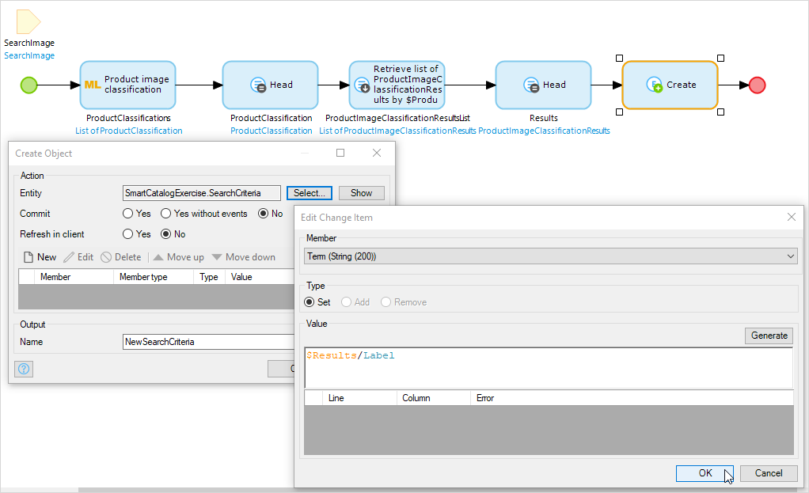

1. Click **OK** to close the **Create Object** dialog.

1. Drag a **Close page** action as the sixth action in the microflow.

1. Drag a **Show page** action as the last action in the microflow.

1. Double-click the **Show page** action.

1. Select **NewSearchCriteria (SmartCatalogExercise.SearchCriteria)** from the **Object to pass** dropdown.

1. Click **Select...** for the **Page**.

1. Select the **App Store modules > SmartCatalogExercise > Home** page.

1. Click **Select**.

1. Click **OK**.

    Your microflow now looks like this:

    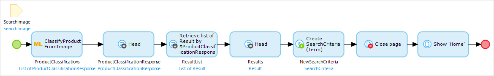

1. Click Run Locally.

1. Click View when the runtime has been started successfully.

You can now see the changes to the app. Running in a browser, you cannot access a camera, but you could upload an image for SAP Leonardo Machine Learning Foundation Services to analyze.


## 12 Setting Security in your App

To deploy the app to SAP Cloud Platform and use the SAP Cloud Connector the security has to be set correctly. If the app is deployed with no security, it is not possible to use SAP credentials to logon and you cannot use non-public endpoints via the SAP Cloud Connector.

1.  Double-click **Project \`Smart Catalog' > Security** in the Project Explorer.

1.  Click **Prototype / demo**.

	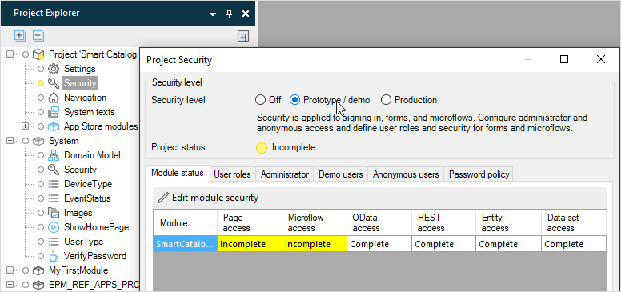

    You now need to set the *User role* **User** to have access to all the modules you have added to the app.

1. Click the **User roles** tab.

1. Select the role named **User**.

1. Click **Edit**.

1. Click **Edit** for **Module roles**.

1. Activate the **User** role for all the modules by clicking the tick boxes. The modules you need to change are:

    * LeonardoMachineLearning
    * SmartCatalogExercise
    * EPM_REF_APPS_PROD_MAN_SRV

1. Click **OK**
     
     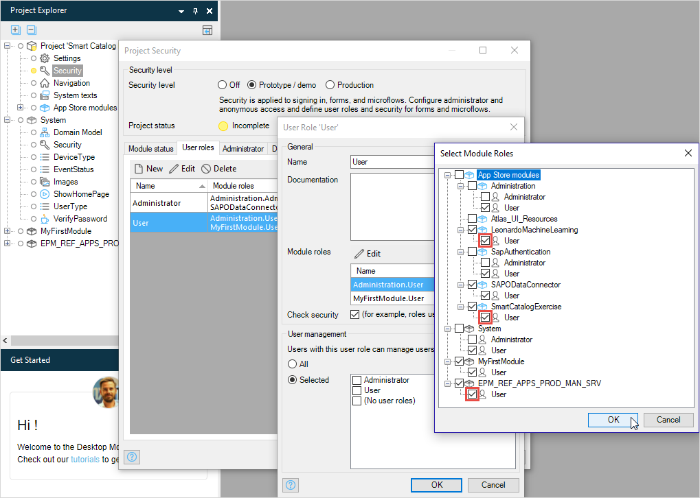

1. Click **OK** to close the **User Role 'User'** dialog.

1. Click **OK** to close the **Project Security** dialog.

    You will see that the project now has some errors as the security settings will not allow some of the pages and microflows to be reached.

1. Double-click **Project 'Smart Catalog' > App Store modules > SmartCatalogExercise > Security**

1. Click the **Page access** tab.

1. Activate the **User** role for the *SelectNewImage* page by clicking the tick box.

	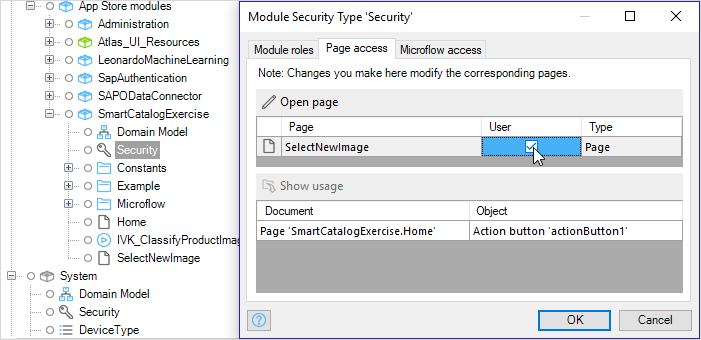

1. Click the **Microflow access** tab.

1. Activate the **User** role for the *DS_NewEmptyImage* and *IVK_ClassifyProductImage* microflows by clicking the tick boxes.

1. Click OK to close the Module Security... dialog.

	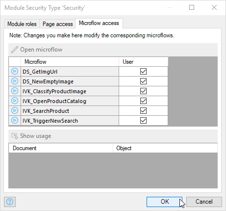

Your app is now error-free\!

## 13 Deploying and Configuring Your App

You have tested your app running on your local machine. It is now time to deploy your app to SAP Cloud Platform. This will allow you to share your app with other users and utilize features such as SAP single sign-on and SAP Cloud Connector.

### 13.1 Deploying Your App

1.  Click the arrow next to **Run Locally**.

1. Click **Run**.

	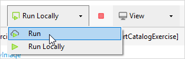

This will deploy your app to SAP Cloud Platform.

### 13.2 Configuring Your App

Because this is the first time you have deployed your app, there are a couple of items which need to be configured from within the SAP Cloud Platform Cockpit.

#### 13.2.1 Configuring Single Sign On

No users have been given access to your app, so you need to add them.

1.  Return to the browser tab with the SAP Cloud Platform Cockpit open. If you have this, jump to step 4.

1. Open the SAP Cloud Platform Cockpit here: https://account.hanatrial.ondemand.com/cockpit.

1. Log On with your student credentials, if required.

1. Click **Home...** if you are not on the home page.
     
     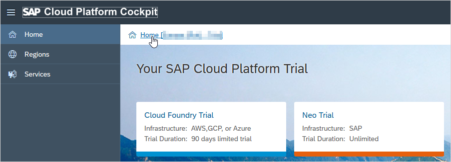

1. Click **Cloud Foundry Trial**.
     
     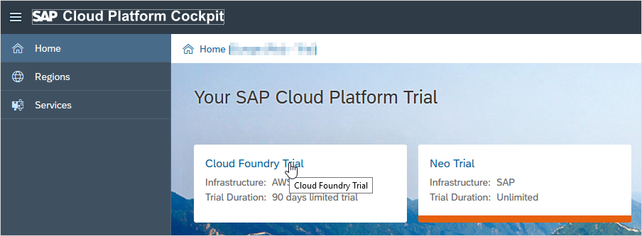

1. Click the **trial** subaccount.
     
     

1. Click **Security > Role Collections** in the menu.
     
     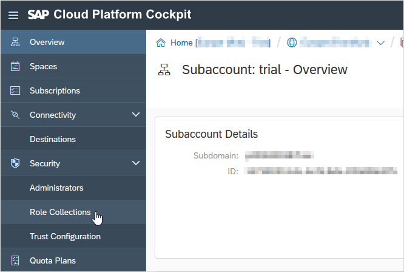

1. Click **New Role Collection.**
     
     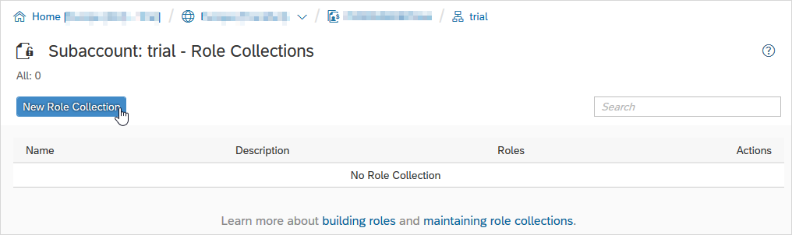

1. Enter *Smart* *Catalog User* as the **Name.**

1. Click **Save.**
     
     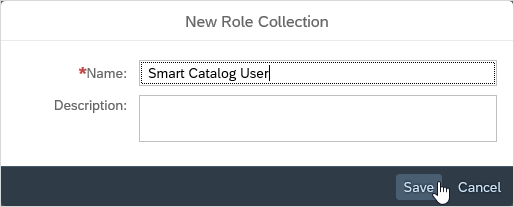

1. Click the **Smart Catalog User** role collection.
     
     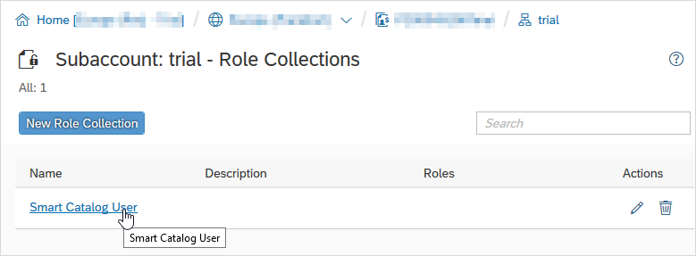

1. Click **Add Role**.
     
     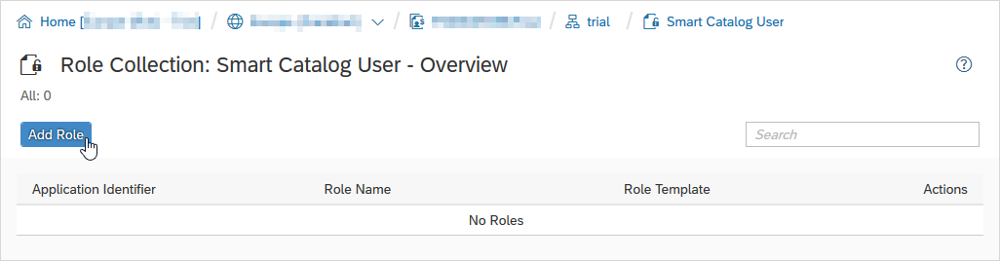

1. Select the **Application Identifier** for your app (starting *Smart-Catalog...*).
     
     

1. Select *User* for the **Role Template**.

1. Select *User* for the **Role**. (This is the *User* role as defined in your app).

1. Click **Save**.
     
     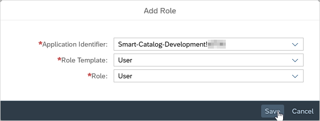

1. Click **trial** in the breadcrumb navigation to return to the trial subaccount.
     
     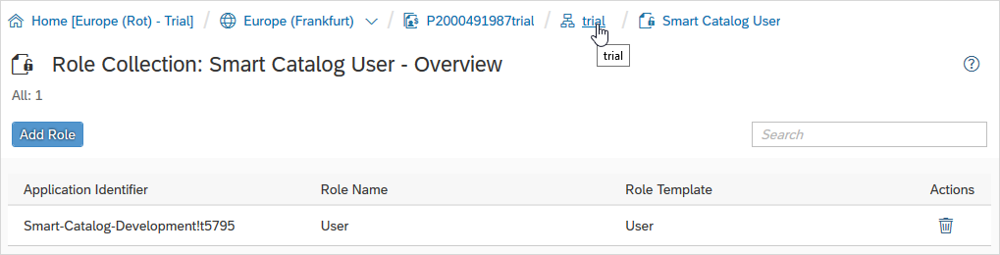

1. Click **Security > Trust Configuration** in the menu.
     
     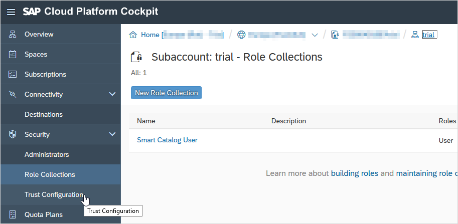

1. Click the **SAP ID Service** configuration.
     
     

1. Type your student username as the **User**

1. Click **Show Assignments**.
     
     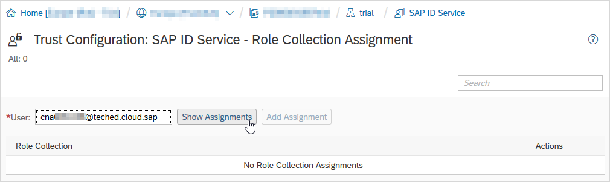

1. Click **Add Assignment**.

1. Check that the **Role Collection** is *Smart Catalog User*.

1. Click **Add Assignment**,
     
     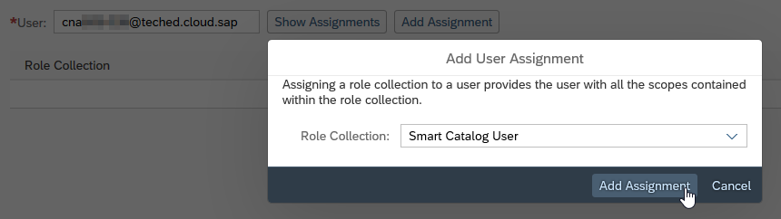

Your student username is now assigned to the User role in the app (via the *Smart Catalog User* role collection) and can be used to log in to your app.

#### 13.2.2 Cloud Connector Configuration

The end point for the cloud connector does not support HTTPS, We, therefore, have to alter the value of the variable containing the endpoint in the app when it is running in the cloud.

1.  Click **trial** in the breadcrumb navigation to return to the trial subaccount.
    
    

1. Click **Spaces** in the menu.
     
     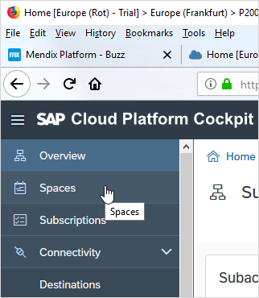

1. Click the **dev** space.
     
     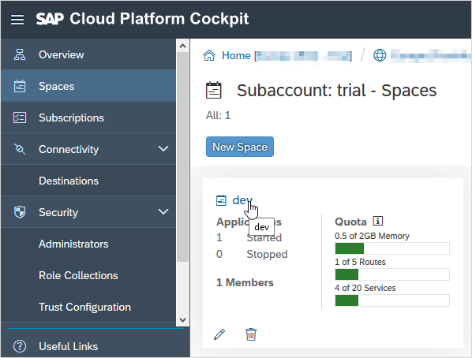

1. Click the **Smart-Catalog-Development** application.
     
     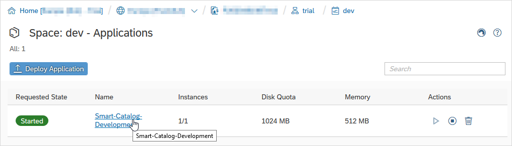

1. Click **User-Provided Variables** in the menu.
     
     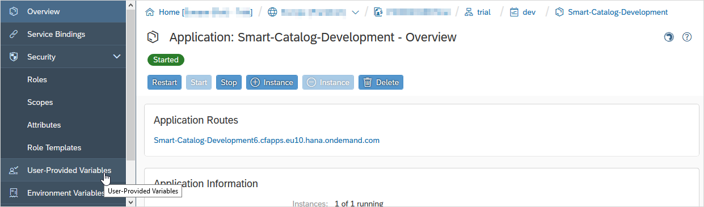

1. Click the edit pencil next to the variable **MX_EPM_REF_APPS_PROD_MAN_SRV_EPM_REF_APPS_PROD_MAN_SRV**.
     
     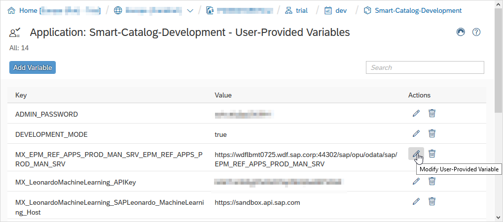

1. Change the **Value** from *https://...* to *http://...*.

1. Click **Save**.
     
     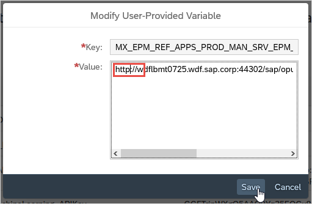

1. Click **Overview** in the menu.
     
     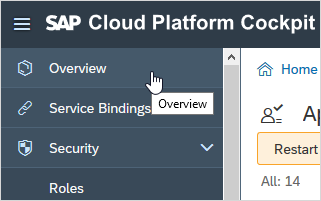

1. Click **Restart**.
     
     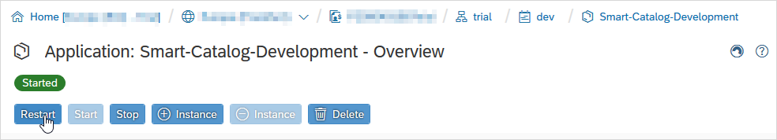

1. Wait for the application to restart and the status to return to **Started**.

You have made all the configuration changes which are needed. These changes only have to be made the first time the app is deployed – your SAP environment will remember the settings.

## 14 Viewing Your App

You can now view your app running in SAP Cloud Platform and confirm that the SAP single-signon works.

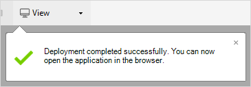

1.  Click **View** in the desktop modeler when the application status is **Started**
    
    

    OR  

    Click the URL in the SAP Cloud Platform Cockpit when the application status is **Started.**
    
    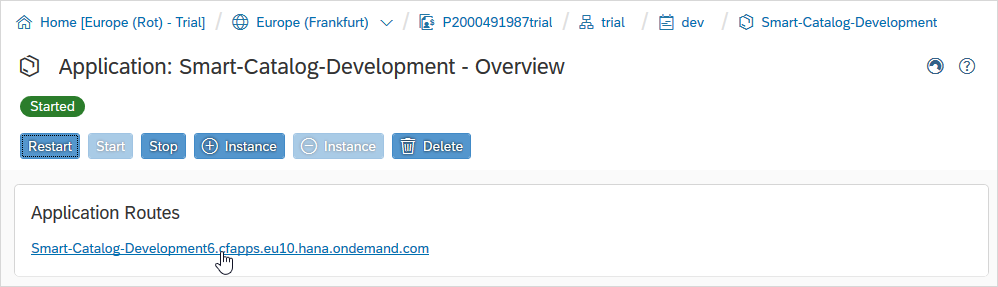

1. Click **Use SAP Authentication Service** to login to the app.
     
     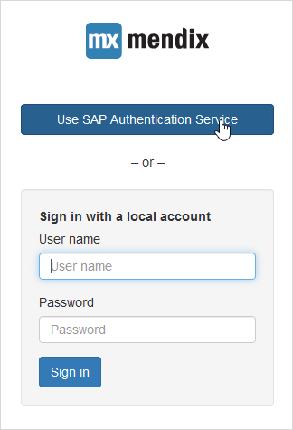

1. Use your SAP credentials to login to the app.

1. Select an image from the student share (or the internet) and use it to search the catalog.

**Congratulations\! You have written a Mendix app to pull together SAP S/4HANA and SAP Leonardo Machine Learning Foundation Services.**
