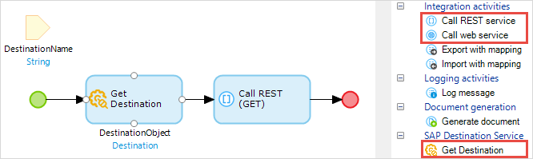

## 1 Introduction

SAP Destination Service is part of the SAP OData Connector and enables OData calls to be made using SAP destinations configured on SAP Cloud Platform. However, you can also use the destination information provided by the SAP Destination Service to make calls to non-OData services using Mendix native actions for consuming REST and SOAP.

This how-to will teach you how to configure a REST or SOAP call to use the configuration obtained from the SAP Destination Service.

## 2 Prerequisites

Before starting this how-to, make sure you have completed the following prerequisites:

* Have a Mendix app which can be deployed to SAP Cloud Platform
* Configured a **PrincipalPropagation** destination to an *on-premise* REST or SOAP service in your SAP Cloud Platform account; see [SAP Destination Services](/refguide/sap/sap-destination-services) for more information
* Imported an **SAP OData Connector** version higher than 4.0.0 into your app

## 3 Writing Your Microflow

In your microflow which is making a REST or SOAP call, perform a **Get Destination** action before the REST or SOAP call. This needs to use the Destination Name which is configured in a Destination on SAP Cloud Platform.

This will return a **Destination** object. This is named *DestinationObject* in the above example, and is used to configure the subsequent REST or SOAP call.

The Destination object has the properties shown in the image below:

### 3.1 Configuring a REST Call

#### 3.1.1 General Tab

The following entries are required in the **General** tab:

|Entry|Description
|-----|-----|
|Location|$DestinationObject/Url followed by any additional parameters|
|Proxy configuration|Override|
|Use proxy|true|
|Host|$DestinationObject/ProxyHost|
|Port|$DestinationObject/ProxyPort|
|Username|$DestinationObject/SapConnectivityProxyCredentials|
|Password|empty|

#### 3.1.2 HTTP Headers Tab

The following HTTP Headers do the following:
* authenticate the app to perform the action via the Connectivity service
* authenticate the user to access the endpoint defined by the destination
* request that data is returned in JSON format

|Key|Value|
|---|---|
|SAP-Connectivity-Authentication|$DestinationObject/SapConnectivityAuthentication|
|Proxy-Authorization|'Bearer ' + $DestinationObject/SapConnectivityProxyCredentials|
|Accept|'application/json'|

### 3.2 Configuring a SOAP Call

#### 3.2.1 Operation Tab

The following entries are required in the **Operation** tab:

|Entry|Description
|-----|-----|
|Override location|*Checked*|
|Location|$DestinationObject/Url|
|Proxy configuration|Override|
|Use proxy|true|
|Host|$DestinationObject/ProxyHost|
|Port|$DestinationObject/ProxyPort|
|Username|$DestinationObject/SapConnectivityProxyCredentials|
|Password|empty|

#### 3.2.2 HTTP Headers Tab

The same HTTP Headers are required as for a REST call. They do the following:
* authenticate the app to perform the action via the Connectivity service
* authenticate the user to access the endpoint defined by the destination
* request that data is returned in JSON format

|Key|Value|
|---|---|
|SAP-Connectivity-Authentication|$DestinationObject/SapConnectivityAuthentication|
|Proxy-Authorization|'Bearer ' + $DestinationObject/SapConnectivityProxyCredentials|
|Accept|'application/json'|

## 4 Related Content

* [SAP Destination Service](/refguide/sap/sap-destination-services)
* [Consumed Web Services](/refguide/consumed-web-services)
* [Consumed Web Service](/refguide/consumed-web-service)
* [Call Web Service Action](/refguide/call-web-service-action)
