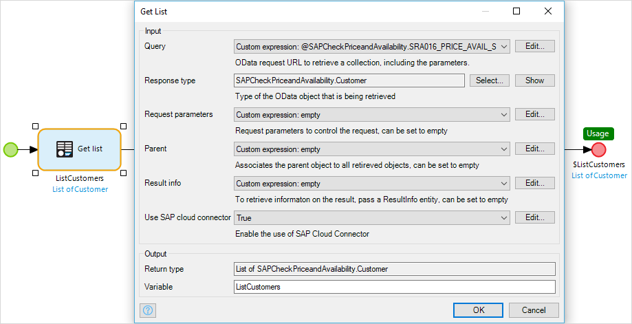
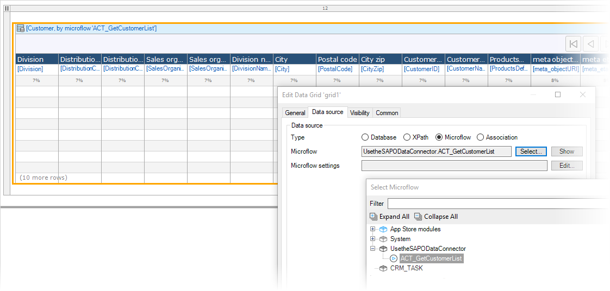

## 1 Introduction

The SAP OData Connector is a specific SAP connector for integrating with SAP back-end systems like SAP Business Suite (SAP ERP 6.0), SAP S/4HANA, SAP S/4HANA Cloud, and SAP SuccessFactors.

**This how-to will teach you how to do the following:**

* Add the SAP OData Connector to your Mendix app
* Configure the SAP OData Connector

## 2 Prerequisites

Before starting this how-to, make sure you have completed the following prerequisites:

* Create the app in the Mendix Desktop Modeler 7.5.1 or higher
* Get the SAP OData Connector module
* Get an SAP data model

### 2.1 Getting the SAP OData Connector Module

To be able to use the OData Connector; first create your project. Inside the desktop modeler, navigate to the Mendix App Store to download the [SAP OData Connector](https://appstore.home.mendix.com/link/app/74525/Mendix/SAP-OData-Connector) module. You will then find this module in your app project's App Store modules.

For more information, see [How to Use App Store Content in the Modeler](/community/app-store/use-app-store-content-in-the-modeler).

### 2.2 Getting an SAP Data Model

To get started quickly, you can download one of the available SAP data models. These modules contain a pre-built domain model for a specific service of SAP.

For more information, see [SAP Data Models](/refguide/sap/sap-data-models).

## 3 Using the SAP OData Connector

In this section, you will learn how to implement the data connector in your Mendix app.

### 3.1 Creating a Microflow

In this example, you are retrieving a list of customers that is available in the SAP data model named **SAP Check Price and Availability Connector**.

{}
This is NOT the very similar SAP data model, **SAP Check Price and Availability for Field Sales Representative**.
{}

To create the microflow for this retrieve, follow these steps:

1. Create a microflow in the Desktop Modeler.
2. From the **Toolbox**, drag the **Get List** operator into your microflow.
3. Fill in the required fields of the Get List connector. For this example, you should use these settings:
    * **Query** – `@SAPCheckPriceandAvailability.SRA016_PRICE_AVAIL_SRV_URL +'/' + toString(SAPCheckPriceandAvailability.EntitySetNames.Customers)`
    * **Response type** – the type you want to query from the OData service; in this example, `Customer` is used
    * **Request parameters** – empty
    * **Parent** – empty
    * **Result info** – empty
    * **Use Cloud Connector** – Yes

4. In the microflow, make the return value of the microflow **List of Customers**. This is so that you can call the microflow as a data source in a page.

The final result of your microflow should look like this:

### 3.2 Creating a Page

To create a page to show the objects in a list, follow these steps:

1. Create a blank page and insert a **Data grid** widget.
2. Select the microflow you created in section [3.1 Creating a Microflow](#microflow) as the data source for the grid. Your page should look like this:

    

3. Create a simple **button** on your homepage.
4. Set the action to **Open page** and select the page you have just created.

Congratulations! You can now run your app and see a list of the customers available in the public **Check Price and Availability** application of [SAP Fiori Cloud Demo](https://www.sapfioritrial.com/sites?helpset=trial&sap-client=001#PriceAndAvailability-check).

## 4 Related Content

* [SAP OData Connector](/refguide/sap/sap-odata-connector)
* [SAP Data Models](/refguide/sap/sap-data-models)
