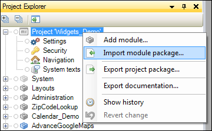

## 1 Introduction

SAP data models reflect an OData service from SAP back-end systems like SAP Business Suite (SAP ERP 6.0), SAP S/4HANA, and SAP S/4HANA Cloud. OData services are exposed via the SAP Gateway and are described in a `$metadata` file, which describes all the entities that are exposed for that service.

Handcrafting a Mendix domain model for these OData services would be a lot of work. The SAP OData Model Creator automates this process by creating a Mendix module for the selected service containing the Mendix domain model which can be imported in your project.

There are three ways to do this:

* [Using the API Catalog](#APICatalog)
* [Providing URL to Metadata](#URL)
* [Uploading an Odata Metadata XML File](#Uploading)

## 2 Prerequisites

Before starting this how-to, make sure you have completed the following prerequisites:

* identify the SAP back-end system and OData service you wish to use

## 3 Generating a Data Model

The SAP OData Model Creator is an app in the App Store. Search for it in the Mendix App Store, or find it here: [SAP OData Model Creator](https://sapodatamodelcreator.mendixcloud.com/). 

{}
The SAP OData Model Creator is not currently available in the App Store within the Desktop Modeler. It can only be run in a browser.
{}

1. Open the [SAP OData Model Creator](https://sapodatamodelcreator.mendixcloud.com/).

You will be asked how you want to 

There are three ways to generate your data model.

### 3.1 Using the API Catalog

### 3.2 Generating the Model Manually

#### 3.2.1 Providing URL to Metadata

#### 3.2.2 [Uploading an Odata Metadata XML File]

Generating an SAP data model starts by getting an OData metadata XML file. This file can be download from the OData service URL directly using the `$metadata` suffix or retrieved from the SAP Gateway. Your SAP Gateway administrator can provide the file for you.

With the file available, go to the [SAP OData Model Creator](https://sapodatamodelcreator.mendixcloud.com/) web page. For this documentation, we use the publicly available HCM People Profile service, for which [this](https://www.sapfioritrial.com/sap/opu/odata/sap/HCM_PEOPLE_PROFILE_SRV/$metadata) is the metadata file.

To generate the data model, follow these steps:

1. Save the file to your hard drive.
2. Open the [SAP OData Model Creator](https://sapodatamodelcreator.mendixcloud.com/).
3.  Upload the OData Schema XML file:

    

4. Press **Generate .mpk**. A progress bar will be shown during the parsing and generation of the module.
5.  Once the generation is done, the **Download File** button appears. Notice that the file name of your data model module is extracted from the metadata file itself.

    

## 4 Using the Data Model Module in a Mendix App

Now you have a Mendix module ready to import into your project. Open the project which you created as a prerequisite. Right-click your project in the **Project Explorer** and select **Import module package...**.

You now have your service **HCM\_PEOPLE\_PROFILE\_SRV** module available in your project ready to use in combination with the SAP OData Connector.

Now you are ready to use the imported data model together with the SAP OData Connector. For more information, see [How to Use the SAP OData Connector](/howto/sap/use-sap-odata-connector).

<!-- 

* Create the app in the Mendix Desktop Modeler 7.5.1 or higher

* Get the SAP OData Connector (see below)

### 2.1 Getting the SAP OData Connector

To be able to use the OData Connector, create your project and then navigate to the Mendix App Store to download the [SAP OData Connector](https://appstore.home.mendix.com/link/app/74525/Mendix/SAP-OData-Connector). You will then find this module in your app project's App Store modules.

For details on using Mendix App Store connectors, see [How to Use App Store Content in the Modeler](/community/app-store/use-app-store-content-in-the-modeler).
-->

## 5 Related Content

* [HCM People Profile Service sample metadata](https://www.sapfioritrial.com/sap/opu/odata/sap/HCM_PEOPLE_PROFILE_SRV/$metadata)
* [How to Use App Store Content in the Modeler](/community/app-store/use-app-store-content-in-the-modeler)
* [How to Use the SAP OData Connector](/howto/sap/use-sap-odata-connector)
* [SAP OData Connector](https://appstore.home.mendix.com/link/app/74525/Mendix/SAP-OData-Connector)
* [SAP OData Model Creator](https://sapodatamodelcreator.mendixcloud.com/)
