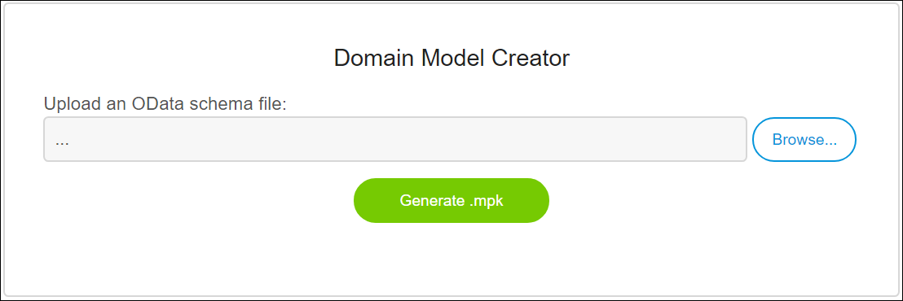
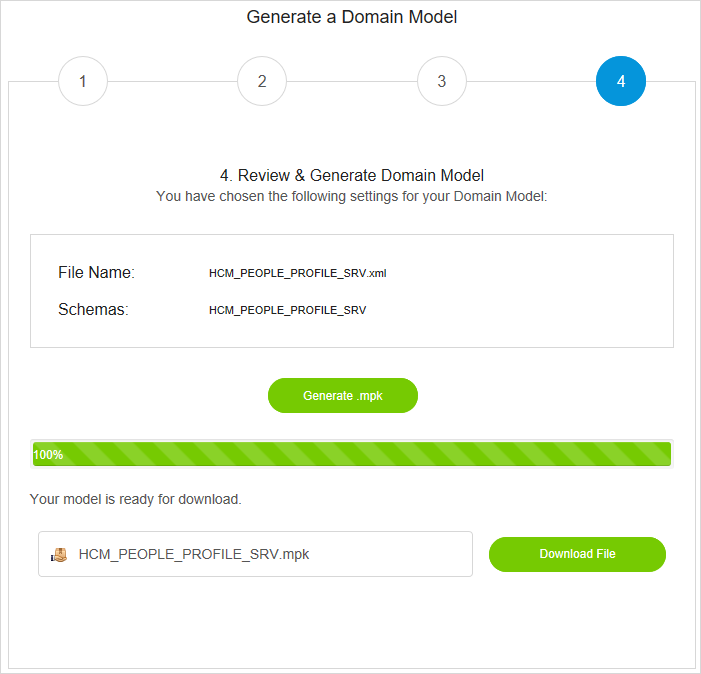
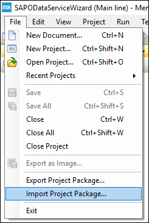
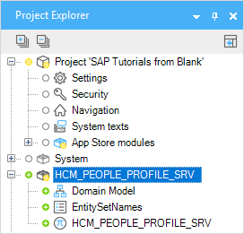

## 1 Introduction

SAP Service modules reflect an OData service from SAP back-end systems like SAP Business Suite (SAP ERP 6.0), SAP S/4HANA, and SAP S/4HANA Cloud. OData services are exposed via the SAP Gateway and are described in a `$metadata` file, which describes all the entities that are exposed for that service.

Handcrafting a Mendix domain model for these OData services can be a lot of work. The SAP OData Model Creator automates this process by providing a website where your OData metadata XML file is transformed into a Mendix module that can be imported in your project.

## 2 Prerequisites

Before starting this how-to, make sure you have completed the following prerequisites:

* Create the app in the Mendix Desktop Modeler 7.5.1 or higher
* Get the SAP OData Connector (see below)

### 2.1 Getting the SAP OData Connector Module

To be able to use the OData Connector, create your project and then navigate to the Mendix App Store to download the [SAP OData Connector](https://appstore.home.mendix.com/link/app/74525/Mendix/SAP-OData-Connector) module. You will then find this module in your app project's App Store modules.

For details on using Mendix App Store connectors, see [How to Use App Store Content in the Modeler](/community/app-store/use-app-store-content-in-the-modeler).

## 3 Generating a Service Module

Generating a service module starts by getting an OData metadata XML file. This file can be download from the OData service URL directly using the `$metadata` suffix or retrieved from the SAP Gateway. Your SAP Gateway adminstrator can provide the file for you.

With the file available visit the [SAP OData Model Creator](https://sapodatamodelcreator.mendixcloud.com/). For this documentation, we use the publicly available HCM People Profile service, for which [this](https://www.sapfioritrial.com/sap/opu/odata/sap/HCM_PEOPLE_PROFILE_SRV/$metadata) is the metadata file.

To generate the service module, follow these steps:

1. Save the file to your hard drive.
2. Open the [SAP OData Model Creator](https://sapodatamodelcreator.mendixcloud.com/).
3.  Upload the OData Schema XML file:

    

4. Press **Generate .mpk**. A progress bar will be shown during the parsing and generation of the module.
5.  Once the generation is done, the **Download File** button appears. Notice that the file name of your module is extracted from the metadata file itself.

    

## 4 Using the Module in a Mendix App

Now you have a Mendix module ready to import into your project. Open the project which you created as a prerequisite, select **File** > **Import Project Package**, and select the MPK file.

You now have your service **HCM\_PEOPLE\_PROFILE\_SRV** module available in your project ready to use in combination with the SAP OData Connector.

For more information on creating a new app from a Mendix project package, see [Import Project Package](/refguide/import-project-package-dialog).

Now you are ready to use the imported service module together with the SAP OData Connector. For more information, see [Use the SAP OData Connector](/howto/sap/use-sap-odata-connector).
