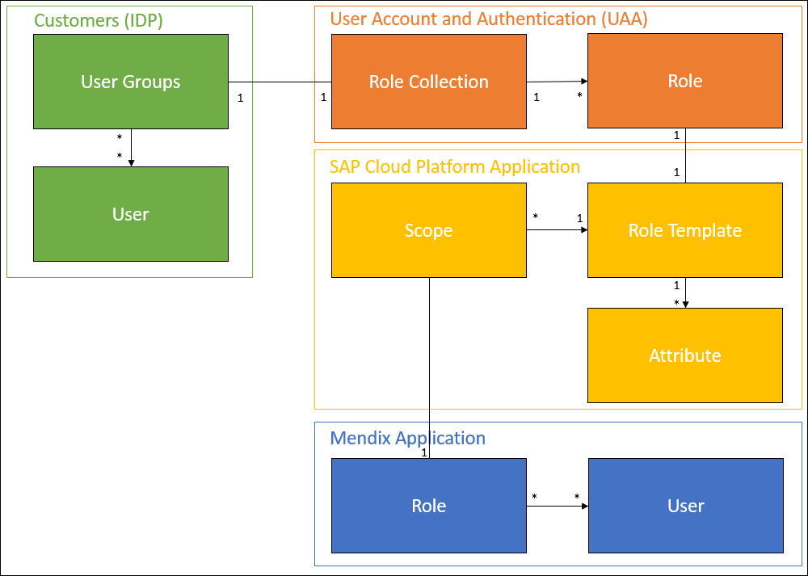

## 1 Introduction

When you deploy an application to SAP Cloud Platform using the SAP deployment features of the Mendix Developer Portal it is bound automatically to the XSUAA service. This service allows you to use an external identity provider (IDP) for a Mendix application. This means that the user can sign on to their app using this IDP instead of having their user credentials stored separately in the Mendix app. This means that they can have a single sign-on (SSO) experience with their application.

A Mendix application is role-based. Using the SAP Cloud Platform Cockpit, you can assign the roles within the app to roles within your SAP subaccount. The roles in the SAP subaccount can then be assigned to individual users via the selected IDP (Trust Configuration).

In this document, you will see how to use the SAP XSUAA Connector to provide SSO to an app which has two roles: Supervisor and Inspector. 

**This how-to will teach you how to do the following:**

* Add the XSUAA Connector to your project
* Configure the XSUAA connector within your app
* Configure security in your SAP subaccount to allow app users to access the app using SSO

## 2 Prerequisites

Before starting this how-to, make sure you have completed the following prerequisites:

* Create an SAP app using an SAP starter app.
* Select and deploy the app to a SAP account and subaccount where you have authority to configure security
* Setup the app with the following two **User roles** in **Project ... > Security**: Supervisor and Inspector
* Give each role a different starting page so that the effect of the SSO can be seen
* 

## 3 Getting the SAP XSUAA Connector Module

The SAP app may already have the SAP XSUAA Connector installed. Look in **Project... > App Store modules** for the module **SapAuthentication**. This is the XSUAA connector.

If the SAP XSUAA Connector is not already in your project, download it from the App Store. It can be found here: [SAP Cloud Platform XSUAA Connector](https://appstore.home.mendix.com/link/app/78091/).

For more information, see [How to Use App Store Content in the Modeler](/community/app-store/use-app-store-content-in-the-modeler).

## 3 Using the Connector

In this section, you will learn how to implement the data connector in your Mendix app.

{}
SAP Authentication will not work if the Project Security is off.

Set the security level for the project to at least Prototype/demo to use SAP Authentication. For more information see [Project Security](/refguide/project-security).
For instructions on setting security levels, see [How To Create a Secure App](../security/create-a-secure-app)
{}

### 3.1 Adding the OnStartup Microflow to the Application Settings

The app needs to be bound to the SAP XSUAA service. This is achieved by executing a microflow when the app starts. This may have been set up already if XSUAA was included in your starter app.

To add the After Startup microflow to your application, follow these steps:

1. In the **Project Explorer**, select **Project ... > Settings** and open the **Runtime** tab.
2. For the **After Startup** microflow, select the microflow **App Store Modules > SapAuthentication > USE_ME > AfterStartup**.


### 3.2 Changing the Login Page to Allow XSUAA SSO

By default, the Mendix login page will not allow the user to enter their SSO credentials. There are two ways of changing the login page:

* Add the SSO login button so the user can choose whether to use SSO or native Mendix credentials
* Bypass the Mendix login page altogether and just display the XSUAA login page

#### 3.2.1 Adding the SSO Login Button to the Login Page<a name="adding"></a>

{}
If your app already had XSUAA included, your login.html file may have been modified already.
{}

If login.html does not support XSUAA then you need to add the SSO login button to the landing page. Do this by following these steps:

1. In the top menu of the Desktop Modeler, select **Project** > **Show Project Directory in Explorer**.
2. Open the **theme** folder.
3. Open **login.html** for editing.
4. Locate this line:

	```html
	<div class="login-logo"></div>
	```
5. Below the line above, add this line:

	```html
	<a id="ssoButton" href="/xsauaalogin/" class="login-sso-button btn btn-primary">Sign in with your XSUAA account</a>
	```
The XSUAA login button will look like this:


#### 3.2.2 Redirecting Your Application to XSUAA Without Showing the Login Page

An alternative to adding the SSO login button to the landing page of your app is to redirect your app to XSUAA automatically without showing the login page.

{}
Note that this will only work if you are running your app on the SAP Cloud.
{}

To accomplish this, follow these steps:

1. Open the project directory of your project and then open the **theme** folder.
2. Change the contents of **login.html** to the following:

	```html
	<!doctype html>
	<html>
		<head>
			<script>
				window.location.assign("/xsauaalogin/")
			</script>
		</head>
	</html>
	```

## 4 Configuring the SAP Cloud Platform Subaccount

Your app is now configured to use an IDP, but you now need to configure the IDP and allocate users to roles. This is performed in the [SAP Cloud Platform Cockpit](https://account.hana.ondemand.com/cockpit#/home/allaccounts).

{}
Before configuring the IDP, you must first deploy your app to the SAP Cloud Portal. This will expose the user roles in the app to the security configuration tools in the SAP Cloud Platform Cockpit.
{}

The diagram below shows the relationship between the security structures in your Mendix app (blue), the SAP Cloud Platform app environment (yellow), SAP User Account and Authentication (orange) and the IDP (green).



When your app is deployed to the SAP Cloud Platform, each **User Role** in the Mendix app is exposed as a **Scope** in the SAP environment. Each Scope is mapped to a single **Role Template** 

In the SAP Cloud Platform Cockpit, you need to configure how the 


## 5 Related Content

* [How To Create a Secure App](../security/create-a-secure-app)
* [How To Use App Store Content in the Modeler](/community/app-store/use-app-store-content-in-the-modeler)
* [Project Security](/refguide/project-security)
* [SAP Cloud Platform XSUAA Connector](https://appstore.home.mendix.com/link/app/78091/)
* [SAP XSUAA Connector](/refguide/sap/sap-xsuaa-connector)
