## 1 Introduction

Each application must have a proper security configuration in order to have its data secured. This how-to will teach you how to turn the security on and configure it.

You will start with the configuration of user and module roles for access to pages and microflows, so we’ll turn on the prototype/demo security. Next you will deal with production security.

**This how-to will teach you how to do the following:**

* Configure prototype/demo security
* Configure production security

## 2 Prerequisites

Before starting with this how-to, make sure you have completed the following prerequisites:

* Know how to create a domain model (for more information, see [How to Create a Basic Data Layer](../data-models/create-a-basic-data-layer))
* Know how to create overview and detail pages (for more information, see [How to Create Your First Two Overview and Details Pages](../ux/create-your-first-two-overview-and-detail-pages))
* Know how to create menu items (for more information, see [How to Set Up the Navigation Structure](../ux/setting-up-the-navigation-structure))

## 3 Preparing the Data Structure, GUI, and Example Data

To see the results of this how-to, you must set up a test project with test data by following these steps:

1.  Create the following domain model:
    
    

2. Create overview and detail pages to manage objects of **Customer** and **Order** type.
3. Create menu items to access the **Customer** and **Order** overview pages.
4.  Add a new microflow by right-clicking your module and selecting **Add** > **Microflow**:
5.  Name the microflow *IVK_SetOrderToComplete*:
    
    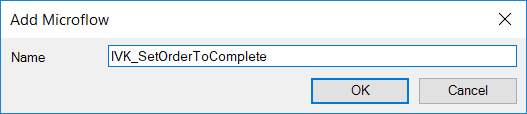

6.  Save the new menu item by clicking **OK**. You should see an empty microflow like this:
    
    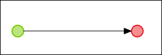

7.  Add an **Action** button to the toolbar of the orders overview:

    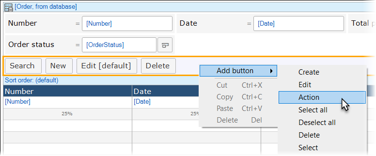

8. Double-click the new button and in the button's properties editor, enter *Set Processing to Complete* for the **Caption**.
9. Set **On click** to **Call a microflow**, and then select the **IVK_SetOrderToComplete** microflow you just created:
    
    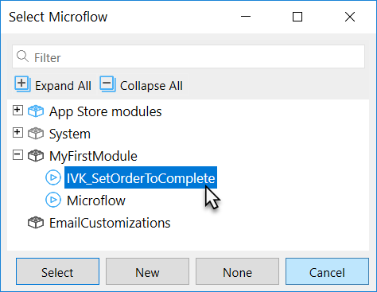

10. Add the following customer data to your app:
    
    

11. Add the following order data to your app:
    
    

## 4 Setting the Security Level to Prototype/Demo

In this part of the how-to, you will learn how to configure the security at the prototype/demo level. Be aware that this level of security is only applicable for development/demo purposes. This level is available for the quick development of demo applications. It simulates security without the more complex configuration of data access. When deploying to the Mendix cloud, production security is mandatory.

To set the security level to prototype/demo, follow these steps:

1.  Open the project **Security**:
    
    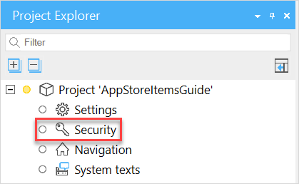
    
    This will open the **Project Security** properties editor.
2.  Switch the **Security level** to **Prototype / demo**:
    
    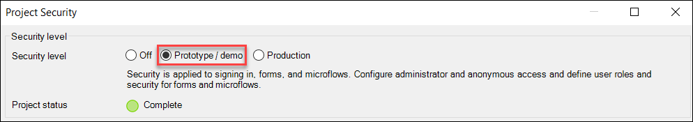

3.  Go to the **Administrator** tab and set the master administrator **Password**:
    
    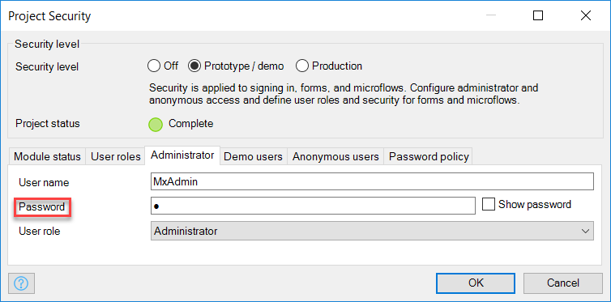

### 4.1 Creating Module Roles Within a Module

You have added one or more modules while the security was turned off, so there is currently no security configured for those modules. Now that security is turned on, you have to configure it from scratch. Access to a module is managed using module roles. You will now add these.

To create module roles within a module, follow these steps:

1.  Open the module **Security** of the **MyFirstModule** module:
    
    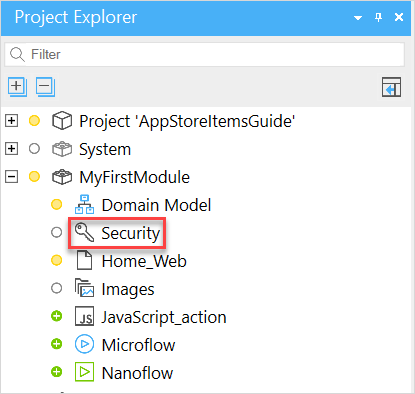

2.  On the **Module Security Type 'Security'** properties editor, click **New**:
    
    

3.  In the **New Module Role** dialog box, enter *Administrator* for the module role **Name**:
    
    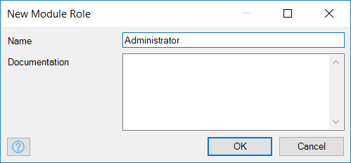

4.  Create the **User** module role:
    
    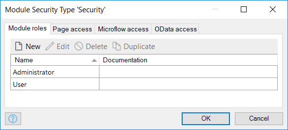

### 4.2 Connecting the User Roles to Module Roles

The two module roles that have been created should be assigned to a user role. When an end-user has a specific user role, the end-user has access to the data, forms, and microflows according to the assigned module roles of that user role:

1. Open the project **Security.**
2.  On the **Project Security** dialog box, go to the **User roles** tab and double-click the **Administrator** user role:
    
    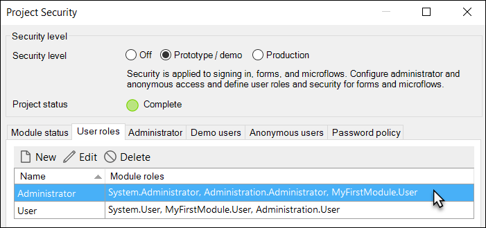

3.  In the **Module roles** section of the **User Role 'Administrator'** properties editor, click **Edit**:
    
    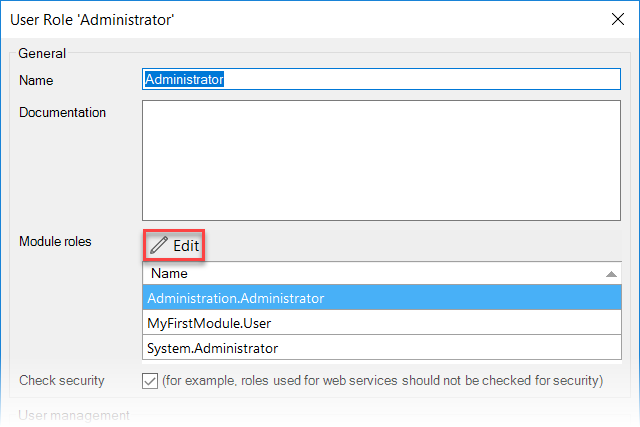

4.  In the **Select Module Roles** pop-up window, select the **Administrator** module role for all the modules:
    
    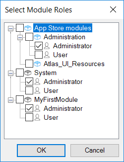

5.  Repeat steps 2–4 for the **User** user role:
    
    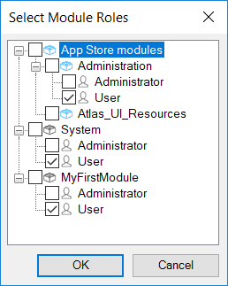

### 4.3 Configuring the Page and Microflow Access of a Module

To configure the page and microflow access of a module, follow these steps:

1.  Open the module **Security** of the **MyFirstModule** module:
    
    

2.  Open the **Page access** tab:
    
    

3.  Check the pages according to the example shown here:
    
    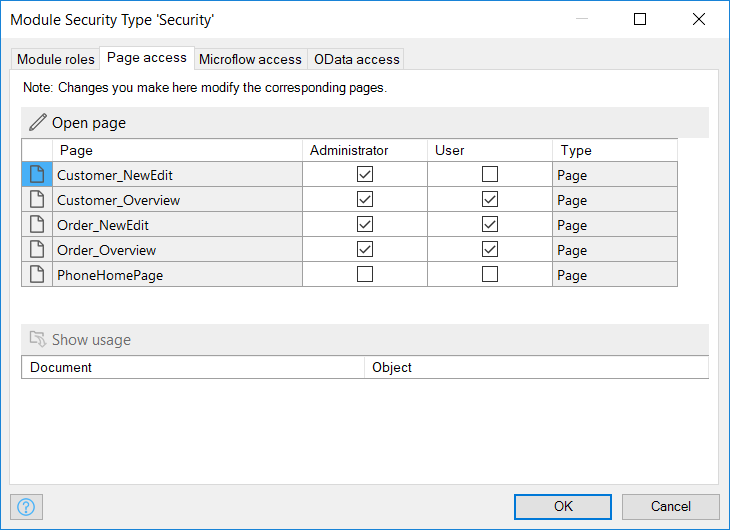

4.  On the **Microflow access** tab, check the microflows according to the example shown here:
    
    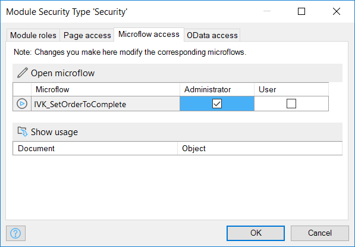

5. Deploy the application.
6. Create new users with different roles.
7. Log in with these users.
8. Test the differences in your application.

## 5 Setting the Security Level to Production

In this section of the how-to, you will configure the security at the production level. At this level, all security settings must be configured. In addition to prototype/demo security, you have to configure the entity (data) access. Production security is mandatory when deploying to the Mendix cloud.

To set the security level to production, follow these steps:

1.  Open the project **Security**:
    
    

2.  On the **Project Security** dialog box, switch the security level to **Production**:
    
    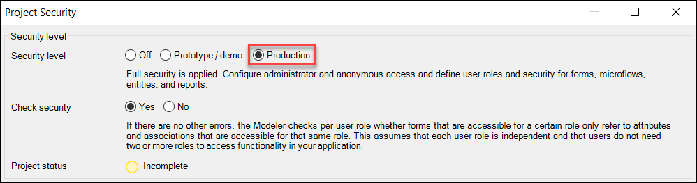

### 5.1 Configuring Form Entity Access

To configure the form entity access, follow these steps:

1.  Open the **Security** module of the **MyFirstModule** module:
    
    

2.  On the **Module Security Type 'Security'** dialog box, open the **Entity Access** tab:
    
    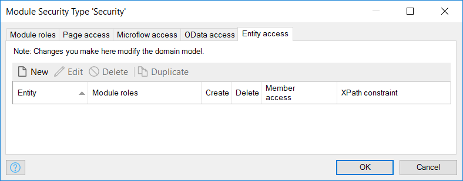

3. Click **New** to create access rules for the **Role Administrator** module. Make sure you allow an administrator to read/write all and restrict some of the user's read/write rights so that you can clearly see the difference in these roles.

### 5.2 Creating Access Rules for the Administrator Module Role

You will now create access rules for the Administrator module role. Since this role represents an administrator, let’s assume that he/she is allowed to create, delete, read, and write everything, so you can create the rules in a quick batch.

To create access roles for the Administrator module role, follow these steps:

1.  Select all the entities and click **OK**:
    
    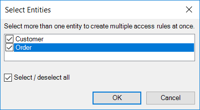

2.  Set up the rule configuration:
    * **Rule applies to the following module roles**: **Administrator**
    * **Allow creating new objects**: true
    * **Allow deleting existing objects**: true
    * **Member read and write rights**: **Read, Write**
    
    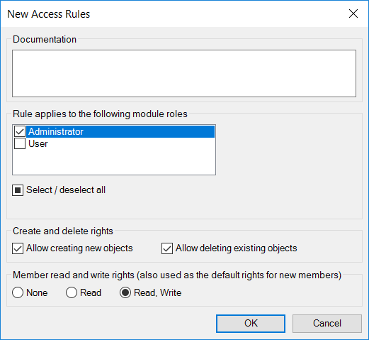

3. Click **OK**.

{}
A separate access rule will be created for all entities when the module role is set to Administrator. It is possible to adjust each rule individually later.
{}

### 5.3 Creating Access Rules for the User Module Role

Next you have to create access rules for the User module role. Since this role represents a user with limited access, let’s assume he/she is only allowed to read most data and is allowed to write some of the Order data. This means you have to configure all the access rules individually.

To create access roles for the User module role, follow these steps:

1.  On the **Module Security Type 'Security"'** dialog box, click **New** to create a new access rule for the User module role:
    
    

2.  Select the **Customer** entity and click **OK**:
    
    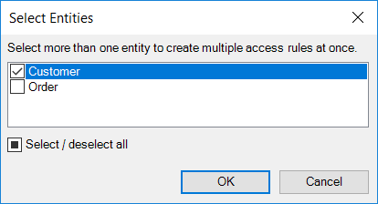

3.  Set up the rule configuration:
    * **Rule applies to the following module roles**: **User**
    * **Allow creating new objects**: false
    * **Allow deleting existing objects**: false
    * **Default rights for new members**: **Read**
    
    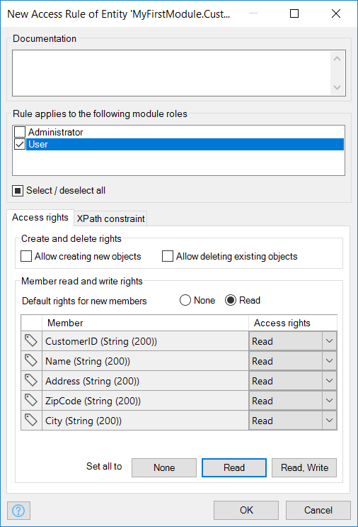

4.  Adjust the rule for the **Order** and set up the rule configuration:
    * **Rule applies to the following module roles**: **User**
    * **Allow creating new objects**: true
    * **Allow deleting existing objects**: false
    * **Default rights for new members**: Read, Write
    * **Access rights** for each member: **Read, Write**

     

    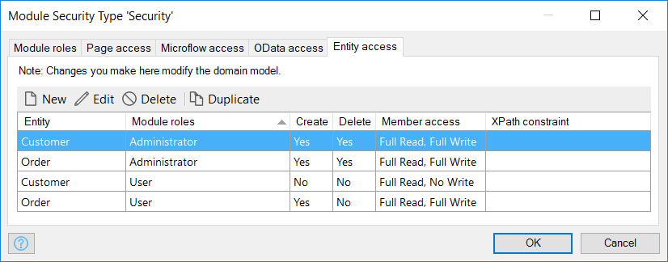

5. Deploy the application.
6. Log in with the different users and test the differences in your application. 

## 6 Defining the Access Rules on the Order Entity Using XPath

In the previous section you set some access rules on your domain model. In this section you you will define the access rules on the Order entity so that orders can only be viewed by a user if the payment status of the order is set to open. You will do this by adding an XPath constraint to the Order entity for the User module role. 

An XPath constraint can be used to constrain the set of objects to which the access rule applies. If the XPath constraint is empty, the rule applies to all the objects of the entity. For more information, see [XPath Constraints](/refguide7/xpath-constraints) in the Mendix Reference Guide.

### 6.1 Adding an Account with the User User Role

1.  Click the **Accounts** in the **Administration** menu:
    
    

2.  On the **Accounts** screen, click **New user**:
    
    

3.  Add an account with a user role named **User**:
    
    

4. Click **Save**.

### 6.2 Set the Entity Access to Open Order Status

1.  Double-click the **Order** entity:

    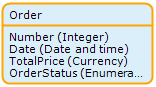

2.  On the **Properties of Entity 'MyFirstModule.Order'** editor, open the **Access rules** tab:
    
    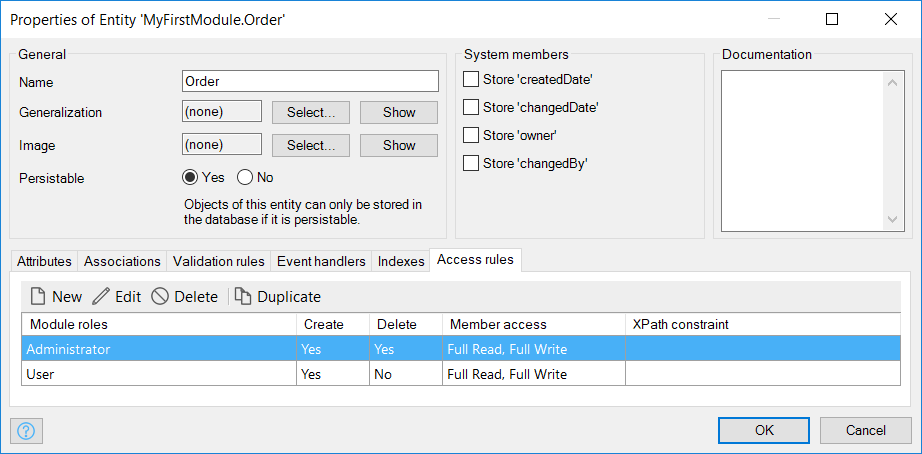

3.  Double-click the **User** module role to open the **Edit Access Rule of Entity 'MyFirstModule.Order'** editor and select the **XPath constraint** tab:
    
    

4.  To constrain the access of the financial administrator to only the open orders, add the following XPath statement:
    
    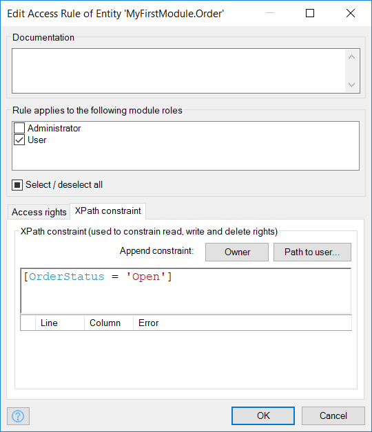

5.  Click **OK**. The properties editor of your Order entity should look like this:
    
    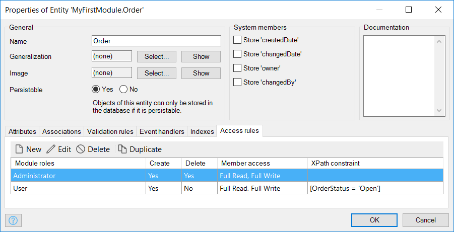

6. Re-deploy your application.
7.  If you log in with the Test User account, you will see that only orders with the **Order status** of **Open** are shown in the overview:
    
    

## 7 Related Content

* [Generate a Personal SSH2 Key Pair](generating-a-personal-ssh2-key-pair)
* [Set Up Anonymous User Security](set-up-anonymous-user-security)
