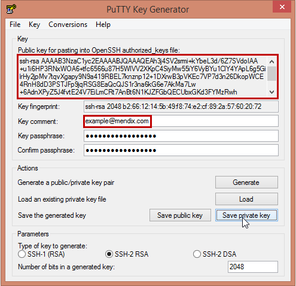
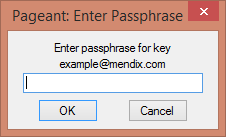
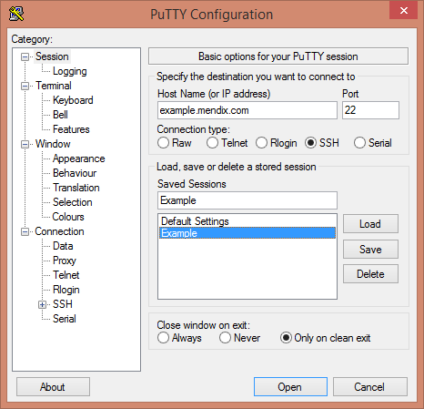

## 1 Introduction

This how-to describes how to generate a personal SSH2 keypair for use in the Mendix hosting environment.

**This how-to will teach you how to do the following:**

* Create SSH2 keys
* Get login access to server accounts

## 2 Prerequisites

None.

## 3 SSKD Key Pairs

### 3.1 What Is an SSH2 Key Pair?

Instead of using old-style passwords, Mendix uses private/public encryption key pairs for user authentication on Linux-based servers. Each key pair is linked to a single person/employee and consists of a private (secret, thus only known to the user) and a public (non-secret) part.

So, instead of maintaining a (shared) list of server login accounts with passwords, each user has his or her personal "digital key." This provides access to the locations where this user is authorized to log in.

Per login account on a server, multiple public keys can be listed, one for each user who is allowed to log in.

### 3.2 Why Should I Use This?

As an analogy, think of a credit card-sized pass used for entering a secured building. Instead of a number combination (password) on the door, each person has his or her own card to open the door. In the password scenario, when one of hundreds of employees leaves the company, you have to change the number combination (or change the password) and communicate the new (secret) combination to all of your employees. But with the pass scenario, you simply revoke the access of that specific plastic card to the building, and the former employee will not be able to enter the building anymore! This is much more convenient and secure.

This is exactly how Mendix works on the Linux server logins. Your private SSH key is the card, which you have to protect from abuse. The public SSH key is the card number. By granting access to doors based on the number of your access card, we can control who can enter what room (or what server account).

For example, if you want John Doe (who works for Example Company) to have access to the Linux server environment for your test application, you first ask John Doe to generate his own public/private keys. After that, you communicate the public part (for example, `ssh-rsa AAAjdsflkjsdf john.doe@example.com`) to Mendix, and then you request access for this user to an environment.

When John Doe leaves Example Company or he should not have access to the server account anymore, Mendix simply revokes his access by telling the server that he may not log in anymore. For other users, nothing changes.

One of the other main benefits of this way of working is that we never need to communicate secrets like passwords, which end up in mailboxes and notebooks everywhere.

## 4 Creating Your Own Keys

### 4.1 Installing PutTTY, PuTTYgen, and Pageant

Download and install **PutTTY**, **PuTTYgen**, and **Pageant** from the [PuTTY Download Page](http://www.chiark.greenend.org.uk/~sgtatham/putty/download.html).

### 4.2 Creating a Key on Linux

If you're on Linux, simply run **ssh-keygen**, and you're done in seconds. Make sure you have a 2048 bit key and that you get the comment right (your e-mail address).

### 4.3 Creating a Key Pair Using PuTTY

Using the tools provided with the free **PuTTY** program, you can create and use your own key pair. To do this, follow these steps:

1. Start the PuTTYgen program, and set the following properties:

    * For **Type of key to generate**, select **SSH-2 RSA**
    * For **Number of bits in a generated key**, enter *2048*

    

2. Click **Generate** and help the program to generate some randomness by moving the mouse over the gray area.
3. Enter your e-mail address in the **Key comment** field.
4. Choose a password (passphrase) to protect your own secret key.
5. Click **Save private key** to save the private part to a *.ppk* file:

    

6. Copy the text listed in the **Public key for pasting into OpenSSH authorized keys file** section. This is the exact text you have to use in the next section.

{}

Do not ever share your private key (*.ppk* file) with anyone!

{}

## 5 Getting Login Access to Server Accounts

To get login access to server account, make sure your public key is known at Mendix. The preferred way to do this is to issue a support request in the [Support Portal](https://support.mendix.com/hc/en-us) so that your SSH public key can be added to your user profile.

When your public key is known, anyone who is authorized to grant access to others on specific deployment locations can issue a support request to have your public key added to that server account.

## 6 Logging In to a Project Account on a Mendix Server

1. Load your private key in Pageant by opening the *.ppk* file. You will be asked for the password that protects the use of your personal private key:

    

2. When it's loaded, start PuTTY and enter the server name in the **Host name** field. Other default settings for connecting (SSH, port 22) are **OK**.
3. Choose a name and click **Save** in the **Saved Sessions** section if you want to save the server information for quick future use:

    

4. Click **Open.** A login prompt will appear.
5. Enter the username of the login account and the system will grant you access after informing you that you've been authenticated using your keys.

As an alternative, you can directly enter the username in the server name edit field by specifying it in the `user@server` format (for example, `myappdev@example.mendix.net`). When opening this session, no username login prompt will appear.

## 7 Related Content

* [How to Create a Secure App](create-a-secure-app)
* [How to Set Up Anonymous User Security](set-up-anonymous-user-security)
