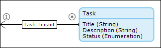

## 1 Introduction

Are you thinking about making your app multi-tenant but are not sure about how to start or what challenges you might come across? Read this how-to and get started with your first multi-tenant app!

It might not seem that complex to build a multi-tenant app, but there are several best practices that will ensure you are building a secure and well-performing app for your customer.

**This how-to will teach you how to do the following:**

* Set up your multi-tenant app
* Use a module from the Mendix App Store to manage your tenants and their users

## 2 Project Security

In a multi-tenant app, you want to differentiate between user roles that transcend the multi-tenant part of the app (for example, Functional Administrator and Technical Administrator) and those that do not. This is due to the way the Mendix platform combines the settings of the user management in the **Project Security** (as shown in [this image](#Figure2)) and access rules on entities that are a specialization of the **System.User** entity.

This is a typical start situation of project security for a multi-tenant app:

The user roles allocated to users that act as a tenant user should not have a configured user management. This is to prevent any user with that user role from seeing users from other tenants. A tenant admin or another tenant-related type of user role must be configured as shown here, which is the desired way of setting user management for tenant-related user roles:

{}
Use the **Administration** module functions to manage users that transcend the tenant level, and use the [Multi tenant administration](https://appstore.home.mendix.com/link/app/80498/) module from the Mendix App Store to manage all users with tenant-related user roles.
{}

{}
When you select the **(No user roles)** option, this means that you can see all the users that do not have a user role linked to their account.
{}

What you see above in the **User management** section is that none of the check boxes are set. This has the desired behavior of not seeing other tenant users, but it also has the undesired behavior of not being able to select a user role for your users. A solution for this is explained in [3.2 User Role Management](#UserRoleManagement) below.

## 3 Multi-Tenant Administration

As stated above, the [Multi tenant administration](https://appstore.home.mendix.com/link/app/80498/) module from the Mendix App Store in which you can handle your user management for a multi-tenant app. This module allows you to manage user roles, tenants and their users. 

Let’s first have a look at the domain model of this module to understand its structure.

### 3.1 The Domain Model

The domain model in the solution supports functions to manage user roles, tenants, and tenant users. There is a **Tenant**, which is the equivalent of an **Organization**.

The TenantUser is the entity that can log in. Attributes are used that look like the attributes of the **System.User** entity. The big difference is that you are now in control! As you can also see, the **TenantUser** is allowed to inherit from **System.User** and not from **Administration.Account**. This is done to prevent a negative impact on the performance of this entity by removing unnecessary levels of depth in the inheritance structure.

In the domain model, one delete prevention rule on the **TenantUser_Tenant** association is also included. This is added to prevent the accidental removal of a tenant.

The **ProjectUserRole** entity is used for duplication of the **System.Userrole** instances.

{}
The `ProjectUserRole_UserRole is 1-*` association is due to the deprecation notice in Mendix 7.5.0 that states, "Cross-module association to the System module must have the Owner property set to Default."
{}

This is the domain model of the multi-tenant administration module:

{}
To make use of the same change-password functionality, the same type of functions are included as in the **Administration** module.
{}

### 3.2 User Role Management

The second step is to rebuild the user management functionality for user roles as you normally would via the **Project Security** (as shown in [this image](#Figure2)). To make this possible, the functions below have been added to the App Store module.

#### 3.2.1	User Role Synchronization

Via an "after startup" event, the **ProjectUserRole** entities are synchronized with the **System.UserRole** entities. This way you can use the **ProjectUserRole** entities to select a user role for your tenant users. The Administrator user role is not synchronized, because this will never be assigned to a tenant user.

#### 3.2.2	User Role Management

An Administrator can view all the synchronized user roles and set the grantable roles for those user roles during runtime. Without setting the grantable roles, no tenant admin will be able to assign a user role to a user.

### 3.3 Tenant Management

The next step is to manage the tenants. This is a function that is offered to the administrator role and consists out of the standard CRUD access.

### 3.4 Tenant User Management

Now that you have user roles and tenants, you can create users for the tenants. This feature is available for Administrators and Tenant Administrators. This way, the Administrator can create at least one user for each tenant, and this user can create more users for their own tenant. By default, the email address is used as a username. This is done to overcome a duplicate username error due to a situation where different tenants would like to use the same username.

## 4 Other Challenges

Next to adjusting your project security and implementing the Mendix App Store module, there are several other challenges you might come across.

### 4.1 Security

The way to start protecting the data of your app is to set access rules on the entities in your domain model. In a multi-tenant app, it is required to add an Xpath constraint to your access rule. This constrains your data to your tenant. In this way, you prevent tenants from seeing information of other tenants. You can see this in an example below.

This is the tenant-related entity **Task**:

This is an access rule for the tenant-related entity:

### 4.2 Performance

When you are building an app, you can find yourself creating complex domain model structures. When an entity is referenced via numerous entities to your Tenant entity, you can imagine that your XPath will become quite large. This will result in large SQL queries that will cost performance.

A solution for this is to add an additional reference directly between your entity and the **Tenant** entity. This way, you can limit your XPath to this path and it will boost your performance.
