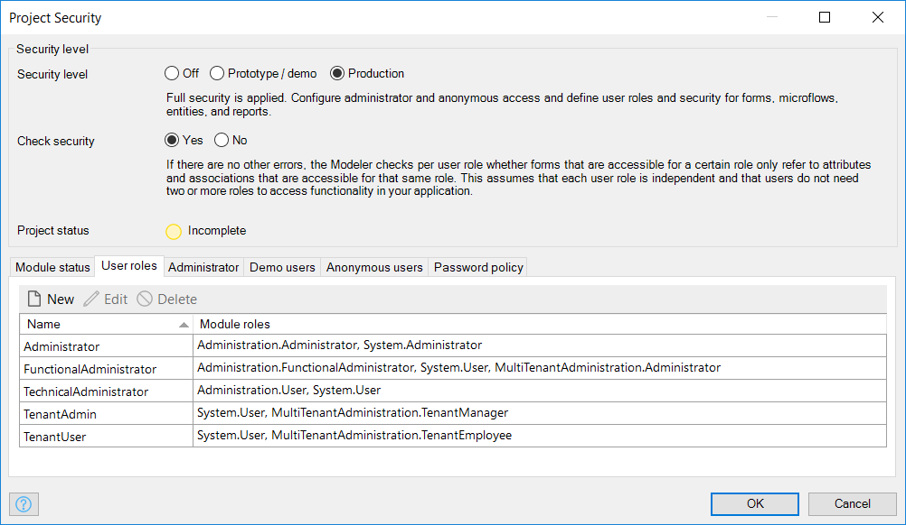
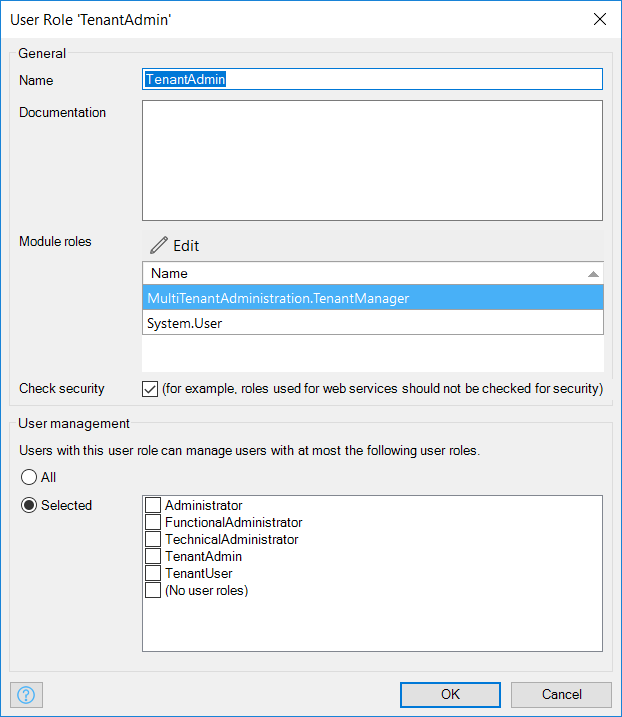

## 1 Introduction

Are you thinking about making your app multi-tenant and not sure how to start or unsure what challenges you might come across? Read this how-to and get started with your first multi-tenant app!

It might not seem that complex to build a multi-tenant app but there are several best practices you want to know to ensure that you are building a secure and performing app for your customer.

After reading this reference guide you will know how to setup your multi-tenant app, what considerations there are while developing the app and you know that there is a module in the Mendix AppStore that allows you to manage your tenants and their users. Let’s start with having a look at the project security!

## 2 Project security

In your multi-tenant app, you want to make a difference between user roles that transcend the multi-tenant part of the app (e.g. functional administrator & technical administrator) and those who don’t. This is due to the way how the Mendix platform combines the settings of the user management in your project security (See figure 2) and access rules on entities that are a specialization of the System.User entity.

_Figure 1: Typical start situation of the project security for multi-tenant apps_

The user roles that will be allocated to users that act as a tenant user shouldn’t have a configured user management. This is to prevent any user with that user role from seeing users from other tenants. A tenant admin or other tenant related type of user role must be configured like shown in below picture.

{}
Use the Administration module functions to manage users that transcend the tenant level and use the MultiTenantAdministration module from the Mendix AppStore to manage all users with tenant related user roles.
{}

_Figure 2: Desired way of setting your user management for tenant related user roles_

{}
When you select the ‘(No user roles)’ option, this means that you can see all users that do not have a user role linked to their account.
{}

What you see here in the user management part is that none of the checkboxes are set. This has the desired behavior of not seeing other tenant users but the undesired behavior of not being able to select a user role for your users. A solution for this is explained in the ‘User role management’ section.

## 3 Multi-tenant administration

As stated in the introduction we have created an AppStore module in which you can handle your user management accordingly for a multi-tenant app. This module allows you to manage user roles, tenants and their users. Let’s first have a look at the domain model of this module to understand its structure.

### 3.1 The domain model

The domain model in our solution will support functions to manage user roles, tenants and tenant users. We have a Tenant which is the equivalent of Organization.
The TenantUser is the entity that can log in. We use attributes that look like the attributes of the System.User entity. The big difference is that we are now in control! As you can also see we let TenantUser inherit from System.User and not from Administration.Account. This is done to prevent a negative impact on the performance of this entity by removing unnecessary levels of depth in the inheritance structure.

In the domain model, we also included one delete prevention rule on the TenantUser_Tenant association. This is added to prevent accidental removal of a tenant.

The ProjectUserRole entity is used for duplication of the System.Userrole instances.

{}
The association ProjectUserRole_UserRole is 1-* due to the deprecation notice in Mendix 7.5.0 that says: ‘Cross-module association to the System module must have the Owner property set to Default’.
{}

_Figure 3: Domain model of the multi-tenant administration module_

{}
To make use of the same change password functionality we have included the same type of functions as in the Administration module.
{}

### 3.2 User role management

The second step is to rebuild the user management functionality for user roles as you normally would do via the project security as shown in figure 2. To make this possible we added the following functions to the AppStore module:

#### 3.2.1	User role synchronization

Via an ‘After startup’ event we synchronize the ProjectUserRole entities with the System.UserRole entities. This way we can use the ProjectUserRole entities to select a user role for our tenant users. The Administrator user role is not synchronized because this will never be assigned to a tenant user.

#### 3.2.2	User role management

An administrator can view all synchronized user roles and set the grantable roles for those user roles during runtime. Without setting the grantable roles no tenant admin will be able to assign a user role to a user.

### 3.3 Tenant management

The next step is to manage the tenants. This is a function that is offered to the administrator role and consists out of the standard CRUD access.

### 3.4 Tenant user management

Now that we have user roles and tenants, we can create users for the tenants. This feature is available for administrators and tenant administrators. This way the administrator can create at least one user for each tenant and this user can create then more users for their own tenant. Default we use the email address as a username. This is done to overcome a duplicate username error due to the situation where different tenants would like to use the same username.

## 4 Other challenges

Next to adjusting your project security and implementing the AppStore module there are several other challenges you might come across.

### 4.1 Security

The way to start protecting the data of your app is to set access rules on the entities in your domain model. In a multi-tenant app, it is required to add an Xpath constraint to your access rule. This constraints your data to your tenant. In this way, you prevent tenants from seeing information of other tenants. You can see this in an example in figure 5.

_Figure 4: Tenant related entity – Task_

_Figure 5: Access rule for Tenant related entity_

### 4.2 Performance

When you are building an app, you can find yourself in creating complex domain model structures. When an entity is referenced via numerous entities to your Tenant entity you can imagine that your Xpath will become quite large. This will result in large SQL queries which will cost performance. A solution for this can be to add an additional reference directly between your entity and the Tenant entity. This way you can limit your Xpath to this path and it will boost your performance.