## 1 Introduction

Selenium IDE is a Firefox plugin that records and plays back user interactions with the browser. 

**After using this how-to, you will know how to do the following:**

* Record a simple test scripts with Selenium IDE
* Find unique CSS selectors

## 2 Prerequisites

Before starting with this how-to, make sure you have completed the following prerequisite:

* Download and install [Firefox](https://www.mozilla.org/nl/firefox/new/)
* Download and install [Selenium IDE](https://addons.mozilla.org/en-US/firefox/addon/selenium-ide/) (when Selenium IDE is installed, it is then available as a Firefox plugin)

### 2.1 Software Versions in This How-To

| Software | Version Used in This How-To |
| --- | --- |
| Firefox | 67.0.1 |
| Selenium IDE | 3.8.1 |

{}
All images, names, and steps in this how-to are based on these versions. When using other versions, the images and/or names on your screen may be different than what is used in this how-to.
{}

## 3 Installing & Running the Company Expenses App

Follow these steps to install and run the Company Expenses app:

1. Open Mendix Studio Pro.
2.  Click the App Store icon in the top toolbar:

	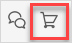

3. Search for *Company Expenses*, then select **Company Expenses**:

	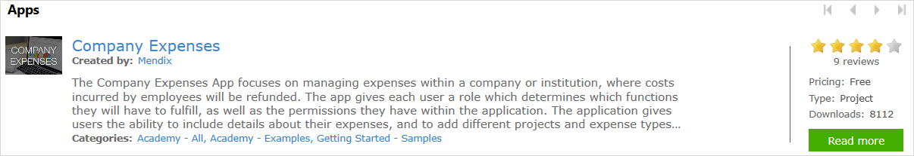

4.  Click **Download** and then **OK**. This will open the Company Expenses app in Studio Pro.

	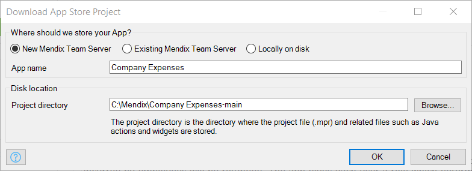

5. Click **Run Locally** then **View**.

## 4 Create Your First Automated Test

To create an automated test by using the record button in Selenium IDE, follow these steps:

1. Open **Firefox** and click the **Selenium IDE** icon in the browser toolbar:

	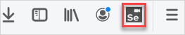

2.  Select **Record a new test in a new project**:

	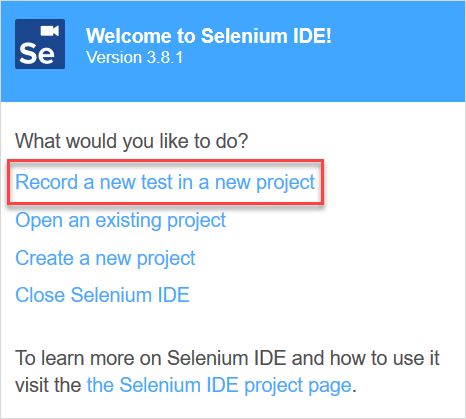

3. Enter a name for your new Selenium project (for example, *CompanyExpenses*).
4. Enter the URL for your Company Expenses app's login screen (`http://localhost:8080/login.html`), then click **START RECORDING**. This will open up your app in a new browser window. The Selenium IDE is now recording.
5.  Log in with default [administrator credentials](/refguide/administrator#2-administrator-properties): 
	* **User name**: MxAdmin
	* **Password**: 1
	
6.  After you logged in, click **Sign out** on the right side of the app:

	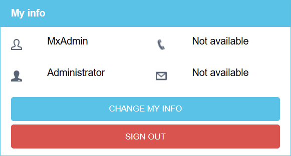

7.  In the Selenium IDE, click the record icon to stop recording: 

  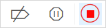

8.  Enter a name for your new test, (for example, *Test1*). The Selenium IDE should now look like this:

  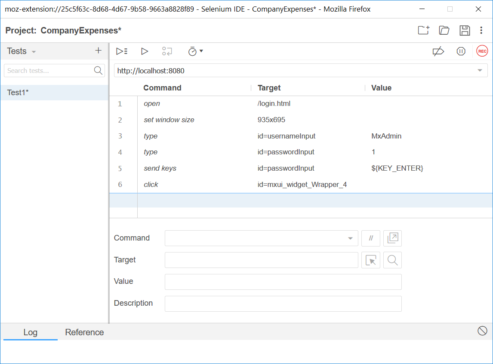

7.  Now that you have a test, click the **Run current test** icon:

	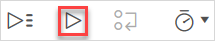

	Every passed test step will be marked green:

	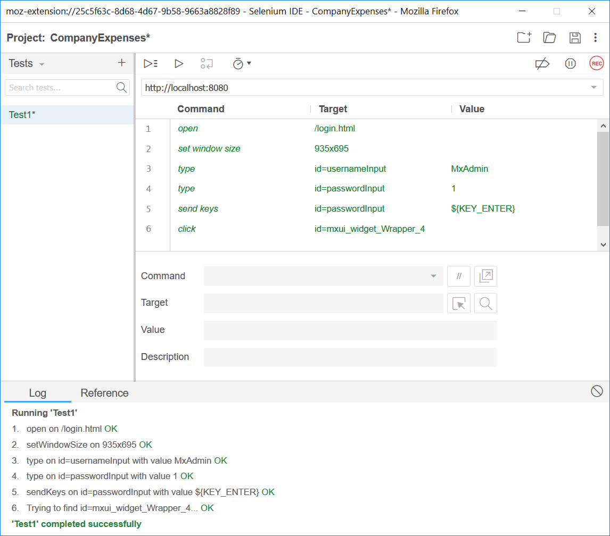

Well done! You have just created your first automated test!

## 5 Read More

* [Automated Tests with TestNG](create-automated-tests-with-testng)
* [Test Microflows Using the UnitTesting Module](testing-microflows-using-the-unittesting-module)
* [Find the Root Cause of Runtime Errors](../monitoring-troubleshooting/finding-the-root-cause-of-runtime-errors)
* [Clear Warning Messages in Mendix](../monitoring-troubleshooting/clear-warning-messages)
* [Test Web Services Using SoapUI](testing-web-services-using-soapui)
* [Monitor Mendix Using JMX](../monitoring-troubleshooting/monitoring-mendix-using-jmx)

Learn more about this topic using the following helpful link:

* [Selenium IDE Documentation](http://docs.seleniumhq.org/docs/02_selenium_ide.jsp)

# OLD

-create test to get to a failing element

## Locating  the Element Using Developer Tools (Second Automated Test)

Selenium IDE can be used to record tests scripts, but these scripts usually need to be edited before you can use them (for example, HTML tag IDs are generated dynamically and will be different with each run of the same page). 

You need to find the right locator, which will tell Selenium IDE the GUI elements (for example, buttons, text boxes, and data grids) on which it needs to operate. To make it easier to create a locator for Mendix elements, `mx-name` is added to the class of an element. When the position of an element in the form changes, there is no need to rewrite the script.

1. In the Selenium IDE, click the plus symbol next to **Tests** to create a new test, and enter a name for the test.
2. Click the record icon.
3. Open `http://localhost:8080/login.html` in your browser and log in with the same default administrator credentials you used above.
4. Once you are logged in, click the **Expenses** tab.
6. Click **New Expense**.
7. Enter *1* in the **Amount** field.
8.  Select **Accomodation** in the **Description** box:

	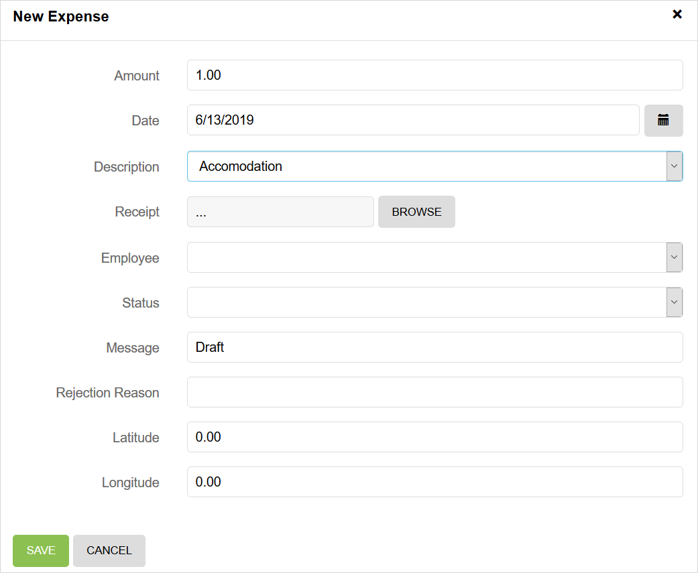

9. Click **Save**.
10. Click **Sign out**.
11. In the Selenium IDE, click the record icon to stop recording: 
12. click the **Run current test** icon. The test will fail because it can not find the element with the target `id=mxui_widget_NumberInput_1_input`.

	

	The element with the target `id=mxui_widget_NumberInput_1_input` does not exist on the page. The number in the ID is not always the same. You need to find another target selector for the same element.

13. Repeat steps 3 through 6.
14. Find a unique selector for the **Amount** field. Mendix uses CSS classes to identify page content like widgets and pop-up windows. You can use these classes in Selenium to manipulate pages and verify data. Widgets can be given a name in Mendix Studio Pro. These names appear in the HTML document as class names prefixed by `mx-name-`. For instance, a grid named `EmployeeGrid` will get a CSS class `mx-name-EmployeeGrid`. This is true for all widgets.
15. Open the **Desktop_Expense_NewEdit_Admin** page in Studio Pro:

	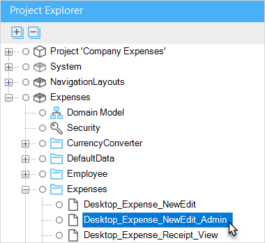

16. Select the **Amount** field:

	 

	The **Name** property of the **Amount** field is **textBox6**. Every element will automatically get the CSS class `mx-name-[Name]`, so the amount field will have the CSS class `mx-name-textBox6`.

	

17. Enter `.mx-name-textBox6` in your developer tools and press <kbd>Enter</kbd>. There is only one matching node, so you have now found a unique selector for the **Amount** field.
18. Change the value `id=_mxui_widget_NumberInput_1_input` into `css=.mx-name-textBox6 input` in Selenium. Because it is an input field, you have to add *input* to the target. 
19. Click **Run current test case**. The test will fail because it can not find the element with the target `css=.mx-name-textBox6 input`, because the page with the element has not been loaded yet.
20. Switch the speed control to slow. The speed control determines how fast your test script runs. By default, the speed control is set to the maximum speed. When the test runs too fast, it is possible that the test starts asserting for an element on the page even before the page is fully loaded by the browser. Try to run your test script as fast as possible.

	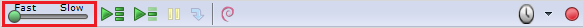

21. Click **Run current test case**. The test will fail because it can not find the element with the target `css=input.form-control.mx-focus`.
22. Open the **Desktop_Expense_NewEdit_Admin** page in Studio Pro.
23. Click the **Description** box. The name of this box is `referenceSelector1` and it will have the CSS class `mx-name-referenceSelector1`.
24. Enter `.mx-name-referenceSelector1` in your developer tools and press <kbd>Enter</kbd>. Two elements should be found: one in the pop-up window and one on the page in the background. To retrieve the element of the active page, you need to add `.mx-window-active` to the target.
25. Enter `.mx-window-active .mx-name-referenceSelector1` in your developer tools and press <kbd>Enter</kbd>. There should only be one matching node, so you have now found a unique selector for the **Type** box. 
26. Change the value `id=mxui_widget_ReferenceSelector_2_input` into `css=.mx-window-active .mx-name-referenceSelector1 select` in Selenium. Because it is a dropdown list, you have to add *select* to the target.
27. Click **Run current test case**. The test will pass.

	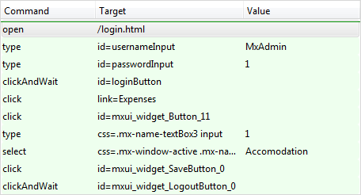

Congratulations! You have just created your second automated test.

{}
Some widgets, like a grid or a list view, can show multiple items. Every item has the CSS class `mx-name-index-[indexNumber].` The index number starts at 0.
{}

