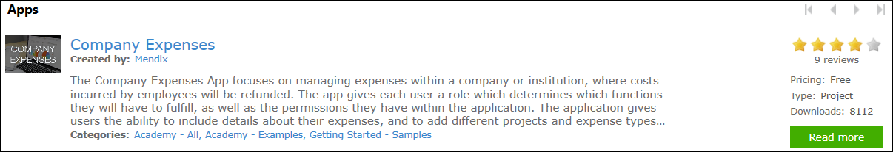

## 1 Introduction

Selenium IDE is a Firefox plugin which records and plays back user interactions with the browser. 

**After using this how-to, you will know how to do the following:**

* Record test scripts with Selenium IDE
* Find unique CSS selectors with FirePath

## 2 Prerequisites

Before starting with this how-to, make sure you have completed the following prerequisite:

* Download and install [Firefox](https://www.mozilla.org/nl/firefox/new/)
* Download and install [Selenium IDE](https://addons.mozilla.org/en-US/firefox/addon/selenium-ide/) (when Selenium IDE is installed, it is then available as a Firefox plugin)
* Install the Firefox add-on [Firebug](https://addons.mozilla.org/en-US/firefox/addon/firebug/)
* Install the Firefox add-on [FirePath](https://addons.mozilla.org/en-US/firefox/addon/firepath/)

### 2.1 Software Versions in This How-To

| Software | Version Used in This How-To |
| --- | --- |
| Firefox | 50.1.0 |
| Selenium IDE | 2.9.1.1 |
| Firebug | 2.0.18 |
| FirePath | 0.9.7.1.1 |

{}

All images, names, and steps in this how-to are based on these versions. When using other versions, the images and/or names on your screen may be different than what is used in this how-to.

{}

## 3 Installing and Running the Company Expenses App

Follow these steps to install and run the Company Expenses app:

1. Open the Mendix Modeler.
2. Click the App Store icon in the top toolbar:

    

3. Search for *Company Expenses*.
4. Click **Company Expenses**:

    

5. Click **Download** and then **OK**. This will open the Company Expenses app in the Modeler.

    

6. Click **Run Locally** (F5).
7. Click **View** (F9).

## 4 Create Your First Automated Test

To create an automated test by using the record button in Selenium IDE, follow these steps:

1. Open **Firefox** and go to `http://localhost:8080/index.html`.
2. Click the Selenium IDE (DEFAULT RECORDING) icon:

    

3. Enter the following login details on the Mendix login screen:

    Field | Value
    --- | ---
    Username | Mxadmin
    Password | 1

    

4. Click **Sign in**.
5. Click **Sign out**.
6. Click record icon in Selenium IDE:

    

    Selenium IDE should look like this:

    

7. Click the "run current test case" icon:

    

    Every passed test step will be marked green:

    

Well done! You have just created your first automated test!

### 4.1 Using Firebug and FirePath to Locate the Element

Selenium IDE can be used to record tests scripts, but these scripts usually need to be edited before you can use them (for example, HTML tag IDs are generated dynamically and will be different with each run of the same page). 

In this section, you will edit some test steps by using Firebug and FirePath to find the right locator. Locators tell Selenium IDE which GUI elements (for example, buttons, text boxes, data grids) it needs to operate on. To make it easier to create a locator for Mendix elements, `mx-name` is added to the class of an element. When the position of an element in the form changes, there is no need to rewrite the script.

1. Press <kbd>CTRL</kbd> + <kbd>N</kbd> to create a new test case in Selenium IDE.
2. Click the record icon.
3. Enter the following login details on the Mendix login screen:

    Field | Value
    --- | ---
    Username | MxAdmin
    Password | 1

4. Click **Sign in**.
5. Click the **Expenses** tab.
6. Click **New Expense**.
7. Enter *1* in the **Amount** field.
8. Select **Accomodation** in the **Description** box:

    

9. Click **Save**.
10. Click **Sign out**.
11. Click the record icon in Selenium IDE to stop recording.
12. Click **Run current test case**. The test will fail because it can not find the element with the target `id=mxui_widget_NumberInput_1_input`.

    
    
    The element with the target `id=mxui_widget_NumberInput_1_input` does not exist on the page. The number in the ID is not always the same. You need to find another target selector for the same element with the use of Firebug and FirePath.

13. Repeat steps 3 through 6.
14. Click the Firebug icon in the Firefox toolbar:

    

15. Click the **FirePath** tab.

    

16. Click the **Inspect Element** button:

    

17. Click the **Amount** field:

    

    The CSS selector `mxui_widget_NumberInput_1_input` does not exist. We need to find a unique selector for the **Amount** field. Mendix uses CSS classes to identify page content like widgets and pop-up windows. You can use these classes in Selenium to manipulate pages and verify data. Widgets can be given a name in the Mendix Modeler. These names appear in the HTML document as class names prefixed by `mx-name-`. For instance, a grid named `EmployeeGrid` will get a CSS class `mx-name-EmployeeGrid`. This is true for all widgets.

18. Open the **Desktop_Expense_NewEdit_Admin** page in the Modeler:

    

19. Select the **Amount** field:

     

    The **Name** of the Amount field is **textBox6**. Every element will automatically get the CSS class `mx-name-[Name]`, so the amount field will have the CSS class `mx-name-textBox6`.

    

20. Enter `.mx-name-textBox6` in FirePath and press <kbd>Enter</kbd>.

    

    There is only one matching node, so you have now found a unique selector for the **Amount** field.
21. Change the value `id=_mxui_widget_NumberInput_1_input` into `css=.mx-name-textBox6 input` in Selenium. Because it is an input field, you have to add *input* to the target. 
22. Click **Run current test case**. The test will fail because it can not find the element with the target `css=.mx-name-textBox6 input`, because the page with the element has not been loaded yet.
23. Switch the speed control to slow. The speed control determines how fast your test script runs. By default, the speed control is set to the maximum speed. When the test runs too fast, it is possible that the test starts asserting for an element on the page even before the page is fully loaded by the browser. Try to run your test script as fast as possible.

    
    
24. Click **Run current test case**. The test will fail because it can not find the element with the target `css=input.form-control.mx-focus`.
25. Open the **Desktop_Expense_NewEdit_Admin** page in the Modeler.
26. Click the **Description** box. The name of this box is `referenceSelector1` and it will have the CSS class `mx-name-referenceSelector1`.
27. Enter `.mx-name-referenceSelector1` in FirePath and press <kbd>Enter</kbd>. Two elements are found: one in the pop-up window and one on the page in the background. To retrieve the element of the active page, you need to add `.mx-window-active` to the target.
28. Enter `.mx-window-active .mx-name-referenceSelector1` in FirePath and press <kbd>Enter</kbd>. There is only one matching node, so you have now found a unique selector for the **Type** box. 
29. Change the value `id=mxui_widget_ReferenceSelector_2_input` into `css=.mx-window-active .mx-name-referenceSelector1 select` in Selenium. Because it is a dropdown list, you have to add *select* to the target.
30. Click **Run current test case**. The test will pass.

    

Congratulations! You have just created your second automated test.

{}

Some widgets, like a grid or a list view, can show multiple items. Every item has the CSS class `mx-name-index-[indexNumber].` The index number starts at 0.

{}

### 4.2 Installing the Selenium Mendix Locator Builder Plugin

Manually editing a lot of test steps is time-consuming, so Marcel Groenweg created a Selenium plugin for Mendix test recording. When you add the plugin to Selenium IDE, the test steps will have `mx-name-` CSS selectors rather than the Selenium default. It will also look for parent grids and list views and will add selectors to get the correct row by its index. This reduces the time spent on editing the test steps.

To install the Selenium Mendix Locator Builder plugin, follow these steps:

1. Go to [https://github.com/mgroeneweg/SeleniumMendixLocatorBuilder](https://github.com/mgroeneweg/SeleniumMendixLocatorBuilder).

2. Click **Download ZIP**:

    

3. Unzip `SeleniumMendixLocatorBuilder-master.zip` and open Selenium IDE.
4. Go to **Options** > **Options**.
5. Click **Browse** to select a Selenium IDE extension.
6. Select **MendixNameLocatorBuilder.js** from the extracted folder.
7. Click **Open** and then click **OK**.
8. Restart Selenium IDE.
9. Click **Options** > **Options**.
10. Select the **Locator Builders** tab.
11. Drag **css:MendixName** to the top.
12. Restart Selenium IDE.

Now the test steps will have `mx-name-` CSS selectors rather than the Selenium default.

### 4.3 Creating an Automated Test with the Selenium Mendix Locator Builder Plugin

1. Open **Selenium IDE**.
2. Enter the following login details on the Mendix login screen:

    Field | Value
    --- | ---
    Username | Mxadmin
    Password | 1

3. Click **Sign in**.
4. Select the **Expenses** tab.
5. Click **New Expense**.
6. Enter *1* in the **Amount** field.
7. Select **Accomodation** in the **Description** box:

    
    
8. Click **Save**.
9. Click **Sign out**.
10. Click the record icon in Selenium IDE to stop recording.
11. Click **Run current test case**. The test will fail because it can not find the element with the target `css=.mx-window-active .mx-name-textBox6 input`. The element can't be found, because the page with the element has not been loaded yet.

    

12. Switch the speed control to slow. The speed control determines how fast your test script runs. By default, the speed control is set to the maximum speed. When the test runs too fast, it is possible that the test starts asserting for an element on the page even before the page is fully loaded by the browser. Try to run your test script as fast as possible.

    

13. Click **Run current test case**. The test will pass.

    

## 5 Related Content

* [How to Create Automated Tests with TestNG](create-automated-tests-with-testng)
* [How to Test Microflows Using the UnitTesting Module](testing-microflows-using-the-unittesting-module)
* [How to Find the Root Cause of Runtime Errors](../monitoring-troubleshooting/finding-the-root-cause-of-runtime-errors)
* [How to Clear Warning Messages in Mendix](../monitoring-troubleshooting/clear-warning-messages)
* [How to Test Web Services Using SoapUI](testing-web-services-using-soapui)
* [How to Monitor Mendix Using JMX](../monitoring-troubleshooting/monitoring-mendix-using-jmx)
* [How to Debug Java Actions Remotely](../monitoring-troubleshooting/debug-java-actions-remotely)
* [How to Log Levels](../monitoring-troubleshooting/log-levels)
* [How to Debug Java Actions](../monitoring-troubleshooting/debug-java-actions)

Learn more about this topic using the following helpful link:

* [Selenium IDE Documentation](http://docs.seleniumhq.org/docs/02_selenium_ide.jsp)
