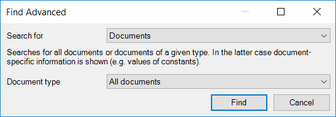
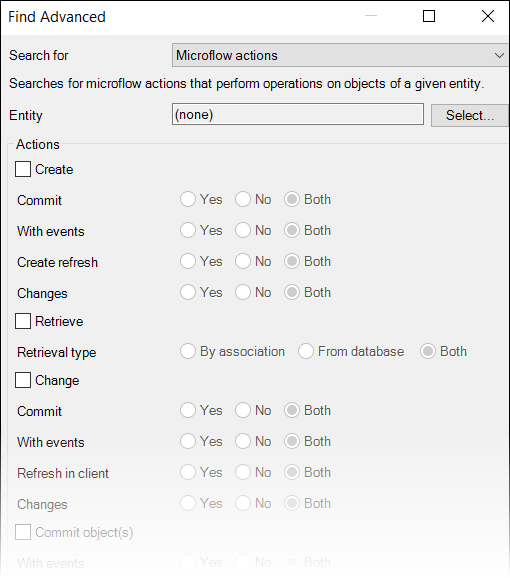
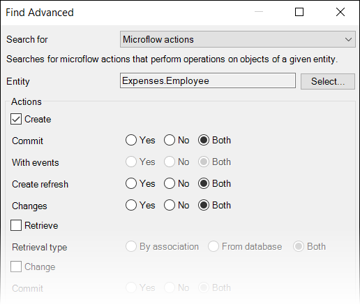
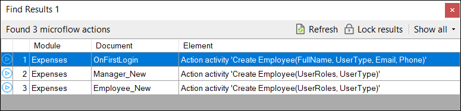

## 1 Introduction

Mendix has comprehensive functionality to find changes made to several subjects in the application. This how-to will describe how to find changes made in objects based on a certain activity.

## 2 Finding Object Activities

The following steps will explain how to find certain activities that are used in microflows, to objects.

1.  In the top toolbar of the Desktop Modeler, click **Edit** > **Find** Advanced (or press <kbd>Ctrl</kbd>+<kbd>Shift</kbd>+<kbd>F</kbd>.
2.  This dialog box will appear:
    
3.  For **Search for**, select **Microflow actions**, and this dialog box will appear:
    
4.  Select the entity for which you want to search for object activities, and click **Find**.
    
5.  See the results of in the **Find Results** pane:
    

