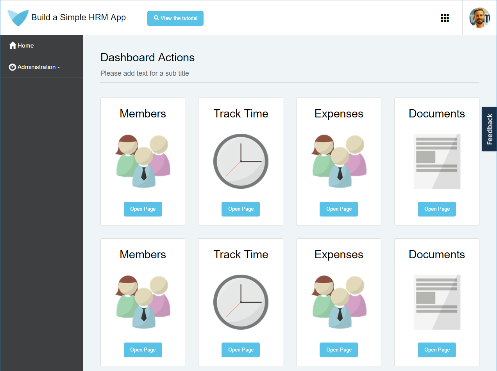

## 1 Introduction

This how-to takes you through the basics of development in Mendix and teaches you how to build a simple human resources management (HRM) app.

**This how-to will teach you how to do the following:**

* Create an app
* Manage an app
* Deploy an app

## 2 Prerequisite

To start this tutorial, create a new instance of the **Build an HR Management app** by downloading the app from the [Mendix App Store](https://appstore.home.mendix.com/link/app/61166/). After selecting the location where you will download the app project, the Desktop Modeler Version Selector will be opened. You need to select the Desktop Modeler version here in which you will open the app project.

{}
This tutorial was written for use on [Desktop Modeler 7.2.0](https://appstore.home.mendix.com/link/modeler/7.2.0). You should use that version for best results.
{}

## 3 Deploying Your App

To deploy your app to the Mendix Cloud so that others can view and test it, follow these steps:

1. Click **Run** to deploy your app to a Free App deployment environment:

    

2. Click **View** to open the app in your browser:

    

Excellent! Check out the app you just deployed.

Great work. Now you can move on to the second how-to for creating a simple HRM app: [Build a Simple HRM Step App 2: Perform the First Steps in Building a Rich GUI](build-a-simple-hrm-app-2-first-steps-in-building-a-rich-gui).

## 4 Related Content

* [Build a Simple HRM App Step 2: Perform the First Steps in Building a Rich GUI](build-a-simple-hrm-app-2-first-steps-in-building-a-rich-gui)
* [Build a Simple HRM App Step 3: Show Related Data in the GUI](build-a-simple-hrm-app-3-show-related-data-in-the-gui)
* [Build a Simple HRM App Step 4: Enrich the GUI with Filter Options](build-a-simple-hrm-app-4-enrich-the-gui-with-filter-options)
* [Build a Simple HRM App Step 5: Smarten Up Your App with Business Logic](build-a-simple-hrm-app-5-smarten-up-your-app-with-business-logic)
* [Create and Deploy Your First App](../modeling-basics/create-and-deploy-your-first-app)
* [Testing Microflows Using the UnitTesting Module](../testing/testing-microflows-using-the-unittesting-module)
* [How to Manage Sprints and Stories](/developerportal/howto/managing-your-application-requirements-with-mendix)
