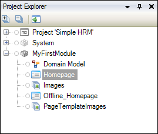

## 1 Introduction

This how-to takes you through the basics of development in Mendix and teaches you how to build a simple human resources management (HRM) app.

**This how-to will teach you how to do the following:**

* Create an app
* Manage an app
* Deploy an app

## 2 Prerequisites

Before starting with this how-to, make sure you have completed the following prerequisite:

* Create a [Mendix account](https://www.mendix.com/try-now/?utm_source=documentation&utm_medium=community&utm_campaign=signup)

## 3 Creating Your App

To create your app, follow these steps:

1. Go to the [Mendix Developer Portal](http://home.mendix.com) and log in if you are not already logged in.

    {}The Mendix Developer Portal is the central starting point for using, sharing, and building apps.{}
2. Make sure you have downloaded the latest Desktop Modeler from the [Mendix App Store](https://appstore.home.mendix.com/link/modelers/) and installed it. Note that this tutorial was created with Mendix Desktop Modeler 7.2.0.
3. Go to the [Build an HR Management app](https://appstore.home.mendix.com/link/app/61166/) in the Mendix App Store and click **Download**.
4. Open the app project with the Mendix **VersionSelector**. Note that this tutorial was created with Desktop Modeler 7.2.0.
5. Choose a directory for extracting the app project package.
6. If the **Version Not Found** dialog box opens, select the Desktop Modeler version with which you want to open the app project (it is best to use the latest version you have installed), and click **Open with selected Modeler version**. When the Desktop Modeler opens, select **Convert in-place** for the app project to open in your selected Modeler version.

When your app is loaded into the Desktop Modeler, you will find the **Project Explorer** pane on the left side. This pane lists all of the developer content of your app. You can add pages, logic, and other content here.

## 4 Deploying Your App

To deploy your app to the Mendix Cloud so that others can view and test it, follow these steps:

1. Click **Run** to deploy your app to a Free App deployment environment:

    

2. Click **View** to open the app in your browser:

    

Excellent! Check out the app you just deployed.

Great work. Now you can move on to the second how-to for creating a simple HRM app: [Build a Simple HRM Step App 2: Perform the First Steps in Building a Rich GUI](build-a-simple-hrm-app-2-first-steps-in-building-a-rich-gui).

## 5 Related Content

* [Build a Simple HRM App Step 2: Perform the First Steps in Building a Rich GUI](build-a-simple-hrm-app-2-first-steps-in-building-a-rich-gui)
* [Build a Simple HRM App Step 3: Show Related Data in the GUI](build-a-simple-hrm-app-3-show-related-data-in-the-gui)
* [Build a Simple HRM App Step 4: Enrich the GUI with Filter Options](build-a-simple-hrm-app-4-enrich-the-gui-with-filter-options)
* [Build a Simple HRM App Step 5: Smarten Up Your App with Business Logic](build-a-simple-hrm-app-5-smarten-up-your-app-with-business-logic)
* [Create and Deploy Your First App](../modeling-basics/create-and-deploy-your-first-app)
* [Testing Microflows Using the UnitTesting Module](../testing/testing-microflows-using-the-unittesting-module)
* [How to Manage Sprints and Stories](/developerportal/howto/managing-your-application-requirements-with-mendix)
