## 1 Introduction

This is the second how-to in a series of five on how to create a simple HRM application. In this how-to, you will learn how to build pages to manage the employees in your application.

**This how-to will teach you how to do the following:**

* Create a domain model
* Build pages

## 2 Prerequisites

Before starting with this how-to, make sure you have completed the following prerequisite:

* Use the first how-to in this series: [Step 1: Create, Manage, and Deploy the App](build-a-simple-hrm-app-1-create-manage-and-deploy-the-app)

## 3 Creating a Domain Model

The domain model is a data model that describes the information in your application domain in an abstract way. It is central to the architecture of your application. The domain model consists of entities and their relations represented by associations.

To create a domain model, follow these steps:

1. Open the **Domain Model** of the **MyFirstModule** module:
2. Click **Entity** in the domain model editor to create a new entity:

    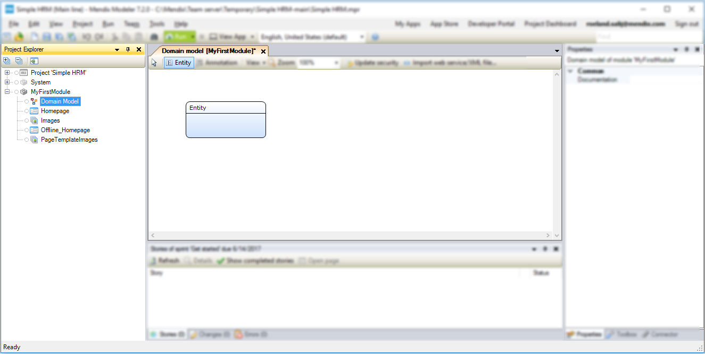
    
    For more information about entities, see [Entities](/refguide7/entities) in the Mendix Reference Guide.
3. To edit the properties of this new entity, double-click the new entity to open the properties window.
4. In the **Name** field, enter *Employee*:

    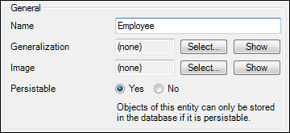

5. Click **New** to add a new attribute:

    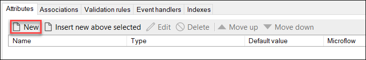
    
    For more information on attributes, see [Attributes](/refguide7/attributes) in the Mendix Reference Guide.
6. In the **Name** field, enter *Name*:

    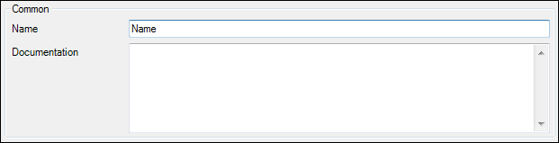

7. Select **String** as the **Type**:

    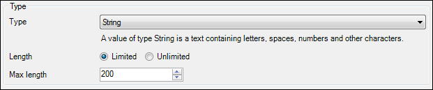
   
8. Click **OK**.
9. Repeat steps 4–7 above for the following attributes: 

   Name | Type
   --- | ---
   Address | String
   City | String
   State | String
   Phone | String
   Email | String
   DateOfBirth | Date and time

The entity will look like this:

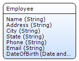

## 4 Building a Page

Pages define the end-user interface of the Mendix app. Each page is based on a layout. A page fills the "gaps" defined by a layout with widgets such as a data view and data grid.

### 4.1 Adding a Page

To add a page, follow these steps:

1. Right-click the **MyFirstModule** module and select **Add** > **Page**:

    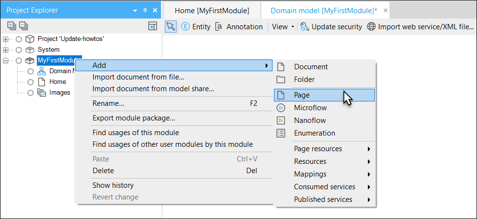

2. On the **Create Page** screen, do the following: 
    a. In the **Page name** field, enter *Employee_Overview*. 
    b. In the **Navigation layout** drop-down menu select **Sidebar_Left**, and then click **OK**.  
    c. Click **Master Detail** and then select the **Master detail big** option. 
    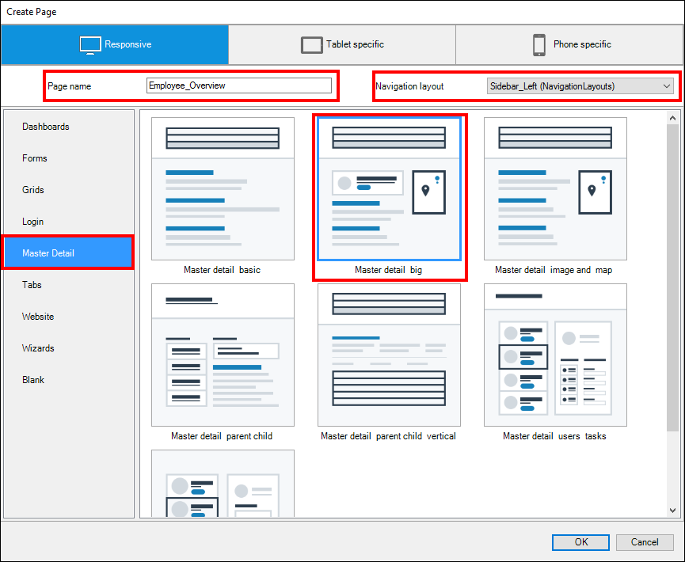

3. Click the data grid below the **Master Detail** label, and then drag the **Employee** entity from the **Connector** pane to the data grid:

    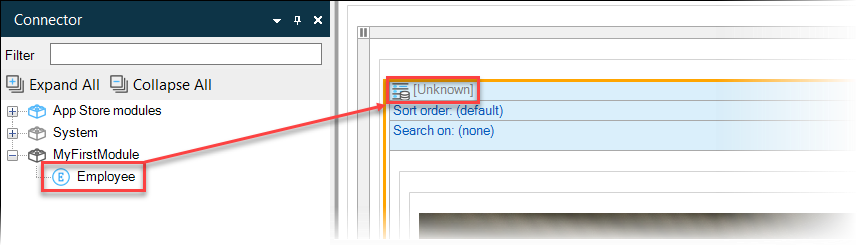

4. Clear the **Auto-Fill** option, and then click **OK**:

     

### 4.2 Adding Attributes to Your Page

To add attributes to your page, follow these steps:

1. Double-click the **Full Name** column.
2. On the **Edit Grid Column** dialog box, click **Select**:

    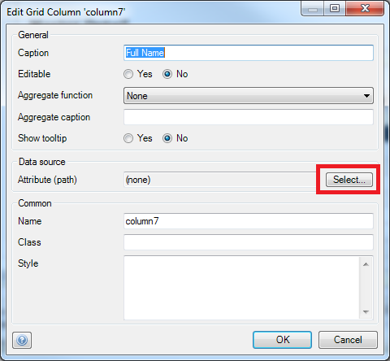 
    
3. On the **Select Attribute** dialog box, select the **Name** attribute and click **Select**:

    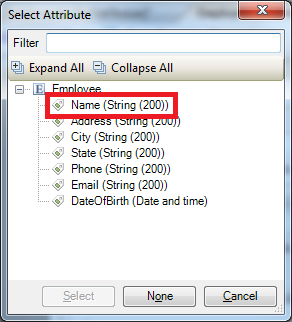
    
4. On the **Edit Grid Column** dialog box, click **OK**.
5. Repeat steps 1–4 for the following columns with the corresponding attributes:

    Caption Column | Attribute
    --- | ---
    Email | Email
    City | City

6. Double-click the first text box below the image:

    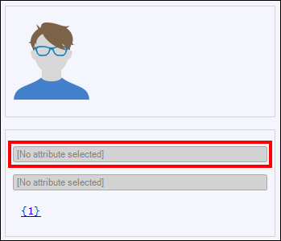
    
7. To select an attribute, click **Select**:

    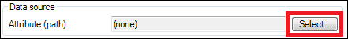 
   
8. Select the **Name** attribute, click **Select**, and then click **OK**.
9. Repeat steps 6–8 for the second text box and select the **Email** attribute.
10. Delete the element with the caption **{1}**, which represents a **Link button**:

    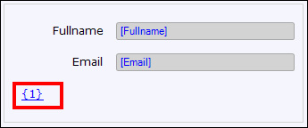
    
11. Click the **Name** text box in the **User details** container:

    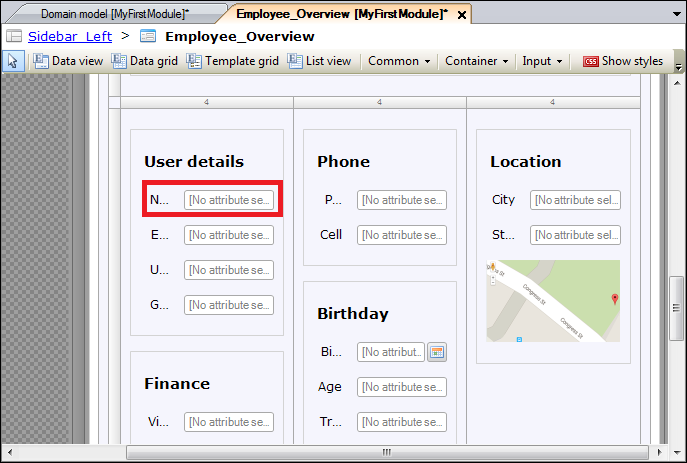 
    
12. Drag the **Name** attribute from the **Connector** to the **Name** field in the **User details** container:

    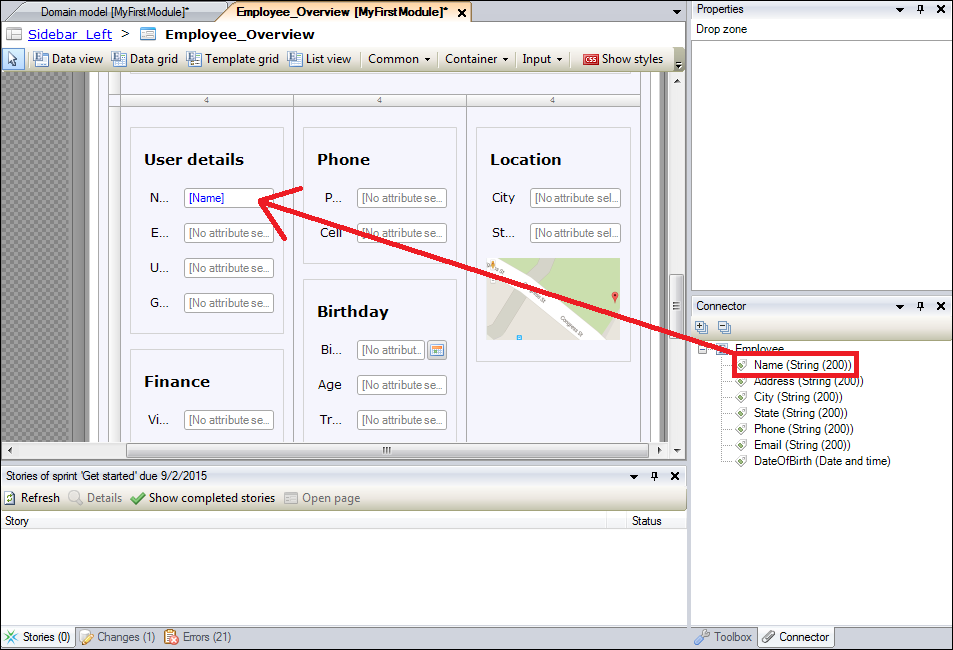 
    
13. Drag the following attributes to their corresponding fields:

    Attribute | Field | Container
    --- | --- | ---
    Email | Name | User details
    Phone | Phone | Phone
    DateOfBirth | Birthday | Birthday
    City | City | Location
    State | State | Location

14. Delete the containers and input fields that are not being used:

    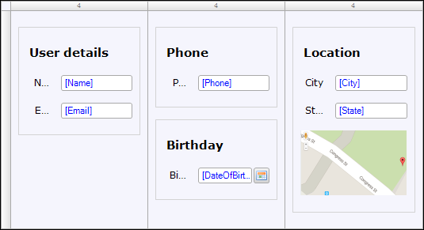 

### 4.3 Adding Buttons to Your Page

To create or delete employees, you need to add a button to the data grid. To do this, follow these steps:

1. Right-click the grid control bar of the data grid and select **Add button** > **Create**:

    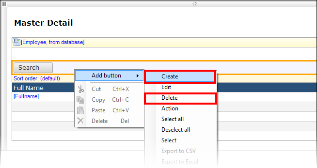 

2. Add the delete button in the same way by selecting **Add button** > **Delete**:

### 4.4 Generating a Page

To generate a page, follow these steps:

1. Right-click the **New** button and select **Generate page**:

    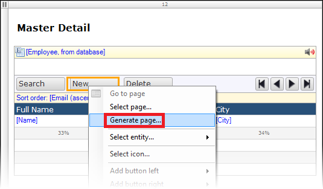 

2. On the **Create Page** screen, do the following: 
    a. In the **Page name** field, enter *Employee_NewEdit*. 
    b. Select **Form basic horizontal**. 
    c. In the **Navigation layout** drop-down menu, select **PopupLayout**. 
    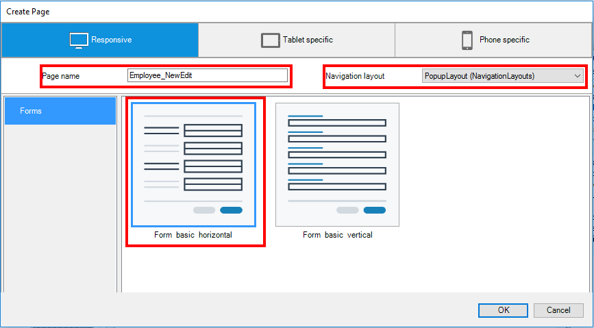 
3.  Click **OK**, and the new page will be shown in the project explorer:

    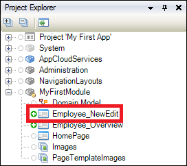

### 4.5 Creating a Menu Item for Your Page

To view a page in your app, you need to add a menu item so that you can navigate to the page. To do this, follow these steps:

1. Open the **Navigation** of the project:

    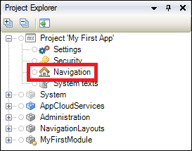 
    
2. On the **Navigation** tab, click **New item** to add a new menu item:

    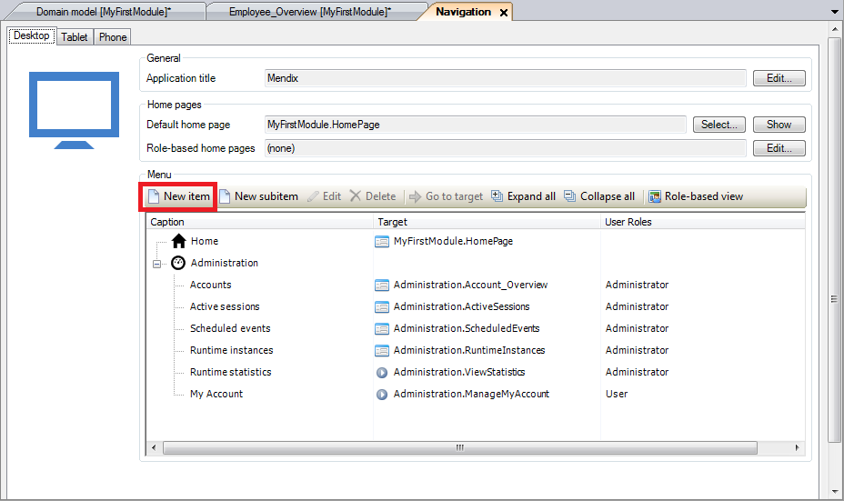 
    
3. In the **Caption** field of the **New Menu Item** dialog box, enter *Employees*.
4. Click **Select** to select a target:

    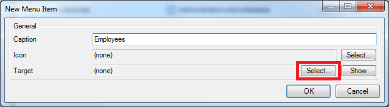
    
5. Select the **Employee_Overview** page of the **MyFirstModule** module:

    
    
6. Click **Select** and then **OK**. The employees overview page will be shown in the navigation list:

    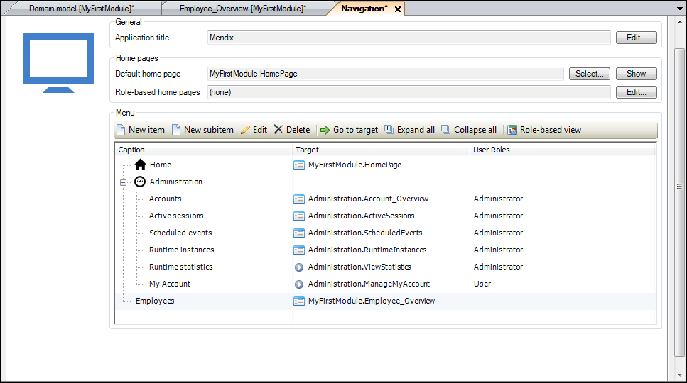 

## 5 Viewing Your App

1. Run and view your app, like you did in [Step 1: Create, Manage, and Deploy the App](build-a-simple-hrm-app-1-create-manage-and-deploy-the-app). On the left side of your app, the **Employees** menu item will be shown:

    
    
2. Click **Employees**:

    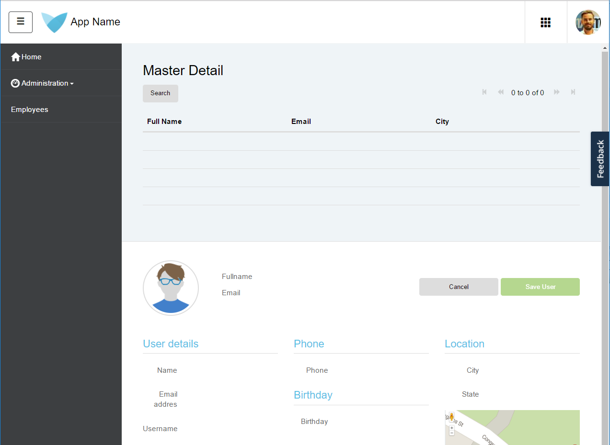

You can now add and edit employees! 

For the next step in creating a simple HRM application, see [Step 3: Show Related Data in the GUI](build-a-simple-hrm-app-3-show-related-data-in-the-gui).

## 6 Related Content

* [Step 1: Create, Manage, and Deploy the App](build-a-simple-hrm-app-1-create-manage-and-deploy-the-app)
* [Step 3: Show Related Data in the GUI](build-a-simple-hrm-app-3-show-related-data-in-the-gui)
* [Step 4: Enrich the GUI with Filter Options](build-a-simple-hrm-app-4-enrich-the-gui-with-filter-options)
* [Step 5: Smarten Up Your App with Business Logic](build-a-simple-hrm-app-5-smarten-up-your-app-with-business-logic)
* [Testing Microflows Using the UnitTesting Module](../testing/testing-microflows-using-the-unittesting-module)
