## 1 Introduction

This is the third how-to in a series of five on how to create a simple HRM application. In this how-to, you will expand your app with management pages for departments and divide employees into departments.

**This how-to will teach you how to do the following:**

* Create a relation between two entities

## 2 Prerequisites

Before starting with this how-to, make sure you have completed the following prerequisite:

* Complete the second how-to in this series: [Build a Simple HRM App Step 2: Perform the First Steps in Building a Rich GUI](build-a-simple-hrm-app-2-first-steps-in-building-a-rich-gui).

## 3 Expanding Your App

In this section, you will create an association between two entities and use the attributes of one entity in the pages of another entity.

### 3.1 Creating an Entity

To create an entity, follow these steps:

1. Open the **Domain Model** of the MyFirstModule module.
2. Click **Entity** to create a new entity, and in the **Name** field, enter *Department*.
3. Click **New** to add a new attribute, and in the **Name** field, enter *Name*.
4. Select **String** as the **Type**, and click **OK**.
5. Repeat steps 3–4 for the following attribute:

    Name | Type
    --- | ---
    Description | String

The entity will look like this:

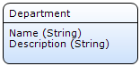

### 3.2 Creating an Association

To create an association, click the border of the **Employee** entity and drag a line to the **Department** entity:

This creates an association between the two entities so that they can use each other's data. To learn more about associations, see [Associations](/refguide7/associations) in the Mendix Reference Guide.

### 3.3 Creating Pages for the Department Entity

To create pages for the department entity, follow these steps:

1. Right-click the **MyFirstModule** module and select **Add** > **Page**.
2. On the **Create Page** screen, do the following: 
    a. In the **Page name** field, enter *Department_Overview*. 
    b. Click **Grids** and select **Datagrid basic**. 
    c. In the **Navigation layout** drop-down menu, select **Sidebar_Left**, and then click **OK**. 
    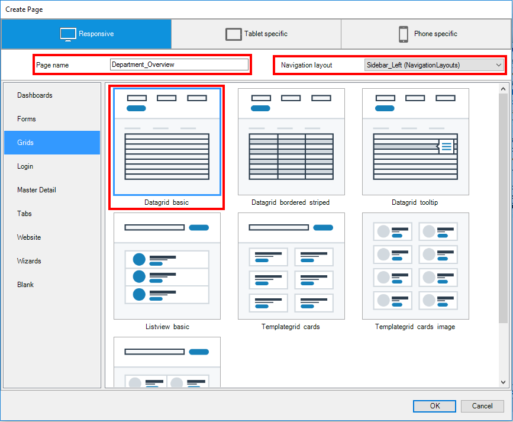
3. Right-click the data grid and select the **Department** entity available in **MyFirstModule**.
4. Select the **Auto-Fill** option and click **OK**.
5. Select and right-click the **New** button and select **Generate page**.
6. On the **Create Page** screen, do the following: 
    a. In the **Page name** field, enter *Department_NewEdit*. 
    b. In the **Navigation layout** drop-down menu, select **PopupLayout**, and then click **OK**. 
    c. Select **Form basic horizontal**.
    
### 3.4 Adding Department Attributes to the Employee Overview Page

To add department attrbitues to the Employee Overview page, follow these steps:

1. Open the **Employee_Overview** page of the **Responsive** module.
2. Right-click the **City** column and select **Add column right**:

    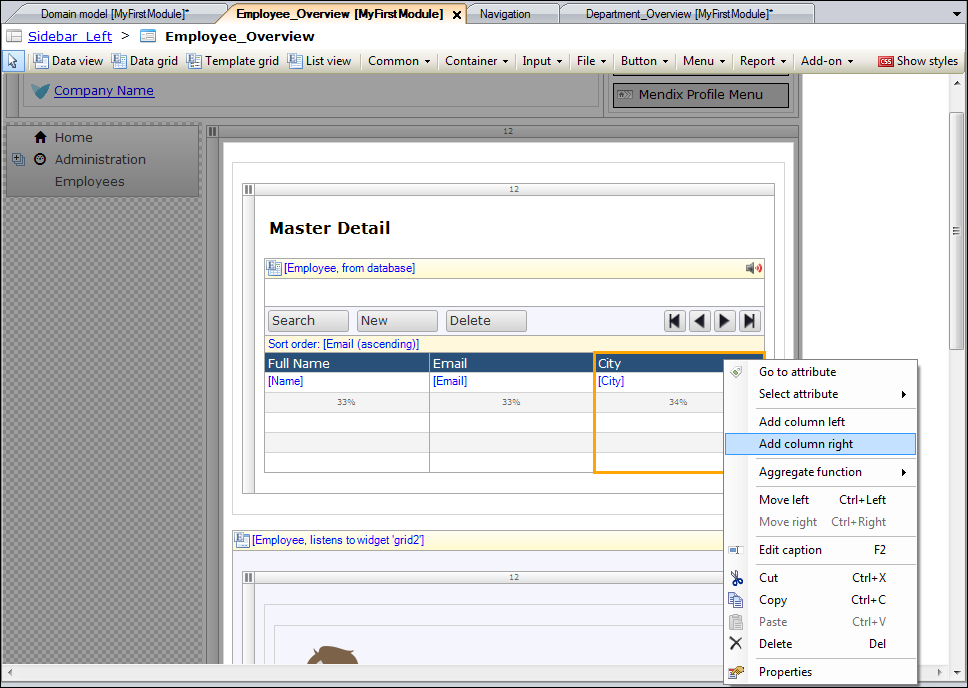
    
3. Change the caption of the column to *Department*.
4. Expand the **Employee_Department** association in the **Connector**, and then expand the **Department** entity.
5. Drag the **Name** attribute of the **Department** entity from the **Connector** to the **Department** column on the data grid:

    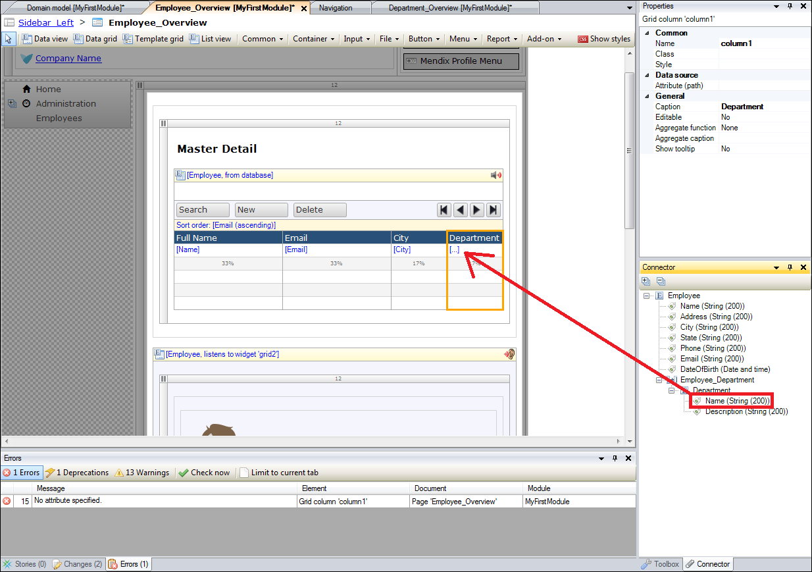
    
6. Right-click the **Master Detail** data grid and select **Reset column widths**:

    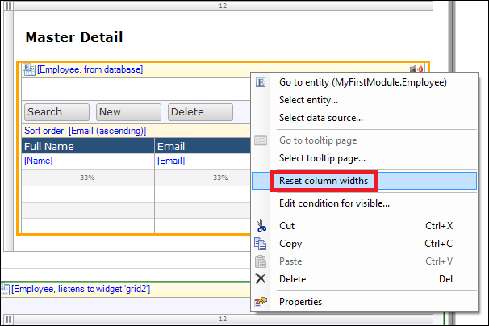
    
7. Click **Input** and select **Reference selector**:

    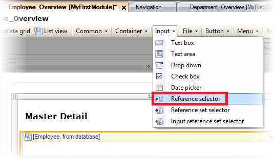
    
8. Add the reference selector below the **Email** field in the **User details** container:

    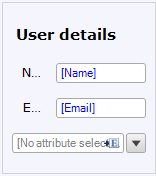
    
9. Drag the **Name** attribute of the **Department** entity from the connector to the new reference selector:

    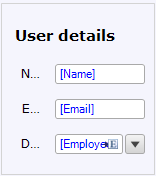 

    The reference selector will now enable selecting a department while editing an employee.
    
10. Open the **Employee_NewEdit** page of the **Responsive** module.
11. Click **Input** and then click **Reference selector**.
12. Add the reference selector beneath the **Date of Birth** field:

    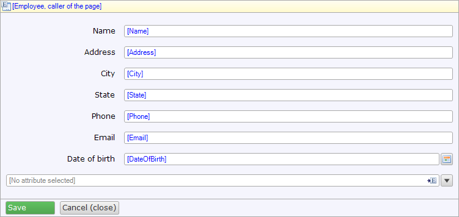
    
13. Drag the **Name** attribute of the **Department** entity from the **Connector** to the new reference selector:

    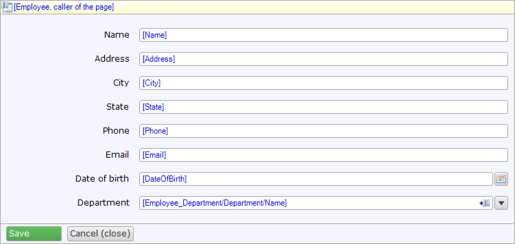

The reference selector now allows you to select a department while creating an employee.

### 3.5 Adding the Department Overview Page to the Navigation

To view a page in your app, you need to add a menu item so you can navigate to the page. To do this, follow these steps:

1. Open the **Navigation** of the project.
2. Click **New item** to add a new menu item.
3. In the **Caption** field, enter *Departments*.
4. Select the **Department_Overview** page of the **MyFirstModule** module, click **Select**, and then click **OK**.

    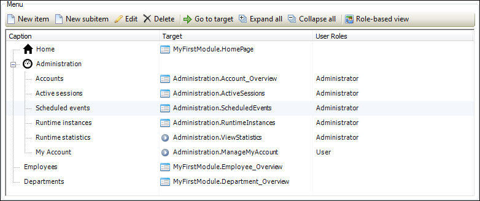  

## 4 Viewing Your App

1. Click **Run** and then click **Save and continue**.
2. Click **View**. On the left side of your app, the **Departments** menu item is shown:

    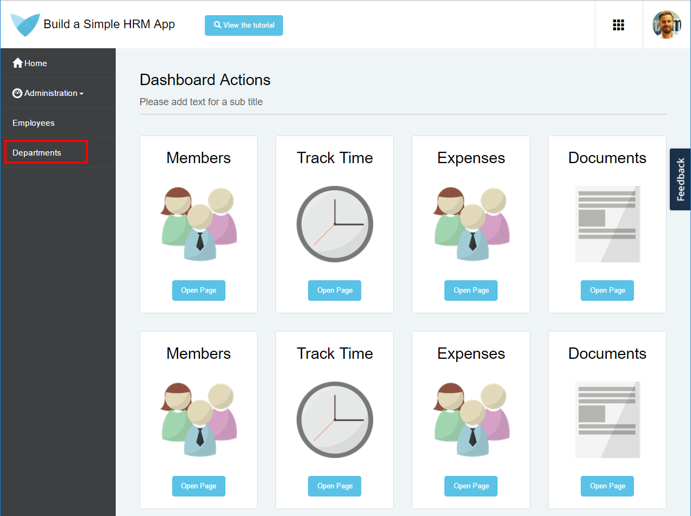
    
3. Click **Departments**, and then click **NEW** to add a new department:

    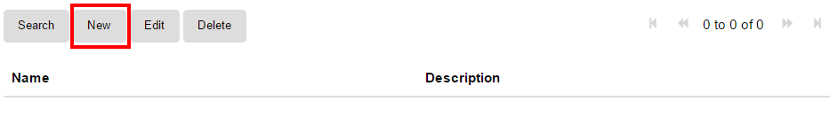
    
4. In the **Name** field of the **Edit Department** dialog box, enter *Marketing*, then click **SAVE**:

    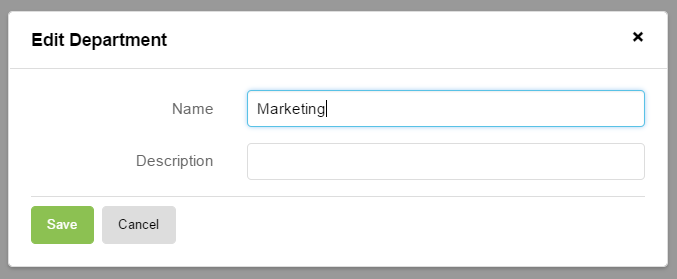
    
5. Repeat steps 3–4 for the *Sales* department:

    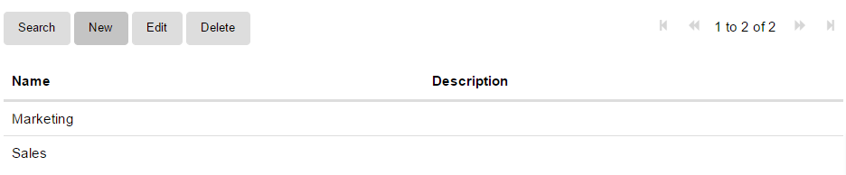
    
6. Click **Employees** in the navigation list, and then click **NEW** to add a new employee.
7. In the **Department** drop-down menu (where the created departments are shown), select **Marketing**:

    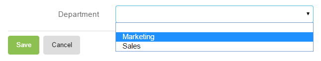
    
8. Enter the following data in the other fields:

    Name | Address | City | State | Phone | Email | Date of birth
    --- | --- | --- | --- | --- | --- | ---
    Thomas Shelby | 50 Pinfold St | Birmingham | West Midlands | +12345678 | thomas@shelby.com | 5/25/1976
    
9. Click **SAVE**:

    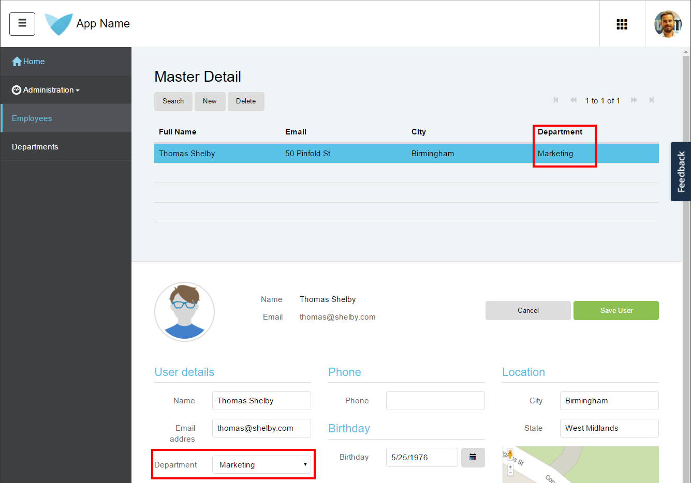
    
You can now see the selected department in the Employee Overview page.

To continue creating your simple HRM app, see [Build a Simple HRM App Step 4: Enrich the GUI with Filter Options](build-a-simple-hrm-app-4-enrich-the-gui-with-filter-options).

## 5 Related Content

* [Build a Simple HRM App Step 1: Create, Manage, and Deploy the App](build-a-simple-hrm-app-1-create-manage-and-deploy-the-app)
* [Build a Simple HRM App Step 2: Perform the First Steps in Building a Rich GUI](build-a-simple-hrm-app-2-first-steps-in-building-a-rich-gui)
* [Build a Simple HRM App Step 4: Enrich the GUI with Filter Options](build-a-simple-hrm-app-4-enrich-the-gui-with-filter-options)
* [Build a simple HRM App Step 5: Smarten Up Your App with Business Logic](build-a-simple-hrm-app-5-smarten-up-your-app-with-business-logic)
* [Create and Deploy Your First App](../modeling-basics/create-and-deploy-your-first-app)
* [How to Build a Simple HRM App](build-a-simple-hrm-app)
* [Testing Microflows Using the UnitTesting Module](../testing/testing-microflows-using-the-unittesting-module)
