## 1 Introduction

This is the fourth how-to in a series of five on how to create a simple HRM app. In this how-to, you will enrich the user interface by adding filter options.

**This how-to will teach you how to do the following:**

* Create an enumeration
* Build a search field

## 2 Prerequisites

Before you can start with this how-to, make sure you have completed the following prerequisite:

*  Complete the third how-to in this series: [Build a Simple HRM App Step 3: Show Related Data in the GUI](build-a-simple-hrm-app-3-show-related-data-in-the-gui)

## 3 Enriching the User Interface

Let's assume that you want to divide your employees into three different levels: Junior, Medior, and Senior. To achieve this, you need to use enumerations.

### 3.1 Creating an Enumeration

To create an enumeration, follow these steps:

1. Right-click the **MyFirstModule** module and select **Add** > **Enumeration**:

    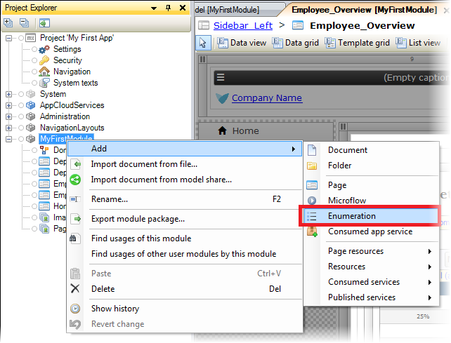

    To learn more about enumerations, see [Enumerations](/refguide7/enumerations) in the Mendix Reference Guide.
    
2. Enter *Level* in the **Name** field of the **Add Enumeration** dialog box, and then click **OK**:

    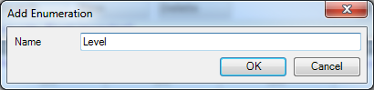 
    
3. On the **Enumeration** dialog box, click **New** to add a new enumeration value:

    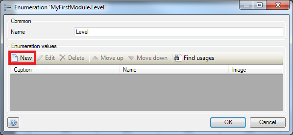
    
4. In the **Caption** field of the **Add Enumeration Value** dialog box, enter *Junior*, and then click **OK**:

    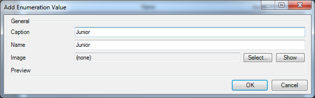 
    
5. Repeat steps 3–4 for the *Medior* and *Senior* enumeration values, and then click **OK**:

    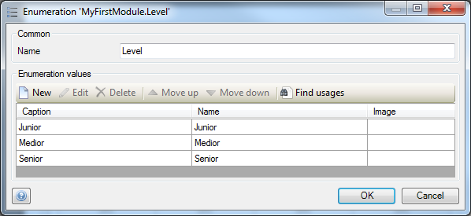

### 3.2 Adding a New Attribute of the Enumeration Type

To add a new attribute of the enumeration type, follow these steps:

1. Open the **Domain Model** of the **MyFirstModule** module.
2. Open the **Employee** entity and click **New** to add a new attribute.
3. Enter *Level* in the **Name** field.
4. Select **Enumeration** in the **Type** drop-down menu:

    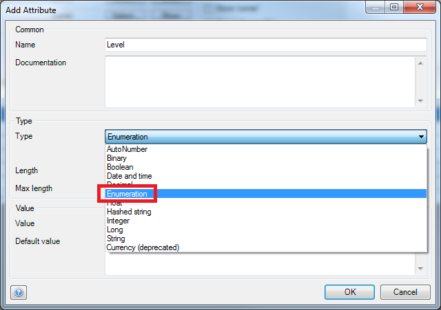 
    
5. In the **Select Enumeration** dialog box, select the **Level** enumeration of the **MyFirstModule** module, and then click **Select**:

    
    
6. Click **OK**.

### 3.3 Adding a New Attribute to the Overview Page

To add a new attribute to the overview page, follow these steps:

1. Open the **Employee_Overview** page of the **MyFirstModule** module.
2. Right-click the **Department** column and select **Add column right**.
3. Change the caption of the column to *Level*.
4. Drag the **Level** attribute of the **Employee** entity from the connector to the **Level** column on the data grid.
5. Right-click the **Master Detail** data grid.
6. Click **Reset column widths**:

    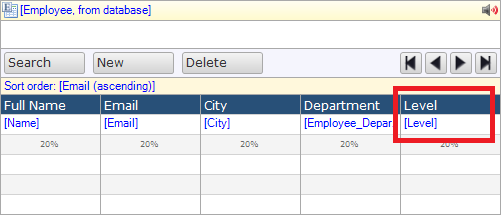

### 3.4 Adding a Search field

To add a search field, follow these steps:

1. Right-click the search bar and select **Add search field** > **Drop-down**:

     
    
2. Change the caption of the new search field to *Level*.
3. Drag the **Level** attribute of the **Employee** entity from the connector to the new search field:

    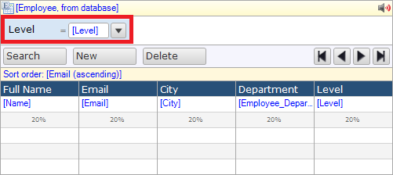 

### 3.5 Adding a Drop-Down Input Field

To add a drop-down input field, follow these steps:

1. Click **Input** and select **Drop down**:

    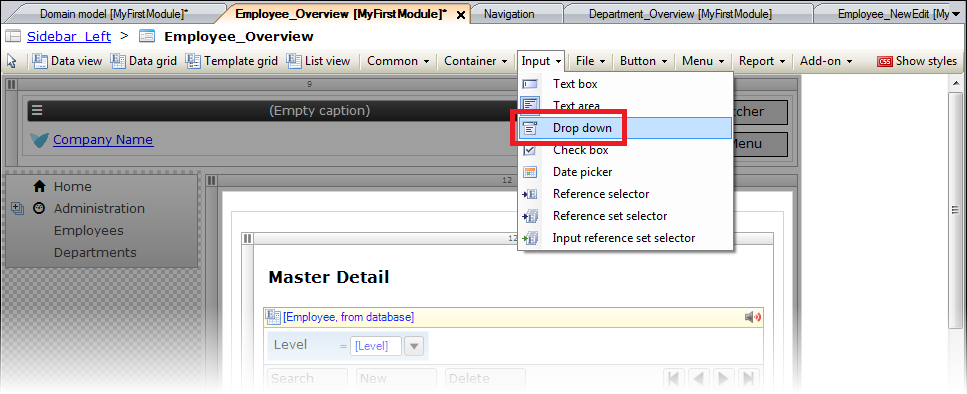 
    
2. Add the drop-down menu beneath the *Department** field in the **User details** container:

    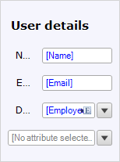 
    
3. Drag the **Level** attribute of the **Employee** entity from the **Connector** to the new drop-down menu:

    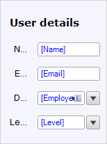
    
4. Open the **Employee_NewEdit** page of the MyFirstModule module.
5. Repeat steps 1–4 on this page:

    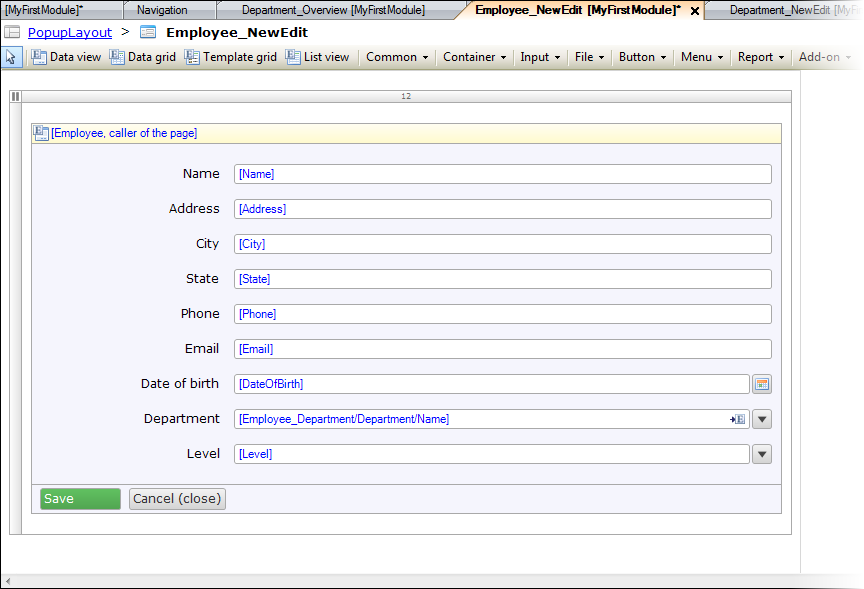 

## 4 Viewing Your App

To view your app, follow these steps:

1. Click **Run**, then **Save and continue**, and then **View App**.
2. Click **Employees** in the navigation list, and then click **NEW** to add a new employee.
3. Enter *Owen Nickelson* in the **Name** field.
4. Enter *owen@nickelson.com* in the **Email** field.
5. Enter *New York* in the **City** field.
6. Select **Sales** from the **Department** drop-down menu.
7. Select **Junior** from the **Level** drop-down menu.
8. Click **SAVE**.
9. Repeat steps 2–8 with the following details:

    Name | Email | City | Department | Level
    --- | --- | --- | --- | ---
    Harvey Specter | harvey@specter.com | New York | Sales | Medior
    Hugo Reyes | hugo@reyes.com | Sydney | Marketing | Senior
    Michael Scofield | michael@scofield.com | Chicago | Marketing | Medior

10. Click **SEARCH** to open the search bar:

    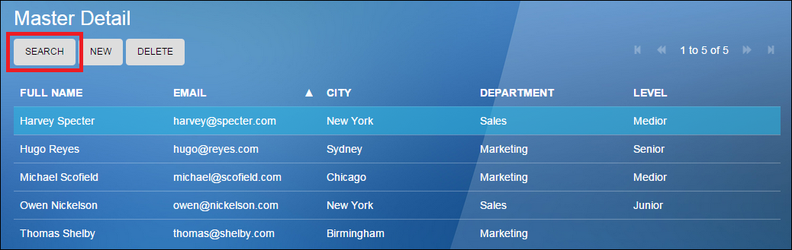 
    
11. Select the **Medior** level:

    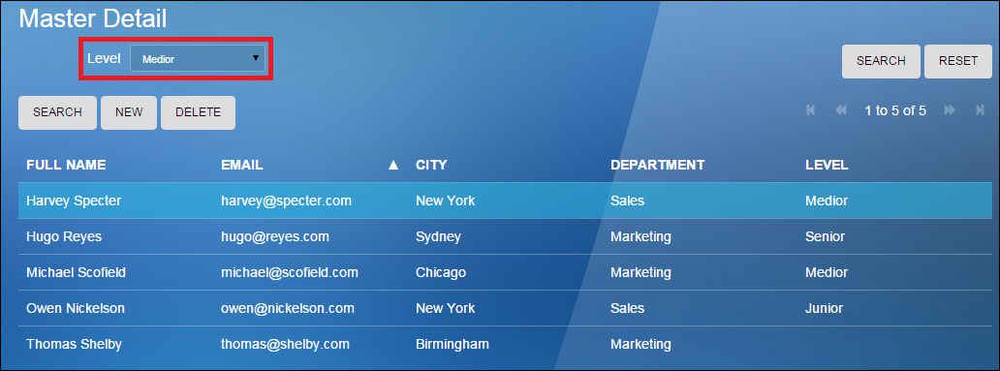
    
15. Click **SEARCH**:
    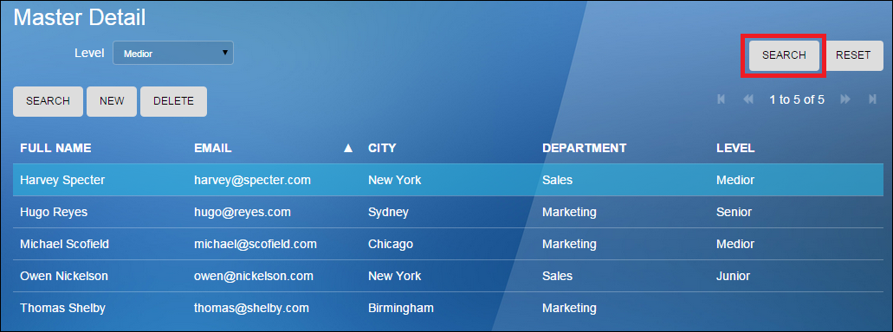
    
    Only the employees with the Medior level will be shown:
    
    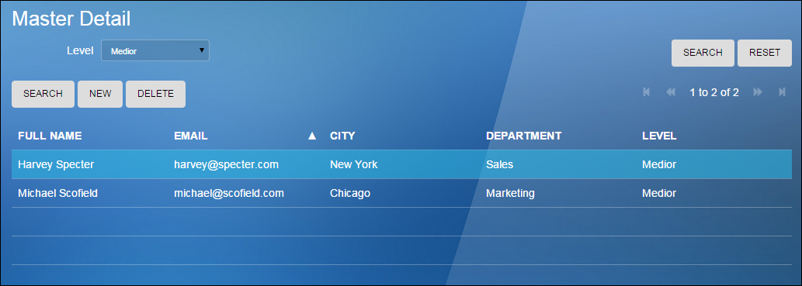

To use the final how-to for creating a simple HRM application, see [Build a Simple HRM App 5: Smarten Up Your App with Business Logic](build-a-simple-hrm-app-5-smarten-up-your-app-with-business-logic).

## 5 Related Content

* [Build a Simple HRM App Step 1: Create, Manage, and Deploy the App](build-a-simple-hrm-app-1-create-manage-and-deploy-the-app)
* [Build a Simple HRM App Step 2: First Steps in Building a Rich GUI](build-a-simple-hrm-app-2-first-steps-in-building-a-rich-gui)
* [Build a Simple HRM App Step 3: Show Related Data in the GUI](build-a-simple-hrm-app-3-show-related-data-in-the-gui)
* [Build a Simple HRM App Step 5: Smarten Up Your App with Business Logic](build-a-simple-hrm-app-5-smarten-up-your-app-with-business-logic)
* [Create and Deploy Your First App](../modeling-basics/create-and-deploy-your-first-app)
* [Testing Microflows Using the UnitTesting Module](../testing/testing-microflows-using-the-unittesting-module)
