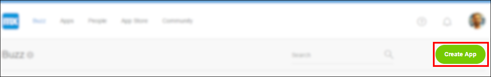
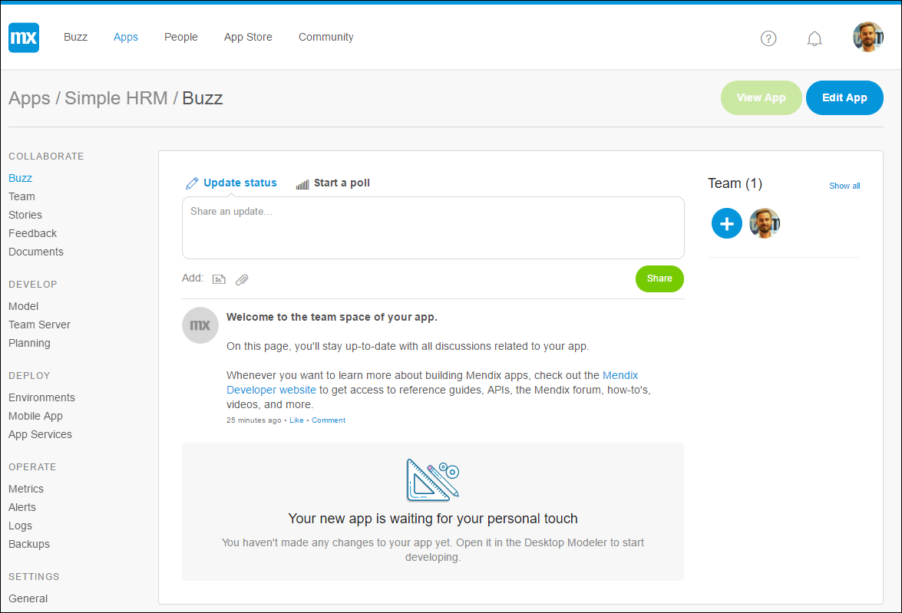

## 1 Introduction

This how-to takes you through the developing in the Mendix Web Modeler and Desktop Modeler and teaches you how to build an employee directory app.

**This how-to will teach you how to do the following:**

* Create an app in the Web Modeler
* Start editing an app in the Web Modeler
* Explore the different parts of the Web Modeler

{}

## 2 Prerequisites

Before starting with this how-to, make sure you have completed the following prerequisite:

* Create a [Mendix account](https://www.mendix.com/try-now/?utm_source=documentation&utm_medium=community&utm_campaign=signup)

## 3 Creating Your App

To create your app, follow these steps:

1. Go to the [Mendix Developer Portal](http://home.mendix.com) and log in if you are not already logged in. The Mendix Developer Portal is the central starting point for using, sharing, and building apps.
2. Click **Create App** in the top right of the screen:

     

3. On the **Tutorials** tab, select **Build an Employee Directory App**.

4. Click **Use this app**, enter a name for your application, and click **Create App**.
5. Your app is now created! When it is ready, you will land on the **Buzz** page for the app, where you can see and share ideas as well as collaborate with your team. In the **Team** section on the right, you can see your team and invite colleagues to join the app project.

    

## 4 Editing Your App

Once your app is created, you can start editing it. 

In the app's **Buzz** page in the Developer Portal, click **Edit App** to open your app in the Web Modeler. 

{}

Clicking **Edit App** will open your app for editing in the Web Modeler by default. If you want to edit your app in the Desktop Modeler, click the drop-down arrow on the right side of the **Edit App** button and select **Edit in Desktop Modeler**.

{}

## 5 Welcome to the Web Modeler

Are you ready to develop your app using the Web Modeler? Let's go briefly through the interface, and we will go into detail later in this tutorial.

On the left side of the Web Modeler is the main menu. Via the icons in this menu, you can navigate to the following locations:

* **Pages** (for the UI)
* **Navigation Document** (for the menu)
* **Domain Models** (for the data structure)
* **Microflows** (for the business logic)
* **App Settings**
* **Theme Customizer**
* **Feedback**

You can click on the Mendix logo to go back to the **Developer Portal**.

The main window of the Web Modeler is where you’ll be developing the app by editing pages, microflows, and domain models.

On the right side of the Web Modeler you can find the toolbox and properties of elements you select in the editing area. The toolbox contains widgets, building blocks, or microflow activities that you can add to your app.

Great! Now you can move on to the second how-to for creating an employee directory app in the Web Modeler: [How to Build an Employee Directory App (Advanced) Step 2: Build a Dashboard Page](build-an-employee-directory-app-advanced-2-build-a-dashboard-page).

## 6 Related Content

* [How to Build an Employee Directory App (Advanced) Step 2: Build a Dashboard Page](build-an-employee-directory-app-advanced-2-build-a-dashboard-page)
* [How to Build an Employee Directory App (Advanced) Step 3: Publish and View Your App](build-an-employee-directory-app-advanced-3-publish-and-view-your-app)
* [How to Build an Employee Directory App (Advanced) Step 4: Add Pages to the User Interface](build-an-employee-directory-app-advanced-4-add-pages-to-the-user-interface)
* [How to Build an Employee Directory App (Advanced) Step 5: Add Employee Promotion Logic](build-an-employee-directory-app-advanced-5-add-employee-promotion-logic)
* [How to Build an Employee Directory App (Advanced) Step 6: Call a REST Service](build-an-employee-directory-app-advanced-6-call-rest-service)
