## 1 Introduction

This is the sixth and final how-to in this series on creating an employee directory. In this how-to, you will learn how to call a REST service in your app.

**This how-to will teach you how to do the following:**

* Create the necessar JSON structure and import mapping
* Edit the domain model to apply data frpm the REST service
* Call the REST service in a microflow

## 2 Prerequisites

Before starting with this how-to, make sure you have completed the following prerequisite:

* Complete the fifth how-to in this series: [How to Build an Employee Directory App (Advanced)  Step 5: Add Employee Promotion Logic](build-an-employee-directory-app-advanced-5-add-employee-promotion-logic)

## 3 Creating a JSON Structure

The Zippopotamus REST service allows you to retrieve location details based on a zip code. The service can be reached at `http://api.zippopotam.us/{countrycode}/{zipcode}`, wherein the following are true:

* `{countrycode}` is a two-letter code for a country (for a list of country codes, see [Countries Supported](http://www.zippopotam.us/#where))
* `{zipcode}` is the zip code (without letters)

To create the JSON structure, follow these steps:

1. Open your browser and go to [http://api.zippopotam.us/NL/3011](http://api.zippopotam.us/NL/3011).
2. Copy the whole JSON snippet, which should be the following:

    ```
    {"post code": "3011", "country": "Netherlands", "country abbreviation": "NL", "places": [{"place name": "Centrum", "longitude": "4.3833", "state": "Noord-Brabant", "state abbreviation": "NB", "latitude": "51.4667"}]}
    ```

3. Add a new JSON structure to your app by right-clicking **MyFirstModule** (if you renamed your module, right-click the module you are working in) and selecting **Add** > **Consumed services** > **JSON structure** (keep the name as **JSON_structure**).
4. Paste the JSON snippet in the **JSON snippet** box.
5.  Click **Refresh**. With the refresh, the JSON snippet will be structured:

    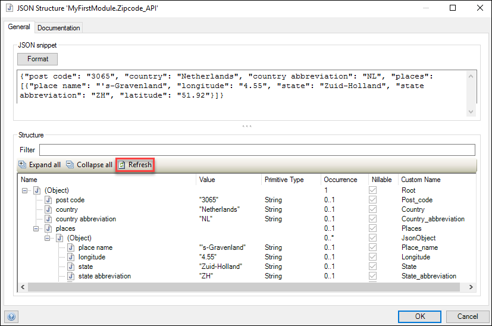

6. Click **OK**.

## 4 Creating an Import Mapping

An import mapping specifies how the JSON relates to entities. You will generate those entities here, but generally you can map the JSON to any entity you like.

To create an import mapping, follow these steps:

1. Create a new import mapping by right-click your module and selecting **Add** > **Consumed services** > **Import mapping** (keep the name as **Import_mapping**).
2. Click the radio button for **JSON structure** and then click **Select**.
3. Double-click **JSON_structure**.
4. Click **Expand all** and then **Check all** to select all the elements:

    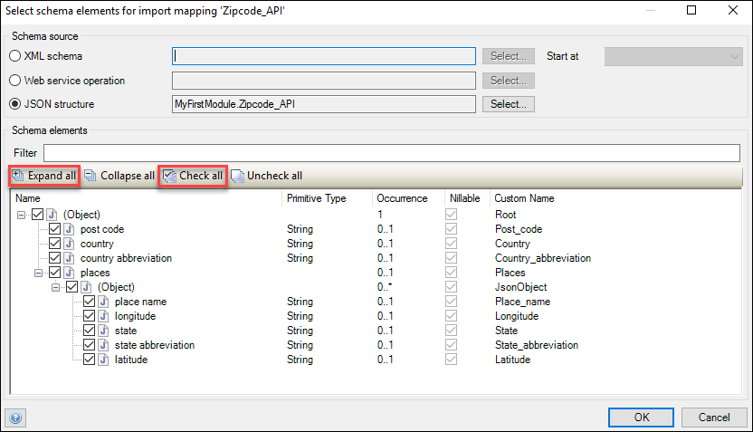

5. Click **OK**. You will now see this structure on the right of the editor:

    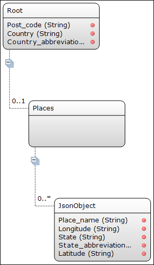

6. Click **Map automatically** at the top of the editor. The Desktop Modeler will inform you that it has applied some changes, which means that it has generated entities that match the JSON structure.
7. Click **Close**.

## 5 Edit the Domain Model

To apply the data that you will call from the REST service, some attributes in the domain model need to be added and changed.

To edit the domain model for these purposes, follow these steps:

1. Open the **Domain Model** of your module.
2. Add the following **Attributes** to the **Employee** entity:
    * **CountryCode** (string with a maximum length of 2)
    * **City** (string)
    * **Longitude** (decimal)
    * **Latitude** (decimal)
    * **Zipcode** (string)
3.  Double-click the **Post_code** attribute in the **Root** entity and change its **Name** to **Zipcode** (string with a maximum length of 5).

    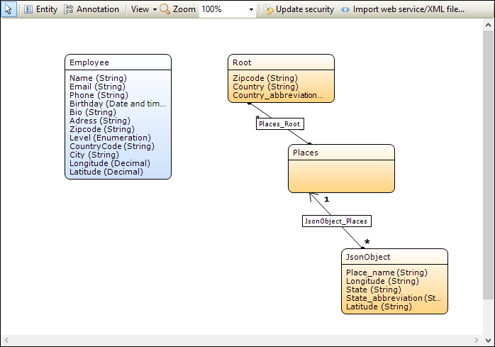

## 6 Calling the REST Service in a Microflow

To call the REST service in a microflow, follow these steps:

1. Add a new **Microflow** to your module.
2. Add an input **Parameter** with the following details:<br>s
    a. Set the **Data type** to **Object**.
    b. Select the **Employee** object.
    c. Enter *Employee* for the **Name**.
3. Insert a new **Activity** on the microflow, double-click it, and set its action to **Call REST service**.
4. For **Location**, click **Edit**.
5. Paste `http://api.zippopotam.us/{1}/{2}` into the **Template**.
6. For **Parameters**, click **New** to add a new parameter.
7. In the **Template Parameter** pane, enter the **CountryCode** attribute of the **Employee** entity (`$Employee/CountryCode`), then click **OK**. This will set the `{1}` in the template to the CountryCode attribute of the Employee entity.
8.	Add another parameter and this time, add the **Zipcode** attribute of the **Employee** entity. This will set the `{2}` in the template to Zipcode.

    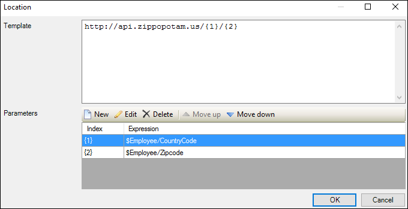

9.	Click **OK**.
10. Back in the **Call REST** dialog box, go to the **Response** tab and select **Apply import mapping** as the **Response handling**.
11. For **Mapping**, click **Select** and select your import mapping.
12.	For the **Variable** name, enter *Root*.

    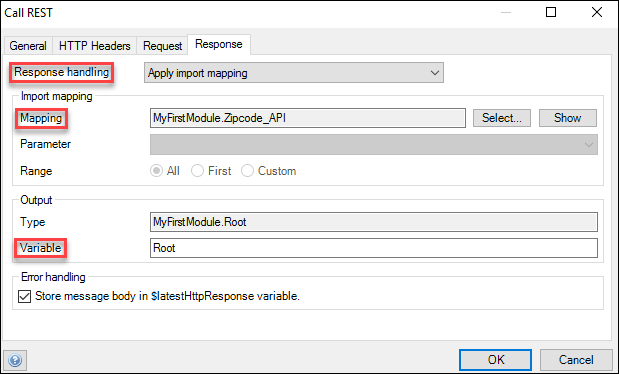

13.	Click **OK**.
14.	Insert another **Activity** on the microflow and set the action as **Retrieve**.
15.	For the **Association**, set **Places_Root**. That will retrieve the **Places** object associated with the **Root** object.

    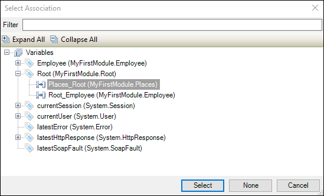

16.	Click **OK**.
17.	Add another **Retrieve** activity and for the **Association**, set **JsonObject_Places**. This will retrieve the list of **JsonObjects** that are associated with the **Places** object. 
18.	Click **OK**.

    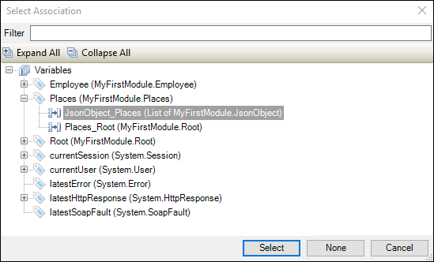

19.	Insert a **Loop** (Iterator) on the microflow. This loop will iterate over the **JsonObject** list that you just retrieved. 
20.	Double-click the loop and for **Iterate over**, select **JsonObjectList**, then click **OK**.
21.	Insert an **Activity** inside the loop and set its action to **Change object**.
22.	For the **Variable**, set **Employee**.
23.	Set **Commit** and **Refresh in client** to **Yes**.
24.	Click **New** and in the **Edit Change Item** dialog box, do the following:<br>
    a. For **Member**, select **City**.<br>
    b. For **Value**, set `$IteratorJsonObject/Place_name` (which is **Place_name** from the **IteraterJsonObject**).<br>
    c. Click **OK**. This will change the **City** attribute of the **Employee** object to  **Place_name** in the **JsonObject** list.
25.	Click **New** again and in the **Edit Change Item** dialog box, do the following:<br>
    a. For **Member**, select **Longitude**.<br>
    b. For **Value**, set `(parseDecimal($IteratorJsonObject/Longitude))`.<br>
    c. Click **OK**. This will use `parseDecimal` to change the **Longitude** attribute of **JsonObject** (which is of the string type) to a decimal attribute, which is needed for the **Longitude** attribute of the **Employee** object.
26. Click **New** again and in the **Edit Change Item** dialog box, do the following:<br>
    a. For **Member**, select **Latitude**.<br>
    b. For **Value**, set `(parseDecimal($IteratorJsonObject/Latitude))`.<br>
    c. Click **OK**.

    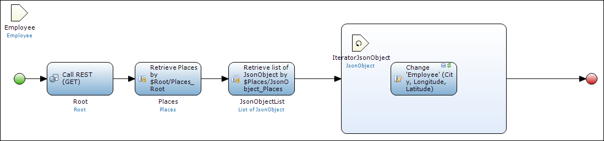

## 7 Edit the Employee Page

To edit the **Employee** page, follow these steps:

1. Open the **Employee** page.
2. Select the **Address** text box and delete it.
3. Add **Country code**, **Zip code**, and **City** text boxes to the page.
4. Drag the microflow you just created to the drop zone between the **Zipcode** and **City** text boxes.
5.  Rename this action to **Retrieve City**.

    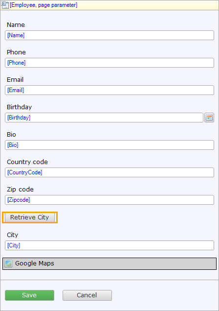

6.  Double-click the **Google Maps** widget to edit its properties and do the following:<br>
    a. For **Address attribute**, click **Select** and then click **none**.<br>
    b. For **Latitude attribute**, click **Select** and then select **Latitude**.<br>       c. For **Longitude attribute**, click **Select** and then select **Longitude**. The **Google Maps** widget will now base the location on the latitude and longitude values retrieved from the REST service.<br>
    d.For **XPath constraint**, click **Selecrt** and type `[id = '[%CurrentObject%]']` to only zoom in on the location of the current employee.<br>    
    
    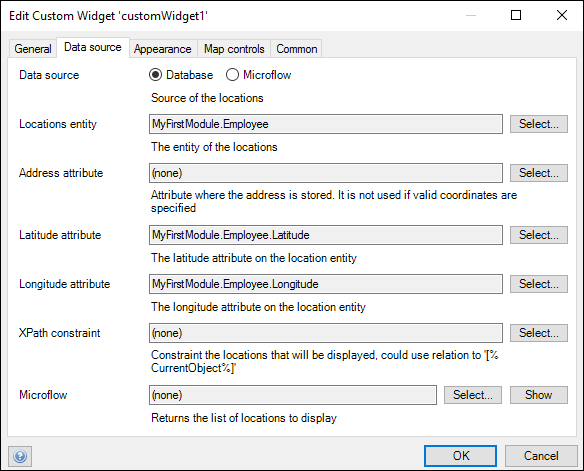

    e. Click **OK**.

7. Run your app locally and click **Retrieve City** to see how it works!

## 8 Call the Microflow On-Change

Instead of the **Retrieve City** button activating the microflow to show the city, it is also possible to call the microflow once you type in the zip code.

To configure this, follow these steps:

1. Go to the **Employee** page.
2. Double-click the **Zipcode** container.
3. Go to the **General** tab and the **Events** section (at the bottom), and for **On change**, click **Select** and select the microflow you created to retrieve the **City** of the **Employee**.

    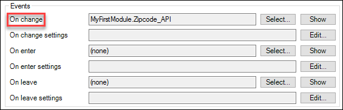

4. Click **OK**.
5. You can now delete the **Retrieve City** button on the **Employee** page.

Now, once you type your zip code (with country code first) and you leave the text box (by using pressing <kbd>Tab</kbd> or <kbd>Enter</kbd>, etc.) the city will automatically appear!

The last thing you need to is sync your changes back to the Web Modeler via the **Sync with Web Modeler** and **Finish sync with Web Modeler** buttons in the **Changes** pane.

This is the end of the tutorial. Please tell us how you liked it as well as any suggestions for improval by sharing feedback in the [Build an Employee Directory App Survey](https://www.surveymonkey.com/r/XY258CP).

You are also perfectly lined up to continue with [another Mendix tutorial](index) or the [Mendix Online Introduction Course](https://learn.mendix.com/), so check those out!

## 9 Related Content

* [How to Build an Employee Directory App (Advanced) Step 1: Create the App](build-an-employee-directory-app-advanced-1-create-the-app)
* [How to Build an Employee Directory App (Advanced) Step 2: Build a Dashboard Page](build-an-employee-directory-app-advanced-2-build-a-dashboard-page)
* [How to Build an Employee Directory App (Advanced) Step 3: Publish and View Your App](build-an-employee-directory-app-advanced-3-publish-and-view-your-app)
* [How to Build an Employee Directory App (Advanced) Step 4: Add Pages to the User Interface](build-an-employee-directory-app-advanced-4-add-pages-to-the-user-interface)
* [How to Build an Employee Directory App (Advanced) Step 5: Add Employee Promotion Logic](build-an-employee-directory-app-advanced-5-add-employee-promotion-logic)
