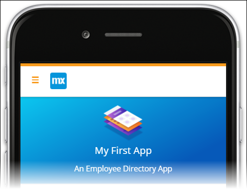
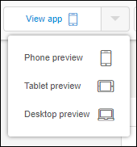

## 1 Introduction

Now that you've gotten started with your app and have worked with some of the design options in the theme customizer, it's time to publish your app.

**This how-to will teach you how to do the following:**

* Update an app
* View the app in a browser
* View the app on a device

{}

## 2 Prerequisites

Before starting with this how-to, make sure you have completed the following prerequisite:

* Complete the second how-to in this series: [How to Build an Employee Directory App (Easy) Step 2: Build a Dashboard Page](build-an-employee-directory-app-easy-2-build-a-dashboard-page)

## 3 Updating and Viewing Your App

The instance of your published app that is available to users is different from the instance in which you are developing.

To view the latest changes in the published version of your app, you need to update the published version first. To update your app, follow these steps:

1. Click **Publish** on the top-right of the Web Modeler:

    

2. Click **Update** to push the latest changes to the published app.

## 4 Viewing Your App

After you publish your app, you are able to instantly view it in your browser or on a mobile device. 

### 4.1 Viewing Your App in a Browser

To view your app in a browser, follow these steps:

1. Click **View app** to view it in the phone preview mode in a new browser window:

     

2. Return to the Web Modeler and select the drop-down arrow on the **View app** button to select the **Tablet preview** or **Desktop preview** mode, which will open that preview in a new browser window:

     

### 4.2 Viewing your App on a Mobile Device

To view your app on a mobile device, follow these steps:

1. Click **View on mobile device**:

     

2. Scan the QR-code with your mobile device using the [Mendix Mobile app](https://play.google.com/store/apps/details?id=com.mendix.SprintrMobile&hl=en). Follow the directions to download the Mendix Mobile app in case you don't have it installed.

Nice. Now you're ready to continue with the last how-to of this tutorial: [How to Build an Employee Directory App (Easy) Step 4: Add Pages to the User Interface](build-an-employee-directory-app-easy-4-add-pages-to-the-user-interface).

## 5 Related Content

* [How to Build an Employee Directory App (Easy) Step 1: Create the App](build-an-employee-directory-app-easy-1-create-the-app)
* [How to Build an Employee Directory App (Easy) Step 2: Build a Dashboard Page](build-an-employee-directory-app-easy-2-build-a-dashboard-page)
* [How to Build an Employee Directory App (Easy) Step 4: Add Pages to the User Interface](build-an-employee-directory-app-easy-4-add-pages-to-the-user-interface)
* [How to Build an Employee Directory App (Easy) Step 5: Add Employee Promotion Logic](build-an-employee-directory-app-easy-5-add-employee-promotion-logic)
