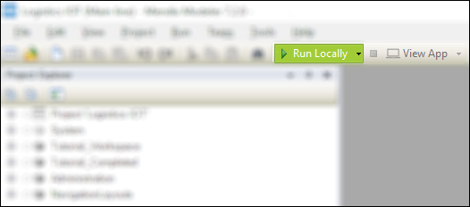
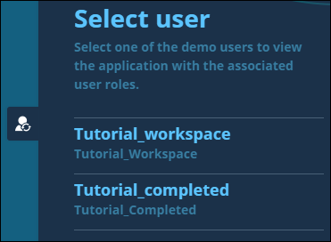

## 1 Introduction

In this how-to, you will first deploy, view, and inspect some details of the Mendix Logistics IoT app. Then you will connect new app pages in the app.

**This how-to will teach you how to do the following:**

* Connect app pages

## 2 Prerequisites

Before starting with this how-to, make sure you have completed the following prerequisite:

* Create a new instance of the **Build a Logistics IoT app**, which you can find by clicking **Create App** in the Developer Portal and then going to the **Tutorials** tab

## 3 Deploying and Viewing the Logistics IoT App

Start by opening your app in the Desktop Modeler and running the app so that you can see how it looks. You will see how you can switch between your workspace and the completed example app.

To deploy and view the app, follow these steps:

1. In the Desktop Modeler, click **Run Locally** and confirm to create a new database. Click **View** to see the app in your browser.

    

2. The app starts on the homepage in the workspace section, which is an overview of all the shipments.
3. Click the menu button in the top-right corner of the app to open the side menu. From here, you can navigate to other pages where you can edit the app data.
4. Select **Shipments** and click **Edit** on the preconfigured shipment, which will bring you to the **Shipment** form. Here you can edit the details about the shipment.
5. On the right side of the screen, click the toggle with the user icon. Switch to the **Tutorial_Completed** section of the app, which contains the completed pages for you to use as a reference. Both **Tutorial_Completed** and **Tutorial_Workspace** have their own data set.

    

6. Click a container from the shipment overview to inspect the page with the container sensor details. This is the page that you are going to build in this tutorial.

## 4 Connecting App Pages (Step 1)

In this section, you are going to observe the app in the development environment. You will make your first change, which will enable you to view the live details of the shipments listed on the shipments overview.

To connect an app page, follow these steps:

1. In the **Tutorial_Workspace** module, open **Step 1 - Connect App Pages** > **Homepage**. This is the homepage of the app that you will be expanding and improving.
2. Inspect how this page is built. Notice that there is a list view element that represents the overview of the shipments. On the right there is a menu, which takes you to the pages where you can configure and edit the shipment details, sensor data, and cloud platform configuration.
3. The button with the **>** icon (which you can find in the list view) is not connected to a page, so right-click the button and select **Edit action** > **Show a page**.
4. In the **Select page** dialog box, select the **Shipment_Detail** page (which has already been prepared for you).
5. Click **Show** to display the **Shipment_Detail** page and then **OK** to inspect the page to which the **>** button is directing.
6. Save the changes, click **Run Locally** to deploy the app, then click **View** to view the app in your browser.
7. Make sure you are switched back to the **Tutorial_Workspace** user (use the user toggle on the right side of the screen for this).
8. Inspect how this **Shipment_Detail** page looks in the browser by clicking the **>** button of the available shipment.

Great! You've made your first change to the app. The **Shipment_Detail** page looks good, but it really needs some data. So, move on to [How to Build a Logistics IoT App Step 2: Configure the Sensor Data Subscription](build-an-iot-app-2) and get some data pushed over from an IoT server to the app.

## 5 Related Content

* [How to Build a Logistics IoT App](build-an-iot-app)
* [How to Build a Logistics IoT App Step 2: Configure the Sensor Data Subscription](build-an-iot-app-2)
* [How to Build a Logistics IoT App Step 3: Handle the Sensor Data](build-an-iot-app-3)
* [How to Build a Logistics IoT App Step 4: Add Another Data Dimension](build-an-iot-app-4)
* [How to Build a Logistics IoT App Step 5: Create Alerts](build-an-iot-app-5)
* [How to Build a Logistics IoT App Step 6: Expand the IoT App Tracking](build-an-iot-app-6)
