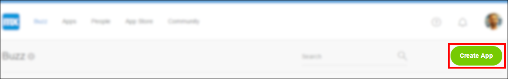
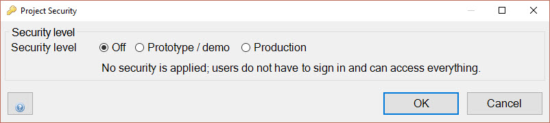
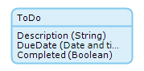

## 1 Introduction

In this how-to, you will create and prepare a new project, module, and domain model. This is the first how-to in the series for creating a to-do app in 20 minutes using the Mendix Mobile Quick Starter app.

**This how-to will teach you how to do the following:**

* Create a project that will speed up and simplify your mobile app development

## 2 Prerequisites

Before starting this how-to, make sure you have completed the following prerequisite:

* Download [Mendix Desktop Modeler 7.3 or later](https://appstore.home.mendix.com/link/modeler/)

## 3 Creating Your App

To create and prepare your new app tutorial project, follow these steps:

1. Go to the [Mendix Developer Portal](http://home.mendix.com) and log in.
2. Click **Create App** in the top right of the screen:

     

3. On the **Tutorial Apps** tab, select **Build a Mobile ToDo app**.
4. Click **Use this app**, enter a name for your application, and click **Create App**.
5. On the **Buzz** page for the app, click **Edit App**, which will open your app in the Desktop Modeler.
6. When your app is loaded into the Desktop Modeler, open **Project** > **Security** to update the security settings of your app project.
7.  Switch the **Security level** to **Off** and click **OK**.

    

    {}

    Switching the security level to **Off** is done for fast development. Make sure you change it back to **Production** and configure the security of your app when you are going to use the app in a production environment.

    {}

## 4 Creating a New Module

The development of your app stays comprehensible when its functionality is split into separate modules.
Follow these steps to create a new module where you can add the to-do implementation of your app:

1. Right-click your **ProjectName** in the Project Explorer.
2. Click **Add module** and give it the name **ToDo**.

## 5 Creating the Domain Model

The domain model is a data model that describes the information in your application domain in an abstract way.

The domain model for the to-do app will be pretty simple. It'll contain one entity with three attributes. Follow these steps to create the entity and attributes:

1. Open the **Domain Model** in the **ToDo** module.
2. Add a new **Entity** to the Domain Model.
2. Rename the entity to **ToDo**.
3.  Add the following three attributes:
    * *Description* (String)
    * *DueDate* (Date and time)
    * *Completed* (Boolean with default value *False*)

    

For the next step in this series, move on to [How to Build a Mobile To-Do App Step 2: Create the Pages](create-a-to-do-app-2).

## 6 Related Content

* [How to Build a Mobile To-Do App Step 2: Create the Pages](create-a-to-do-app-2)
* [How to Build a Mobile To-Do App Step 3: Improve the Look and Feel of the App](create-a-to-do-app-3)
* [How to Build a Mobile To-Do App Step 4: Add Logic to the Microflows](create-a-to-do-app-4)
* [How to Deploy Your First Hybrid Mobile App](../mobile/deploy-your-first-hybrid-mobile-app)
* [How to Publish a Mendix Hybrid Mobile App in Mobile App Stores](../mobile/publishing-a-mendix-hybrid-mobile-app-in-mobile-app-stores)
* [Push Notifications](../mobile/push-notifications)
