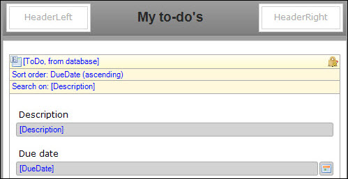
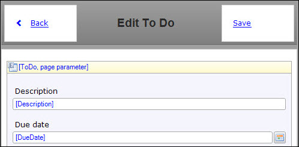
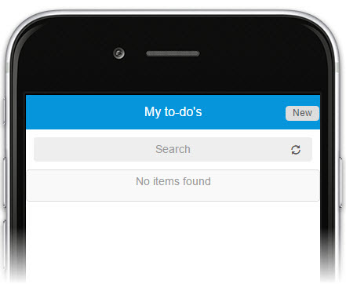

## 1 Introduction

In this how-to, you will create and configure the home page as well as the new and edit pages.

**This how-to will teach you how to do the following:**

* Build the to-do app pages

## 2 Prerequisites

Before starting this how-to, make sure you have completed the following prerequisite:

* Complete [How to Build a Mobile To-Do App Step 1: Create a New Project, Module, and Domain Model](create-a-to-do-app-1).

## 3 Creating the Home Page

When users open the to-do app they will land on the homepage of the app. Follow these steps to create and configure the home page:

1. Right click your newly created ToDo module and select **Add > Page**.
2. Go to the **Phone Specific** tab and click **No** when you're asked to create a new Phone Profile.
3. Name the page **Home_Phone_Default**.
4. Select *Phone_HeaderOnly* as **Navigation layout**.
5. Click **Blank** on the left side and select the *Blank* page template.
6. Click **OK** to create the page.
7. Open the **HybridPhone** profile available in your project's **Navigation** and set the **Home_Phone_Default page** in the ToDo module as default home page.
8. Change the **Home** menu item so that it also directs to **Home_Phone_Default page** in the ToDo module. 

## 4 Configuring the Home Page

Let's create the user interface for the home page so that it shows a list of available to-do's. Follow these steps to set up the user interface and connect it to the new entity in the domain model:

1. Open **Home_Phone_Default page** you've just created in the ToDo module.
2. Change the page title to **My to-do's** in the **Properties** pane on the right side of the Desktop Modeler.
3. Remove the **Layout grid** from the page.
4. Right-click the area you just cleared and select **Add widget > List view** to add a List view to the page that will take the place of the layout grid.
5. Right-click the **List view** and select **Select data soure**.
6. Click **Select** and select the **ToDo** entity for the **Entity (path)**.
7. Click **OK** and then **Yes** to automatically fill the content of the list view.
8. Remove the **Completed** attribute.
9. Double-click the **Sort order: (default)** and add the **DueDate** attribute with the **Ascending** sort direction.

    

Great! You can now see a list of to-do's on your home page, but only after you have created them. Let's configure a page to create to-do's.

## 5 Creating and Configuring the New and Edit Page

Users also need to be able to add new to-do's to the list, that's why you're going to add a page that lets them do this. Follow these steps to create a new and edit page:

1. Add a **Create button** to the **HeaderRight** placeholder on the page.
2. Select the **ToDo** entity in the pop-up.
3. Right-click the **New** button and select **Generate page**.
4. Select **Form default** and click **OK**.
5. Right-click the **New** button and select **Go to page**.
6. Delete the **Completed** attribute.

    

7. Run the app locally. Click **Save and continue** if you did not save your page(s) yet.
8. Click **Yes** to create a default database if this is asked.
9. Open the **View** drop-down menu and select **Hybrid Phone Mobile App**.

This is an easy way to see your app. There is also a way to simulate the touch behavior of a user on a mobile device. This is explained later in step 4 of this how-to.

For the next step in this series, move on to [How to Create a Mobile To-Do App Step 3: Improve the Look and Feel of the App](create-a-to-do-app-3).

## 6 Related Content

* [How to Build a Mobile To-Do App Step 1: Create a New Project, Module, and Domain Model](create-a-to-do-app-1)
* [How to Build a Mobile To-Do App Step 3: Improve the Look and Feel of the App](create-a-to-do-app-3)
* [How to Build a Mobile To-Do App Step 4: Add Logic to the Microflows](create-a-to-do-app-4)
* [How to Deploy Your First Hybrid Mobile App](../mobile/deploy-your-first-hybrid-mobile-app)
* [How to Publish a Mendix Hybrid Mobile App in Mobile App Stores](../mobile/publishing-a-mendix-hybrid-mobile-app-in-mobile-app-stores)
* [Push Notifications](../mobile/push-notifications)
