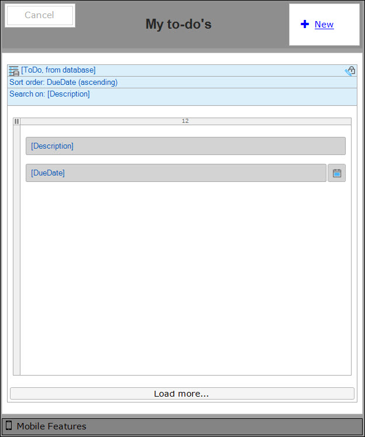
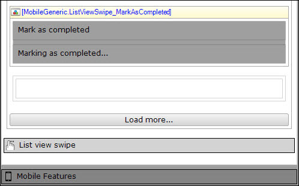
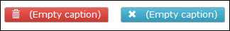
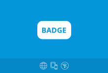
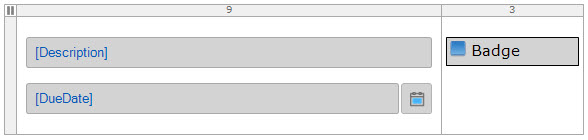
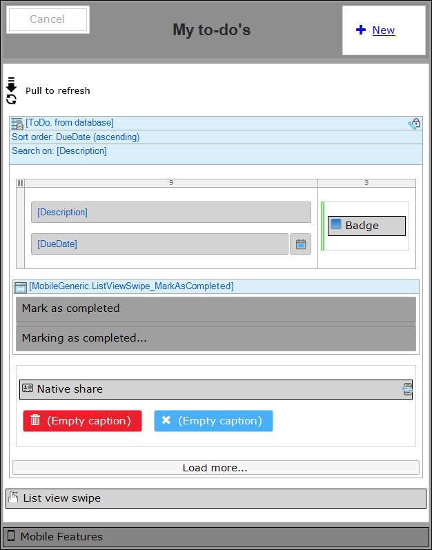

## 1 Introduction

In this how-to, you will improve the mobile look and feel by adding and configuring widgets in your project.

**This how-to will teach you how to do the following:**

* Configure several widgets to realize a rich mobile app with a native look and feel

## 2 Prerequisites

Before starting this how-to, make sure you have completed the following prerequisite:

* Complete [Step 2: Create the Pages](create-a-to-do-app-2).

## 3 Enhancing the Home Page

Follow these steps to improve the look and feel of the home page:

1. Go back to the Desktop Modeler.
2. Open the **Home_Phone_Default** of the **ToDo** module.
3. Open the properties of the **Description** attribute and change the following settings:
    * On the **General** tab, set **Show label** to **No**
    * On the **Common** tab, add the **text-bold** class.
4. Open the properties of the **DueDate** attribute and change the following settings:
    * Select **Custom** for **Date format**, and set the custom format to **dd-MMM-yyyy**.
    * Set **Show label** to **No**
5. Right-click the **List view** and select **Properties** to open its properties editor and change the following settings:
    * Select **Show a page** for **On click**
    * Select the **ToDo_NewEdit** page and click **Select**
    * Go to the **Data source** tab and add a constraint for the **Completed** attribute that equals **false**.
    * Go to the **Common** tab and change the **Name** to **ToDo**
6. Add a **Layout grid** (**full**) widget to the **ToDo** list view.
7. Move the **Description** and **DueDate** attributes into the new layout grid. This will create some spacing around the borders of your mobile screen.
8. Open the **Properties** of the **Layout grid** and add the **slide-left** class. This class will activate a page transition and, in this case, slides the page to the left when you hit the **New** button. Look at the **Mobile features** widget in the **Page layout** to see which classes are available for page transitions.
9. Open the properties of **New** button in the top-right corner of the page and change the following properties:
    * Check **Override page title** and change the title to **Create to do**
    * Set the **plus** icon for the **Icon** option
    * Select **Link** for the **Render mode**
    * Add the **flip-right** class to the **Class** option
10. Click **OK** to save the properties.



## 4 Enhancing the NewEdit Page

Follow these steps to add special page transitions to the action buttons. 

1. Open the **ToDo_NewEdit** page.
2. Open the **Properties** of the **< Back** button and add the **flip-left** class.
3. Open the **Properties** of the **Save** button and add the **flip-right** class.
4. Add a **Layout grid** (**full**) to the **ToDo** data view.
5. Move the **Description** and **DueDate** attributes into the **Layout grid**.

## 5 Adding the Pull-to-Refresh Widget

Follow these steps to enable pull-to-refresh functionality to your app:

1. Open the **Home_Phone_Default** page.
2. Add the **Pull to refresh** widget above the **ToDo** list view.

This is all you need to do to refresh your list of to-do's. If you want, you can change some messages the widget generates when you pull to refresh on your phone.

## 6 Adding and Configuring the List View Swipe Widget

Follow these steps to add swiping functionality to the items in the list view:

1. Open the **Home_Phone_Default** page.
2. Add the **List view swipe** widget below the **ToDo list view**.
3. Open the **Properties** of the widget and configure the following settings on the **General** tab:
    * Enter **ToDo** for the **Target list view**
    * Select the **ToDo** entity for the **List view entity**
4. Configure the following settings on the **Swipe to left** tab:
    * **On swipe action**: No action
    * **Swipe container left**: Buttons
    * **After swipe left**: Stick to button(s)
5. Configure the following settings on the **Swipe to right** tab:
    * **On swipe action**: Call a microflow
    * **Microflow right**: **Select** > **New** > *ACT_ToDo_MarkAsCompleted* (you'll add the logic to the microflow later)
    * **Swipe container right**: MarkAsCompleted
    * **Transparent swipe**: Yes
    * **Hide container right**: MarkingAsCompleted
6. Click **OK** to save the properties.

## 7 Adding List View Swipe MarkAsCompleted Snippet

Follow these steps to add a predefined snippet which contains the UI for the *mark as completed* functionality:

1. Open the **Home_Phone_Default** page.
2. Expand the **MobileGeneric** module in the **Project Explorer**.
3. Drag the **ListViewSwipe_MarkAsCompleted** snippet below the layout grid. The values you configured in the List view Swipe widget (**MarkAsCompleted** and **MarkingAsCompleted**) match the names of the containters in the snippet. You can modify the text in the containers, but make sure the container names correspond with the container names configuration in the widget.
4. Add a **Container** below the **ListViewSwipe_MarkAsCompleted** snippet and within the **Todo list view**.
5. Change the name of the container to **Buttons**.

  

## 8 Adding a Delete Button

Follow these steps to add a delete button to the list view swipe widget:

1. Add a **Call microflow button** widget to the **Container** you named *Buttons*.
2. Create a new microflow from the **Select microflow** dialog and name it **ACT_ToDo_Delete** (you'll add the logic to the microflow later).
3. Double-click the button you just created to open its properties dialog.
4. Remove the caption from the button.
5. Select **trash** for the button's **Icon**.
6. Change the **Button style** to **Danger**.
7. Click **Edit** for **Microflow settings**.
8. Set **Ask confirmation** to **Yes** and click **OK**.
9. Add the **btn-lg** class to make the button larger and close the properties dialog.

## 9 Adding a Share Button

Follow these steps to add and configure a native share button to the list view swipe widget:

1. Drag a second **Button** in the **Container**.
2. Remove the caption from the button.
3. Select **remove** for the button's **Icon**.
4. Change the **Button style** to **Info**.
5. Change the **Name** of the button to **Share**.
6. Add the **btn-lg** class to make the button larger.
7. Click **OK** to save the properties.



## 10 Adding the Native Share Widget

Follow these steps to integrate native share functionality into the page:

1. Open the **App Store** in the Desktop Modeler.
2. Enter *share* in the search box.
3. Open the **Native Share** widget in the search results and click **Download**.
4. Go back to the **Home_Phone_Default** page.
5. Add the **Native share** widget above the **Delete** and **Share** buttons in the same container.
6. Open the **Properties** of the native share widget.
7. Enter *Share* for **Element name selector**.
8. Set **Hide outside Phonegap** to **No**.
9. Go to the **Data source** tab.
10. Select the **Description** attribute for the **Message**.
11. Click **OK** to save and close the settings.

## 11 Adding the Badge Widget

To show which to-do items have passed their deadline, you can make use of the custom **Badge** widget, available in the [Mendix App Store](https://appstore.home.mendix.com/link/app/50325/Mendix/Badge). 
Follow these steps to add the **Badge** widget to your project:

1. Open the **App Store** in the Desktop Modeler.
2.  Enter *badge* in the search box.
3. Open the **Badge** widget in the search results and click **Download**:<br>

    

4. Go back to the **Home_Phone_Default** page.
5. Add a new column to the right of the existing one in the layout grid.
6. Open the properties of the left column.
7. Change the weight to **9** and add the **col-xs-9** class.
8. Open the properties of the right column.
9. Change the weight to **3** and add the **col-xs-3** class.
10. Add the **Badge** widget to the right column.
11. Open the **Properties** of the widget.
12. Enter *Too late!* for the **Default value** of the badge.
13. Go to the **Display** tab and set the **Badge style** to **Warning**.

     

## 12 Adding Conditional Visibility with Client-Side Expressions

Follow these steps to only show the **Badge** when the **DueDate** has passed:

1. Add a **Container** to the right column and drag and drop the **Badge** into it.
2. Open the **Properties** of the **Container**.
3. Click **Edit** and select **based on expression**.
4. Add the following expression: ```$currentObject/DueDate < [%CurrentDateTime%]```. This will make sure the **Badge** shows up when a to-do is overdue.
5. Save and close the settings.
6. Save all your documents.

This is what your page should look like:



For the next step in this series, move on to [How to Create a Mobile To-Do App Step 4: Add Logic to the Microflows](create-a-to-do-app-4).

## 13 Related Content

* [Step 1: Create a New Project, Module, and Domain Model](create-a-to-do-app-1)
* [Step 2: Create the Pages](create-a-to-do-app-2)
* [Step 4: Add Logic to the Microflows](create-a-to-do-app-4)
* [How to Deploy Your First Hybrid Mobile App](../mobile/deploy-your-first-hybrid-mobile-app)
* [How to Publish a Mendix Hybrid Mobile App in Mobile App Stores](../mobile/publishing-a-mendix-hybrid-mobile-app-in-mobile-app-stores)
* [Push Notifications](../mobile/push-notifications)
