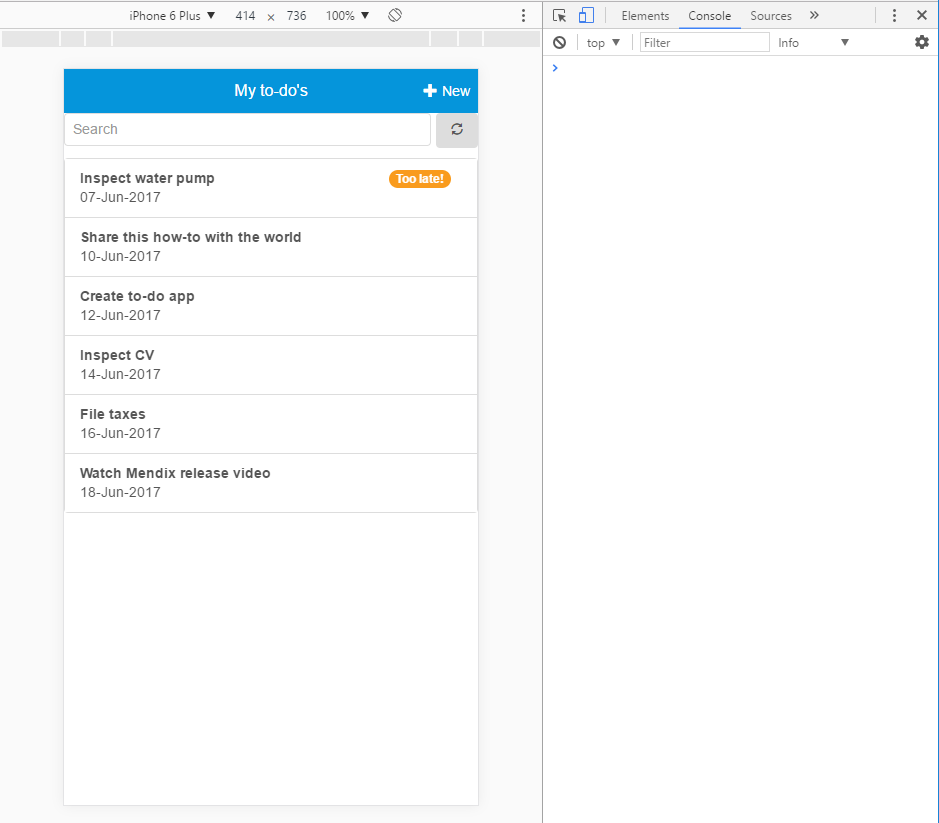

## 1 Introduction

This is the final how-to in the series for creating a to-do app based on the Mendix Mobile Quick Starter app.

**This how-to will teach you how to do the following:**

* Add logic to the microflows
* Simulate touch behavior of mobile device

## 2 Prerequisites

Before starting this how-to, make sure you have completed the following prerequisite:

* Complete [Step 3: Improve the Look and Feel of the App](create-a-to-do-app-3).

## 3 Adding Logic to the Microflows

The **List view swipe** widget has been configured, but the two microflows you created do not have any logic yet. Follow these steps to add logic to the microflows so they will execute the behavior we want:

1. Open the **ACT_ToDo_Delete** microflow.
2. Add an **Activity** that deletes the **ToDo** object and refreshes the client.
    <iframe width='100%' height='350px' frameborder='0' src='https://modelshare.mendix.com/models/83d0f300-356e-4a6b-9ea3-7625284a6937/act_todo_delete?embed=true' allowfullscreen></iframe>
3. Open the **ACT_ToDo_MarkAsCompleted** microlfow.
4. Add an **Activity** that changes the **Completed** attributed of the **ToDo** object to *true* and set **Commit** to *Yes*.
    <iframe width='100%' height='350px' frameborder='0' src='https://modelshare.mendix.com/models/adbe2dd5-2e27-41ab-8f67-3a728917f01b/act_todo_markascompleted?embed=true' allowfullscreen></iframe> 

{}
There is no need to refresh in the client due to the "Move out, hide" behavior of the List View Swipe widget.
{}

## 4 Running the App and Simulating Touch Behavior of Mobile Device

The app is now finished, so you are going to view it on a simulated mobile device. To emulate the touch behavior of a user on a mobile device (which is mentioned in [Step 2: Create the Pages](create-a-to-do-app-2#5)), follow these steps: 

1. Save all changes and run the app locally.
2. Open the **View** drop-down menu and select **Responsive Browser (F9)**.
3. Change the URL to `http://localhost:8080/index.html?profile=HybridPhone` to simulate a phone profile. This will result in a simulation that is easier to preview.
4. Press **F12** to open the browser's Developer Tools.
5. Select the device you want to simlate, and your mouse will act like a finger on the screen.

    

Fantastic! You've finished this how-to series and now have a mobile to-do app that works well and looks great.

### 5 Feedback

We are very interested in your feedback. Please take [this short survey](https://www.surveymonkey.com/r/6CPC8SK) to let us know what you think about this how-to.

## 6 Related Content

* [Step 1: Create a New Project, Module, and Domain Model](create-a-to-do-app-1)
* [Step 2: Create the Pages](create-a-to-do-app-2)
* [Step 3: Improve the Look and Feel of the App](create-a-to-do-app-3)
* [How to Deploy Your First Hybrid Mobile App](../mobile/deploy-your-first-hybrid-mobile-app)
* [How to Publish a Mendix Hybrid Mobile App in Mobile App Stores](../mobile/publishing-a-mendix-hybrid-mobile-app-in-mobile-app-stores)
* [Push Notifications](../mobile/push-notifications)
