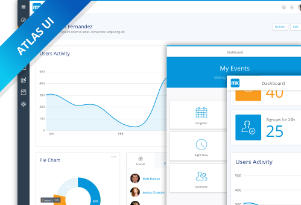
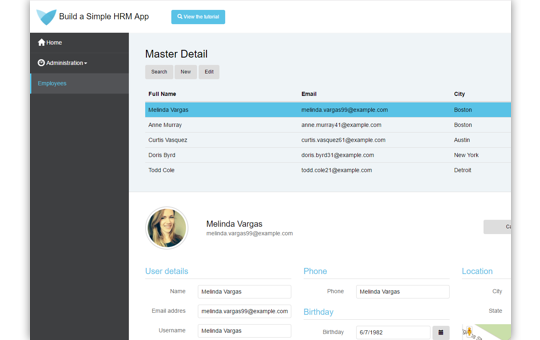
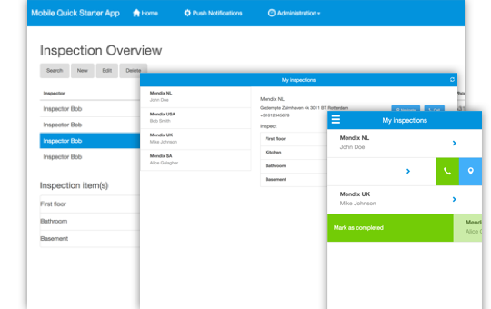
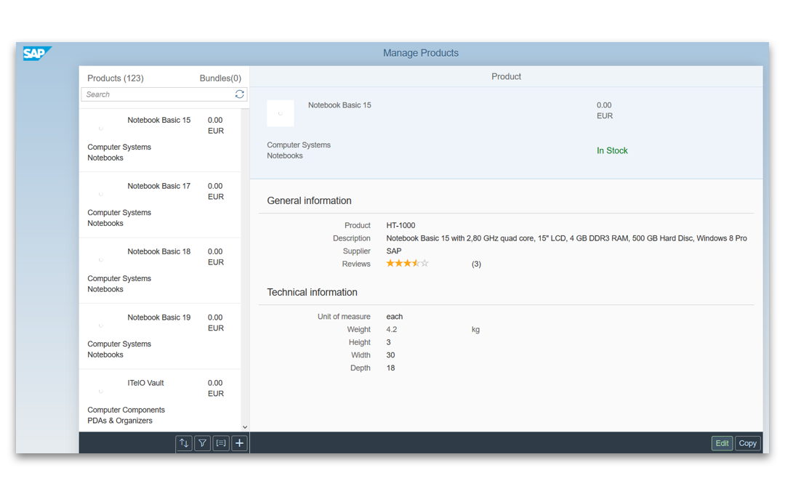

These tutorials will teach you how to build various apps:

<table>
  <thead style='display:none;'>
    <th>header 1</th>
    <th>header 2</th>
  </thead>
  <tbody>
    <td><a href="start-with-a-blank-app">Start with a Blank App</a>  
    In this introductory tutorial, you will learn the basics of app development in the Mendix Web Modeler by starting with a blank app.</td>
    <td></td>
  </tbody>
  </tbody>
    <tbody>
    <td><a href="build-a-simple-hrm-app">Build a Simple HRM App</a>  
    In this tutorial, you will learn the basics of app development in the Mendix Desktop Modeler by building a simple HRM app.</td>
    <td></td>
  </tbody>
  <tbody>
    <td><a href="create-a-to-do-app">Build a Mobile To-Do App</a>  
    This tutorial will teach you the basics of building an app for mobile devices. You'll start with the Mobile Quick Starter App, use handy widgets to add swipe gestures, and also use native device capabilities like sharing, taking pictures, and more.</td>
    <td></td>
  </tbody>
  <tbody>
    <td><a href="build-an-iot-app">Build a Logistics IoT App</a>  
    This tutorial will let you experience how to consume IoT services from an IoT Cloud platform.</td>
    <td></td>
  </tbody>
  </tbody>
    <tbody>
    <td><a href="sap-tutorials">SAP Tutorial</a>  
    This tutorial will teach you how to extend the SAP Purchase Order Approval Tutorial app using Mendix.</td>
    <td></td>
  </tbody>
</table>
