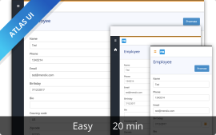
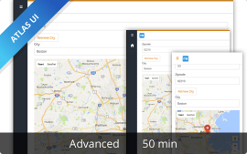

The following onboarding tutorials are available here:

|  | [How to Build an Employee Directory App (Beginner)](build-an-employee-directory-app-beginner)|
|------|:-----|
|  | **[How to Build an Employee Directory App (Advanced)](build-an-employee-directory-app-advanced)**|
