## 1 Introduction

This tutorial takes you through the basics of development in the Mendix Desktop Modeler and teaches you how to add an approval step into the SAP Purchase Order Approval Tutorial app. The approval is invoked from the Mendix app and will trigger a request to the SAP Gateway Demo System (ES5).

**This how-to will teach you how to do the following:**

* Change the UI by modifying and adding pages
* Add business logic by creating microflows
* Define the data structures using entities in the domain model
* Add the SAP Gateway Demo System (ES5) credentials to the app
* Send requests to the SAP Gateway Demo System (ES5)

## 2 Prerequisites

Before starting this how-to, make sure you have completed the following prerequisites:

* Create a free [Mendix Account](https://www.mendix.com/sign-up/SAP)
* Download, open, and log in to the [Mendix Desktop Modeler](https://appstore.home.mendix.com/link/modelers/)
* Create a free [SAP Account](https://www.sap.com/developer/tutorials/hcp-create-trial-account.html)
* Request the authentication credentials required to connect with the SAP Gateway Demo System (ES5) by registering [here](https://register.sapdevcenter.com/SUPSignForms/)

## 3 Starting with the SAP Purchase Order Approval Tutorial

To start this tutorial, go to the [Mendix Developer Portal](https://sprintr.home.mendix.com/index.html) and follow these steps:

1.  Click **Create App** in the upper-right corner of the screen.

2.  Go to the **SAP Apps** tab and select **SAP Purchase Order Approval Tutorial**.
3.  Click **Use this app**.
4.  Enter *SAP Purchase Order Approval App* for the name of the new app, and click **Create App**.
5.  Select the **Region** and sign in to SAP Cloud Platform:

    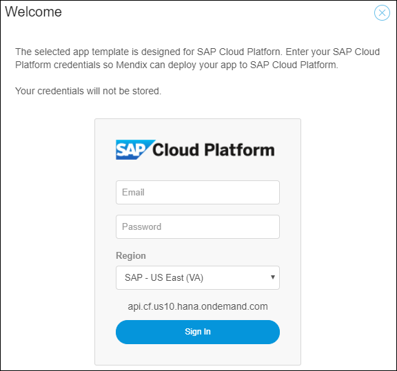

6.  Select the **Domain**, **Organization**, and **Space** that you want to use:

    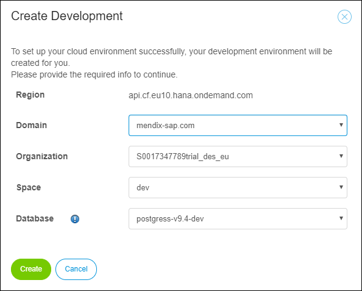

7.  Verify that the environment has been created successfully:

    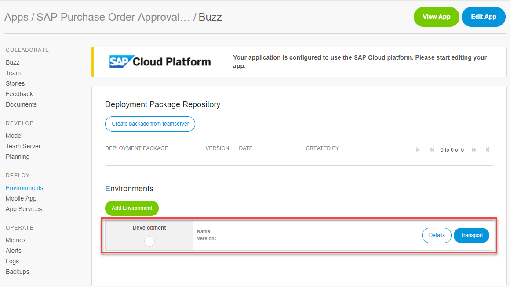

    {}If you receive an error creating the environment, there may be an issue with your SAP account (for example, it may have expired or you may have exceeded your quota limit). You can manage your SAP Cloud account by going to the [SAP Cloud Platform Cockpit](https://account.hanatrial.ondemand.com/cockpit)
    {}

8. Click **Edit App** to edit the app in the Mendix Desktop Modeler.

## 4 Running the App for the First Time

Now that you've set up the app, you can run it and have it connect with the SAP Gateway Demo System (ES5).

To run the app for the first time, follow these steps:

1.  Click **Run** > **Run Locally**:

    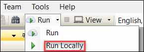

    If you see the pop-up window asking if you want to create a database, select **Yes**.
2. Wait until the startup of the app has finished and the app is running.
3. Click **View** to view the app in your browser:

    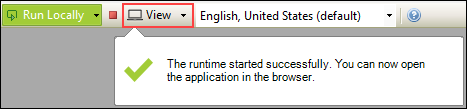

4. Enter your ES5 credentials and click **Login**:

    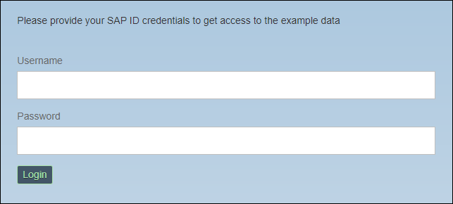

5.  You will now see the Purchase Order Approval App in the browser:

    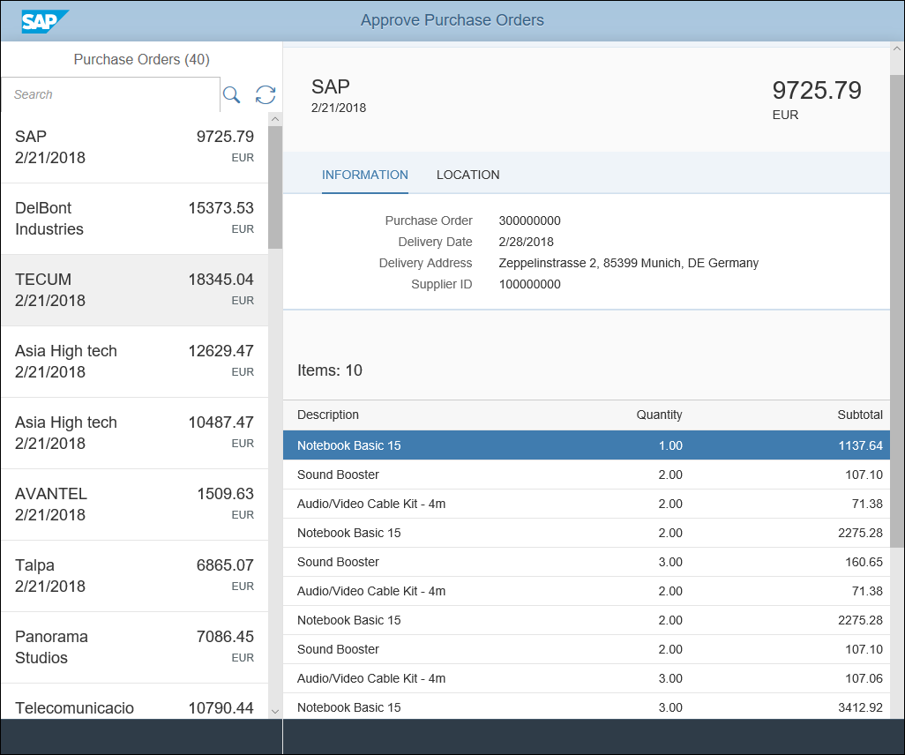

In the following steps, you will implement the purchase order approval functionality.

## 5 Creating an Approval Object Container

In Mendix, the data structure of an application is captured in entities that you can find in the domain model.

To create the data structure for an approval input object, follow these steps:

1. Open the **Domain Model** of **MyFirstModule**.

    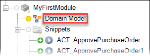

2. Right-click in the central editor window and select **Add entity**.

3. Double-click the entity to open its properties.

4. Enter *ApprovalDialog* for the **Name** (make sure there are no spaces in the name!).

5. Set the **Persistable** property to **No**.

6. On the **Attributes** tab, click **New** to add a new attribute and do the following:

    * Enter *Note* for its **Name**
    * Set the **Length** of the attribute **Type** (**String**) to **Unlimited**

7.  On the **Associations** tab, add an association to the **PurchaseOrder** entity of the module **EPM_REF_APPS_PO_APV_SRV** (by searching for "PurchaseOrders" or by expanding the modules and selecting the entity as in the screenshot below):

    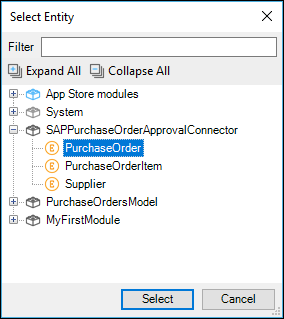

Now that you've defined the data structure, you can move on to creating the button and business logic for opening a custom approval dialog window.

## 6 Adding an Approve Button

Buttons in Mendix open pages or invoke microflows. Microflows in Mendix are used to define business logic.

To add an **Approve** button to the home page, follow these steps:

1. Search (using <kbd>Ctrl</kbd> + <kbd>G</kbd>) for **Homepage [MyFirstModule]**, select it, and click **Go to**. This is the starting page of the app.
2.  Scroll to the bottom of the page, right-click the **MyFirstModule.ButtonToolbar** snippet, and select **Show snippet**.

    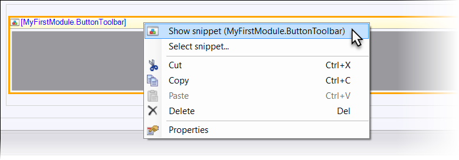

3. Right-click in the snippet area and select **Add widget** > **Button** > **Call microflow button**. Microflows consist of microflow actions, which trigger basic operations such as creating, changing, and deleting objects as well as aggregating object lists and showing messages.

4. In the **Select Microflow** dialog window, click **New** to create a new microflow and enter *ACT_OpenApproveDialog* for the **Name**. For details on Mendix naming convention best practices, see [Mendix Development Best Practices](https://docs.mendix.com/howtogeneral/bestpractices/dev-best-practices).

5. Double-click the button you just created and change the **Caption** to *Approve*.

6. In the Properties pane on the right, change the **Button Style** to *Success*.

    

6.  Click **Run Locally** and then **View** to view the app in your browser. Save your work and synchronize the database if prompted to do so.

7.  The new **Approve** button will appear in the bottom-right of the page. Click it and observe that nothing happens. You will create business logic in the microflow in the following sections to make the button work.

    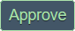

Nice work. Continue below for creating business logic in the microflow so the approve button will actually trigger an action.

## 7 Creating Logic for the Approve Button

Follow these steps to create some simple logic to open the approval dialog pop-up.

1.  Search (using <kbd>Ctrl</kbd> + <kbd>G</kbd>) for **ACT_OpenApproveDialog**, select it, and click **Go to**. This is the microflow you added in section 6.

2. Right-click the line between the green and red dots in the microflow editor and select **Insert > Activity**.

3. Double-click the new activity, select **Create object** and click **Select**.

4. In the Create Object dialog, click **Select** and select the **ApproveOptionalText** entity.

    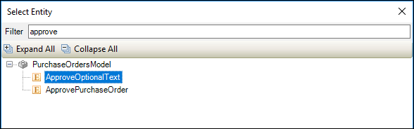

5. Click **New** to add a member.

6. Select *PurchaseOrdersModel.ApproveOptionalText_PurchaseOrder* as member.

7. Enter *``$PurchaseOrder``* in the Value text area.

    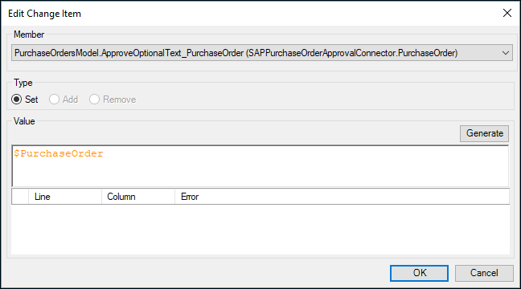

8. Click **OK** to close the dialog window.

9. Drag a **Show Page** action to the microflow to the right of the activity you have just added.

10. Double-click on the **Show Page** action to open the dialog.

11. In the Show Page dialog select **NewApproveOptionalText** as the object to pass.

12. Click **Select** to select a page and click **New** to add a new page.

13. In the Create Page dialog:

      * Change the **Page name** to *Approve_Popup*
    * Change the **Navigation layout** to *PopupLayout (NavigationLayouts)*
    * Select **Form basic vertical**

14. Click **OK** to create the new page and close the dialog windows.

    Your microflow should now look like this:

    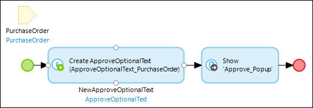

15. Run the app locally and click the **Approve** button to see what happens.

Nice work. You have added business logic to the microflow that will ensure that a fresh object is shown in the dialog pop-up. In the next section you will change the popup.

## 8 Change the Approval Dialog Pop-Up

To create a basic approval dialog page, follow these steps:

1. In the **ACT_OpenApproveDialog** microflow, right-click the **Show page** activity and select **Go to page**.

2. In the **Properties** for the **ApprovalDialog** page, change the **Title** to *Approve the purchase order?*.

3. Double-click the **Text** area and:

    * Set **Placeholder text** to *Add a comment*
    * Set **Show label** to *No*

4. Click **OK** to save the properties.

5. Double-click the **Save** button to open its properties and:

    * Change the **Caption** to *Approve*

    * Change the **On click** action to *Call a microflow*

6. Click **New** in the Select Microflow dialog and name it *ACT_ApprovePurchaseOrder*.

7. Click **OK** to close the dialog windows.

8. Open the properties of the **Cancel** button and change the Render mode to **Link**.

9. Run the app locally and view it in your browser.

10. Click **Approve**. A new dialog window will open:

      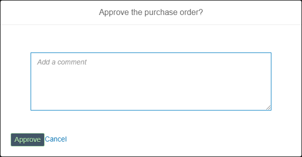

11. Click **Approve** to confirm the Purchase Order.

Nice work, although you see nothing happens when you click the **Approve** button. This makes sense because there is no business logic added in the microflow *ACT_ApprovePurchaseOrder*. This is what you are going to do in the next section.

## 9 Creating Business Logic to Approve a Purchase Order

Follow these steps to create the logic to approve a purchase order and push it to SAP Cloud:

1. In the **Approve_Popup** page in the *MyFirstModule* module, right-click the **Approve** button you created in the previous section, and select **Go to microflow**.

2. Right-click the line between the green start event and the red end event and select **Insert > Activity**.

    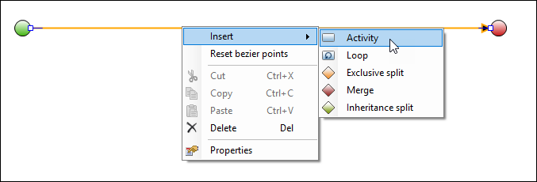

3. Double-click the activity, select **Retrieve** and click **Select**.

4. In the Retrieve Objects dialog window, set the **Association** to **ApproveOptionalText_PurchaseOrder**.

    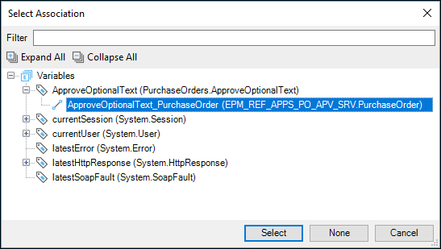

5. Click **OK** to close the dialog window.

6. Add an **Activity** to the right of the retrieve.

7. Select **Microflow call** as **Type of Action** for this activity.

8. In the Call Microflow dialog window, set:

    * the microflow action to **Con_ApprovePurchaseOrder**

    * the value of the **PurchaseOrderID** to ``$PurchaseOrder/POId``

    * the **Edit parameter value** of Note to ``$ApproveOptionalText/Text``

9. Click **OK** to close the dialog window.

10. Add a **Close page** activity after the second activity.

    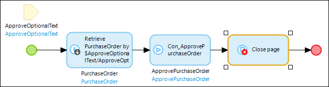

11. Add an **Exclusive split** after the **Close page** activity and open its properties:

    *   Change the **Caption** to *Success?*

    *   Change the **Expression** to ``if $ApprovePurchaseOrder != empty then $ApprovePurchaseOrder/Success else false``

12. Click **OK** to close the dialog window.

13. Right-click the red arrow and set the **Condition value** to **true**.

14. Add a **Show message** activity to the true flow.

15. Change the template in the Show Message dialog window to *Purchase Order approved.*.

16. Click **OK** to close the dialog window.

17. Add a **Microflow call** activity after the message.

18. Select the *SUB_RefreshPageData* microflow as the microflow action.

19. Click **OK** to save the settings.

20. Add a **Merge** after the last **Microflow call**.

21. Drag an arrow from the **Exclusive split** to the **Merge** and you will see that the condition value will automatically been set to **False**.

    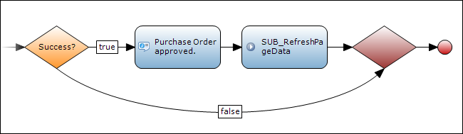

22. Run the app locally and view it in your browser.

23. Click **Approve**.

24. Add a comment in the comment section (for example, *Test approval*), then click **Approve**.

      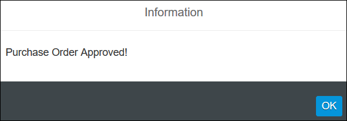

Congratulations on extending the SAP Purchase Order Approval App and finishing this tutorial!
