{}

This tutorial will only work at an SAP TechEd 2017 event.

{}

## 1 Introduction

This tutorial takes you through the basics of development in the Mendix Desktop Modeler and teaches you how to extend the SAP TechEd 2017 Manage Products App. You will add the logic of bundled products to the app, create and view the bundles of products, and extend the business logic and UI.

**This how-to will teach you how to do the following:**

* Extend the app's domain model with bundle data
* Extend the app homepage
* Extend the bundle overview page
* Add a button for creating a bundle

## 2 Prerequisites

Before starting this how-to, make sure you have completed the following prerequisites:

* Sign up for and log in to [Mendix](https://www.mendix.com/sign-up/SAP/)
* Open and log in to the [Mendix Desktop Modeler](https://appstore.home.mendix.com/link/modelers/) (this tutorial was written for Desktop Modeler version **7.5.1**)

## 3 Starting with the SAP TechEd 2017 Manage Products App

To start this tutorial, go to the [Mendix Developer Portal](https://sprintr.home.mendix.com/index.html) and follow these steps:

1.  Click **Create App** in the upper-right corner of the screen.
2.  Go to the **SAP** tab and select **SAP TechEd 2017 Manage Products**.
3.  Click **Use this app**.
4.  Enter *SAP Manage Products App* for the name of the new app, and click **Create App**.
5.  Sign in to the SAP Cloud Platform (and pay special attention to the **Region** you need to select):

    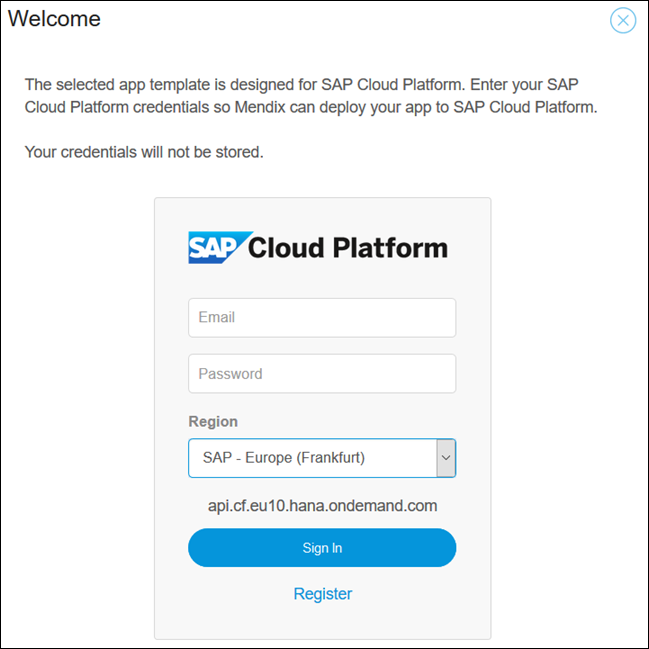

6.  Select the **Region**, **Domain**, **Organization**, and **Space** that you want to use:

    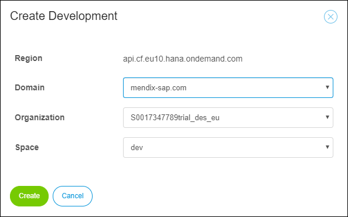

7.  Verify that the environment has been created successfully:

    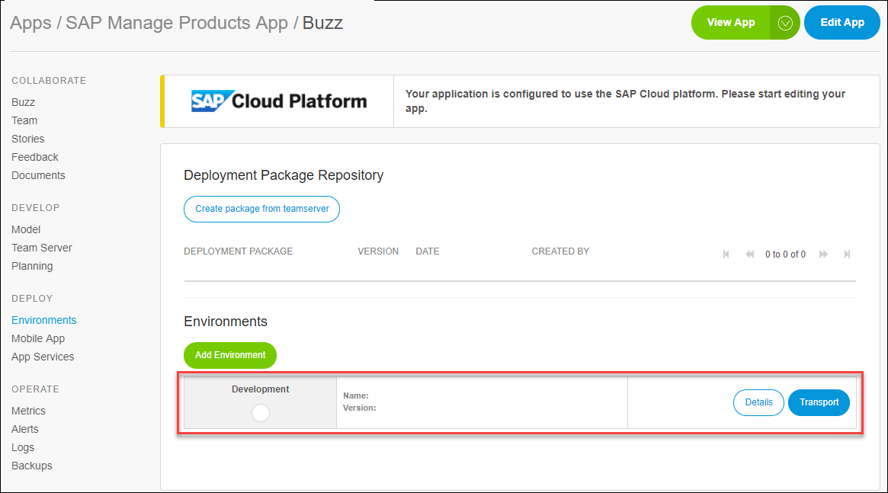

8. Click **Edit App** to edit the app in the Mendix Desktop Modeler.
    * If you see the **Version Selection** pop-up window, select version **7.5.1**

## 4 Configure the TechEd Settings
You are following this tutorial from TechEd, which means you are using a special JDK directory. Follow these steps to configure the JDK directory settings:

1. In the Desktop Modeler, go to **Edit > Preferences**.
2. Set the **JDK directory** to *D:\SAP\JavaVM\NTAMD64\sapjvm_8.1.030\sapjvm_8*.
3. Click **OK** to save the properties.

    

{}

If this setting is already configured in your Modeler, you can leave it as it is.

{}

## 5 Extending the Domain Model

To extend the domain model with bundle data for this app, follow these steps:

1. Make sure the **MyFirstModule.Username** and **MyFirstModule.Password** constants in your app are set with the credentials shared by the TechEd Team, and then click **OK** to close the dialog boxes:

    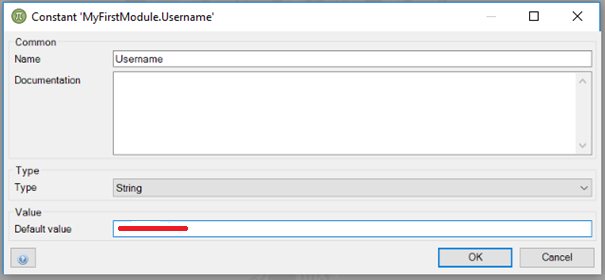

    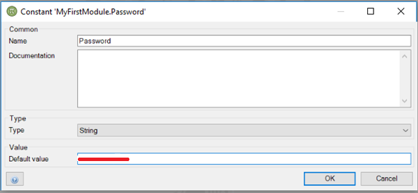

2.  In the Desktop Modeler, click **Run** > **Run Locally** to see the current state of the app in your browser:

    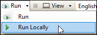

    If you see the pop-up window asking if you want to create a database, select **Yes**.
3. Wait until the startup of the app has finished and the app is running.
4.  Click **View** to view the app in your browser:

    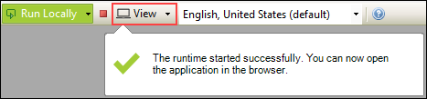

5. Log in with the username *mxadmin* and the password *1* to view the application in your browser:

    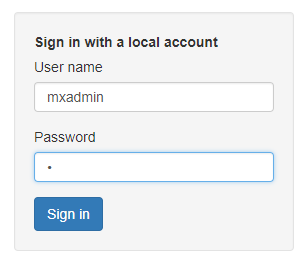

    This is the starting state of your app.

6.  Return to the Desktop Modeler and in the **Project Explorer**, open **MyFirstModule** > **Domain Model**:

    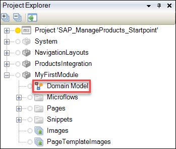

7. Right-click the domain model editor window and select **Add entity**.
8.  Double-click the entity to open its **Properties** dialog box: 
    a. Enter *Bundle* for the **Name**. 
    b. For **Generalization**, click **Select** and select **System** > **Image**. 

    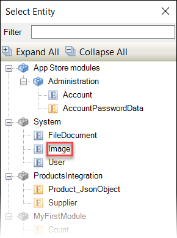

    c. On the **Attributes** tab, click **New** and name the new attribute *Description*. 
    d. Click **OK** to close the dialog boxes.
9. In the domain model editor, draw an arrow from the **Bundle** entity to the **Product** entity to make an association.
10. Double-click the association arrow and in the **Properties** dialog box, do the following: 
    a. Select **Multiple** for **Multiplicity**, which means that multiple Product objects will be associated with multiple Bundle objects (for more information on associations, see [Associations](/refguide/associations)). 
    b. Select **'Bundle' and 'Product' objects refer to each other** for **Navigability**. 
    
    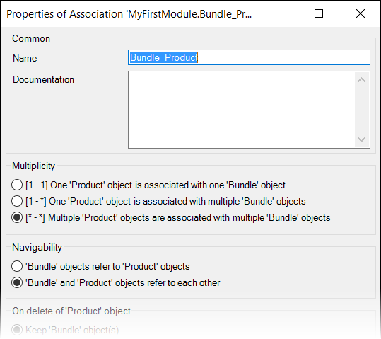
    
    c. Click **OK** to close the dialog box. 
11. Double-click the **Count** entity to open its **Properties** dialog box and on the **Attributes** tab, click **New** and do the following: 
    a. Enter *NumberOfBundles* for the **Name** of the new attribute. 
    b. Select **Integer** for **Type**. 
    c. Click **OK** to close the dialog boxes.

## 6 Extending the Homepage

To extend the app homepage with a **Bundles** button, follow these steps:

1.  Under **MyFirstModule**, open **Pages** > **Homepage_Desktop_Default** :

    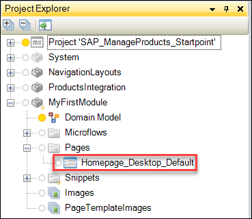

2.  Right-click the **MyFirstModule.Navigation** snippet call widget in the top-left corner of the page (note that you can always click an element and see its type in the **Properties** pane) and select **Show snippet**:

    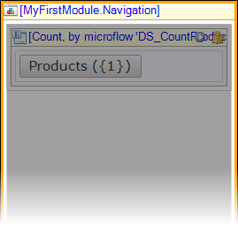

3.  In the **Navigation** snippet, right-click the container around the button and select **Copy**, then paste the duplicate in this drop zone:

    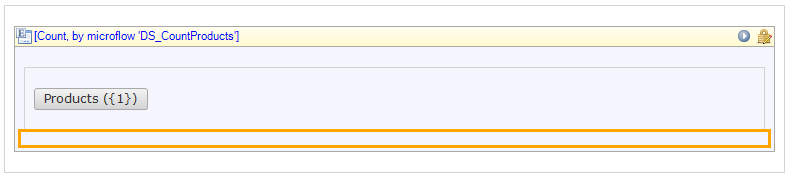

4. Select this new container and in the **Properties** pane (if necessary, open this by selecting **View** > **Properties** from the top menu bar), change the **Class** from **shell-pageheader-left** to **shell-pageheader-right**.
5.  Double-click the button in this new container to open its editor dialog box and for **Caption**, click **Edit** and do the following: 
    a. Change the **Caption** of the button to **Bundles({1})** (later you will attach the **Bundle Overview** page to this page to see how many bundles are in the app). 
    b. Click **Edit** for **Parameters** and in the **Select Attribute** dialog box, select **NumberOfBundles**. 
6. Click **OK** to close the dialog boxes.

## 7 Extending the List View

To create the overview of the bundles and change the content of the page by extending the list view, follow these steps:

1. In the **Project Explorer**, right-click **Homepage_Desktop_Default**, and select **Duplicate**.
2. Right-click the duplicated homepage, select **Rename**, and enter *Homepage_Desktop_Bundle_Overview* for the new **Name**.
3. Return to the **Navigation** snippet and double-click the the **Bundles ({1})** button to open its properties.
4. Switch **On click** > **Show a page** to this new page (**Homepage_Desktop_Bundle_Overview**), then click **OK**.
5.  Return to **Homepage_Desktop_Bundle_Overview**, right-click the **Product, from database** list view, and select **Select data source**:

    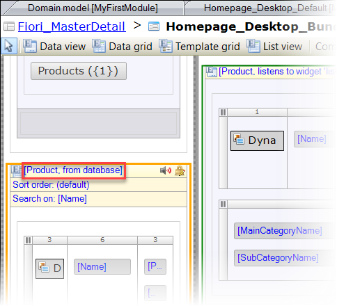

6.  In the **Select Data Source** dialog box, do the following: 
    a. Click **Select** for **Entity (path)**, select **Bundle**, then click **Select**: 

    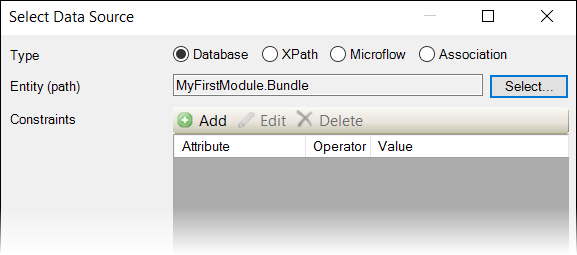

    b. On the pop-up window that asks you if you want to automatically fill the contents of the list view, click **No**. 
7.  In this same list view, delete the **Dynamic Image Viewer** in the far-left column of the layout grid:

    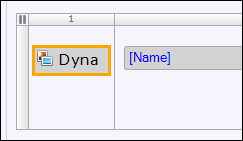

8.  In that same layout grid column, do the following: 
    a. Right-click the drop zone and select **Add widget** > **File** > **Image Viewer**. 
    b. Right-click the image viewer and select **Select data source**. 
    c. Click **Select** for **Entity (path)**, select **Bundle**, then click **Select**. 
    d. On the pop-up window that asks you if you want to automatically fill the contents of the list view, click **No**. 

    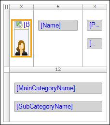

9. In the middle column of this same layout grid, change the **Name** attribute by selecting it to highlight it and dragging the **Description** attribute from the **Connector** pane (open this pane from the **View** menu item if necessary) into it.
10. Double-click **Description** to open its properties and set **Show label** to **No**.
11. In the far-right column of the layout grid, delete the **Price** and **CurrencyCode** attributes. Leave this column empty, you will come back to it later.
12. Delete the second row of the layout grid:

    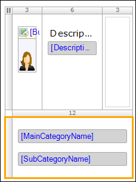

## 8 Extending the Data View

Now you are going to extend the data view by following these steps:

1. At the top of **Homepage_Desktop_Bundle_Overview**, change the **Product** header text to **Bundle**.
2.  In the main bundle data view of the homepage, do the following: 
    a. Delete the **Dynamic Image Viewer** in the top layout grid. 

    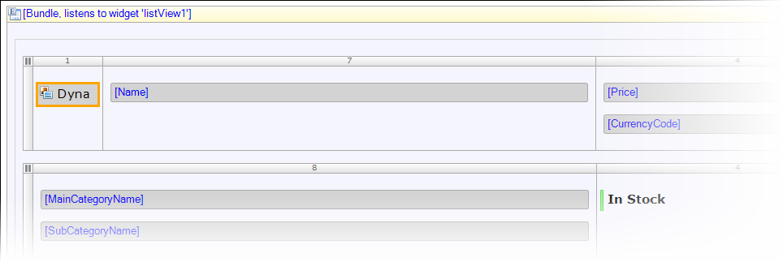

    b. Insert an **Image Viewer** widget, as you did above in [step 8 of Extending the List View](#ImageViewer). 
    c. Click **Select** for **Entity (path)**, select **Bundle** (under **MyFirstModule**), then click **Select**. 
    d. Do not automatically fill the contents. 
3. In the second column of the layout grid, change the **Name** attribute to the **Description** attribute and set the **Show label** property to *No*.
4. Delete the **CurrencyCode** and **Price** attributes in the third column, and leave that column empty.
5.  Delete the second layout grid in the container as well as the container wrapped around **General information**:

    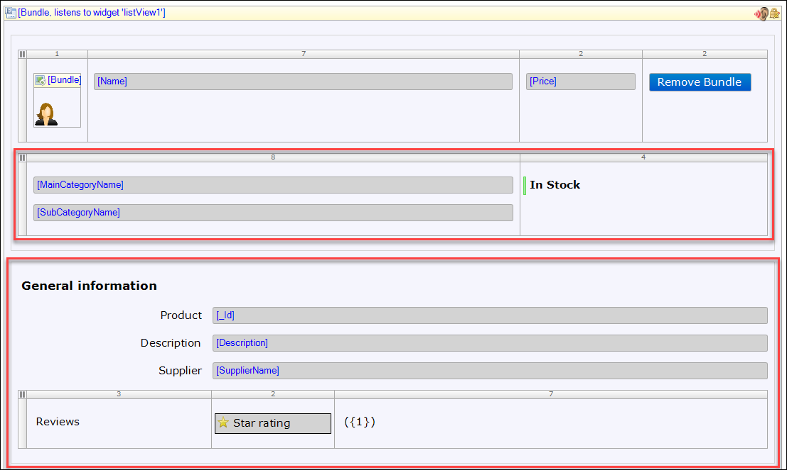

6.  Delete all the content of the **Technical information** container, but keep the header.

    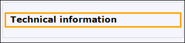

7. Run and view the app to see its updated state. If asked, click **Synchronize database**.
8.  Click **Bundles** to see how the bundles overview page differs from the default homepage:

    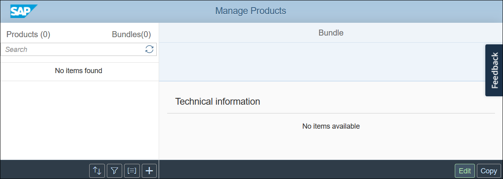

Continue with the section below to further extend the UI of the app.

## 9 Extending the Bundle Overview Page

To extend the bundle overview page with some more necessary functionality, follow these steps:

1.  You want to see the price of the bundle in this layout grid column:

    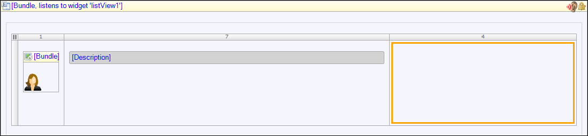

    To accomplish this, you first have to make changes to the data model, so go to the **Domain Model** and open the properties of the **Bundle** entity.
2.  In the **Bundle** entity properties, do the following: 
    a. Add a new attribute. 
    b. Enter *Price* for the **Name**. 
    c. Set **Decimal** for the **Type**. 
    d. Set **Calculated** for the **Value**. 
    e. Click **Select** for the **Microflow** and in the **Select Microflow** dialog box, click **New**. 
    f. Enter *CALC_BundlePrice* for the **Name** of the new microflow. 
    g. Click **OK** and back in the **Edit Attribute** dialog box, click **Show** next to **Microflow** to open to the new microflow. 
    h. Go to the **Properties** pane and set **Security** > **Allowed roles** to **User**. 

    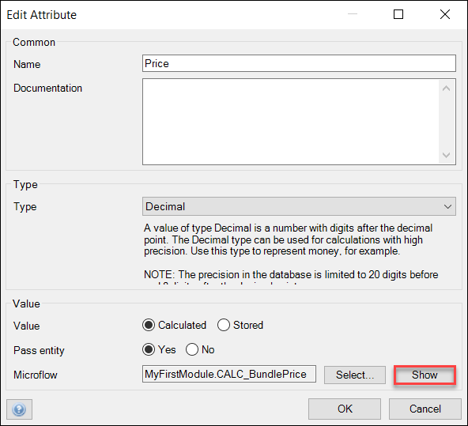

    g. Click **OK** to close the dialog boxes.
3.  In the **CALC_BundlePrice** microflow editor, you need to insert a new activity in the microflow. You can do this in two ways:
    *   Right-click the microflow arrow between the start and end activities and select **Insert** > **Activity**

        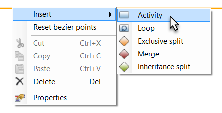

    *  Select and then drag an **Action activity** icon from the editor toolbar onto the microflow arrow between the start and end activities

        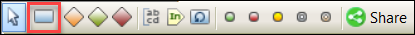

4. Double-click the new activity and in the **Select Type of Action** dialog box, set its type to **Retrieve** in order to retrieve all the products of the bundle (over an association).
5.  In the **Retrieve Objects** dialog box, do the following: 
    a. Click **Select** for **Association**. 
    b. Select **Bundle** > **Bundle_Product**. 
    c. Click **OK**. 
6.  Insert another **Activity** in the microflow, set its type to **Aggregate list**, and in the **Aggregate List** dialog box, do the following: 
    a. Select **ProductList** for the **Variable**. 
    b. Select **Price** for the **Attribute**. 
    c. Click **OK**. 
7.  Double-click the red microflow end event and in the **End Event** dialog box enter `$SumPrice` as the **Return value** of the microflow (make sure you type this value, as copying and pasting it will lead to an error!), then click **OK**:

    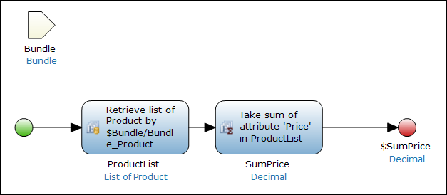

8.  Return to **Homepage_Desktop_Bundle_Overview** and drag the **Price** attribute from the **Connector** to the third column of the layout grid:

    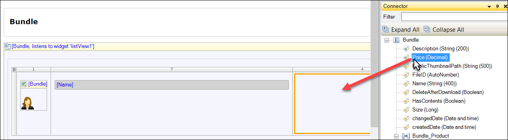

9. In the **Properties** pane (open this from the **View** menu item if necessary) for the **Price** attribute, set **Label** > **Show label** to **No** in order to hide the label.
10. Right-click the layout grid column with the **Price** attribute and select **Add column right**.
11. Highlight then double-click each layout grid column to open the **Edit Layout Grid Column** dialog box and reset the column widths to the following (going from left to right): **1**, **7**, **2**, **2**.

    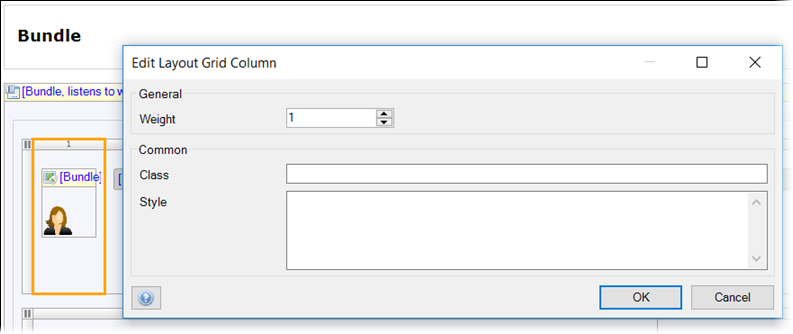

12. In the far-right column, right-click the drop zone and select **Add widget** > **Button** > **Button**.
13. Double-click the button to open the button editor and do the following: 
    a. Enter *Remove Bundle* for the **Caption**. 
    b. Set the **Button style** to **Primary**. 
    c. Set **On click** to **Call a microflow**. 
14. In the **Select Microflow** dialog box, do the following: 
    a. Click **New** to create a new microflow that will be called by this button. 
    b. Enter *ACT_DeleteBundle* for the **Name** of the microflow. 
    c. Click **OK** to close the dialog box. 
15. Back in the button editor, click **Show** next to **Microflow** to open the new microflow, then click **OK**.
16. In the **ACT_DeleteBundle** microflow editor, go to the **Properties** pane and set **Security** > **Allowed roles** to **User**:

    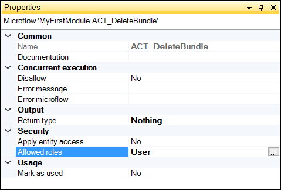

17. Add an **Activity** to the microflow of the **Delete object(s)** type and do the following: 
    a. For the **Variable**, set **Bundle**. 
    b. For **Refresh in client**, set**Yes**. 
18. Return to **Homepage_Desktop_Bundle_Overview**, double-click the **Technical information** header, and change the **Caption** to *Bundled products*.
19. Right-click the first drop zone beneath the **Bundled products** header and select **Add widget** > **List view**:

    

20. Right-click the new list view, click **Select data source**, then do the following: 
    a. For **Type**, select **Association**. 
    b. For **Entity (path)**, click **Select** and select **Product**. 
    c. Click **OK**. 
    d. On the pop-up window that asks you if you want to automatically fill the contents of the list view, click **No**. 
21. Open **Homepage_Desktop_Default** and copy the first layout grid under **Product** (the one that contains **Name**, **Price**, and **CurrencyCode**).
22. Return to **Homepage_Desktop_Bundle_Overview** and paste that layout grid in the drop zone of the list view under **Bundled products**:

    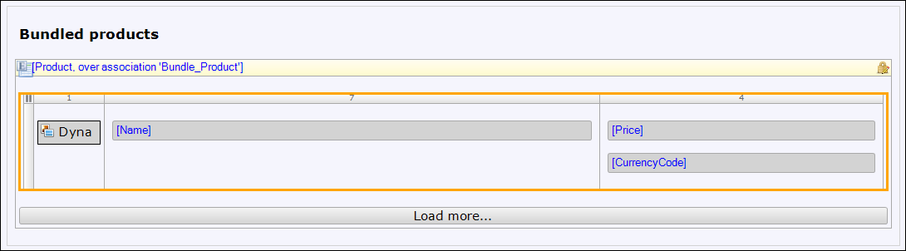

23. Add a column to the right of the one that contains the **Price** and **CurrencyCode** attributes.
24. Set the column widths of this layout grid to the following (going from left to right): **1**, **8**, **2**, **1**.
25. In the drop zone of the last (far-right) column, right-click and select **Add widget** > **Button** > **Button**.
28. Double-click the button to open the button editor and do the following: 
    a. Remove the **Caption**. 
    b. Select the **remove** icon for **Icon**. 
    c. Select **Link** for **Render mode**. 
    d. Select **Call a microflow** for **On click**. 
29. In the **Select Microflow** dialog box, do the following: 
    a. Click **New** to create a new microflow that will be called by this button. 
    b. Enter *ACT_RemoveProductFromBundle* for the **Name** of the microflow. 
    c. Click **OK** to close the dialog box. 
30. Back in the button editor, click **Show** next to **Microflow** to open the microflow you just created, then click **OK** to close the dialog box.
31. In the **ACT_RemoveProductFromBundle** microflow editor, set **Allowed roles** to **User**.
32. Add an **Activity** to the microflow of the **Change object** type and do the following: 
    a. For the **Variable**, set **Bundle**. 
    b. For **Commit**, set **Yes**. 
    c. For **Refresh in client**, set **Yes**. 
    b. Click **New** to add a new change item. 
33. In the **Edit Change Item** dialog box, do the following: 
    a. Select **MyFirstModule.Bundle_Product** for the **Member**. 
    b. Set **Remove** for **Type**. 
    c. Enter `$Product` for the **Value**. 

    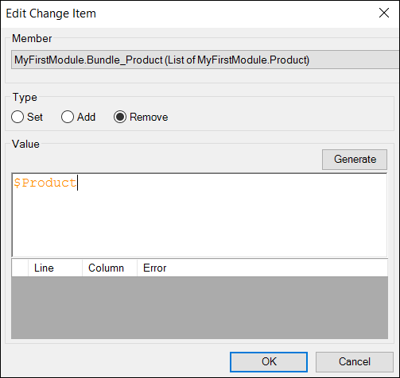

    d. Click **OK** to close the dialog boxes.

    The **ACT_RemoveProductFromBundle** microflow should now look like this:

    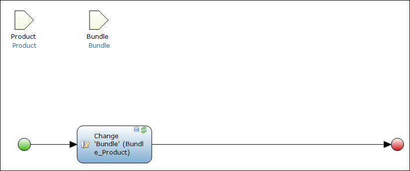

34. Run and view the app to see its updated state, and click **Bundles** to see the new **Remove Bundle** button and **Bundled products** section of the UI:

    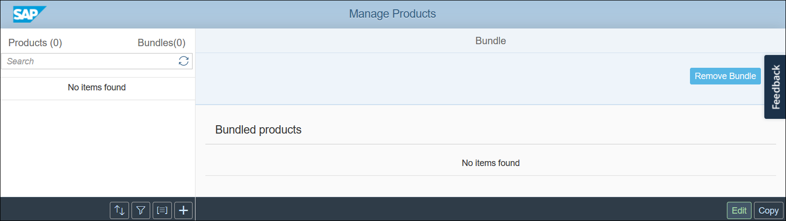

## 10 Adding a Button to Create a Bundle

The only thing missing in the page right now is the button to create a bundle. Follow these steps to add it.

1. Return to **Homepage_Desktop_Bundle_Overview**
2.  Go to the button in the bottom-left corner that has the **Class** called **icon icon-add** (you can look in the **Properties** pane to determine the class):

    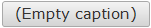

3. Right-click the button, select **Edit action**, and select **Call a microflow**.
4. Create a new microflow, enter *ACT_CreateBundle* for its **Name**, then click **Show** to go to this microflow editor.
5. In the **ACT_CreateBundle** microflow editor, set **Allowed roles** to **User**.
6.  Add an **Activity** of the **Create object** type and do the following: 
    a. Select **Bundle** for the **Entity**. 
    b. Make sure the **Name** of the **Output** object is **NewBundle**.  

    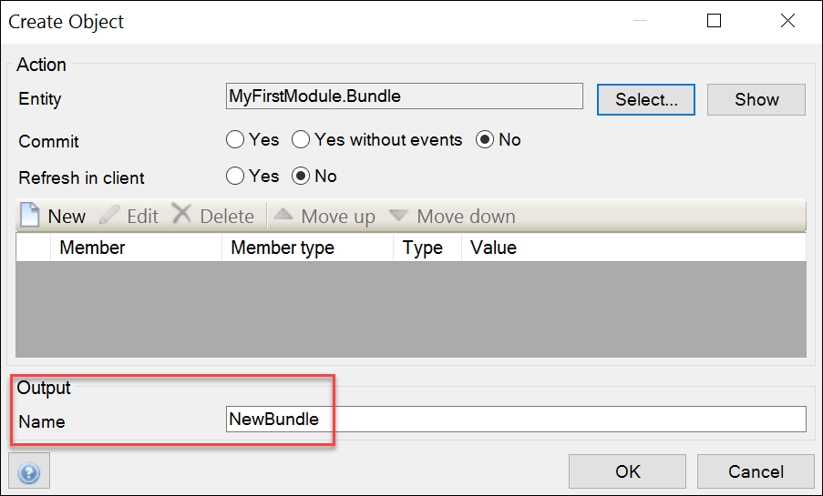

7.  Add an **Activity** to the microflow of the **Show page** type and do the following: 
    a. Set **NewBundle** for the **Object to pass**. 
    b. For **Page**, click **Select** and then **New** to create a new page called *Bundle_New*. 
    c. Set the **Navigation layout** to **PopupLayout**. 
    d. Select the **Form basic vertical** page template. 

    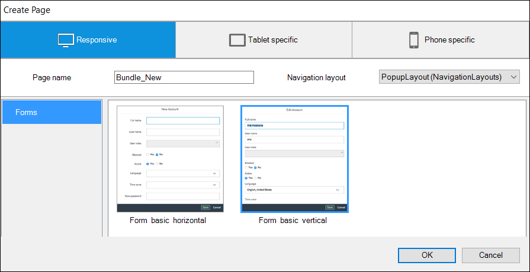

    e. Click **OK** to close the **Create Page** wizard.
8. Back in the **Show Page** dialog box, click **Show** to go to the page you just created, then **OK**.
9. Go to the **Properties** pane and set **Navigation** > **Visible for** to **User**.
10. On the **Bundle_New** page, delete the **Image Viewer** as well as the **Name** and **Size** attributes.
11. Right-click the drop zone below **Upload image**:

    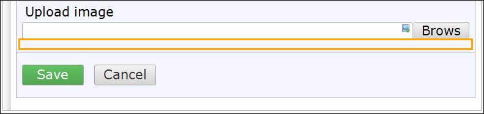

12. Do the following: 
    a. Select **Add widget** > **Input** > **Reference set selector**. 
    a. Right-click this widget and select **Select entity**, then select **Product**. 
    b. On the pop-up window that asks you if you want to automatically fill the contents of the list view, click **No**. 
13. Select the **Column** grid column of the new reference set selector to highlight it, then drag a **Name** attribute from the **Connector** into this column.
14. Rename the **Column** to *Name*.
15. Select the whole reference set selector and in **Properties**, set **Data source** > **Show search bar** to **Never** (which will delete the search bar):

    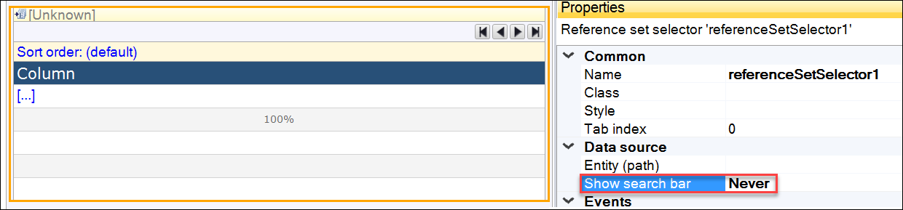

16. Right-click the grid conrol bar where the **Search** button was located, select **Add button**, and add two buttons:
    * **Add**
    * **Remove**

    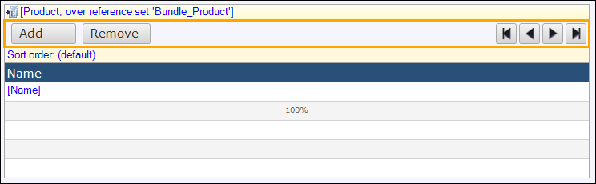

17. In the **Project Explorer**, expand **MyFirstModule**, right-click **Pages**, and do the following: 
    a. Select **Add** > **Page**. 
    b. Name the page *SelectProductsForBundle*. 
    c. Select the **Blank** > **Blank** page template. 
    d. Go to the **Properties** pane and set **Security** > **Allowed roles** to **User**. 
    e. Click **OK**. 
18. Return to **Bundle_New** and do the following: 
    a. Right-click the **Add** button and select **Select page**. 
    b. Select the page you just created (**SelectProductsForBundle**). 
19. Return to the new **SelectProductsForBundle** page, right-click and select **Add widget** > **Data grid**.
20. Double-click this new data grid and in the **Edit Data Grid** dialog box, do the following: 
    a. Open the **Data source** tab. 
    b. For **Entity (path)**, select **Product**. 
    c. Click **OK** and on the pop-up window that asks you if you want to automatically fill the contents of the list view, click **No**. 
21. From the **Connector** pane, drag a **Name** attribute to the **Column** of the new data grid.
22. Rename the **Column** to *Name*.
23. Right-click the search bar above the **Search** button and do the following: 
    a. Select **Add search field** > **Comparison**. 
    b. Drag a **Name** attribute from the **Connector** pane to the new **Caption** search field. 
    c. Enter *Name* for the **Caption** of the new search field. 
24. Next to the **Search** button, right-click and select **Add button** > **Select**:

    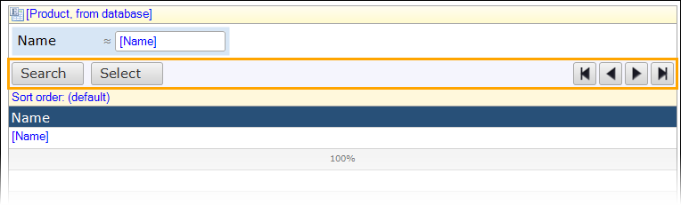

25. Select the whole data grid and in the **Properties**, change **General** > **Selection Mode** to **Simple multi-selection**.
26. Run the app locally and view it to see your changes. When you click the plus sign in the bottom-left corner of the app, you will now see a nice  dialog box that you just built for creating bundles:

    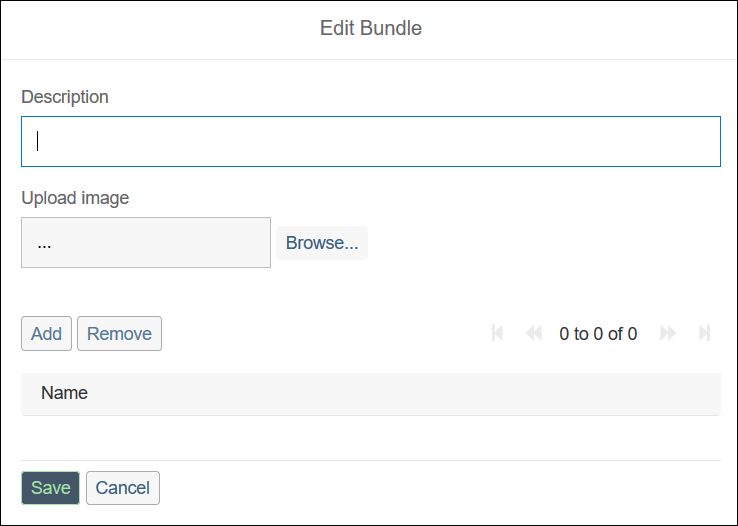

    Let's now run the app in the SAP Cloud!

27. Return to the Desktop Modeler, go to **ProductsIntegration > Constants** in the Project Explorer, and open the **Hostname** constant:

    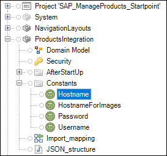

28. Change *https* to *http* in the **Default value** field and click **OK** to save the constant:

    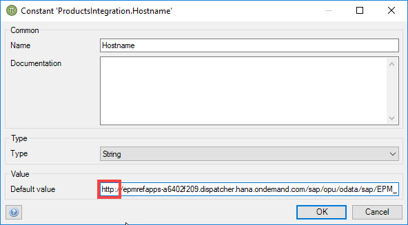

29. Select **Run > Run** to deploy the app to the SAP Cloud.
30. Click **View** when the app has started successfully.
31. On the login screen, click **Sign in with your XSUAA account**:

    

32. Enter your SAP ID username and password, then click **Log On**:

    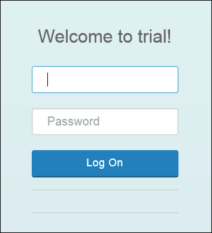

Great work! You have finished the tutorial.
