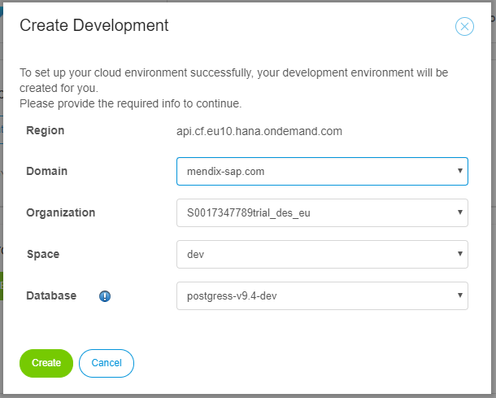
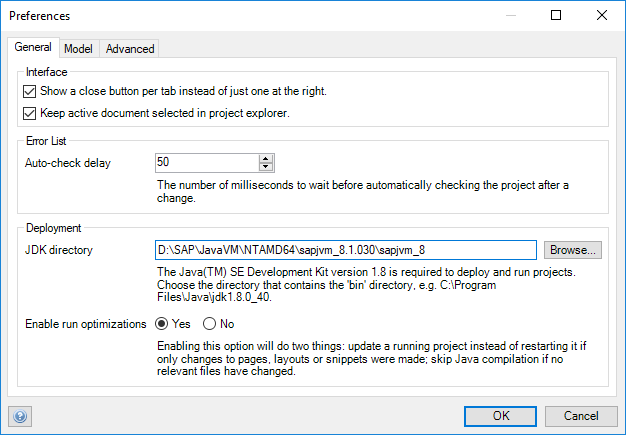
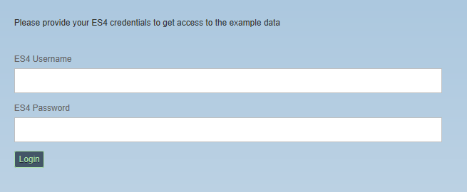
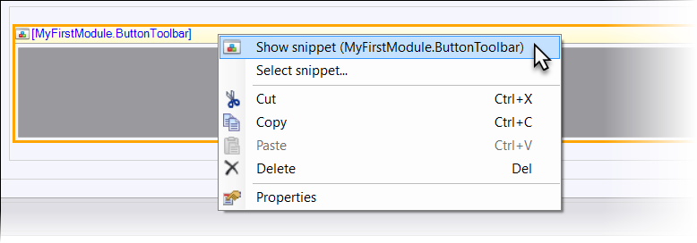

{}

This tutorial will only work at an SAP TechEd 2017 event.

{}

## 1 Introduction

This tutorial takes you through the basics of development in the Mendix Desktop Modeler and teaches you how to build an approval step in the SAP Purchase Order Approval App. The approval is invoked from the Mendix app and will trigger a request to the SAP Gateway Demo System (ES4).

**This how-to will teach you how to do the following:**

* Add the SAP Gateway Demo System (ES4) credentials to the app
* Change the UI by modifying and adding pages
* Add business logic by selecting microflows
* Define the data structures using entities in the domain model
* Send requests to the SAP Gateway Demo System (ES4)

## 2 Prerequisites

Before starting this how-to, make sure you have completed the following prerequisites:

* Sign up for and log in to [Mendix](https://www.mendix.com/sign-up/SAP/)
* Open and log in to the [Mendix Desktop Modeler](https://appstore.home.mendix.com/link/modelers/) (this tutorial was written for Desktop Modeler version **7.5.1**)
* Request the authentication credentials required to connect with the SAP Gateway Demo System (ES4) by registering [here](https://register.sapdevcenter.com/SUPSignForms/)

## 3 Starting with the SAP Purchase Order Approval App

To start this tutorial, go to the [Mendix Developer Portal](https://sprintr.home.mendix.com/index.html) and follow these steps:

1.  Click **Create App** in the upper-right corner of the screen.
2.  Go to the **SAP** tab and select **SAP TechEd 2017 Purchase Order Approval**.
3.  Click **Use this app**.
4.  Enter *SAP Purchase Order Approval App* for the name of the new app, and click **Create App**.
5.  Sign in to SAP Cloud Platform:

    

6.  Select the **Region**, **Domain**, **Organization**, **Space** and **Database** that you want to use:

    

7.  Go the environments overview page:

    

8. Click **Edit App** to edit the app in the Mendix Desktop Modeler.
    * If you see the **Version Selection** pop-up window, select version **7.5.1**

## 4 Configure the TechEd Settings
You are following this tutorial from TechEd, which means you are using a special JDK directory. Follow these steps to configure the JDK directory settings:

1. In the Desktop Modeler, go to **Edit > Preferences**.
2. Set the **JDK directory** to *D:\SAP\JavaVM\NTAMD64\sapjvm_8.1.030\sapjvm_8*.
3. Click **OK** to save the properties.

    

{}

If this setting is already configured in your Modeler, you can leave it as it is.

{}

## 5 Running the App for the First Time

Now that you've created the credentials, you can run the app and have it connect with the SAP Gateway Demo System (ES4) system.

To run the app for the first time, follow these steps:

1.  Click **Run** > **Run Locally**:

    

    If you see the pop-up window asking if you want to create a database, select **Yes**.
2. Wait until the startup of the app has finished and the app is running.
3. Click **View** to view the app in your browser:

    

4. Enter your ES4 credentials and click **Login**:

    

5.  You will now see the Purchase Order Approval App in the browser:

    

In the following steps, you will implement the purchase order approval functionality.

## 6 Adding an Approve Button

Buttons in Mendix open pages or invoke microflows. Microflows in Mendix are used to define business logic.

To add an **Approve** button to the home page, follow these steps:

1. Search (using <kbd>Ctrl</kbd> + <kbd>G</kbd>) for **Homepage [MyFirstModule]**, select it, and click **Go to**. This is the starting page of the app.
2.  Scroll to the bottom of the page, right-click the **MyFirstModule.ButtonToolbar** snippet, and select **Show snippet**.

    

3. Right-click in the snippet area and select **Add widget** > **Button** > **Call microflow button**. Microflows consist of microflow actions, which trigger basic operations such as creating, changing, and deleting objects as well as aggregating object lists and showing messages.
4. In the **Select Microflow** dialog box, select the **ACT_OpenApproveDialog** microflow in the *PurchaseOrdersModel* module. When the user clicks this button, this microflow will therefore be triggered.
5.  Select the button you just created and in the **Properties** pane on the right (you can open it from the **View** menu if it is not already opened), do the following: 
    a.  Change the **Caption** to *Approve*. 
    b.  Change the **Button Style** to *Success*. 

    

6.  Click **Run Locally** and then **View** to view the app in your browser.
7.  The new **Approve** button will appear in the bottom-right of the page.

    

Nice work. Continue below by creating the data structure to capture additional approval data.

## 7 Creating the Approval Dialog Page

To create a basic approval dialog page, follow these steps:

1. In the **ACT_OpenApproveDialog** microflow in the *PurchaseOrdersModel* module, right-click the **Show page** activity you created in the previous section and select **Go to page**.
2. In the **Properties** for the **Approve_Popup** page, change the **Title** to *Approve the purchase order?*.
3. Double-click the **OK** button to open its properties, change the **Caption** to *Approve*, then click **OK** to close the dialog box.
4. Run the app locally and view it in your browser.
5. Click **Approve** to see that it opens the new dialog box:

    

6. In the dialog box, add a comment in the comment section (for example, *Test approval*), then click **Approve**. That will open this pop-up window:

    

Excellent, you've implemented the **Purchase Order** approval step. You can click **Run Locally** now and then **View** to see all the changes to the app that you have made.

Congratulations on extending the SAP Purchase Order Approval App and finishing this tutorial!
